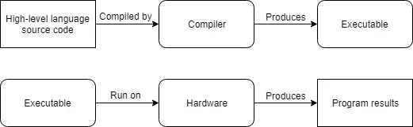
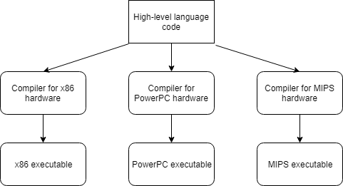
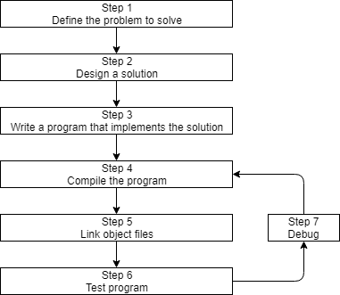
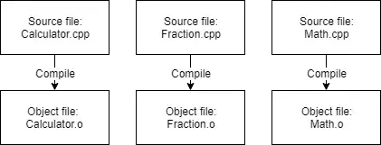
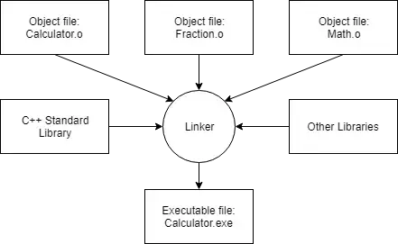

# **Bài 0**: <u>Giới thiệu về CPP</u>

- Máy tính ngày nay đã chạy vô cùng nhanh, và ngày càng nhanh hơn theo thời gian. Tuy nhiên, máy tính cũng có một số hạn chế đáng kể: chúng chỉ hiểu một tập lệnh giới hạn và phải được hướng dẫn chính xác những gì cần làm.
- Một chương trình máy tính là tập các chỉ dẫn mà máy tính có thể thực hiện để hoàn thành tác vụ nào đó. Quá trình tạo ra 1 chương trình như vậy được gọi là *lập trình*.
- Các thành phần vật lý tạo nên máy tính được gọi là *phần cứng*. Khi một chương trình được tải vào bộ nhớ và phần cứng lần lượt thực thi các chỉ dẫn lệnh, việc đó được là chạy hay thực thi chương trình.
## **Ngôn ngữ máy:**
- CPU của máy không có khả năng đọc được các đoạn mã C++. Tập lệnh giới hạn mà CPU có thể hiểu trực tiếp được gọi là *mã máy* (hay *ngôn ngữ máy* hay *tập lệnh điều khiển (instruction set)* )
- Đây là một tập lệnh ngôn ngữ máy ví dụ: **10110000 01100001**
- Ở những ngày đầu máy tính được phát minh, các lập trình viên phải viết trực tiếp ngôn ngữ máy, vốn là việc rất khó và tốn nhiều thời gian thực hiện.
- Tập lệnh mã máy là chuỗi các số 1 và 0. Mỗi số 1 hoặc 0 được là *đơn vị nhị phân* (*binary digit*) hay *bit*. Số lượng bit để tạo thành 1 câu lệnh đơn lẻ có thể thay đổi, vd. một số CPU thực thi tập lệnh có 1 độ dài 32 bit, trong khi CPU khác có kiến trúc tập lệnh 64 bit, 16 bit, 8 bit...
- Các chuỗi nhị phân được CPU dịch thành câu lệnh thực hiện các công việc cụ thể, vd. so sánh 2 số, đặt 1 số vào ô địa chỉ bộ nhớ nào... Tuy nhiên, mỗi loại CPU có kiến trúc tập lệnh khác nhau, tập lệnh viết cho CPU này đọc được nhưng CPU khác có kiến trúc tập lệnh khác thì không đọc được. Điều đó có nghĩa chương trình viết bằng mã máy không **di động** (portable) trên nhiều hệ thống khác nhau.
## **Hợp ngữ:**
- Bởi ngôn ngữ máy rất khó học, hợp ngữ đã được phát minh. Trong hợp ngữ, mỗi chỉ dẫn được xác định bởi 1 viết tắt ngắn gọn (thay vì một chuỗi bit), tên và các chữ số cũng có thể được sử dụng.
> VD: *mov al, 061h*
- Điều này khiến hợp ngữ dễ đọc và viết hơn ngôn ngữ máy. Tuy vậy, CPU không thể hiểu trực tiếp hợp ngữ. Thay vào đó, chương trình hợp ngữ được dịch ra thành mã máy trước khi được thực thi. Điều này được thực hiện bởi 1 chương trình gọi là *trình biên dịch hợp ngữ* (*assembler*). Các chương trình được viết bằng hợp ngữ có xu hướng chạy rất nhanh, và hợp ngữ vẫn được sử dụng ngày nay khi vấn đề tốc độ có tính quyết định.
- Tuy nhiên hợp ngữ cũng có nhiều nhược điểm. ví dụ, hợp ngữ vẫn yêu cầu rất nhiều chỉ dẫn để thực hiện 1 tác vụ đơn giản. Mặc dù các chỉ dẫn riêng lẻ ở dạng người có thể hiểu được, nhưng để hiểu toàn bộ một chương trình vẫn là 1 vấn đề nan giải. Và hợp ngữ cũng không di động với nhiều hệ thống khác nhau.
## **Ngôn ngữ bậc cao:**
- Để tăng khả năng đọc hiểu chương trình và tính di động, các ngôn ngữ lập trình mới đã được ra đời như C, C++, Pascal (sau này là Java, Javascript, Perl,...). Những ngôn ngữ trên được gọi là *ngôn ngữ bậc cao* bởi chúng được thiết kế để cho phép lập trình viên viết chương trình mà không phải bận tâm loại máy tính nào chương trình sẽ chạy trên đó.
- Ví dụ một dòng lệnh trên C/C++ :
> `a = 97;`
- Giống như các chương trình hợp ngữ, chương trình viết bằng ngôn ngữ bậc cao cũng phải được dịch thành ngôn ngữ mà máy tính có thể hiểu. Có 2 cách thực hiện việc trên: biên dịch và thông dịch.
- Trình biên dịch (compiler) là 1 chương trình (tập chương trình) có thể đọc mã nguồn và dịch chúng sang các ngôn ngữ bậc thấp hơn (hợp ngữ hoặc mã máy). Thông thường nhất, các tệp mã ngôn ngữ bậc thấp này sau đó sẽ được kết hợp thành một tệp thực thi (chứa các lệnh ngôn ngữ máy) có thể chạy hoặc phân phối cho người khác. Các tệp thực thi không yêu cầu trình biên dịch phải được cài đặt.
- Ban đầu, các trình biên dịch còn thô sơ và chậm, không tối ưu mã. Tuy nhiên qua thời gian, trình biên dịch dần trở nên nhanh hơn, tối ưu code hơn, ở một vài trường hợp còn tốt hơn cả hợp ngữ.



- Các chương trình C++ cũng được biên dịch bởi trình biên dịch.
- Trình thông dịch là chương trình thực thi các câu lệnh trong mã nguồn trực tiếp mà không yêu cầu chương trình phải được biên dịch thành tệp thực thi trước. Trình thông dịch thường linh hoạt hơn trình biên dịch, nhưng hiệu suất thấp hơn khi chạy chương trình bởi trình thông dịch luôn phải chạy mỗi khi thực thi chương trình.


- Ngôn ngữ bậc cao có rất nhiều ưu điểm:
    + Dễ đọc hiểu và viết mã, bởi câu lệnh gần với ngôn ngữ tự nhiên.
    + Yêu cầu ít lệnh hơn khi thực thi 1 tác vụ -> chương trình dễ học và gọn gàng.
    + Có thể được biên dịch (hoặc thông dịch) cho nhiều hệ thống khác nhau.


## **Giới thiệu về C/C++**
### <u>Trước C++, chúng ta có C:</u>
- C được phát triển từ 1972 bởi Dennis Ritchie tại Bell Labs, phục vụ chủ yếu cho việc lập trình hệ thống.
### <u>C++</u>
- C++ được phát triển 1983 bởi Bjarne Stroustrup tại Bell Labs như một phần mở rộng của C, thêm nhiều tính năng mới cho ngôn ngữ C, được chuẩn hóa năm 1998 tại hội đồng ISO.
- 5 update lớn cho C++ (C++11, C++14, C++17, C++20, C++23) đã được tiến hành kể từ thời điểm đó. Mỗi phiên bản mới được ra mắt và chuẩn hóa được gọi là chuẩn ngôn ngữ (language standard).
- Triết lý thiết kế cơ bản của C và C++ tóm gọn lại: "Trust the programmer".

## **Giới thiệu quá trình cấu hình chương trình C++**


### Bước 1: **Xác định vấn đề cần giải quyết**
- Đây là bước "what", nơi chúng ta tìm hiểu vấn đề nào đang cần giải quyết.
- VD:
    - "Tôi muốn viết 1 ctrinh cho phép tôi nhập nhiều số, rồi tính ra giá trị trung bình'
    - "Tôi muốn viết 1 ctrinh tạo ra 1 mê cung 2 chiều và để user khám phá nó. User thắng nếu tìm tới đích.
    - "Tôi muốn viết chương trình đọc giá cổ phiếu và dự đoán cổ phiếu sẽ tăng hay giảm"
### Bước 2: **Xác định cách giải quyết vấn đề**
- Đây là bước "how", nơi bạn xác định cách bạn sẽ giải quyết vấn đề bạn đã đưa ra ở bước 1. Đây cũng là bước bị bỏ qua nhiều nhất trong quá trình phát triển phần mềm. Điểm mấu chốt của vấn đề ở đây là: có nhiều cách để giải quyết một vấn đề -- tuy nhiên, một số giải pháp trong số đó là tốt và một số lại không tốt. Thông thường, một lập trình viên sẽ nảy ra ý tưởng, ngồi xuống và ngay lập tức bắt đầu viết mã giải. Điều này thường tạo ra một giải pháp tồi.
- Thông thường, các giải pháp tốt có những đặc điểm sau:
    - Minh bạch (không phức tạp hóa hoặc rối rắm)
    - Được mô tả tốt (đặc biệt là xung quanh bất kỳ giả định nào được đưa ra hoặc những hạn chế)
    - Xây dựng theo mô đun.
    - Code phải mạnh (robust), có thể phục hồi hoặc gửi mã lỗi khi có trường hợp không mong muốn xảy ra.
### Bước 3: **Viết chương trình**
VD: 

```
#include <iostream>

int main()
{
    std::cout << "Here is some text.";
    return 0;
}
```

### Bước 4: **Biên dịch chương trình**
- Để biên dịch các tệp mã nguồn C++, chúng ta sử dụng trình biên dịch C++. Trình biên dịch C++ tuần tự duyệt từng tệp mã nguồn (.cpp) trong chương trình của bạn và thực hiện hai nhiệm vụ quan trọng:
    - Đầu tiên, trình biên dịch kiểm tra mã C++ của bạn để đảm bảo nó tuân theo các quy tắc của ngôn ngữ C++. Nếu không, trình biên dịch sẽ báo lỗi cho bạn (và số dòng tương ứng) để giúp xác định những gì cần sửa. Quá trình biên dịch cũng sẽ bị hủy bỏ cho đến khi lỗi được khắc phục.
    - Thứ hai, trình biên dịch dịch mã C++ của bạn thành các tập lệnh ngôn ngữ máy. Các tập lệnh này được lưu trữ trong một tệp trung gian gọi là tệp đối tượng. Tệp đối tượng cũng chứa siêu dữ liệu cần thiết hoặc hữu ích trong các bước tiếp theo.
- Các tệp đối tượng thường được đặt tên là name.o hoặc name.obj, trong đó tên trùng với tên của tệp .cpp mà nó được tạo ra từ đó.
- Ví dụ: nếu chương trình của bạn có 3 tệp .cpp, trình biên dịch sẽ tạo ra 3 tệp đối tượng:



### Bước 5: **Liên kết tệp đối tượng và các thư viện**
- Sau khi trình biên dịch hoàn tất thành công, một chương trình khác gọi là trình liên kết sẽ khởi động. Công việc của trình liên kết là kết hợp tất cả các tệp đối tượng và tạo ra tệp đầu ra mong muốn (thường là tệp thực thi). Quá trình này được gọi là liên kết (linking).
- Đầu tiên, trình liên kết đọc từng tệp đối tượng do trình biên dịch tạo ra và đảm bảo chúng hợp lệ.
- Thứ hai, trình liên kết đảm bảo tất cả các phần phụ thuộc giữa các tệp được giải quyết đúng cách. Ví dụ: nếu bạn xác định nội dung nào đó trong một tệp .cpp, sau đó sử dụng nội dung đó trong một tệp .cpp khác, thì trình liên kết sẽ kết nối cả hai tệp đó lại với nhau. Nếu trình liên kết không thể kết nối một tham chiếu đến một cái gì đó với định nghĩa của nó, bạn sẽ gặp lỗi liên kết và quá trình liên kết sẽ bị hủy.
- Thứ ba, trình liên kết cũng có khả năng liên kết các tệp thư viện. Tệp thư viện là một tập hợp mã được biên dịch trước đã được “đóng gói” để sử dụng lại trong các chương trình khác.
- C++ đi kèm với một thư viện mở rộng được gọi là Thư viện chuẩn C++ (thường được rút ngắn thành thư viện chuẩn) (standard library) cung cấp một tập các tính năng hữu ích để sử dụng trong các chương trình. Một trong những phần được sử dụng phổ biến nhất của thư viện chuẩn C++ là thư viện iostream, chứa chức năng in văn bản trên màn hình và nhận dữ liệu nhập từ bàn phím từ người dùng. Hầu hết mọi chương trình C++ được viết đều sử dụng thư viện chuẩn dưới một số hình thức, do đó, việc thư viện chuẩn được liên kết với các chương trình của bạn là điều rất bình thường. Hầu hết các trình liên kết sẽ tự động liên kết trong thư viện tiêu chuẩn ngay khi bạn sử dụng bất kỳ phần nào của nó, vì vậy đây thường không phải là điều bạn cần phải lo lắng.
- Bạn cũng có thể tùy ý liên kết các thư viện khác. Ví dụ: nếu bạn định viết một chương trình phát âm thanh, có thể bạn sẽ không muốn viết mã của riêng mình để đọc các tệp âm thanh từ đĩa, kiểm tra để đảm bảo chúng hợp lệ hoặc tìm ra cách định tuyến dữ liệu âm thanh. vào hệ điều hành hoặc phần cứng để phát qua loa -- điều đó sẽ tốn rất nhiều công sức! Thay vào đó, bạn có thể tải xuống một thư viện đã biết cách thực hiện những việc đó và sử dụng thư viện đó. Chúng ta sẽ nói về cách liên kết trong thư viện (và tạo liên kết của riêng bạn!) trong phần phụ lục.


- Sau khi trình liên kết hoàn tất việc liên kết tất cả các tệp đối tượng và thư viện, thì (giả sử mọi việc suôn sẻ) bạn sẽ có một tệp thực thi mà bạn có thể chạy.


### Bước 6&7: **Kiểm thử và vá lỗi (testing & debugging)**
> Mục này sẽ tìm hiểu ở các bài tiếp theo


```python

```
