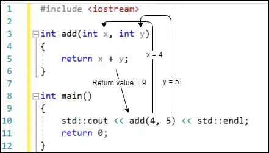

# ***Chương 2: C++ cơ bản***

## **Bài 2.1: <u>Giới thiệu về hàm</u>**

Trong chương trước, chúng ta đã định nghĩa hàm là một tập hợp các câu lệnh được thực thi tuần tự. Mặc dù điều đó hoàn toàn đúng, nhưng định nghĩa đó không cung cấp nhiều thông tin chi tiết về lý do tại sao hàm lại hữu ích. Hãy cập nhật định nghĩa của chúng ta: **Hàm** là một chuỗi các câu lệnh có thể tái sử dụng được thiết kế để thực hiện một công việc cụ thể.

Bạn đã biết rằng mọi chương trình thực thi đều phải có một hàm được đặt tên là `main` (chính là nơi chương trình bắt đầu thực thi khi được chạy). Tuy nhiên, khi chương trình bắt đầu trở nên dài hơn, việc đặt tất cả code bên trong hàm `main` sẽ ngày càng khó quản lý. Hàm cung cấp một cách để chúng ta chia nhỏ chương trình thành các khối nhỏ, mô-đun dễ dàng tổ chức, kiểm tra và sử dụng hơn. Hầu hết các chương trình sử dụng nhiều hàm. Thư viện chuẩn C++ đi kèm với rất nhiều hàm đã được viết sẵn để bạn sử dụng - tuy nhiên, việc viết hàm của riêng bạn cũng rất phổ biến. Các hàm do bạn tự viết được gọi là **hàm do người dùng định nghĩa (user-defined functions).**

Hãy xem xét một trường hợp có thể xảy ra trong thực tế: bạn đang đọc sách, thì bạn nhớ ra mình cần gọi điện thoại. Bạn đánh dấu trang sách, thực hiện cuộc gọi điện thoại và khi kết thúc cuộc gọi, bạn quay lại vị trí đã đánh dấu và tiếp tục đọc sách chính xác từ nơi bạn dừng lại.

Các chương trình C++ cũng có thể hoạt động theo cách tương tự. Một chương trình sẽ thực thi các câu lệnh tuần tự bên trong một hàm khi nó gặp một lời gọi hàm. **Lời gọi hàm** là một biểu thức yêu cầu CPU tạm dừng hàm hiện tại và thực thi một hàm khác. CPU “đánh dấu” tại điểm thực thi hiện tại, sau đó gọi (thực thi) hàm được đặt tên trong lời gọi hàm. Khi hàm được gọi kết thúc, CPU quay trở lại điểm đã đánh dấu và tiếp tục thực thi.

**Hàm khởi tạo lời gọi hàm được gọi là hàm gọi (caller), còn hàm được gọi bởi caller được gọi là callee (hay hàm được gọi).**

### **Hàm do người dùng định nghĩa** 

Trước tiên, hãy bắt đầu với cú pháp cơ bản nhất để định nghĩa một hàm do người dùng định nghĩa. Trong vài bài học tiếp theo, tất cả các hàm do người dùng định nghĩa sẽ có dạng sau:

>```
>returnType functionName() // Đây là tiêu đề hàm (thông báo cho trình biên dịch về sự tồn tại của hàm)
>{
>    // Đây là thân hàm (thông báo cho trình biên dịch hàm này làm gì)
>}
>```

Dòng đầu tiên được gọi không chính thức là **tiêu đề hàm (function header)**, nó thông báo cho trình biên dịch về sự tồn tại của một hàm, tên của hàm và một số thông tin khác mà chúng ta sẽ đề cập trong các bài học tiếp theo (như kiểu trả về và kiểu tham số).

Trong bài học này, chúng ta sẽ sử dụng **kiểu trả về (`returnType`)** là `int` (cho hàm `main()`) hoặc `void` (nếu không cần kiểu). Hiện tại, đừng lo lắng về chúng, vì chúng ta sẽ nói thêm về kiểu trả về và giá trị trả về trong bài học tiếp theo **(2.2 - Giá trị trả về của hàm (hàm trả về giá trị)).**

Giống như biến có tên, các hàm do người dùng định nghĩa cũng có tên. **Tên hàm (functionName)** là tên (định danh) của hàm do người dùng định nghĩa của bạn.

Dấu ngoặc đơn sau định danh cho biết với trình biên dịch rằng chúng ta đang định nghĩa một hàm.

Các dấu ngoặc nhọn và các câu lệnh bên trong được gọi là **thân hàm (function body).** Đây là nơi chứa các câu lệnh xác định chức năng của hàm của bạn.

Dưới đây là một chương trình mẫu cho thấy cách định nghĩa và gọi một hàm mới:

>```
>#include <iostream> // for std::cout
>
>// Định nghĩa hàm do người dùng định nghĩa doPrint()
>void doPrint() // doPrint() là hàm được gọi trong ví dụ này
>{
>    std::cout << "In doPrint()\n";
>}
>
>// Định nghĩa hàm main()
>int main()
>{
>    std::cout << "Starting main()\n";
>    doPrint(); // Tạm dừng main() bằng cách thực hiện một lời gọi hàm đến doPrint(). main() là hàm gọi.
>    std::cout << "Ending main()\n"; // câu lệnh này được thực thi sau khi doPrint() kết thúc
>
>    return 0;
>}
>```


Chương trình này tạo ra đầu ra sau:
>```
>Starting main()
>In doPrint()
>Ending main()
>```

Chương trình này bắt đầu thực thi ở đầu hàm `main`, và dòng đầu tiên được thực thi sẽ in ra `Starting main()`.

Dòng thứ hai trong `main` là một lời gọi hàm đến hàm `doPrint`. Chúng ta gọi hàm `doPrint` bằng cách thêm một cặp dấu ngoặc đơn vào tên hàm như thế này: `doPrint()`.<br>
Lưu ý rằng nếu bạn quên dấu ngoặc đơn, chương trình của bạn có thể không biên dịch được (và nếu có, thì hàm sẽ không được gọi).

>**Cảnh báo** <br>
>Đừng quên thêm dấu ngoặc đơn `()` sau tên hàm khi thực hiện lời gọi hàm.

Vì một lời gọi hàm đã được thực hiện, việc thực thi các câu lệnh trong `main` bị tạm dừng và thực thi nhảy đến đầu của hàm được gọi `doPrint`. Dòng đầu tiên (và duy nhất) trong `doPrint` in ra `In doPrint()`. Khi `doPrint` kết thúc, việc thực thi quay trở lại hàm gọi (ở đây: hàm `main`) và tiếp tục từ điểm dừng lại. Do đó, câu lệnh tiếp theo được thực thi trong `main` in ra `Ending main()`.

### **Gọi hàm nhiều lần**

Một điều hữu ích về hàm là chúng có thể được gọi nhiều lần. Đây là một chương trình minh họa điều này:

>```
>#include <iostream> // for std::cout
>
>void doPrint()
>{
>    std::cout << "In doPrint()\n";
>}
>
>// Định nghĩa hàm main()
>int main()
>{
>    std::cout << "Starting main()\n";
>    doPrint(); // doPrint() được gọi lần đầu tiên
>    doPrint(); // doPrint() được gọi lần thứ hai
>    std::cout << "Ending main()\n";
>
>    return 0;
>}
>```

Chương trình này tạo ra đầu ra sau:
>```
>Starting main()
>In doPrint()
>In doPrint()
>Ending main()
>```

Vì `doPrint` được gọi hai lần bởi `main`, `doPrint` thực thi hai lần và `In doPrint()` được in ra hai lần (một lần cho mỗi lời gọi).

### **Hàm có thể gọi hàm khác, hàm khác lại gọi hàm khác**

Bạn đã thấy rằng hàm `main` có thể gọi một hàm khác (chẳng hạn như hàm `doPrint` trong ví dụ ở trên). Bất kỳ hàm nào cũng có thể gọi bất kỳ hàm nào khác. Trong chương trình sau, hàm `main` gọi hàm `doA`, hàm `doA` lại gọi hàm `doB`:

>```
>#include <iostream> // for std::cout
>
>void doB()
>{
>    std::cout << "In doB()\n";
>}
>
>
>void doA()
>{
>    std::cout << "Starting doA()\n";
>
>    doB();
>
>.    std::cout << "Ending doA()\n";
>}
>
>// Định nghĩa hàm main()
>int main()
>{
>    std::cout << "Starting main()\n";
>
>    doA();
>
>    std::cout << "Ending main()\n";
>
>    return 0;
>}
>```

Chương trình này tạo ra đầu ra sau:
>```
>Starting main()
>Starting doA()
>In doB()
>Ending doA()
>Ending main()
>```

**Giải thích:**

- Chương trình bắt đầu thực thi tại hàm `main`.
- Dòng đầu tiên trong main in ra `"Starting main()"`.
- Tiếp theo, `main` gọi hàm `doA` bằng cách sử dụng `doA()`.
- Khi `doA` được gọi, nó in ra `"Starting doA()"`.
- Bên trong `doA`, nó lại gọi hàm `doB` bằng cách sử dụng `doB()`.
- Lúc này, điều khiển nhảy đến hàm `doB`.
- `doB` in ra `"In doB()"`.
- Sau khi `doB` thực thi xong, điều khiển quay trở lại `doA` (hàm gọi `doB`).
- `doA` in ra `"Ending doA()"`.
- Điều khiển quay trở lại `main` (hàm gọi `doA`).
- `main` in ra `"Ending main()"`.
- Chương trình kết thúc.

**Tóm lại:**

Các hàm có thể gọi cho nhau, tạo ra các chuỗi thực thi phức tạp hơn. Bất kỳ hàm nào cũng có thể gọi bất kỳ hàm nào khác, miễn là hàm được gọi đã được định nghĩa trước đó trong chương trình.

### **C++ không hỗ trợ hàm lồng nhau**

Trái ngược với một số ngôn ngữ lập trình khác, C++ không cho phép định nghĩa hàm bên trong các hàm khác. Tính năng này được gọi là định nghĩa hàm lồng nhau (**nested function**).

>```
>#include <iostream>
>
>int main() {
>    void foo() { // Dòng này bất hợp lệ trong C++
>        std::cout << "foo!\n";
>    }
>
>    foo(); // Dòng này cố gắng gọi hàm lồng nhau
>    return 0;
>}
>```

**Lỗi:** Dòng `void foo()` cố gắng định nghĩa một hàm có tên `foo` bên trong hàm `main`. Điều này không được phép trong C++.

Trong C++, các hàm cần được định nghĩa bên ngoài các hàm khác:

>```
>#include <iostream>
>
>void foo() { // Định nghĩa hàm bên ngoài main
>    std::cout << "foo!\n";
>}
>
>int main() {
>    foo(); // Gọi hàm foo
>    return 0;
>}
>```

>**Thông tin bổ sung:** <br>
>Biến siêu cú pháp: Mã sử dụng `"foo"` làm tên giữ chỗ cho hàm. Những tên giữ chỗ này thường được sử dụng khi tên cụ thể không quan trọng để minh họa một khái niệm.<br>
Các ví dụ phổ biến khác bao gồm `"bar"`, `"baz"` hoặc các từ 3 chữ cái kết thúc bằng `"oo"` (`goo`, `moo`, `boo`).

## **Bài 2.2: <u>Hàm trả về giá trị (value-returning functions)</u>**

Xét đoạn chương trình sau:

>```
>#include <iostream>
>
>int main() {
>    // Nhận giá trị từ người dùng
>    std::cout << "Nhập một số nguyên: ";
>    int num{};
>    std::cin >> num;
>
>    // In ra giá trị gấp đôi
>    std::cout << num << " nhân đôi là: " << num * 2 << '\n';
>
>    return 0;
>}
>```

Chương trình này được cấu thành từ hai phần: Đầu tiên, chúng ta nhận giá trị từ người dùng. Sau đó, chúng ta thông báo cho người dùng giá trị đó nhân đôi là bao nhiêu.

Mặc dù chương trình này đủ đơn giản để không cần chia thành nhiều hàm, nhưng nếu chúng ta muốn chia tách thì sao? Nhận giá trị số nguyên từ người dùng là một công việc được xác định rõ ràng mà chương trình của chúng ta cần thực hiện, do đó nó sẽ là một ứng cử viên tốt cho một hàm.

Vì vậy, hãy viết một chương trình để thực hiện việc này:

>```
>// Chương trình này không hoạt động
>#include <iostream>
>
>void getValueFromUser() {
>    std::cout << "Nhập một số nguyên: ";
>    int input{};
>    std::cin >> input;
>}
>
>int main() {
>    getValueFromUser(); // Yêu cầu người dùng nhập dữ liệu
>
>    int num{}; // Làm thế nào để lấy giá trị từ getValueFromUser() và sử dụng nó để khởi tạo biến này?
>
>    std::cout << num << " nhân đôi là: " << num * 2 << '\n';
>
>    return 0;
>}
>```

Mặc dù chương trình này là một nỗ lực giải quyết tốt, nhưng nó không hoàn toàn hoạt động.

Khi hàm `getValueFromUser` được gọi, người dùng được yêu cầu nhập một số nguyên như mong đợi. Nhưng giá trị họ nhập vào sẽ bị mất khi `getValueFromUser` kết thúc và quyền điều khiển trở lại `main`. Biến num không bao giờ được khởi tạo bằng giá trị người dùng nhập vào, do đó chương trình luôn in ra kết quả `0`.

### **Giá trị trả về**

Khi bạn viết một hàm do người dùng định nghĩa, bạn có thể xác định xem hàm của bạn có trả về giá trị cho trình gọi hay không. Để trả về giá trị cho trình gọi, cần hai điều.

#### **1. Kiểu trả về của hàm (Return Type):**

Thứ nhất, hàm của bạn phải chỉ định loại giá trị sẽ được trả về. Điều này được thực hiện bằng cách đặt kiểu trả về của hàm, là kiểu được xác định trước tên hàm. Trong ví dụ trên, hàm `getValueFromUser` có kiểu trả về là `void` (có nghĩa là không có giá trị nào được trả về cho trình gọi), và hàm `main` có kiểu trả về là `int` (nghĩa là một giá trị kiểu `int` sẽ được trả về cho trình gọi). Lưu ý rằng điều này không xác định chính xác giá trị cụ thể được trả về - nó chỉ xác định kiểu của giá trị sẽ được trả về.

>**Bài học liên quan:**<br>
>Chúng ta sẽ khám phá thêm về các hàm trả về `void` trong bài học tiếp theo **(2.3 - Hàm Void (hàm không trả về giá trị)).**

#### **2. Sử dụng câu lệnh return (Return Statement)**

Thứ hai, bên trong hàm sẽ trả về một giá trị, chúng ta sử dụng câu lệnh `return` để chỉ định giá trị cụ thể được trả về cho trình gọi. Giá trị cụ thể được trả về từ một hàm được gọi là **giá trị trả về** của hàm. Khi câu lệnh `return` được thực thi, hàm thoát ngay lập tức và giá trị trả về được sao chép từ hàm trở lại hàm gọi. Quá trình này được gọi là **trả về theo giá trị (return by value).**


**Ví dụ:**<br>
Hãy xem một hàm đơn giản trả về một giá trị số nguyên và một chương trình mẫu gọi hàm đó:

>```
>#include <iostream>
>
>// int là kiểu trả về
>// Kiểu trả về int có nghĩa là hàm sẽ trả về một giá trị số nguyên nào đó cho trình gọi (giá trị cụ thể không được chỉ định ở đây)
>int returnFive() {
>    // Câu lệnh return chỉ định giá trị cụ thể sẽ được trả về
>    return 5; // Trả về giá trị cụ thể 5 cho hàm gọi.
>}
>
>int main() {
>    std::cout << returnFive() << '\n'; // In 5
>    std::cout << returnFive() + 2 << '\n'; // In 7
>
>    returnFive(); // Không sao: giá trị 5 được trả về, nhưng bị bỏ qua vì main() không làm gì với nó
>
>    return 0;
>}
>```
Hãy thận trọng khi sử dụng các đoạn mã.
Khi chạy, chương trình này in:

>`5`\
>`7`

#### **Thứ tự thực thi:**


- Quá trình thực thi bắt đầu từ đầu hàm `main`.
- Trong câu lệnh đầu tiên, lệnh gọi hàm `returnFive` được đánh giá, dẫn đến việc hàm `returnFive` được gọi.
- Hàm `returnFive` trả về giá trị cụ thể là `5` hàm gọi (hàm `main`), sau đó giá trị này được in ra console thông qua `std::cout`.
- Trong lệnh gọi hàm thứ hai, lệnh gọi hàm `returnFive` được đánh giá, dẫn đến việc hàm `returnFive` được gọi lại lần nữa. Hàm `returnFive` trả về giá trị `5` cho hàm gọi. Biểu thức `5 + 2` được tính toán để tạo ra kết quả `7`, sau đó được in ra console thông qua `std::cout`.
- Trong câu lệnh thứ ba, hàm `returnFive` được gọi lại, dẫn đến việc giá trị `5` được trả về cho hàm gọi. Tuy nhiên, hàm `main` không làm gì với giá trị trả về này, vì vậy không có gì khác xảy ra (giá trị trả về bị bỏ qua).

>**Lưu ý:**<br>
>Giá trị trả về sẽ không được in ra trừ khi trình gọi gửi chúng đến console thông qua `std::cout`. Trong trường hợp cuối cùng ở trên, giá trị trả về không được gửi đến `std::cout`, vì vậy không có gì được in ra.

>**Mẹo:**<br>
>Khi một hàm được gọi trả về giá trị, hàm gọi nó có thể quyết định sử dụng giá trị đó trong một biểu thức hoặc câu lệnh (ví dụ: sử dụng nó để khởi tạo biến hoặc gửi nó đến `std::cout`) hoặc bỏ qua nó (bằng cách không làm gì khác). Nếu hàm gọi bỏ qua giá trị trả về, nó sẽ bị loại bỏ (không có gì được thực hiện với nó).

### **Giải quyết bài toán thách thức đặt ra ở đầu bài**

Giờ đây, với những kiến thức vừa học, chúng ta có thể sửa chữa chương trình được giới thiệu ở đầu bài:

>```
>#include <iostream>
>int getValueFromUser() { // Hàm này hiện trả về một giá trị kiểu số nguyên
>    std::cout << "Enter an integer: ";
>    int input {};
>    std::cin >> input;
>    return input; // Trả về giá trị người dùng nhập cho hàm gọi
>}
>int main() {
>    int num { getValueFromUser() }; // Khởi tạo num bằng giá trị trả về của getValueFromUser()
>    std::cout << num << " doubled is: " << num * 2 << '\n';
>
>    return 0;
>}
>```

**Giải thích:**

Khi chương trình này thực thi, câu lệnh đầu tiên trong `main` sẽ tạo một biến int có tên `num`. Khi chương trình khởi tạo `num`, nó sẽ thấy có một lệnh gọi hàm `getValueFromUser()`, do đó chương trình sẽ thực thi hàm đó. Hàm `getValueFromUser` yêu cầu người dùng nhập giá trị, sau đó trả giá trị đó về cho trình gọi (`main`). Giá trị trả về này được sử dụng làm giá trị khởi tạo cho biến `num`.

Hãy tự biên dịch chương trình này và chạy nó vài lần để kiểm tra xem nó hoạt động chính xác hay không.


### **Xem xét lại hàm `main()`:**

Bây giờ bạn đã có những công cụ khái niệm để hiểu cách thức hoạt động thực sự của hàm `main`. Khi chương trình được thực thi, hệ điều hành sẽ gọi hàm `main`. Sau đó, quá trình thực thi nhảy đến đầu của `main`. Các câu lệnh trong `main` được thực thi tuần tự. Cuối cùng, `main` trả về một giá trị kiểu số nguyên (thường là `0`), và chương trình của bạn kết thúc. Giá trị trả về từ `main` đôi khi được gọi là **mã trạng thái (status code, còn được gọi là mã thoát (exit code) hoặc hiếm khi gọi là mã trả về (return code))**, vì nó được sử dụng để báo hiệu chương trình có chạy thành công hay không.

Theo định nghĩa, mã trạng thái `0` có nghĩa là chương trình đã chạy thành công.

>**Thực hành:**
>
>Hàm main của bạn nên trả về giá trị 0 nếu chương trình chạy bình thường.

Mã trạng thái khác 0 thường được sử dụng để báo hiệu lỗi (mặc dù điều này đúng trên hầu hết các hệ điều hành, nhưng về mặt lý thuyết, nó không đảm bảo tính di động).

>**Đối với người đọc nâng cao:**
>
>Chuẩn C++ chỉ định nghĩa ý nghĩa của 3 mã trạng thái: `0`, `EXIT_SUCCESS` và `EXIT_FAILURE`. `0` và `EXIT_SUCCESS` đều có nghĩa là chương trình chạy thành công. `EXIT_FAILURE` có nghĩa là chương trình không chạy thành công.
>
>`EXIT_SUCCESS` và `EXIT_FAILURE` là các macro tiền xử lý được định nghĩa trong tiêu đề <cstdlib>:
>
>>```
>>#include <cstdlib> // for EXIT_SUCCESS and EXIT_FAILURE
>>
>>int main()
>>{
>>    return EXIT_SUCCESS;
>>}
>>```

Nếu bạn muốn tối đa hóa khả năng di động, bạn chỉ nên sử dụng `0` hoặc `EXIT_SUCCESS` để báo hiệu kết thúc thành công, hoặc `EXIT_FAILURE` để báo hiệu kết thúc không thành công.

>**Lưu ý:**
>
>**C++** không cho phép gọi hàm main() một cách trực tiếp.

>**Ngoài lề:**
>
>**C** cho phép gọi `main()` trực tiếp, vì vậy một số trình biên dịch **C++**
> sẽ cho phép điều này vì lý do tương thích.

Hiện tại, bạn cũng nên định nghĩa hàm `main()` ở cuối tệp mã của bạn, bên dưới các hàm khác, và tránh gọi nó trực tiếp.

### **Một hàm trả về giá trị mà không trả về giá trị sẽ tạo ra hành vi bất định.**

Một hàm trả giá trị được thiết kế để cung cấp một giá trị cụ thể (số nguyên, chuỗi ký tự, đối tượng, ...) cho đoạn mã gọi hàm đó. Một hàm là hàm trả về giá trị nếu kiểu trả về là bất kỳ thứ gì ngoại trừ `void`. Kiểu trả về của hàm xác định loại dữ liệu mà nó sẽ trả về. Các kiểu trả về phổ biến gồm `int` (số nguyên), `double` (số thực), `string` (chuỗi ký tự), và các kiểu dữ liệu do bạn tự định nghĩa.

Một hàm trả về giá trị phải trả về một giá trị của kiểu đó (sử dụng câu lệnh `return`), nếu không sẽ tạo ra hành vi bất định.

>**Nội dung liên quan**
>
>Chúng tôi thảo luận về **hành vi bất định** trong **[bài học 1.6 - Biến chưa khởi tạo và hành vi bất định](../lesson1/lesson1_6.ipynb).**

**Hành vi bất định:**

>```
>#include <iostream>
>
>int getValueFromUserUB() { // Hàm này được khai báo để trả về một số nguyên
>  std::cout << "Nhập một số nguyên: ";
>  int input;
>  std::cin >> input;
>
>  // Lưu ý: Không có câu lệnh return!
>}
>
>int main() {
>  int num = getValueFromUserUB(); // Cố gắng sử dụng giá trị trả về
>
>  std::cout << num << " nhân đôi là: " << num * 2 << std::endl;
>
>  return 0;
>}
>```

Trong ví dụ này, hàm `getValueFromUserUB` được khai báo để trả về một số nguyên, nhưng nó thiếu câu lệnh `return` để cung cấp giá trị đó. Việc thiếu sót này dẫn đến hành vi bất định:
- Chương trình có thể bị lỗi hoặc tạo ra kết quả không mong đợi.
- Giá trị được gán cho `num` trong `main` trở nên bất định, dẫn đến lỗi tiềm ẩn khi sử dụng nó trong các phép tính.

May mắn thay, nhiều trình biên dịch hiện đại sẽ cảnh báo khi gặp hàm được khai báo để trả về giá trị nhưng thiếu `return`. Những cảnh báo này giúp bạn phát hiện lỗi và ngăn chặn hành vi bất định.

Trong hầu hết các trường hợp, trình biên dịch sẽ phát hiện nếu bạn quên trả về một giá trị. Tuy nhiên, trong một số trường hợp phức tạp, trình biên dịch có thể không thể xác định một cách chính xác liệu hàm của bạn có trả về một giá trị hay không trong tất cả các trường hợp, vì vậy bạn không nên phụ thuộc vào điều này.

>**Lưu ý**
>- Luôn sử dụng return trong các hàm trả giá trị. Điều này giúp mã của bạn dễ hiểu, dự đoán được và ít lỗi hơn.

### **Hàm `main()` sẽ ngầm định `return 0;` nếu lệnh return không được cấp**

Hàm `main` là một trường hợp đặc biệt. Nếu `main` không có câu lệnh `return` rõ ràng, mặc định nó sẽ trả về `0`. Tuy nhiên, nên thành lập thói quen sử dụng `return` với giá trị cụ thể trong `main` để thể hiện ý định và duy trì tính nhất quán với các hàm khác (mà sẽ gây ra hành vi bất định nếu thiếu `return`).


### **Hàm chỉ có thể trả về một giá trị:**

Một hàm trả về giá trị chỉ có thể trả về một giá trị duy nhất cho người gọi mỗi lần nó được gọi.

Lưu ý rằng giá trị được cung cấp trong câu lệnh `return` không cần phải là literal -- nó có thể là kết quả của bất kỳ biểu thức hợp lệ nào, bao gồm biến hoặc thậm chí là một lời gọi đến một hàm trả về giá trị khác. Trong ví dụ của hàm `getValueFromUser()` ở trên, chúng ta đã trả về một biến `input`, chứa giá trị mà người dùng nhập vào.

Mặc dù các hàm thường chỉ trả về một giá trị duy nhất, nhưng có những kỹ thuật trong lập trình (như truyền đối số theo tham chiếu hoặc trả về cấu trúc) cho phép bạn truyền tải dữ liệu phức tạp hơn. Những khái niệm này sẽ được đề cập trong các bài học sau.


### **Ý nghĩa của giá trị trả về của hàm:**

Ý nghĩa của giá trị trả về bởi một hàm được xác định bởi tác giả của hàm đó. Một số hàm sử dụng giá trị trả về như mã trạng thái, để báo hiệu chúng thành công hay thất bại. Các hàm khác trả về một giá trị được tính toán hoặc lựa chọn. Một số hàm khác không trả về gì (chúng ta sẽ xem các ví dụ về những hàm này trong bài học tiếp theo).

Do có nhiều khả năng khác nhau, nên tốt nhất là bạn nên ghi chú hàm của mình bằng một bình luận cho biết ý nghĩa của các giá trị trả về. Ví dụ:

>```
>// Hàm yêu cầu người dùng nhập giá trị
>// Giá trị trả về là số nguyên được người dùng nhập từ bàn phím
>int getValueFromUser()
>{
>  std::cout << "Nhập một số nguyên: ";
>  int input{};
>  std::cin >> input;
>
>  return input; // trả về giá trị người dùng nhập cho chương trình gọi
>}
>```

### **Sử dụng lại hàm**

Bây giờ chúng ta có thể minh họa một ví dụ hay về việc sử dụng lại hàm. Xem xét chương trình sau:

>```
>#include <iostream>
>
>int main()
>{
>  int x{};
>  std::cout << "Nhập một số nguyên: ";
>  std::cin >> x;
>
>  int y{};
>  std::cout << "Nhập một số nguyên: ";
>  std::cin >> y;
>
>  std::cout << x << " + " << y << " = " << x + y << '\n';
>
>  return 0;
>}
>```

Mặc dù chương trình này hoạt động, nhưng nó hơi thừa. Thực tế, chương trình này vi phạm một trong những nguyên tắc cốt lõi của lập trình tốt: **Đừng Lặp Lại Chính Mình** (thường được viết tắt là **DRY - Don't Repeat Yourself).**

Tại sao mã lặp lại là không tốt? Nếu chúng ta muốn thay đổi văn bản `"Nhập một số nguyên:"` thành thứ khác, chúng ta sẽ phải cập nhật nó ở hai vị trí. Và nếu chúng ta muốn khởi tạo 10 biến thay vì 2 thì sao? Điều đó sẽ tạo ra rất nhiều mã thừa (khiến chương trình của chúng ta dài hơn và khó hiểu hơn), và tạo ra nhiều chỗ cho lỗi đánh máy.

Hãy cập nhật chương trình này để sử dụng hàm `getValueFromUser` mà chúng ta đã phát triển ở trên:

>```
>#include <iostream>
>
>int getValueFromUser()
>{
>  std::cout << "Nhập một số nguyên: ";
>  int input{};
>  std::cin >> input;
>
>  return input;
>}
>
>int main()
>{
>  int x{ getValueFromUser() }; // gọi getValueFromUser lần đầu
>  int y{ getValueFromUser() }; // gọi getValueFromUser lần thứ hai
>
>  std::cout << x << " + " << y << " = " << x + y << '\n';
>
>  return 0;
>}
>```

Chương trình này tạo ra đầu ra sau:
>```
>Nhập một số nguyên: 5
>Nhập một số nguyên: 7
>5 + 7 = 12
>```

Trong chương trình này, chúng ta gọi `getValueFromUser` hai lần, một lần để khởi tạo biến `x` và một lần để khởi tạo biến `y`. Điều đó giúp chúng ta tránh việc sao chép mã để lấy đầu vào của người dùng và giảm thiểu khả năng mắc lỗi. Một khi chúng ta biết `getValueFromUser` hoạt động, chúng ta có thể gọi nó nhiều lần theo ý muốn.

Đây là bản chất của **lập trình mô-đun**: khả năng viết một hàm, kiểm tra nó, đảm bảo nó hoạt động và sau đó biết rằng chúng ta có thể sử dụng lại nó nhiều lần tùy thích và nó sẽ tiếp tục hoạt động (miễn là chúng ta không sửa đổi hàm - tại thời điểm đó chúng ta sẽ phải kiểm tra lại).

>**Thực hành tốt nhất: Tránh lặp lại mã (DRY)**<br>
>**Nguyên tắc <u>DRY</u> (Don't Repeat Yourself - Tránh lặp lại chính mình):**
>- Nếu bạn cần thực hiện một tác vụ nhiều hơn một lần, hãy cân nhắc cách sửa đổi mã để loại bỏ càng nhiều sự trùng lặp càng tốt.
>- Biến có thể được sử dụng để lưu trữ kết quả của các phép tính cần sử dụng nhiều lần (để chúng ta không phải lặp lại phép tính).
>- Hàm có thể được sử dụng để xác định một chuỗi các lệnh mà chúng ta muốn thực thi nhiều hơn một lần.
>- Vòng lặp (sẽ được đề cập trong một chương sau) có thể được sử dụng để thực thi một câu lệnh nhiều hơn một lần.

>**Lưu ý:**<br>
>DRY là một nguyên tắc hướng dẫn, không phải quy tắc tuyệt đối. Quá chia nhỏ mã thành các phần quá nhỏ có thể ảnh hưởng đến khả năng hiểu tổng thể của chương trình.
>Ngược lại của **DRY** là **WET (“Write everything twice” - Viết mọi thứ hai lần).**

## **Bài 2.3: <u>Hàm `void` (Hàm Không Trả Giá Trị)</u>**

Trong bài học trước **(2.1 - Giới thiệu về Hàm)**, chúng ta đã thấy cú pháp cho định nghĩa một hàm trông như thế này:

>```
>returnType tên_hàm() // tên_hàm được thay thế bằng tên hàm của bạn
>{
>  // Code của bạn ở đây
>}
>```

Mặc dù chúng tôi đã trình bày các ví dụ về hàm có kiểu trả về `void`, nhưng chúng tôi không thảo luận về ý nghĩa của nó. Trong bài học này, chúng ta sẽ khám phá các hàm có kiểu trả về `void`.

### **Giá trị trả về `void`**

Hàm không nhất thiết phải trả về giá trị cho chương trình gọi nó. Để thông báo cho trình biên dịch rằng một hàm không trả về giá trị, kiểu trả về `void` được sử dụng. Ví dụ:

>```
>#include <iostream>
>
>// void nghĩa là hàm không trả về giá trị cho hàm gọi
>void printHi()
>{
>  std::cout << "Hi" << '\n';
>
>  // Hàm này không trả về giá trị nên không cần câu lệnh return
>}
>
>int main()
>{
>  printHi(); // ổn: hàm printHi() được gọi, không có giá trị được trả về
>
>  return 0;
>}
>```

Trong ví dụ trên, hàm `printHi` có một hành vi có nghĩa (nó in ra `“Hi”`) nhưng nó không cần trả về bất cứ thứ gì cho chương trình gọi. Do đó, `printHi` được đặt kiểu trả về là `void`.

Khi `main` gọi `printHi`, mã trong `printHi` được thực thi và “Hi” được in ra. Khi kết thúc `printHi`, quyền điều khiển trở lại `main` và chương trình tiếp tục.

Một hàm không trả về giá trị được gọi là hàm không trả giá trị (hoặc hàm `void`).

### **Hàm `void` không cần câu lệnh `return`**

Một hàm `void` sẽ tự động nhảy về hàm gọi ở cuối hàm. Không cần câu lệnh `return`.

Câu lệnh `return` (với không có giá trị trả về nào, hay `return` trống) có thể được sử dụng trong một hàm `void` - một câu lệnh như vậy sẽ khiến hàm nhảy về hàm gọi tại điểm mà câu lệnh `return` được thực thi. Điều này cũng giống như những gì xảy ra ở cuối hàm. Do đó, việc đặt một câu lệnh `return` trống ở cuối hàm `void` là thừa:

>```
>#include <iostream>
>
>// void nghĩa là hàm không trả về giá trị cho chương trình gọi
>void printHi()
>{
>  std::cout << "Hi" << '\n';
>
>  return; // yêu cầu trình biên dịch trả về cho hàm gọi - điều này thừa vì lệnh return; sẽ luôn xảy ra ở cuối hàm!
>} // hàm sẽ trả về cho chương trình gọi tại đây
>
>int main()
>{
>  printHi();
>
>  return 0;
>}
>```

>**Thực hành tốt nhất**<br>
>Không đặt câu lệnh `return` ở cuối hàm `void`.

### **Hàm `void` không thể sử dụng trong biểu thức yêu cầu giá trị**

Một số loại biểu thức yêu cầu giá trị. Ví dụ:

>```
>#include <iostream>
>
>int main()
>{
>    std::cout << 5; // ok: 5 is a literal value that we're sending to the console to be printed
>    std::cout << ;  // compile error: no value provided
>
>    return 0;
>}
>```

Trong chương trình trên, giá trị cần in phải được cung cấp ở phía bên phải của `std::cout <<`. Nếu không cung cấp giá trị, trình biên dịch sẽ tạo ra lỗi cú pháp. Vì lần gọi thứ hai đến `std::cout` không cung cấp giá trị để in ra, điều này gây ra lỗi.

Bây giờ hãy xem xét chương trình sau:

>```
>#include <iostream>
>
>// void nghĩa là hàm không trả về giá trị cho chương trình gọi
>void printHi()
>{
>  std::cout << "Hi" << '\n';
>}
>
>int main()
>{
>  printHi(); // ổn: hàm printHi() được gọi, không có giá trị được trả về
>
>  std::cout << printHi(); // lỗi biên dịch
>
>  return 0;
>}
>```

Lần gọi đầu tiên đến `printHi()` được gọi trong một bối cảnh không yêu cầu giá trị. Vì hàm không trả về giá trị nên điều này là ổn.

Lần gọi hàm thứ hai đến hàm `printHi()` thậm chí sẽ không được biên dịch. Hàm `printHi` có kiểu trả về là `void`, nghĩa là nó không trả về giá trị. Tuy nhiên, câu lệnh này đang cố gắng gửi giá trị trả về của `printHi` đến `std::cout` để in ra. `std::cout` không biết cách xử lý điều này (nó sẽ xuất ra giá trị gì?). Do đó, trình biên dịch sẽ đánh dấu đây là lỗi. Bạn cần phải chú thích dòng code này để chương trình có thể biên dịch.

>**Mẹo**<br>
>Một số câu lệnh yêu cầu cung cấp giá trị, một số khác thì không.
>
>Khi chúng ta có một câu lệnh chỉ bao gồm một lời gọi hàm (ví dụ như `printHi()` đầu tiên trong ví dụ trên), chúng ta đang gọi một hàm vì hành vi của nó, chứ không phải giá trị trả về của nó. Trong trường hợp này, chúng ta có thể gọi một hàm không trả về giá trị hoặc có thể gọi một hàm trả về giá trị và bỏ qua giá trị trả về đó.
>
>Khi chúng ta gọi một hàm trong bối cảnh yêu cầu giá trị (ví dụ như `std::cout`), thì phải cung cấp một giá trị. Trong ngữ cảnh như vậy, chúng ta chỉ có thể gọi các hàm trả về giá trị.
>
>>```
>>#include <iostream>
>>
>>// Hàm không trả về giá trị
>>void returnNothing()
>>{
>>}
>>
>>// Hàm trả về một giá trị
>>int returnFive()
>>{
>>    return 5;
>>}
>>
>>int main()
>>{
>>    // Khi gọi một hàm riêng lẻ, không yêu cầu giá trị
>>    returnNothing(); // ok: chúng ta có thể gọi một hàm không trả về giá trị
>>    returnFive();    // ok: chúng ta có thể gọi một hàm trả về giá trị và bỏ qua giá trị trả về đó
>>
>>    // Khi gọi một hàm trong bối cảnh yêu cầu giá trị (như std::cout)
>>    std::cout << returnFive();    // ok: chúng ta có thể gọi một hàm trả về giá trị và giá trị đó sẽ được sử dụng
>>    std::cout << returnNothing(); // lỗi biên dịch: chúng ta không thể gọi một hàm trả về void trong ngữ cảnh này
>>
>>    return 0;
>>}
>>```

### **Trả về giá trị từ hàm void gây ra lỗi biên dịch**

Việc cố gắng trả về giá trị từ một hàm không trả về giá trị sẽ dẫn đến lỗi biên dịch:

>```
>void printHi() // Hàm này không trả về giá trị
>{
>    std::cout << "In printHi()" << '\n';
>
>    return 5; // lỗi biên dịch: chúng ta đang cố gắng trả về giá trị
>}
>```

## **Bài 2.4: <u>Giới thiệu về tham số và đối số của hàm (function parameter and function argument)</u>**

Trong bài học trước, chúng ta đã học được rằng hàm có thể trả về giá trị cho chương trình gọi nó. Chúng ta đã sử dụng điều đó để tạo ra hàm `getValueFromUser` theo mô hình:

>```
>#include <iostream>
>
>int getValueFromUser()
>{
>  std::cout << "Nhập một số nguyên: ";
>  int input{};
>  std::cin >> input;
>
>  return input;
>}
>
>int main()
>{
>  int num{ getValueFromUser() };
>
>  std::cout << num << " nhân đôi là: " << num * 2 << '\n';
>
>  return 0;
>}
>```

Tuy nhiên, nếu chúng ta muốn đặt dòng xuất ra vào một hàm riêng biệt thì sao? Bạn có thể thử như thế này:

>```
>#include <iostream>
>
>int getValueFromUser()
>{
>  std::cout << "Nhập một số nguyên: ";
>  int input{};
>  std::cin >> input;
>
>  return input;
>}
>
>// Hàm này sẽ không được biên dịch
>void printDouble()
>{
>  std::cout << num << " doubled is: " << num * 2 << '\n';
>}
>
>int main()
>{
>  int num{ getValueFromUser() };
>
>  printDouble();
>
>  return 0;
>}
>```

Chương trình trên sẽ không được biên dịch, vì hàm `printDouble` không biết định danh `num` là gì. Bạn có thể thử định nghĩa `num` như một biến bên trong hàm `printDouble`:

>```
>void printDouble()
>{
>  int num{}; // chúng tôi đã thêm dòng này
>  std::cout << num << " doubled is: " << num * 2 << '\n';
>}
>```

Mặc dù điều này giải quyết lỗi trình biên dịch và khiến chương trình có thể biên dịch được, chương trình vẫn hoạt động không chính xác (nó luôn in `“0 nhân đôi là: 0”`). Vấn đề cốt lõi ở đây là hàm `printDouble` không có cách nào để truy cập vào giá trị do người dùng nhập.

Chúng ta cần một cách nào đó để truyền giá trị của biến `num` sang hàm `printDouble` để `printDouble` có thể sử dụng giá trị đó trong thân hàm.

### **Tham Số Hàm và Đối Số**

Trong nhiều trường hợp, việc có thể truyền thông tin cho một hàm được gọi là rất hữu ích, để hàm đó có dữ liệu để làm việc. Ví dụ, nếu chúng ta muốn viết một hàm để cộng hai số, chúng ta cần một cách nào đó để báo cho hàm biết hai số nào cần cộng khi chúng ta gọi nó. Bằng cách nào khác, hàm sẽ biết phải cộng cái gì? Chúng ta thực hiện điều đó thông qua tham số và đối số hàm.

- **Tham số hàm** là một biến được sử dụng trong tiêu đề của hàm. Tham số hàm hoạt động gần giống hệt với các biến được định nghĩa bên trong hàm, nhưng có một điểm khác biệt: chúng được khởi tạo với giá trị được cung cấp bởi hàm gọi của hàm đó.

Tham số hàm được định nghĩa trong tiêu đề hàm bằng cách đặt chúng vào giữa dấu ngoặc đơn sau tên hàm, với nhiều tham số được phân cách bằng dấu phẩy.

Dưới đây là một số ví dụ về hàm với số lượng tham số khác nhau:

>```
>// Hàm này không nhận tham số nào
>// Nó không phụ thuộc vào hàm gọi truyền vào thứ gì
>void doPrint()
>{
>  std::cout << "In doPrint()\n";
>}
>
>// Hàm này nhận một tham số nguyên có tên x
>// Hàm gọi sẽ cung cấp giá trị của x
>void printValue(int x)
>{
>  std::cout << x << '\n';
>}
>
>// Hàm này có hai tham số nguyên, một tên là x và một tên là y
>// Hàm gọi sẽ cung cấp giá trị của cả x và y
>int add(int x, int y)
>{
>  return x + y;
>}
>```

- **Đối số** là một giá trị được truyền từ caller cho hàm khi thực hiện một lời gọi hàm:

>`doPrint(); // Lời gọi này không có đối số`\
>`printValue(6); // 6 là đối số được truyền cho hàm printValue()`\
>`add(2, 3); // 2 và 3 là các đối số được truyền cho hàm add()`

Lưu ý rằng nhiều đối số cũng được phân cách bằng dấu phẩy.

### **Cách tham số hàm và đối số hoạt động cùng nhau**

Khi một hàm được gọi, tất cả các tham số của hàm được tạo thành các biến và giá trị của từng đối số được sao chép vào tham số tương ứng (sử dụng khởi tạo sao chép (copy initialization)). Quá trình này được gọi là **truyền theo giá trị (pass by value)**. Tham số hàm sử dụng truyền theo giá trị được gọi là **tham số giá trị (value parameter)**.

**Ví dụ:**

>```
>#include <iostream>
>
>// Hàm này có hai tham số nguyên, một tên là x và một tên là y
>// Giá trị của x và y được truyền vào bởi hàm gọi
>void printValues(int x, int y)
>{
>  std::cout << x << '\n';
>  std.cout << y << '\n';
>}
>
>int main()
>{
>  printValues(6, 7); // Lời gọi hàm này có hai đối số, 6 và 7
>
>  return 0;
>}
>```

Khi hàm `printValues` được gọi với đối số `6` và `7`, tham số `x` của `printValues` được tạo và khởi tạo với giá trị `6`, và tham số `y` của `printValues` được tạo và khởi tạo với giá trị `7`.

Điều này dẫn đến đầu ra:
>```
>6
>7
>```

Lưu ý rằng số lượng đối số nói chung phải khớp với số lượng tham số hàm, nếu không trình biên dịch sẽ báo lỗi. Đối số được truyền cho một hàm có thể là bất kỳ biểu thức hợp lệ nào (vì đối số về cơ bản chỉ là một bộ khởi tạo cho tham số và bộ khởi tạo có thể là bất kỳ biểu thức hợp lệ nào).

### **Khắc phục chương trình ở đầu bài**

Bây giờ chúng ta đã có công cụ cần thiết để sửa chữa chương trình được trình bày ở đầu bài học:

>```
>#include <iostream>
>
>int getValueFromUser()
>{
>    std::cout << "Nhập một số nguyên: ";
>    int input{};
>    std::cin >> input;
>
>    return input;
>}
>
>void printDouble(int value) // Hàm này bây giờ có một tham số kiểu nguyên
>{
>    std::cout << value << " doubled is: " << value * 2 << '\n';
>}
>
>int main()
>{
>    int num { getValueFromUser() };
>
>    printDouble(num);
>
>    return 0;
>}
>```

Trong chương trình này, biến `num` đầu tiên được khởi tạo với giá trị do người dùng nhập. Sau đó, hàm `printDouble` được gọi và giá trị của đối số `num` được sao chép vào tham số `value` của hàm `printDouble`. Hàm `printDouble` sau đó sử dụng giá trị của tham số `value`.

### **Sử dụng giá trị trả về của hàm làm đối số**

Trong bài toán trên, chúng ta có thể thấy rằng biến `num` chỉ được sử dụng một lần, để truyền giá trị trả về của hàm `getValueFromUser` cho đối số của hàm gọi `printDouble`.

Chúng ta có thể đơn giản hóa ví dụ trên một chút như sau:

>```
>#include <iostream>
>
>int getValueFromUser() {
>  std::cout << "Nhập một số nguyên: ";
>  int input{};
>  std::cin >> input;
>
>  return input;
>}
>
>void printDouble(int value) {
>  std::cout << value << " nhân đôi là: " << value * 2 << '\n';
>}
>
>int main() {
>  printDouble(getValueFromUser());
>
>  return 0;
>}
>```

Bây giờ, chúng ta đang sử dụng giá trị trả về của hàm `getValueFromUser` trực tiếp làm đối số cho hàm `printDouble`!

Mặc dù chương trình này gọn hơn (và làm rõ rằng giá trị do người dùng nhập sẽ không được sử dụng cho việc gì khác), bạn cũng có thể thấy cú pháp gọn này hơi khó đọc. Nếu bạn cảm thấy thoải mái hơn khi sử dụng phiên bản sử dụng biến thay thế, thì không sao cả.

### **Cách tham số hàm và giá trị trả về hoạt động cùng nhau**

Bằng cách sử dụng cả tham số và giá trị trả về, chúng ta có thể tạo các hàm nhận dữ liệu làm đầu vào, thực hiện một số phép tính với dữ liệu đó và trả về giá trị cho chương trình gọi.

Dưới đây là một ví dụ về một hàm rất đơn giản cộng hai số lại với nhau và trả về kết quả cho chương trình gọi:

>```
>#include <iostream>
>
>// Hàm add() nhận hai số nguyên làm tham số và trả về kết quả của tổng của chúng
>// Giá trị của x và y được xác định bởi hàm gọi add()
>int add(int x, int y)
>{
>    return x + y;
>}
>
>// Hàm main không nhận tham số
>int main()
>{
>    std::cout << add(4, 5) << '\n'; // Các đối số 4 và 5 được truyền cho hàm add()
>    return 0;
>}
>```

Thực thi bắt đầu từ đầu của hàm `main`. Khi `add(4, 5)` được đánh giá, hàm `add` được gọi, với tham số `x` được khởi tạo với giá trị `4` và tham số `y` được khởi tạo với giá trị `5`.

Câu lệnh `return` trong hàm `add` tính toán `x + y` để tạo ra giá trị `9`, sau đó trả về `main`. Giá trị `9` này sau đó được gửi đến `std::cout` để in ra console.

>**Kết quả:** `9`

**Minh họa bằng ảnh:**<br>
>

### **Các ví dụ thêm về tham số và giá trị trả về**

Hãy xem một số lời gọi hàm khác:

>```
>#include <iostream>
>
>int add(int x, int y)
>{
>    return x + y;
>}
>
>int multiply(int z, int w)
>{
>    return z * w;
>}
>
>int main()
>{
>    std::cout << add(4, 5) << '\n'; // Trong hàm add() x=4, y=5, nên x+y=9
>    std::cout << add(1 + 2, 3 * 4) << '\n'; // Trong hàm add() x=3, y=12, nên x+y=15
>
>    int a{ 5 };
>    std::cout << add(a, a) << '\n'; // tính toán (5 + 5)
>
>    std::cout << add(1, multiply(2, 3)) << '\n'; // tính toán 1 + (2 * 3)
>    std::cout << add(1, add(2, 3)) << '\n'; // tính toán 1 + (2 + 3)
>
>    return 0;
>}
>```

Chương trình này tạo ra đầu ra:

>```
>9
>15
>10
>7
>6
>```

- Câu lệnh đầu tiên đơn giản.
- Trong câu lệnh thứ hai, các đối số là các biểu thức được tính toán trước khi được truyền. Trong trường hợp này, `1 + 2` được tính toán thành `3`, vì vậy `3` được sao chép vào tham số `x`. `3 * 4` được tính toán thành `12`, vì vậy `12` được sao chép vào tham số `y`. `add(3, 12)` tương ứng với `15`.

- Cặp câu lệnh tiếp theo cũng tương đối dễ hiểu:
>```
>int a{ 5 };
>std::cout << add(a, a) << '\n'; // tính toán (5 + 5)
>```

    Trong trường hợp này, `add()` được gọi và giá trị của `a` được sao chép vào cả hai tham số `x` và `y`. Vì `a` có giá trị `5`, nên `add(a, a) = add(5, 5)`, tương ứng với giá trị `10`.

- Chúng ta hãy xem xét câu lệnh khó nhằn đầu tiên trong nhóm:
>`std::cout << add(1, multiply(2, 3)) << '\n'; // tính toán 1 + (2 * 3)`

    Khi hàm `add` được thực thi, chương trình cần xác định giá trị cho các tham số `x` và `y`. `x` đơn giản vì chúng ta vừa truyền cho nó số nguyên `1`. Để lấy giá trị cho tham số `y`, trước tiên nó cần tính toán `multiply(2, 3)`.

    Chương trình gọi `multiply` và khởi tạo `z = 2` và `w = 3`, vì vậy `multiply(2, 3)` trả về giá trị số nguyên `6`. Giá trị trả về `6` đó bây giờ có thể được sử dụng để khởi tạo tham số `y` của hàm `add`. `add(1, 6)` trả về số nguyên `7`, sau đó được truyền cho `std::cout` để in ra.

- Tóm gọn hơn: `add(1, multiply(2, 3))` tương ứng với `add(1, 6)` -> tương ứng với `7`

- Câu lệnh sau trông khó hiểu vì một trong các đối số được truyền cho `add` là một lời gọi khác cho `add`.
>`std::cout << add(1, add(2, 3)) << '\n'; // tính toán 1 + (2 + 3)`

    Nhưng trường hợp này hoạt động hoàn toàn giống như trường hợp trước đó. `add(2, 3)` giải quyết trước tiên, dẫn đến giá trị trả về là `5`. Bây giờ nó có thể giải quyết `add(1, 5)`, tương ứng với giá trị `6`, được truyền cho `std::cout` để in ra.

    Tóm gọn hơn: `add(1, add(2, 3))` tương ứng với `add(1, 5)` -> tương ứng với `6`

### **Tham Số Không Được Sử Dụng**

Trong một số trường hợp, bạn sẽ gặp các hàm có các tham số không được sử dụng trong thân hàm. Chúng được gọi là **tham số không tham chiếu hay tham số không được sử dụng (unreferenced parameters or unused parameter)**.

Điều này có thể xảy ra khi một tham số hàm đã từng được sử dụng nhưng không còn được sử dụng nữa.

**Ví dụ đơn giản:**

>```
>void doSomething(int count) // cảnh báo: tham số count không được tham chiếu
>{
>  // Hàm này đã từng làm gì đó với count nhưng không còn được sử dụng nữa
>}
>
>int main()
>{
>  doSomething(4);
>
>  return 0;
>}
>```

Giống như các biến cục bộ không được sử dụng, trình biên dịch của bạn có thể sẽ cảnh báo rằng biến count đã được định nghĩa nhưng không được sử dụng.

>**Điểm mấu chốt**<br>
Nếu đơn giản xóa tham số hàm không được sử dụng, thì bất kỳ lời gọi hàm hiện có nào cũng sẽ bị lỗi (vì lời gọi hàm sẽ cung cấp nhiều đối số hơn so với hàm có thể chấp nhận).

Trong định nghĩa hàm, tên của tham số hàm là tùy chọn. Do đó, trong trường hợp một tham số hàm cần tồn tại nhưng không được sử dụng trong thân hàm, bạn chỉ cần bỏ qua tên. Tham số không có tên được gọi là **tham số không tên (unnamed parameter)**:
>```
>void doSomething(int) // ok: unnamed parameter will not generate warning
>{
>}
>```

Hướng dẫn chuẩn C++ của Google khuyên nên sử dụng chú thích để ghi lại tham số không tên là gì:

>```
>void doSomething(int /*count*/) // Sử dụng cho người đọc nâng cao
>{
>}
>```

>**Đối với người đọc nâng cao**<br>
>Trong C++ nâng cao, có những trường hợp khác mà tham số hàm không được tham chiếu xảy ra. Ví dụ, C++ sử dụng sự tồn tại của một tham số hàm không được tham chiếu để phân biệt giữa toán tử tiền tố `++` (ví dụ: `++foo`) và toán tử hậu tố `++` (ví dụ: `foo++`). Chúng tôi sẽ đề cập đến điều này trong **bài học 21.8 - Nạp chồng toán tử tăng và giảm**.

>**Lưu ý từ tác giả**<br>
>Nếu tham số không tên vẫn chưa có ý nghĩa đối với bạn, đừng lo lắng. Chúng ta sẽ gặp lại chúng trong các bài học sau, khi chúng ta có nhiều ngữ cảnh hơn để giải thích khi nào chúng hữu ích.

>**Thực hành tốt**<br>
>Khi một tham số hàm tồn tại nhưng không được sử dụng trong thân hàm, thì không đặt tên cho nó. Bạn có thể tùy chọn đặt tên bên trong một chú thích.

### **Kết luận**

Tham số hàm và giá trị trả về là những cơ chế then chốt để viết các hàm theo cách có thể tái sử dụng được. Chúng cho phép chúng ta viết các hàm thực hiện các tác vụ và trả về kết quả đã truy xuất hoặc tính toán cho chương trình gọi mà không cần biết trước các đầu vào hoặc đầu ra cụ thể.

## **Bài 2.5: <u> Giới thiệu về phạm vi cục bộ</u>**

### **Biến cục bộ**

Biến được khai báo bên trong thân hàm được gọi là **biến cục bộ** (trái ngược với **biến toàn cục**, chúng ta sẽ thảo luận trong chương sau):
>```
>int add(int x, int y) {
>  int z{ x + y }; // z là biến cục bộ
>  return z;
>}
>```

Tham số hàm cũng thường được coi là biến cục bộ và chúng ta sẽ xếp chúng vào loại đó:
>```
>int add(int x, int y) // tham số hàm x và y là biến cục bộ
>{
>  int z{ x + y };
>  return z;
>}
>```

Trong bài học này, chúng ta sẽ xem xét chi tiết một số thuộc tính của biến cục bộ.


### **Vòng đời của biến cục bộ**

Trong **[bài học 1.3 - Đối tượng và biến trong C++](../lesson1/lesson1_3.ipynb)**, chúng ta đã thảo luận về cách khai báo biến như `int x;` sẽ khiến biến được khởi tạo khi câu lệnh này được thực thi. Tham số hàm được tạo và khởi tạo khi hàm được nhập, và các biến trong thân hàm được tạo và khởi tạo tại điểm khai báo.

**Ví dụ:**

>```
>int add(int x, int y) // x và y được tạo và khởi tạo tại đây
>{
>  int z{ x + y };   // z được tạo và khởi tạo tại đây
>  return z;
>}
>```

Câu hỏi tiếp theo được đặt ra là, "Vậy một biến được khởi tạo thì bị hủy khi nào?". Biến cục bộ bị hủy theo thứ tự ngược lại với thứ tự tạo ở cuối cặp ngoặc nhọn nơi nó được khai báo (hoặc đối với tham số hàm, ở cuối hàm).

**Dễ hiểu hơn**
- **Tạo:**
  - Biến cục bộ được tạo khi chúng được khai báo trong thân hàm hoặc khối mã khác.
  - Tham số hàm cũng được coi là biến cục bộ và được tạo khi hàm được gọi.
  - Biến cục bộ được khởi tạo với giá trị mặc định của kiểu dữ liệu của chúng khi được tạo.
- **Hủy:**
  - Biến cục bộ bị hủy khi khối mã nơi chúng được khai báo kết thúc.
  - Biến cục bộ không thể được truy cập sau khi chúng bị hủy.

>```
>int add(int x, int y)
>{
>    int z{ x + y };
>
>    return z; //this is the end of function, any lines after this return doesn't count
>} // z, y, and x destroyed here if there is no return value
>```

Giống như tuổi thọ của một người được xác định là khoảng thời gian giữa khi sinh và khi chết, vòng đời của một đối tượng được xác định là khoảng thời gian giữa khi nó được tạo và bị hủy. Lưu ý rằng việc tạo và hủy biến xảy ra khi **chương trình đang chạy** (gọi là **thời gian chạy**), không phải tại **thời gian biên dịch**. Do đó, vòng đời là một thuộc tính của **thời gian chạy** (runtime).


>**Đối với người đọc nâng cao**<br>
>Các quy tắc về tạo, khởi tạo và hủy ở trên là những đảm bảo. Nghĩa là, các đối tượng phải được tạo và khởi tạo muộn nhất là tại điểm khai báo và bị hủy không sớm hơn cuối cặp ngoặc nhọn nơi chúng được khai báo (hoặc đối với tham số hàm, ở cuối hàm).
>
>Trên thực tế, đặc tả C++ cung cấp cho trình biên dịch rất nhiều linh hoạt để xác định thời điểm tạo và hủy biến cục bộ. Đối tượng có thể được tạo sớm hơn hoặc hủy muộn hơn vì mục đích tối ưu hóa. Thông thường, biến cục bộ được tạo khi hàm được nhập và hủy theo thứ tự ngược lại với thứ tự tạo khi hàm thoát. Chúng ta sẽ thảo luận chi tiết hơn về điều này trong bài học sau, khi chúng ta nói về ngăn xếp cuộc gọi (**call stack**).

Đây là một chương trình C++ phức tạp hơn một chút để minh họa vòng đời của biến có tên x:

>```
>#include <iostream>
>
>void doSomething()
>{
>    std::cout << "Hello!\n";
>}
>
>int main()
>{
>    int x{ 0 };    // Vòng đời của x bắt đầu tại đây
>
>    doSomething(); // x vẫn tồn tại trong suốt lời gọi hàm này
>
>    return 0;
>} // Vòng đời của x kết thúc tại đây

Trong chương trình trên, vòng đời của `x` bắt đầu từ điểm khai báo đến cuối hàm `main`. Điều này bao gồm thời gian thực thi hàm `doSomething`.

**Phân tích chi tiết:**

- Dòng `int x {0};`: Biến `x` được khai báo kiểu `int` và khởi tạo với giá trị `0`. Lúc này, biến `x` được tạo (khởi tạo vùng nhớ) và tuổi thọ của nó bắt đầu.
- Dòng `doSomething();`: Hàm `doSomething` được gọi. Tuy nhiên, `x` là biến cục bộ của hàm `main` nên nó không bị hủy trong quá trình thực thi `doSomething`. Biến `x` vẫn tồn tại và có thể truy cập được trong suốt lời gọi hàm này.
- Dòng `return 0;`: Hàm `main` kết thúc. Lúc này, biến `x` được đánh dấu để hủy vì nó là biến cục bộ của `main`. Biến `x` không còn khả dụng sau dòng này.


### **Khi một đối tượng bị hủy, điều gì xảy ra?**

Trong hầu hết các trường hợp, không có gì xảy ra. Đối tượng bị hủy trở nên không hợp lệ và bất kỳ việc sử dụng thêm đối tượng đó sẽ dẫn đến **hành vi bất định (undefined behavior)**. Vào một thời điểm nào đó sau khi hủy, bộ nhớ được sử dụng bởi đối tượng sẽ được giải phóng để sử dụng lại.

>**Đối với người đọc nâng cao:**<br>
Nếu đối tượng là một đối tượng kiểu lớp (`class type object`), trước khi hủy, một hàm đặc biệt gọi là hàm hủy (`destructor`) sẽ được kích hoạt. Trong nhiều trường hợp, hàm hủy không làm gì, do đó không phát sinh thêm chi phí nào.

### **Phạm vi cục bộ**

**Phạm vi (scope)** của một định danh xác định vị trí định danh đó có thể được nhìn thấy và sử dụng trong mã nguồn. Khi một định danh có thể được nhìn thấy và sử dụng, chúng ta nói nó **nằm trong phạm vi (in scope)**. Khi một định danh không thể nhìn thấy, chúng ta không thể sử dụng nó và chúng ta nói nó **nằm ngoài phạm vi (out of scope)**. **Phạm vi** là một **thuộc tính** của **thời gian biên dịch (compile-time property)**, và việc cố gắng sử dụng một định danh khi nó không nằm trong phạm vi sẽ dẫn đến **lỗi biên dịch (compile error).**

**Phạm vi của một biến cục bộ** bắt đầu tại điểm khai báo biến và kết thúc ở cuối cặp ngoặc nhọn nơi nó được khai báo (hoặc đối với tham số hàm, ở cuối hàm). Điều này đảm bảo biến không thể được sử dụng trước điểm khai báo (ngay cả khi trình biên dịch chọn tạo chúng trước đó). Biến cục bộ được khai báo trong một hàm cũng không nằm trong phạm vi của các hàm khác được gọi lên sau đó.

>```
>#include <iostream>
>
>// x không nằm trong phạm vi bất cứ nơi nào trong hàm này
>void doSomething()
>{
>    std::cout << "Hello!\n";
>}
>
>int main()
>{
>    // x không thể được sử dụng ở đây vì nó chưa nằm trong phạm vi
>
>    int x{ 0 }; // x bắt đầu nằm trong phạm vi ở đây và bây giờ có thể được sử dụng trong hàm này
>
>    doSomething();
>
>    return 0;
>} // x ra khỏi phạm vi ở đây và không còn được sử dụng nữa
>```

Trong chương trình trên, biến `x` bắt đầu nằm trong phạm vi tại điểm khai báo và ra khỏi phạm vi ở cuối hàm `main`. Lưu ý rằng biến `x` không nằm trong phạm vi bất kỳ nơi nào bên trong hàm `doSomething`. Việc hàm `main` gọi hàm `doSomething` không liên quan trong ngữ cảnh này.

### **"Out of Scope" và "Going Out of Scope"**

Các thuật ngữ "out of scope" (ngoài phạm vi) và "going out of scope" (ra khỏi phạm vi) có thể gây nhầm lẫn cho lập trình viên mới.

#### *<u>Out of Scope (Ngoài phạm vi)</u>*

Một định danh được coi là **"out of scope"** bất cứ nơi nào nó không thể được truy cập trong code. Trong ví dụ trên, định danh `x` nằm trong phạm vi từ điểm khai báo của nó đến cuối hàm `main`. Định danh `x` nằm ngoài phạm vi bên ngoài vùng code đó.

#### *<u>Going Out of Scope (Ra khỏi phạm vi)</u>*

Thuật ngữ **"going out of scope"** thường được áp dụng cho các đối tượng (object) chứ không phải định danh. Chúng ta nói một đối tượng **"goes out of scope" (ra khỏi phạm vi)** ở cuối phạm vi (ngoặc nhọn đóng) nơi đối tượng được khởi tạo. Trong ví dụ trên, đối tượng có tên `x` ra khỏi phạm vi ở cuối hàm `main`.

Vòng đời của một biến cục bộ kết thúc tại thời điểm biến đó ra khỏi phạm vi, vì vậy các biến cục bộ bị hủy tại thời điểm này.

Lưu ý rằng không phải tất cả các kiểu biến đều bị hủy khi chúng ra khỏi phạm vi. Chúng ta sẽ thấy các ví dụ về điều này trong các bài học tương lai.

### **Ví dụ khác** 

Đây là một ví dụ phức tạp hơn một chút. Hãy nhớ rằng, **vòng đời** là thuộc tính của **thời gian chạy (runtime)**, còn **phạm vi** là thuộc tính của **thời gian biên dịch (compile-time)**, vì vậy mặc dù chúng ta đang nói về cả hai trong cùng một chương trình, chúng được áp dụng tại các thời điểm khác nhau.

>```
>#include <iostream>
>
>int add(int x, int y) // x và y được tạo và bắt đầu nằm trong phạm vi ở đây
>{
>    // x và y chỉ nhìn thấy/sử dụng được trong hàm này
>    return x + y;
>} // y và x ra khỏi phạm vi và bị hủy ở đây
>
>int main()
>{
>    int a{ 5 }; // a được tạo, khởi tạo và bắt đầu nằm trong phạm vi ở đây
>    int b{ 6 }; // b được tạo, khởi tạo và bắt đầu nằm trong phạm vi ở đây
>
>    // a và b chỉ sử dụng được trong hàm này
>    std::cout << add(a, b) << '\n'; // gọi hàm add() với x=5 và y=6
>
>    return 0;
>} // b và a ra khỏi phạm vi và bị hủy ở đây
>```

Tham số `x` và `y` được tạo khi hàm `add` được gọi, chỉ có thể được nhìn thấy/sử dụng trong hàm `add` và bị hủy ở cuối hàm `add`. Biến `a` và `b` được tạo trong hàm `main`, chỉ có thể được nhìn thấy/sử dụng trong hàm `main` và bị hủy ở cuối hàm `main`.

**Phân tích chi tiết**

Để nâng cao hiểu biết của bạn về cách tất cả điều này hoạt động cùng nhau, chúng ta hãy theo dõi chi tiết hơn chương trình này. Các bước diễn ra theo thứ tự:

1. Chương trình bắt đầu chạy từ đầu hàm `main`.
2. Biến `a` của hàm `main` được tạo và gán giá trị `5`.
3. Biến `b` của hàm `main` được tạo và gán giá trị `6`.
4. Hàm `add` được gọi với các giá trị đối số là `5` và `6`.
5. Tham số `x` và `y` của hàm `add` được tạo và khởi tạo với các giá trị tương ứng là `5` và `6`.
6. Biểu thức `x + y` được tính toán để ra kết quả là `11`.
7. Hàm `add` sao chép giá trị `11` trở lại hàm gọi `main`.
8. Tham số `y` và `x` của hàm `add` bị hủy.
9. Hàm `main` in giá trị `11` ra console.
10. Hàm `main` trả về `0` cho hệ điều hành.
11. Biến `b` và `a` của hàm main bị hủy.

Lưu ý rằng nếu hàm `add` được gọi hai lần, thì các tham số `x` và `y` sẽ được tạo và hủy hai lần - một lần cho mỗi lần gọi. Trong một chương trình có nhiều hàm và các lệnh gọi

### **Sự tách biệt biến theo phạm vi hàm**

Trong ví dụ trên, rất dễ dàng để thấy rằng các biến `a` và `b` khác với các biến `x` và `y`.

Bây giờ hãy xem xét chương trình tương tự sau:

>```
>#include <iostream>
>
>int add(int x, int y) // x và y của add được tạo và bắt đầu nằm trong phạm vi ở đây
>{
>    // x và y của add chỉ nhìn thấy/sử dụng được trong hàm này
>    return x + y;
>} // y và x của add ra khỏi phạm vi và bị hủy ở đây
>
>int main()
>{
>    int x{ 5 }; // x của main được tạo, khởi tạo và bắt đầu nằm trong phạm vi ở đây
>    int y{ 6 }; // y của main được tạo, khởi tạo và bắt đầu nằm trong phạm vi ở đây
>
>    // x và y của main chỉ sử dụng được trong hàm này
>    std::cout << add(x, y) << '\n'; // calls function add() with x=5 and y=6
>
>    return 0;
>} // y và x của main ra khỏi phạm vi và bị hủy ở đây
>```

Trong ví dụ này, tất cả những gì chúng ta đã làm là thay đổi tên của các biến `a` và `b` bên trong hàm main thành `x` và `y`. Chương trình này biên dịch và chạy giống hệt nhau, mặc dù các hàm `main` và `add` đều có các biến được đặt tên là `x` và `y`. Tại sao điều này hoạt động?

Thứ nhất, chúng ta cần nhận ra rằng mặc dù các hàm `main` và `add` đều có các biến được đặt tên là `x` và `y`, nhưng các biến này là riêng biệt. Biến `x` và `y` trong hàm `main` không liên quan gì đến biến `x` và `y` trong hàm `add` - chúng chỉ trùng tên nhau mà thôi.

Thứ hai, khi bên trong hàm `main`, tên `x` và `y` tham chiếu đến các biến cục bộ `x` và `y` của main. Các biến đó chỉ có thể được nhìn thấy (và sử dụng) bên trong `main`. Tương tự, khi bên trong hàm `add`, tên `x` và `y` tham chiếu đến tham số hàm `x` và `y`, chúng chỉ có thể được nhìn thấy (và sử dụng) bên trong `add`.

Nói tóm lại, cả `add` và `main` đều không biết hàm kia có các biến cùng tên. Bởi vì phạm vi không chồng chéo, nên trình biên dịch luôn luôn rõ ràng biến `x` và `y` nào đang được tham chiếu tại bất kỳ thời điểm nào.

>**Ý chính**<br>
>Tên được sử dụng cho tham số hàm hoặc biến được khai báo trong thân hàm chỉ nhìn thấy được trong hàm khai báo chúng. Điều này có nghĩa là các biến cục bộ trong một hàm có thể được đặt tên mà không cần quan tâm đến tên của các biến trong các hàm khác. Điều này giúp các hàm hoạt động độc lập.

Chúng ta sẽ thảo luận thêm về phạm vi cục bộ và các loại phạm vi khác trong chương học sau.

### **Vị trí khai báo biến cục bộ**

Trong C++ hiện đại, cách thực hành tốt nhất là biến cục bộ bên trong thân hàm nên được khai báo càng gần lần sử dụng đầu tiên của chúng càng hợp lý:

>```
>#include <iostream>
>
>int main()
>{
>    std::cout << "Nhập một số nguyên: ";
>    int x{};       // x được khai báo tại đây
>    std::cin >> x; // và được sử dụng tại đây
>
>    std::cout << "Nhập một số nguyên khác: ";
>    int y{};       // y được khai báo tại đây
>    std::cin >> y; // và được sử dụng tại đây
>
>    int sum{ x + y }; // sum có thể được khởi tạo với giá trị mong muốn
>    std::cout << "Tổng là: " << sum << '\n';
>
>    return 0;
>}
>```

Trong ví dụ trên, mỗi biến được khai báo ngay trước khi được sử dụng lần đầu tiên. Không cần quá khắt khe về điều này - nếu bạn muốn đổi chỗ dòng 5 và 6 thì cũng không sao.

>**Thực hành tốt nhất**<br>
>Khai báo biến cục bộ của bạn càng gần lần sử dụng đầu tiên của chúng càng hợp lý.

>**Ngoài lề**<br>
>Do những hạn chế của các trình biên dịch cũ, nguyên thủy hơn, ngôn ngữ C từng yêu cầu tất cả các biến cục bộ được khai báo ở đầu hàm. Chương trình C++ tương đương sử dụng phong cách đó sẽ trông như thế này:
>>```
>>#include <iostream>
>>
>>int main()
>>{
>>    int x{}, y{}, sum{}; // chúng được sử dụng như thế nào?
>>
>>    std::cout << "Nhập một số nguyên: ";
>>    std::cin >> x;
>>
>>    std::cout << "Nhập một số nguyên khác: ";
>>    std::cin >> y;
>>
>>    sum = x + y;
>>    std::cout << "Tổng là: " << sum << '\n';
>>
>>    return 0;
>>}
>>```
>
>Phong cách này không tối ưu vì một số lý do:
>- Mục đích sử dụng các biến này không rõ ràng tại thời điểm khai báo. Bạn phải quét qua toàn bộ hàm để xác định vị trí và cách sử dụng từng biến.
>- Giá trị khởi tạo dự định có thể không có sẵn ở đầu hàm (ví dụ: chúng ta không thể khởi tạo `sum` thành giá trị mong muốn vì chúng ta chưa biết giá trị của `x` và `y`).
>- Có thể có nhiều dòng giữa toán tử khởi tạo của biến và lần sử dụng đầu tiên của nó. Nếu chúng ta không nhớ giá trị nó được khởi tạo, chúng ta sẽ phải cuộn lại đầu hàm, điều này gây mất tập trung.
>
>Giới hạn này đã được dỡ bỏ trong tiêu chuẩn ngôn ngữ C99.

### **Giới thiệu về đối tượng tạm thời** 

Một **đối tượng tạm thời** (còn được gọi là **đối tượng ẩn danh**) là một đối tượng không tên do trình biên dịch tạo ra để lưu trữ giá trị tạm thời.

Có nhiều cách khác nhau để tạo ra các giá trị tạm thời, nhưng đây là một cách phổ biến:

>```
>#include <iostream>
>
>int getValueFromUser()
>{
>    std::cout << "Nhập một số nguyên: ";
>    int input{};
>    std::cin >> input;
>
>    return input; // trả về giá trị của input cho hàm gọi
>}
>
>int main()
>{
>    std::cout << getValueFromUser() << '\n'; // giá trị trả về được lưu trữ ở đâu?
>
>    return 0;
>}
>```

Trong chương trình trên, hàm `getValueFromUser()` trả về giá trị được lưu trữ trong biến cục bộ `input` cho hàm gọi. Bởi vì `input` sẽ bị hủy ở cuối hàm, nên hàm gọi nhận được một bản sao của giá trị để nó có giá trị có thể sử dụng ngay cả sau khi `input` bị hủy.

Nhưng giá trị được sao chép lại cho hàm gọi được lưu trữ ở đâu? Chúng tôi chưa khai báo bất kỳ biến nào trong `main()`. Câu trả lời là giá trị trả về được lưu trữ trong một **đối tượng tạm thời**. Đối tượng tạm thời này sau đó được truyền cho `std::cout` để in ra.

**Đặc điểm của đối tượng tạm thời**
- Đối tượng tạm thời không có phạm vi (điều này hợp lý, vì phạm vi là thuộc tính của một định danh, và đối tượng tạm thời không có định danh).
- Đối tượng tạm thời bị hủy ở cuối biểu thức đầy đủ trong đó chúng được tạo. Do đó, đối tượng tạm thời được tạo để chứa giá trị trả về của `getValueFromUser()` bị hủy sau khi `std::cout << getValueFromUser() << '\n'` thực thi.
- Trong trường hợp một đối tượng tạm thời được sử dụng để khởi tạo một biến, việc khởi tạo xảy ra trước khi hủy đối tượng tạm thời.

**Cải tiến của C++ hiện đại**

Trong C++ hiện đại (đặc biệt là từ **C++17**), trình biên dịch có nhiều thủ thuật để tránh tạo các đối tượng tạm thời ở những nơi trước đây nó cần phải tạo. Trong ví dụ trên, vì giá trị trả về của `getValueFromUser()` được xuất ra ngay lập tức, trình biên dịch có thể bỏ qua việc tạo và hủy đối tượng tạm thời trong `main()`, và sử dụng giá trị trả về của `getValueFromUser()` để khởi tạo trực tiếp tham số của toán tử `<<`.

## **Bài 2.6: <u>Tại sao hàm hữu ích và cách sử dụng chúng hiệu quả</u>**

Bây giờ, khi chúng ta đã tìm hiểu về hàm và một số khả năng cơ bản của chúng, hãy cùng xem xét kỹ hơn lý do tại sao chúng hữu ích.

### **Tại sao sử dụng hàm?**

Lập trình viên mới thường hỏi, "Chẳng phải chúng ta chỉ cần đặt tất cả mã bên trong hàm `main` sao?" Đối với các chương trình đơn giản, bạn hoàn toàn có thể làm được điều đó. Tuy nhiên, hàm cung cấp một số lợi ích khiến chúng cực kỳ hữu ích trong các chương trình có độ dài hoặc phức tạp không tầm thường.

**1**. **Tổ chức** - Khi chương trình ngày càng phức tạp, việc chứa tất cả mã bên trong hàm `main` sẽ trở nên phức tạp hơn. Hàm gần giống như một chương trình nhỏ mà chúng ta có thể viết riêng biệt với chương trình chính, mà không cần phải nghĩ đến phần còn lại của chương trình trong khi viết. Điều này cho phép chúng ta phân tách một chương trình phức tạp thành các phần nhỏ hơn, dễ quản lý hơn, giúp giảm thiểu tổng thể tính phức tạp của chương trình.

**2**. **Tái sử dụng** - Sau khi một hàm được viết, nó có thể được gọi nhiều lần từ bên trong chương trình. Điều này tránh được việc sao chép mã (**"Đừng lặp lại chính mình"**) và giảm thiểu khả năng xảy ra lỗi sao chép/dán. Hàm cũng có thể được chia sẻ với các chương trình khác, giúp giảm lượng mã phải viết từ đầu (và kiểm tra lại) mỗi lần.

**3**. **Kiểm thử** - Do hàm giảm thiểu sự trùng lặp mã, nên ngay từ đầu sẽ có ít mã hơn để kiểm thử. Ngoài ra, vì các hàm là các đơn vị độc lập, nên một khi chúng ta đã kiểm thử một hàm để đảm bảo nó hoạt động, chúng ta không cần phải kiểm thử lại trừ khi chúng ta thay đổi nó. Điều này làm giảm lượng mã chúng ta phải kiểm thử cùng một lúc, giúp việc tìm lỗi (hoặc tránh lỗi ngay từ đầu) dễ dàng hơn nhiều.


**4**. **Mở rộng** - Khi chúng ta cần mở rộng chương trình để xử lý một trường hợp mà trước đây nó không xử lý được, hàm cho phép chúng ta thực hiện thay đổi ở một vị trí và thay đổi đó sẽ có hiệu lực mỗi lần hàm được gọi.

**5**. **Trừu tượng** - Để sử dụng một hàm, bạn chỉ cần biết tên, đầu vào, đầu ra và vị trí của nó. Bạn không cần biết cách hoạt động của nó hoặc mã khác mà nó phụ thuộc để sử dụng nó. Điều này làm giảm lượng kiến thức cần thiết để sử dụng mã của người khác (bao gồm mọi thứ trong thư viện chuẩn).

### **Sử dụng hàm hiệu quả**

Một trong những thách thức lớn nhất mà lập trình viên mới gặp phải (bên cạnh việc học ngôn ngữ) là hiểu khi nào và làm thế nào để sử dụng hàm một cách hiệu quả. Dưới đây là một vài hướng dẫn cơ bản để viết hàm:

- Nhóm các câu lệnh xuất hiện nhiều lần trong chương trình thường nên được chuyển thành một hàm. Ví dụ, nếu chúng ta đang đọc dữ liệu nhập từ người dùng nhiều lần theo cùng một cách, đó là một ứng dụng tuyệt vời cho hàm. Nếu chúng ta xuất ra thứ gì đó theo cùng một cách ở nhiều vị trí khác nhau, thì đó cũng là một ứng dụng tuyệt vời cho hàm.

- Mã có một tập hợp đầu vào và đầu ra được xác định rõ ràng là một ứng cử viên cho hàm (đặc biệt nếu nó phức tạp). Ví dụ, nếu chúng ta có một danh sách các mục mà chúng ta muốn sắp xếp, thì mã để thực hiện việc sắp xếp sẽ tạo ra một hàm tuyệt vời, ngay cả khi nó chỉ được thực hiện một lần. Đầu vào là danh sách chưa được sắp xếp và đầu ra là danh sách đã được sắp xếp. Một hàm tiềm năng tốt khác là mã mô phỏng việc lăn một con xúc xắc 6 mặt. Chương trình hiện tại của bạn chỉ có thể sử dụng nó ở một vị trí, nhưng nếu bạn biến nó thành một hàm, nó đã sẵn sàng để được tái sử dụng nếu sau này bạn mở rộng chương trình hoặc trong một chương trình tương lai.

- Một hàm thường nên thực hiện một (và chỉ một) tác vụ.

- Khi một hàm trở nên quá dài, quá phức tạp hoặc khó hiểu, nó có thể được chia thành nhiều hàm phụ. Đây được gọi là **refactoring (tái cấu trúc)**. Chúng tôi sẽ thảo luận thêm về tái cấu trúc trong **bài học 3.10 - Tìm ra vấn đề trước khi chúng trở thành rắc rối.**


Thông thường, khi học C++, bạn sẽ viết nhiều chương trình liên quan đến 3 nhiệm vụ phụ:

- Đọc dữ liệu nhập từ người dùng
- Tính toán một giá trị từ các đầu vào
- In ra giá trị đã tính toán

Đối với các chương trình đơn giản (ví dụ: ít hơn 20 dòng code), một số hoặc tất cả các nhiệm vụ này có thể được thực hiện trong hàm main. Tuy nhiên, đối với các chương trình dài hơn (hoặc chỉ để thực hành), mỗi nhiệm vụ này đều là một ứng dụng tuyệt vời cho một hàm riêng lẻ.

### **Sai lầm của lập trình viên mới**

Lập trình viên mới thường kết hợp việc tính toán giá trị và in ra giá trị đã tính toán thành một hàm duy nhất. Tuy nhiên, điều này vi phạm quy tắc “chỉ một nhiệm vụ” cho các hàm. Một hàm tính toán giá trị nên trả về giá trị đó cho hàm gọi và để hàm gọi quyết định làm gì với giá trị đã tính toán (chẳng hạn như gọi một hàm khác để in ra giá trị).

## **Bài 2.7: <u>Tiền khai báo và Định nghĩa Hàm (Forward declarations and Definitions of Functions)</u>**

### **Giới thiệu:** 

Hãy xem xét chương trình mẫu có vẻ vô hại này:

>```
>#include <iostream>
>
>int main()
>{
>    std::cout << "Tổng của 3 và 4 là: " << add(3, 4) << '\n';
>    return 0;
>}
>
>int add(int x, int y)
>{
>    return x + y;
>}
>```

Bạn mong đợi chương trình này sẽ trả về kết quả:
>`Tổng của 3 và 4 là: 7`

Nhưng trên thực tế, nó không thể biên dịch được! Visual Studio tạo ra lỗi biên dịch sau:
>`add.cpp(5) : error C3861: 'add': identifier not found`

Đối với trình biên dịch GCC:
>```
>2_7notForwardDeclareFunc.cpp: In function ‘int main()’:
>2_7notForwardDeclareFunc.cpp:4:44: error: ‘add’ was not declared in 
>this scope
>    4 |     std::cout << "Tổng của 3 và 4 là: " << add(3,4) << '\n';
>      |                                            ^~~
>```


### **Xử lý vấn đề:** 

Để khắc phục sự cố này, chúng ta cần giải quyết vấn đề là trình biên dịch không biết `add` là gì. Có hai cách phổ biến để giải quyết vấn đề.

#### *<u>Cách 1: Sắp xếp lại định nghĩa hàm</u>*


Một cách để giải quyết vấn đề là sắp xếp lại các định nghĩa hàm để add được định nghĩa trước `main`:

>```
>#include <iostream>
>
>int add(int x, int y)
>{
>    return x + y;
>}
>
>int main()
>{
>    std::cout << "Tổng của 3 và 4 là: " << add(3, 4) << '\n';
>    return 0;
>}
>```

Bằng cách đó, vào thời điểm `main` gọi `add`, trình biên dịch sẽ đã biết `add` là gì. Bởi vì đây là một chương trình đơn giản nên việc thay đổi này tương đối dễ dàng thực hiện. Tuy nhiên, trong một chương trình lớn hơn, việc cố gắng tìm ra hàm nào gọi các hàm khác (và theo thứ tự nào) để chúng có thể được khai báo tuần tự có thể tốn nhiều công sức.

Hơn nữa, tùy chọn này không phải lúc nào cũng khả thi. Giả sử chúng ta đang viết một chương trình có hai hàm `A` và `B`. Nếu hàm `A` gọi hàm `B` và hàm `B` gọi hàm `A`, thì không có cách nào để sắp xếp các hàm theo cách làm cho trình biên dịch hài lòng. Nếu bạn định nghĩa `A` trước, trình biên dịch sẽ phàn nàn rằng nó không biết `B` là gì. Nếu bạn định nghĩa `B` trước, trình biên dịch sẽ phàn nàn rằng nó không biết `A` là gì.


#### *<u>Cách 2: Sử dụng tiền khai báo</u>*

Chúng ta cũng có thể khắc phục sự cố này bằng cách sử dụng tiền khai báo.

**Tiền khai báo (forward declaration)** cho phép chúng ta thông báo với trình biên dịch về sự tồn tại của một định danh trước khi thực sự định nghĩa định danh đó.

Đối với các hàm, điều này cho phép chúng ta thông báo với trình biên dịch về sự tồn tại của một hàm trước khi chúng ta định nghĩa thân hàm. Bằng cách này, khi trình biên dịch gặp phải một lệnh gọi đến hàm, nó sẽ hiểu rằng chúng ta đang thực hiện một lệnh gọi hàm và có thể kiểm tra để đảm bảo chúng ta đang gọi hàm chính xác, ngay cả khi nó chưa biết hàm được định nghĩa như thế nào hoặc ở đâu.

Để viết tiền khai báo cho một hàm, chúng ta sử dụng một câu lệnh khai báo hàm được gọi là **nguyên mẫu hàm**. **Nguyên mẫu hàm** bao gồm: **kiểu trả về, tên và kiểu tham số của hàm**, được kết thúc bằng **dấu chấm phẩy**. Tên của các tham số có thể tùy chọn. Thân hàm không được bao gồm trong khai báo.

Đây là nguyên mẫu hàm cho hàm `add`:

>```
>int add(int x, int y); // Nguyên mẫu hàm bao gồm kiểu trả về, tên, tham số và dấu chấm phẩy. Không có thân hàm!
>```


Ta sẽ sử dụng tiền khai báo để xử lí ví dụ ở đầu bài: 

>```
>#include <iostream>
>
>int add(int x, int y); // Tiền khai báo add() (sử dụng nguyên mẫu hàm)
>
>int main()
>{
>    std::cout << "Tổng của 3 và 4 là: " << add(3, 4) << '\n'; // Điều này hoạt động vì chúng ta đã viết tiền khai báo cho add() ở trên
>    return 0;
>}
>
>int add(int x, int y) // Mặc dù thân hàm của add() không được định nghĩa cho đến đây
>{
>    return x + y;
>}
>```

Bây giờ, khi trình biên dịch đến lệnh gọi `add` trong `main`, nó sẽ biết `add` trông như thế nào (một hàm nhận hai tham số kiểu số nguyên và trả về một giá trị kiểu số nguyên), và nó sẽ không phàn nàn.

Điều đáng chú ý là nguyên mẫu hàm không cần chỉ định tên của các tham số (vì chúng không được coi là một phần của khai báo hàm). Trong đoạn mã ở trên, bạn cũng có thể khai báo trước hàm của mình như thế này:

>`int add(int, int); // Khai báo hàm hợp lệ`

Tuy nhiên, chúng tôi thích đặt tên cho các tham số của mình (sử dụng cùng tên với hàm thực tế). Điều này cho phép bạn hiểu các tham số của hàm chỉ bằng cách nhìn vào khai báo. Ví dụ: nếu bạn nhìn thấy khai báo `void doSomething(int, int, int)`, bạn có thể nghĩ rằng bạn nhớ mỗi tham số đại diện cho cái gì, nhưng bạn cũng có thể hiểu sai.

Ngoài ra, nhiều công cụ tạo tài liệu tự động sẽ tạo tài liệu từ nội dung của các tệp header, đây là nơi các khai báo thường được đặt. Chúng tôi thảo luận về các tệp header và khai báo trong bài học **2.11 - Tệp header.**


>**Thực hành tốt nhất**<br>
>Giữ lại tên tham số trong tiền khai báo hàm của bạn.

>**Mẹo:**<br>
>Bạn có thể dễ dàng tạo các tiền khai báo hàm bằng cách sao chép/dán tiêu đề hàm của bạn và thêm dấu chấm phẩy.

### **Tại sao sử dụng tiền khai báo?**

Bạn có thể tự hỏi tại sao chúng ta lại sử dụng tiền khai báo nếu chúng ta có thể sắp xếp lại các hàm để làm cho chương trình của chúng ta hoạt động.

Thông thường, tiền khai báo được sử dụng để thông báo cho trình biên dịch về sự tồn tại của một số hàm được định nghĩa trong một tệp mã khác. Sắp xếp lại không thể thực hiện được trong trường hợp này vì hàm gọi và hàm được gọi nằm trong các tệp hoàn toàn khác nhau! Chúng tôi sẽ thảo luận về điều này chi tiết hơn trong bài học tiếp theo **(2.8 - Chương trình với nhiều tệp mã).**

Tiền khai báo cũng có thể được sử dụng để định nghĩa các hàm của chúng ta theo cách không phụ thuộc vào thứ tự. Điều này cho phép chúng ta định nghĩa các hàm theo bất kỳ thứ tự nào để tối đa hóa tổ chức (ví dụ: bằng cách nhóm các hàm liên quan lại với nhau) hoặc theo sự hiểu biết của người đọc.

Ít phổ biến hơn, có những trường hợp khi chúng ta có hai hàm gọi lẫn nhau. Sắp xếp lại cũng không thể thực hiện được trong trường hợp này, vì không có cách nào để sắp xếp lại các hàm sao cho mỗi hàm xuất hiện trước hàm kia. Tiền khai báo cung cấp cho chúng ta một cách để giải quyết các phụ thuộc theo vòng tròn như vậy.

### **Quên Thân Hàm**

Lập trình viên mới thường tự hỏi điều gì sẽ xảy ra nếu họ tiền khai báo một hàm nhưng không định nghĩa nó.

Câu trả lời là: phụ thuộc. Nếu tiền khai báo được thực hiện, nhưng hàm không bao giờ được gọi, chương trình sẽ biên dịch và chạy tốt. Tuy nhiên, nếu tiền khai báo được thực hiện và hàm được gọi, nhưng chương trình không bao giờ định nghĩa hàm, thì chương trình sẽ biên dịch ổn, nhưng trình liên kết sẽ phàn nàn rằng nó không thể giải quyết lệnh gọi hàm.

Xem xét chương trình sau:

>```
>#include <iostream>
>
>int add(int x, int y); // Khai báo trước add()
>
>int main()
>{
>    std::cout << "Tổng của 3 và 4 là: " << add(3, 4) << '\n';
>    return 0;
>}
>
>// Lưu ý: Không có định nghĩa cho hàm add
>```

Trong chương trình này, chúng tôi khai báo trước `add`, và chúng tôi gọi `add`, nhưng chúng tôi không bao giờ định nghĩa `add` ở bất kỳ đâu. Khi chúng tôi cố gắng biên dịch chương trình này, Visual Studio tạo ra thông báo sau:

>```
>Compiling...
>add.cpp
>Linking...
>add.obj : error LNK2001: unresolved external symbol "int __cdecl add(int,int)" (?add@@YAHHH@Z)
>add.exe : fatal error LNK1120: 1 unresolved externals
>```


Như bạn có thể thấy, chương trình đã được biên dịch bình thường, nhưng nó bị lỗi ở giai đoạn liên kết vì `int add(int, int)` không bao giờ được định nghĩa.

### **Các loại tiền khai báo khác**

Tiền khai báo thường được sử dụng nhất với các hàm. Tuy nhiên, tiền khai báo cũng có thể được sử dụng với các định danh khác trong C++, chẳng hạn như biến và kiểu dữ liệu. Biến và kiểu dữ liệu có cú pháp tiền khai báo khác nhau, vì vậy chúng tôi sẽ đề cập đến chúng trong các bài học sau.

### **Khai báo vs. Định nghĩa**

Trong C++, bạn sẽ thường xuyên nghe thấy các từ **"khai báo"** và **"định nghĩa"** được sử dụng, và thường được sử dụng thay thế cho nhau. Chúng có nghĩa là gì? Bây giờ bạn đã có đủ kiến thức cơ bản để hiểu sự khác biệt giữa hai điều này.

**Khai báo (declaration)** thông báo cho trình biên dịch về sự tồn tại của một định danh và thông tin kiểu liên quan của nó. Dưới đây là một số ví dụ về khai báo:
>```
>int add(int x, int y); // Thông báo cho trình biên dịch về một hàm có tên "add" nhận hai tham số kiểu int và trả về một kiểu int. Không có thân hàm!
>int x;                 // Thông báo cho trình biên dịch về một biến kiểu int có tên x
>```

**Định nghĩa (definition)** cung cấp cho trình biên dịch thông tin chi tiết về cách thức hoạt động của định danh. Nó bao gồm cả **khai báo** và **cung cấp phần thân (implementation)** của định danh. Phần thân cho trình biên dịch biết cách thực thi các hàm, khởi tạo biến, hoặc cấu trúc lớp.

>```
>int x = 10; // Định nghĩa biến `x` kiểu `int` và gán giá trị 10
>void printMessage() {
>  std::cout << "Hello, World!" << std::endl;
>}
>class Person {
>public:
>  std::string name;
>  int age;
>};
>```

Trong C++, tất cả định nghĩa đều là khai báo. Do đó `int x;` vừa là định nghĩa vừa là khai báo.

Ngược lại, không phải tất cả các khai báo đều là định nghĩa. Khai báo không phải là định nghĩa được gọi là **khai báo thuần túy (pure declaration)**. Các loại khai báo thuần túy bao gồm tiền khai báo cho hàm, biến và kiểu dữ liệu.

>**Thuật ngữ**<br>
>Trong ngôn ngữ thông thường, thuật ngữ **"khai báo"** thường được dùng để chỉ **"khai báo thuần túy"**, và **"định nghĩa"** được dùng để chỉ **"định nghĩa đồng thời là khai báo"**. Do đó, chúng ta thường gọi `int x;` là một định nghĩa, mặc dù nó vừa là định nghĩa vừa là khai báo.

Khi trình biên dịch gặp một định danh, nó sẽ kiểm tra để đảm bảo việc sử dụng định danh đó hợp lệ (ví dụ: định danh đó nằm trong phạm vi, nó được sử dụng theo cách cú pháp hợp lệ, v.v.).

Trong hầu hết các trường hợp, khai báo là đủ để cho phép trình biên dịch đảm bảo định danh đang được sử dụng đúng cách. Ví dụ, khi trình biên dịch gặp lệnh gọi hàm `add(5, 6)`, nếu nó đã thấy khai báo cho `add(int, int)`, thì nó có thể xác nhận rằng `add` thực sự là một hàm nhận hai tham số kiểu `int`. Nó không cần thực sự thấy định nghĩa của hàm `add` (có thể nằm trong một tệp khác).

Tuy nhiên, có một vài trường hợp trình biên dịch phải có thể nhìn thấy định nghĩa đầy đủ để sử dụng một định danh (chẳng hạn như đối với định nghĩa **khuôn mẫu (template)** và định nghĩa **kiểu dữ liệu**, cả hai đều sẽ được thảo luận trong các bài học sau).

**Tóm lại:**
- Khai báo chỉ thông báo cho trình biên dịch về sự tồn tại của một định danh.
- Định nghĩa cung cấp cho trình biên dịch thông tin chi tiết về cách thức hoạt động của định danh.
- Định nghĩa bao gồm cả khai báo.

**Lưu ý:**

- Không phải tất cả các định danh đều cần được định nghĩa. Ví dụ, bạn có thể tiền khai báo một hàm mà không cần định nghĩa nó, và trình biên dịch sẽ cho phép bạn sử dụng tên hàm trong biểu thức. Tuy nhiên, bạn sẽ không thể thực sự gọi hàm cho đến khi nó được định nghĩa.
- Trong một số trường hợp, bạn có thể thấy các thuật ngữ **"khai báo nguyên mẫu" (prototype declaration)** và **"khai báo hàm" (function declaration)** được sử dụng thay thế cho nhau. Cả hai đều đề cập đến việc khai báo một hàm mà không cung cấp phần thân của nó.

### **Quy tắc định nghĩa một lần (One definition rule hay ODR)**
 

**Quy tắc định nghĩa một lần (ODR)** là một quy tắc nổi tiếng trong C++. **ODR** có ba phần:
- **Trong một tệp:** Mỗi hàm, biến, kiểu hoặc khuôn mẫu chỉ có thể có một định nghĩa. Các định nghĩa xuất hiện trong các phạm vi khác nhau (ví dụ: biến cục bộ được định nghĩa bên trong các hàm khác nhau hoặc hàm được định nghĩa bên trong các không gian tên khác nhau) không vi phạm quy tắc này.
- **Trong một chương trình:** Mỗi hàm hoặc biến chỉ có thể có một định nghĩa. Quy tắc này tồn tại vì các chương trình có thể có nhiều hơn một tệp (chúng tôi sẽ đề cập đến điều này trong bài học tiếp theo). Các hàm và biến không hiển thị với trình liên kết bị loại trừ khỏi quy tắc này (được thảo luận thêm trong bài học **7.6 - Liên kết nội bộ**).
- **Kiểu, mẫu, hàm nội tuyến và biến nội tuyến** được phép có các định nghĩa trùng lặp trong các tệp khác nhau, miễn là mỗi định nghĩa đều giống hệt nhau. Chúng tôi chưa đề cập đến hầu hết những thứ này, vì vậy đừng lo lắng về điều này ngay bây giờ - chúng tôi sẽ quay lại vấn đề này khi nó có liên quan.

**Vi phạm phần 1** của ODR sẽ khiến trình biên dịch thông báo lỗi định nghĩa lại. **Vi phạm phần 2** của ODR sẽ khiến trình liên kết thông báo lỗi định nghĩa lại. **Vi phạm phần 3** của ODR sẽ dẫn đến hành vi bất định.

Đây là một ví dụ về việc vi phạm phần 1:

>```
>int add(int x, int y)
>{
>     return x + y;
>}
>
>int add(int x, int y) // Vi phạm ODR, chúng ta đã định nghĩa hàm add(int, int)
>{
>     return x + y;
>}
>
>int main()
>{
>    int x{};
>    int x{ 5 }; // Vi phạm ODR, chúng ta đã định nghĩa x
>}
>```

Trong ví dụ này, hàm `add(int, int)` được định nghĩa hai lần (trong phạm vi toàn cục) và biến cục bộ `int x` được định nghĩa hai lần (trong phạm vi của `main()`). Do đó, trình biên dịch Visual Studio thông báo các lỗi biên dịch sau:

>```
>project3.cpp(9): error C2084: function 'int add(int,int)' already has a body
>project3.cpp(3): note: see previous definition of 'add'
>project3.cpp(16): error C2086: 'int x': redefinition
>project3.cpp(15): note: see declaration of 'x'
>```

Tuy nhiên, việc `main()` có biến cục bộ được định nghĩa là `int x` và `add()` cũng có tham số hàm được định nghĩa là `int x` thì không phải là vi phạm ODR phần 1. Các định nghĩa này xảy ra trong các phạm vi khác nhau (trong phạm vi của mỗi hàm tương ứng), vì vậy chúng được coi là các định nghĩa riêng biệt cho hai đối tượng riêng biệt, không phải là định nghĩa và định nghĩa lại của cùng một đối tượng.

>**Đối với người đọc nâng cao**<br>
>Các hàm có cùng một định danh nhưng có các bộ tham số khác nhau cũng được coi là các hàm riêng biệt, vì vậy các định nghĩa như vậy không vi phạm ODR. Chúng tôi sẽ thảo luận thêm về điều này trong bài học **11.1 - Giới thiệu về nạp chồng hàm**.


## **Bài 2.8: <u>Chương trình với nhiều tệp mã</u>**

Khi chương trình trở nên lớn hơn, việc chia chúng thành nhiều tệp khác nhau cho mục đích tổ chức hoặc tái sử dụng mã là điều thường thấy. Một lợi thế của việc làm việc với IDE là chúng giúp việc làm việc với nhiều tệp trở nên dễ dàng hơn nhiều. Bạn đã biết cách tạo và biên dịch các dự án tệp đơn. Thêm các tệp mới vào các dự án hiện có rất dễ dàng.

>**Thực hành tốt nhất**<br>
>Khi bạn thêm các tệp mã mới vào dự án của mình, hãy đặt cho chúng phần mở rộng .cpp

>**Đối với người dùng Visual Studio:**
>
>Nhấp chuột phải vào thư mục **Source Files** (hoặc tên dự án) trong cửa sổ **Solution Explorer**, và chọn **Add > New Item…** (**Thêm > Thêm Mục Mới…**).
>
>
>
>Kiểm tra xem bạn đã chọn **C++ File (.cpp)** (Tệp C++ (.cpp)) chưa. Đặt tên cho tệp mới và nó sẽ được thêm vào dự án của bạn.
>
>**Lưu ý:** Visual Studio của bạn có thể chọn hiển thị cho bạn chế độ xem gọn thay vì chế độ xem đầy đủ như được hiển thị ở trên. Bạn có thể sử dụng chế độ xem gọn hoặc nhấp vào **"Show all Templates"** (Hiển thị tất cả Mẫu) để chuyển sang chế độ xem đầy đủ.
>
>
>
>**Lưu ý:** Nếu bạn tạo một tệp mới từ menu **File** (Tệp) thay vì từ dự án của mình trong **Solution Explorer**, thì tệp mới sẽ không được tự động thêm vào dự án của bạn. Bạn sẽ phải thêm nó vào dự án theo cách thủ công. Để thực hiện việc này, hãy nhấp chuột phải vào **Source Files** trong **Solution Explorer**, chọn **Add > Existing Item** (Thêm > Mục Hiện Có), rồi chọn tệp của bạn.
>
>Bây giờ, khi bạn biên dịch chương trình của mình, bạn sẽ thấy trình biên dịch liệt kê tên tệp của mình khi nó biên dịch nó.

>**Đối với người dùng Code::Blocks**
>
>Trong Code::Blocks, hãy đi tới menu **File** (Tệp) và chọn **New > File…** (Mới > Tệp…).
>
>
>
>Trong hộp thoại **New from template** (Mới từ mẫu), chọn **C/C++ source** (Nguồn C/C++) và nhấp vào **Go** (Đi).
>
>
>
>Lúc này, bạn có thể thấy hoặc không thấy hộp thoại **welcome to the C/C++ source file wizard** (chào mừng đến trình hướng dẫn tệp nguồn C/C++). Nếu có, hãy nhấp vào **Next** (Tiếp theo).
>
>
>
>Trên trang tiếp theo của trình hướng dẫn, chọn "**C++**" và nhấp vào **Next** (Tiếp theo).
>
>
>
>Bây giờ, đặt tên cho tệp mới (đừng quên phần mở rộng .cpp), và nhấp vào nút **All** (Tất cả) để đảm bảo tất cả các mục tiêu xây dựng được chọn. Cuối cùng, chọn **Finish** (Hoàn thành).
>
>
>
>Bây giờ, khi bạn biên dịch chương trình của mình, bạn sẽ thấy trình biên dịch liệt kê tên tệp của mình khi nó biên dịch nó.

>**Đối với người dùng GCC/G++**
>
>Từ dòng lệnh, bạn có thể tự tạo tệp bổ sung bằng trình soạn thảo yêu thích của mình và đặt tên cho nó. Khi bạn biên dịch chương trình của mình, bạn cần bao gồm tất cả các tệp mã liên quan trên dòng biên dịch. Ví dụ: `g++ main.cpp add.cpp -o main` , trong đó `main.cpp` và `add.cpp` là tên các tệp mã của bạn và `main` là tên của tệp đầu ra.

>**Đối với người dùng VS Code**
>
>Để tạo một tệp mới, chọn **View > Explorer** từ thanh điều hướng trên cùng để mở ngăn **Explorer**, sau đó nhấp vào biểu tượng **New File** (Tệp mới) ở bên phải tên dự án. Hoặc, chọn **File > New File** (Tệp > Tệp mới) từ thanh điều hướng trên cùng. Sau đó, đặt tên cho tệp mới của bạn (đừng quên phần mở rộng .cpp). Nếu tệp xuất hiện bên trong thư mục .vscode, hãy kéo nó lên một cấp tới thư mục dự án.
>
>Tiếp theo, hãy mở tệp `tasks.json` và tìm dòng `"${file}"`,.
>
>Bạn có hai lựa chọn ở đây:
>
>Nếu bạn muốn rõ ràng về việc các tệp nào được biên dịch, hãy thay thế `"${file}"`, bằng tên của từng tệp bạn muốn biên dịch, mỗi tệp trên một dòng, giống như này:
>>```
>>"main.cpp",
>>"add.cpp",


### **Ví dụ về chương trình nhiều tệp mã**

Trong bài học [**2.7 - Tiền khai báo và định nghĩa hàm**](lesson2_7.ipynb), chúng tôi đã xem xét một chương trình tệp đơn không thể biên dịch được:
>```
>#include <iostream>
>
>int main()
>{
>  std::cout << "The sum of 3 and 4 is: " << add(3, 4) << '\n';
>  return 0;
>}
>
>int add(int x, int y)
>{
>  return x + y;
>}
>```

Khi trình biên dịch đến lệnh gọi hàm `add` trên dòng *5* của `main`, nó không biết `add` là gì, bởi vì chúng tôi chưa định nghĩa `add` cho đến dòng *9*! Giải pháp của chúng tôi là sắp xếp lại các hàm (đặt `add` lên đầu) hoặc sử dụng **tiền khai báo** cho `add`.

Bây giờ, chúng ta hãy xem xét một chương trình đa tệp tương tự:

**add.cpp:**
>```
>int add(int x, int y)
>{
>  return x + y;
>}

**main.cpp:**
>```
>#include <iostream>
>
>int main()
>{
>  std::cout << "The sum of 3 and 4 is: " << add(3, 4) << '\n'; // lỗi biên dịch
>  return 0;
>}

Trình biên dịch của bạn có thể biên dịch `add.cpp` hoặc `main.cpp` trước. Dù bằng cách nào, `main.cpp` sẽ không thể biên dịch được, dẫn đến lỗi trình biên dịch giống như ví dụ trước:
>`main.cpp(5) : error C3861: 'add': identifier not found`

Lý do cũng chính xác như vậy: khi trình biên dịch đến dòng *5* của `main.cpp`, nó không biết định danh `add` là gì.

Hãy nhớ rằng, trình biên dịch biên dịch từng tệp riêng lẻ. Nó không biết về nội dung của các tệp mã khác hoặc ghi nhớ bất kỳ điều gì nó đã thấy từ các tệp mã được biên dịch trước đó. Vì vậy, ngay cả khi trình biên dịch có thể đã thấy định nghĩa của hàm `add` trước đó (nếu nó biên dịch `add.cpp` trước), thì nó cũng không nhớ.

Khả năng hiển thị hạn chế và bộ nhớ ngắn này là có chủ đích, vì một vài lý do:
- Nó cho phép các tệp nguồn của một dự án được biên dịch theo bất kỳ thứ tự nào.
- Khi chúng tôi thay đổi một tệp nguồn, chỉ tệp nguồn đó cần được biên dịch lại.
- Nó giảm khả năng xung đột tên giữa các định danh trong các tệp khác nhau.

Chúng tôi sẽ khám phá những gì xảy ra khi tên xung đột trong bài học tiếp theo ([**2.9 - Xung đột tên và Giới thiệu về Không gian tên**](lesson2_9.cpp)).

Các tùy chọn giải pháp của chúng tôi ở đây giống như trước: đặt định nghĩa của hàm `add` trước hàm `main`, hoặc đáp ứng trình biên dịch bằng tiền khai báo. Trong trường hợp này, vì hàm `add` nằm trong một tệp khác, nên tùy chọn sắp xếp lại không khả thi.

Giải pháp ở đây là sử dụng tiền khai báo:

**main.cpp (với tiền khai báo):**
>```
>#include <iostream>
>
>int add(int x, int y); // cần thiết để main.cpp biết rằng add() là một hàm được định nghĩa ở nơi khác
>
>int main()
>{
>  std::cout << "The sum of 3 and 4 is: " << add(3, 4) << '\n';
>  return 0;
>}

**add.cpp**
>```
>int add(int x, int y)
>{
>  return x + y;
>}

Bây giờ, khi trình biên dịch đang biên dịch `main.cpp`, nó sẽ biết định danh `add` là gì và hài lòng. Trình liên kết sẽ kết nối lệnh gọi hàm `add` trong `main.cpp` với định nghĩa của hàm `add` trong `add.cpp`.

Sử dụng phương pháp này, chúng ta có thể cho các tệp truy cập vào các hàm nằm trong một tệp khác.

Hãy thử tự biên dịch `add.cpp` và `main.cpp` với tiền khai báo. Nếu bạn gặp lỗi trình liên kết, hãy đảm bảo bạn đã thêm `add.cpp` vào dự án hoặc dòng biên dịch của mình một cách chính xác.

>**Mẹo**<br>
>Do trình biên dịch biên dịch từng tệp mã riêng lẻ (và sau đó quên những gì nó đã thấy), mỗi tệp mã sử dụng `std::cout` hoặc `std::cin` đều cần `#include <iostream>`.
>
>Trong ví dụ trên, nếu `add.cpp` sử dụng `std::cout` hoặc `std::cin`, thì nó cũng cần `#include <iostream>`.

>**Kiến thức trọng tâm**<br>
>Khi một định danh được sử dụng trong một biểu thức, định danh đó phải được kết nối với định nghĩa của nó.
>- Nếu trình biên dịch không thấy khai báo trước hoặc định nghĩa cho định danh trong tệp đang được biên dịch, thì nó sẽ báo lỗi tại điểm mà định danh được sử dụng.
>- Hoặc là, nếu định nghĩa tồn tại trong cùng một tệp, trình biên dịch sẽ kết nối việc sử dụng định danh với định nghĩa của nó.
>- Hoặc là, nếu định nghĩa tồn tại trong một tệp khác (và trình liên kết có thể nhìn thấy), thì trình liên kết sẽ kết nối việc sử dụng định danh với định nghĩa của nó.
>
>Nếu không thì cuối cùng, trình liên kết sẽ báo lỗi cho biết nó không thể tìm thấy định nghĩa cho định danh.


## **Bài 2.9: <u>Xung đột tên và giới thiệu về không gian tên (namespaces)</u>** 

**Tình huống**

Hãy tưởng tượng bạn đang lái xe đến nhà một người bạn lần đầu tiên, và địa chỉ được cung cấp là số 245 phố Front ở Mill City. Khi đến Mill City, bạn lấy bản đồ ra, chỉ để phát hiện ra rằng Mill City thực sự có hai phố Front khác nhau nằm cách xa nhau! Bạn sẽ đi đến cái nào? Trừ khi có một số gợi ý bổ sung để giúp bạn quyết định (ví dụ: bạn nhớ nhà bạn mình ở gần sông), bạn sẽ phải gọi cho bạn mình và yêu cầu thêm thông tin. Bởi vì điều này sẽ gây nhầm lẫn và kém hiệu quả (đặc biệt là đối với người đưa thư), ở hầu hết các quốc gia, tất cả tên đường và địa chỉ nhà trong một thành phố đều phải là duy nhất.

### **Xung đột tên trong C++** 

Tương tự, C++ yêu cầu tất cả các định danh (identifier) đều không được gây mù mờ. Nếu hai định danh giống hệt nhau được đưa vào cùng một chương trình theo cách mà trình biên dịch hoặc trình liên kết không thể phân biệt chúng, trình biên dịch hoặc trình liên kết sẽ tạo ra lỗi. Lỗi này thường được gọi là **xung đột tên** (hoặc **trùng tên**).

Nếu các định danh xung đột được đưa vào cùng một tệp, kết quả sẽ là lỗi trình biên dịch. Nếu các định danh xung đột được đưa vào các tệp riêng biệt thuộc cùng một chương trình, kết quả sẽ là lỗi trình liên kết.

**Ví dụ về xung đột tên**

**a.cpp:**

>```
>#include <iostream>
>
>void myFcn(int x) {
>  std::cout << x;
>}
>```

**main.cpp:**
>```
>#include <iostream>
>
>void myFcn(int x) {
>  std::cout << 2 * x;
>}
>
>int main() {
>  return 0;
>}
>```

Khi trình biên dịch biên dịch chương trình này, nó sẽ biên dịch `a.cpp` và `main.cpp` độc lập và mỗi tệp sẽ được biên dịch mà không có vấn đề gì.

Tuy nhiên, khi trình liên kết thực thi, nó sẽ liên kết tất cả các định nghĩa trong `a.cpp` và `main.cpp` lại với nhau và phát hiện ra các định nghĩa xung đột cho hàm `myFcn()`. Sau đó, trình liên kết sẽ dừng với lỗi. Lưu ý rằng lỗi này xảy ra ngay cả khi `myFcn()` không bao giờ được gọi!

**Các trường hợp phổ biến gây ra xung đột tên**

Hầu hết các xung đột tên xảy ra trong hai trường hợp:

- Hai (hoặc nhiều) hàm (hoặc biến toàn cục) có tên giống hệt nhau được đưa vào các tệp riêng biệt thuộc cùng một chương trình. Điều này sẽ dẫn đến lỗi trình liên kết, như được hiển thị ở trên.
- Hai (hoặc nhiều) hàm (hoặc biến toàn cục) có tên giống hệt nhau được đưa vào cùng một tệp. Điều này sẽ dẫn đến lỗi trình biên dịch.

Khi chương trình trở nên lớn hơn và sử dụng nhiều định danh hơn, khả năng xảy ra xung đột tên sẽ tăng lên đáng kể. Tin tốt là C++ cung cấp nhiều cơ chế để tránh xung đột tên. Phạm vi cục bộ, giúp các biến cục bộ được định nghĩa bên trong các hàm không xung đột với nhau, là một trong những cơ chế như vậy. Nhưng phạm vi cục bộ không hoạt động cho tên hàm. Vậy làm thế nào để chúng ta tránh tên hàm xung đột với nhau?

### **Vùng phạm vi (Scope Regions)**

Quay lại ví dụ về địa chỉ của chúng ta một chút, việc có hai con phố Front chỉ gây ra rắc rối vì những con phố đó nằm trong cùng một thành phố. Mặt khác, nếu bạn phải gửi thư đến hai địa chỉ, một địa chỉ tại số 245 phố Front ở Thành phố Mill và một địa chỉ khác tại số 417 phố Front ở Jonesville, thì sẽ không có nhầm lẫn về việc đi đến đâu. Nói cách khác, các thành phố cung cấp các nhóm cho phép chúng ta phân biệt các địa chỉ có thể xung đột với nhau.

Vùng phạm vi là một khu vực trong mã nguồn nơi tất cả các định danh được khai báo được coi là riêng biệt so với các tên được khai báo trong các vùng phạm vi khác (giống như các thành phố trong ví dụ của chúng ta). Hai định danh có cùng tên có thể được khai báo trong các vùng phạm vi riêng biệt mà không gây ra xung đột đặt tên. Tuy nhiên, trong một vùng phạm vi nhất định, tất cả các định danh phải duy nhất, nếu không sẽ dẫn đến xung đột đặt tên.

Thân hàm là một ví dụ về vùng phạm vi. Hai định danh có tên giống nhau có thể được định nghĩa trong các hàm riêng biệt mà không có vấn đề gì - bởi vì mỗi hàm cung cấp một vùng phạm vi riêng biệt, nên không có xung đột. Tuy nhiên, nếu bạn cố gắng định nghĩa hai định danh có tên giống nhau trong cùng một hàm, sẽ xảy ra xung đột đặt tên và trình biên dịch sẽ báo lỗi.

### **Không gian tên (Namespaces)**

Không gian tên cung cấp một loại vùng phạm vi khác (gọi là phạm vi không gian tên) cho phép bạn khai báo tên bên trong đó để phân biệt rõ ràng. Bất kỳ tên nào được khai báo bên trong không gian tên sẽ không bị nhầm lẫn với các tên giống hệt nhau trong các phạm vi khác.


>**Điểm mấu chốt**<br>
>Một tên được khai báo trong một vùng phạm vi (chẳng hạn như không gian tên) sẽ không bị nhầm lẫn với một tên giống hệt được khai báo trong một vùng phạm vi khác.

Không giống như các hàm (được thiết kế để chứa các câu lệnh có thể thực thi), chỉ các khai báo và định nghĩa mới có thể xuất hiện trong phạm vi của một không gian tên. Ví dụ, hai hàm có tên giống hệt nhau có thể được định nghĩa bên trong các không gian tên riêng biệt và sẽ không xảy ra xung đột đặt tên.

>**Điểm mấu chốt**<br>
>Chỉ các khai báo và định nghĩa mới có thể xuất hiện trong phạm vi của một không gian tên (không phải các câu lệnh có thể thực thi). Tuy nhiên, một hàm có thể được định nghĩa bên trong một không gian tên và hàm đó có thể chứa các câu lệnh có thể thực thi.

Không gian tên thường được sử dụng để nhóm các định danh liên quan trong một dự án lớn để giúp đảm bảo chúng không vô tình va chạm với các định danh khác. Ví dụ, nếu bạn đặt tất cả các hàm toán học của mình vào một không gian tên có tên math, thì các hàm toán học của bạn sẽ không xung đột với các hàm có tên giống hệt nhau bên ngoài không gian tên math.

Chúng ta sẽ thảo luận về cách tạo các không gian tên của riêng bạn trong một bài học sắp tới.

### **Không gian tên toàn cục (Global Namespace)** 

Trong C++, bất kỳ tên nào không được định nghĩa bên trong một lớp, hàm hoặc không gian tên nào khác đều được coi là một phần của một không gian tên được định nghĩa ngầm định, gọi là **không gian tên toàn cục** (đôi khi còn được gọi là **phạm vi toàn cục**).

Trong ví dụ ở đầu bài học, các hàm `main()` và cả hai phiên bản của `myFcn()` đều được định nghĩa bên trong không gian tên toàn cục. Xung đột đặt tên gặp phải trong ví dụ xảy ra vì cả hai phiên bản của `myFcn()` đều nằm trong không gian tên toàn cục, điều này vi phạm quy tắc là tất cả các tên trong vùng phạm vi phải là duy nhất.

Chúng tôi sẽ thảo luận chi tiết hơn về không gian tên toàn cục trong bài học **7.4 - Giới thiệu về biến toàn cục.**

Hiện tại, có hai điều bạn cần biết:
- Các định danh được khai báo bên trong phạm vi toàn cục có phạm vi từ điểm khai báo đến cuối tệp.
- Mặc dù các biến có thể được định nghĩa trong không gian tên toàn cục, nhưng điều này thường nên tránh (lý do được thảo luận trong bài học **7.8 - Tại sao biến toàn cục (không phải hằng) có hại**).

**Ví dụ:**
>```
>#include <iostream> // nhập khai báo của std::cout vào phạm vi toàn cục
>
>// Tất cả các câu lệnh sau đây đều là một phần của không gian tên toàn cục
>
>void foo();    // okay: tiền khai báo hàm
>int x;         // biên dịch được nhưng không khuyến khích: định nghĩa biến toàn cục không phải hằng (không có giá trị khởi tạo)
>int y { 5 };   // biên dịch được nhưng không khuyến khích: định nghĩa biến toàn cục không phải hằng (có giá trị khởi tạo)
>x = 5;         // lỗi biên dịch: các câu lệnh thực thi không được phép trong không gian tên
>
>int main()     // okay: định nghĩa hàm
>{
>    return 0;
>}
>
>void goo();    // okay: tiền khai báo hàm
>

### **Không gian tên `std`**


Khi C++ được thiết kế ban đầu, tất cả các định danh trong thư viện chuẩn C++ (bao gồm `std::cin` và `std::cout`) đều có sẵn để sử dụng mà không cần tiền tố `std::` (chúng là một phần của không gian tên toàn cục). Tuy nhiên, điều này có nghĩa là bất kỳ định danh nào trong thư viện chuẩn đều có thể xung đột với bất kỳ tên nào bạn chọn cho các định danh của riêng bạn (cũng được định nghĩa trong không gian tên toàn cục). Mã đang hoạt động đột nhiên có thể gặp phải xung đột đặt tên khi bạn `#include` một tệp mới từ thư viện chuẩn. Hoặc tệ hơn, các chương trình được biên dịch dưới một phiên bản C++ này có thể không được biên dịch dưới phiên bản C++ tương lai, vì các định danh mới được giới thiệu trong thư viện chuẩn có thể xung đột đặt tên với mã đã được viết. Vì vậy, C++ đã di chuyển tất cả các chức năng trong thư viện chuẩn vào một không gian tên được đặt tên là `std` (viết tắt của **"standard"**).

Hóa ra tên của `std::cout` thực sự không phải là `std::cout`. Nó thực sự chỉ là `cout`, và `std` là tên của không gian tên mà định danh `cout` là một phần. Bởi vì `cout` được định nghĩa trong không gian tên `std`, tên `cout` sẽ không xung đột với bất kỳ đối tượng hoặc hàm nào được đặt tên là `cout` mà chúng ta tạo bên ngoài không gian tên `std` (chẳng hạn như trong không gian tên toàn cục).

Khi truy cập một định danh được định nghĩa trong một không gian tên (ví dụ: `std::cout`), bạn cần thông báo cho trình biên dịch rằng chúng ta đang tìm kiếm một định danh được định nghĩa bên trong không gian tên (`std`).

>**Điểm mấu chốt**<br>
>Khi bạn sử dụng một định danh được định nghĩa bên trong một không gian tên (chẳng hạn như không gian tên std), bạn phải thông báo cho trình biên dịch rằng định danh đó nằm trong không gian tên.

Có một vài cách khác nhau để thực hiện việc này.

#### *Sử dụng tiền tố không gian tên `std::`*

Cách đơn giản nhất để báo cho trình biên dịch rằng chúng ta muốn sử dụng cout từ không gian tên `std` là sử dụng rõ ràng tiền tố `std::`. Ví dụ:

>```
>#include <iostream>
>
>int main()
>{
>    std::cout << "Hello world!"; // khi chúng ta nói cout, chúng ta muốn nói đến cout được định nghĩa trong không gian tên std
>    return 0;
>}
>```

Ký hiệu `::` là toán tử được gọi là toán tử phân giải phạm vi (scope resolution operator). Định danh ở bên trái của ký hiệu `::` xác định không gian tên mà tên ở bên phải của ký hiệu `::` nằm trong đó. Nếu không cung cấp định danh nào ở bên trái của ký hiệu `::`, thì không gian tên toàn cục được mặc định.

Vì vậy, khi chúng ta nói `std::cout`, chúng ta đang nói "`cout` được khai báo trong không gian tên `std`".

Đây là cách an toàn nhất để sử dụng `cout`, vì không có sự nhầm lẫn về việc `cout` nào chúng ta đang tham chiếu (cái nằm trong không gian tên `std`).

>**Thực hành tốt nhất**<br>
>Sử dụng tiền tố không gian tên tường minh để truy cập các định danh được định nghĩa trong một không gian tên.
Khi một định danh bao gồm tiền tố không gian tên, định danh đó được gọi là tên có định danh (qualified name).

### **Sử dụng using namespace std (và tại sao nên tránh)**

Một cách khác để truy cập các định danh bên trong một không gian tên là sử dụng **câu lệnh using-directive** (chỉ thị bằng từ khóa `using`). Đây là chương trình **`"Hello world"`** ban đầu của chúng tôi với một **using-directive**:


>```
>#include <iostream>
>
>using namespace std; // đây là một using-directive cho phép chúng ta truy cập các tên trong không gian tên std mà không cần tiền tố không gian tên
>
>int main()
>{
>    cout << "Hello world!";
>    return 0;
>}

**Using directive** cho phép chúng ta truy cập các tên trong một không gian tên mà không cần sử dụng tiền tố không gian tên. Vì vậy, trong ví dụ trên, khi trình biên dịch xác định định danh `cout` là gì, nó sẽ khớp với `std::cout`, mà do có **using-directive**, nên có thể truy cập được chỉ bằng `cout`.

Nhiều tài liệu, hướng dẫn và thậm chí cả một số IDE khuyên dùng hoặc sử dụng `using-directive` ở đầu chương trình. Tuy nhiên, sử dụng theo cách này là một thực hành xấu và rất không khuyến khích.

Xem xét chương trình sau:

>```
>#include <iostream> // imports the declaration of std::cout into the global scope
>
>using namespace std; // makes std::cout accessible as "cout"
>
>int cout() // defines our own "cout" function in the global namespace
>{
>    return 5;
>}
>
>int main()
>{
>    cout << "Hello, world!"; // Lỗi biên dịch! Chúng ta muốn sử dụng cout nào ở đây? Cái trong không gian tên std hay cái chúng ta đã định nghĩa ở trên?
>
>    return 0;
>}

Chương trình trên không được biên dịch vì bây giờ trình biên dịch không thể phân biệt được chúng ta muốn sử dụng hàm `cout` mà chúng ta đã định nghĩa hay `std::cout`.

Khi sử dụng **using-directive** theo cách này, bất kỳ định danh nào chúng ta định nghĩa đều có thể xung đột với bất kỳ định danh nào có tên giống hệt nhau trong không gian tên `std`. Thậm chí tệ hơn, trong khi tên định danh có thể không xung đột ngày nay, nó có thể xung đột với các định danh mới được thêm vào không gian tên `std` trong các bản sửa đổi ngôn ngữ tương lai. Đây chính là lý do tại sao tất cả các định danh trong thư viện chuẩn được chuyển vào không gian tên `std` ngay từ đầu!

>**Cảnh báo**<br>
>Tránh sử dụng **using-directives** (chẳng hạn như `using namespace std;`) ở đầu chương trình hoặc trong các tệp header. Chúng vi phạm lý do tại sao không gian tên được thêm vào ngay từ đầu.

>**Nội dung liên quan**<br>
>Chúng ta sẽ nói nhiều hơn về cách sử dụng using-declaration và using-directive (và cách sử dụng chúng một cách có trách nhiệm) trong bài **7.12 -- Using declaration và Using-directive**.

### **Cặp ngoặc nhọn (curly braces) và mã thụt lề**

Trong C++, **cặp ngoặc nhọn (curly braces)** thường được sử dụng để phân định một vùng phạm vi được lồng nhau bên trong một vùng phạm vi khác (cặp ngoặc nhọn cũng được sử dụng cho một số mục đích không liên quan đến phạm vi, chẳng hạn như **khởi tạo danh sách**). Ví dụ, một hàm được định nghĩa bên trong vùng phạm vi toàn cục sử dụng cặp ngoặc nhọn để tách vùng phạm vi của hàm ra khỏi phạm vi toàn cục.

Trong một số trường hợp nhất định, các định danh được định nghĩa bên ngoài cặp ngoặc nhọn vẫn có thể là một phần của phạm vi được xác định bởi cặp ngoặc nhọn thay vì phạm vi xung quanh - tham số hàm là một ví dụ điển hình.

**Ví dụ:**
>```
>#include <iostream> // imports the declaration of std::cout into the global scope
>
>void foo(int x) // foo được định nghĩa trong phạm vi toàn cục, x được định nghĩa trong phạm vi của foo()
>{ // Khối nhọn được sử dụng để phân định vùng phạm vi lồng nhau cho hàm foo()
>    std::cout << x << '\n';
>} // x hết hiệu lực ở đây
>
>int main()
>{ // Khối nhọn được sử dụng để phân định vùng phạm vi lồng nhau cho hàm main()
>    foo(5);
>
>    int x { 6 }; // x được định nghĩa trong phạm vi của main()
>    std::cout << x << '\n';
>
>    return 0;
>} // x hết hiệu lực ở đây
>// foo và main (và std::cout) hết hiệu lực ở đây (cuối tệp)

Theo quy ước, mã tồn tại bên trong một vùng phạm vi lồng nhau được thụt lề vào một cấp, cả để dễ đọc và để giúp chỉ ra rằng nó tồn tại bên trong một vùng phạm vi riêng biệt.

Các lệnh `#include` và định nghĩa hàm cho `foo()` và `main()` tồn tại trong vùng phạm vi toàn cục, vì vậy chúng không cần phải thụt lề. Các câu lệnh bên trong mỗi hàm tồn tại bên trong vùng phạm vi lồng nhau của hàm, vì vậy chúng được thụt lề một cấp.

## **Bài 2.10: <u>Giới thiệu về bộ tiền xử lí (Preprocessor)</u>**


Khi bạn biên dịch dự án của mình, bạn có thể mong đợi trình biên dịch sẽ biên dịch từng tệp mã chính xác như những gì bạn đã viết. Thực tế không phải như vậy.

Thay vào đó, trước khi biên dịch, mỗi tệp mã nguồn (.cpp) đều trải qua giai đoạn **tiền xử lý (preprocessing)**. Trong giai đoạn này, một chương trình gọi là **preprocessor (bộ tiền xử lý)** thực hiện các thay đổi khác nhau đối với văn bản của tệp mã. **Bộ tiền xử lí** không thực sự sửa đổi các tệp mã gốc theo bất kỳ cách nào - thay vào đó, tất cả các thay đổi do **bộ tiền xử lí** thực hiện đều diễn ra tạm thời trong bộ nhớ hoặc sử dụng các tệp tạm thời.

>**Ngoài lề**<br>
>Trong lịch sử, preprocessor là một chương trình riêng biệt với trình biên dịch, nhưng trong các trình biên dịch hiện đại, preprocessor có thể được tích hợp ngay vào chính trình biên dịch.

Hầu hết những gì bộ tiền xử lí làm đều khá nhàm chán. **Ví dụ:** nó loại bỏ các chú thích và đảm bảo mỗi tệp mã kết thúc bằng một dòng mới. Tuy nhiên, bộ tiền xử lí có một vai trò rất quan trọng: nó là thứ xử lý các chỉ thị **`#include`** (chúng ta sẽ thảo luận thêm về điều này sau đây một lát).

Khi bộ tiền xử lí hoàn thành việc xử lý một tệp mã, kết quả thu được gọi là một **đơn vị dịch (translation unit)**. Đơn vị dịch này sau đó được biên dịch bởi trình biên dịch.

>**Nội dung liên quan**<br>
>Toàn bộ quá trình tiền xử lý, biên dịch và liên kết được gọi là **dịch (translation)**.
>
>Nếu bạn tò mò, đây là danh sách [các giai đoạn dịch](https://en.cppreference.com/w/cpp/language/translation_phases). Tính đến thời điểm viết bài này, tiền xử lý bao gồm các giai đoạn từ 1 đến 4, và biên dịch là các giai đoạn từ 5 đến 7.


### **Chỉ thị tiền xử lí (preprocessor directive)**

Khi bộ tiền xử lí chạy, nó quét qua tệp mã (từ trên xuống dưới), tìm kiếm các chỉ thị tiền xử lí. Chỉ thị tiền xử lí (thường được gọi tắt là chỉ thị) là các hướng dẫn bắt đầu bằng ký hiệu `#` và kết thúc bằng **một dòng mới** (**KHÔNG PHẢI** dấu chấm phẩy). Các chỉ thị này yêu cầu bộ tiền xử lí thực hiện một số tác vụ thao tác văn bản nhất định. Lưu ý rằng bộ tiền xử lí không hiểu cú pháp C++ - thay vào đó, các chỉ thị có cú pháp riêng của chúng (trong một số trường hợp giống với cú pháp C++ và trong một số trường hợp khác thì không).

Trong bài học này, chúng ta sẽ xem xét một số chỉ thị tiền xử lí phổ biến nhất.

>**Ngoài lề**<br>
>Chỉ thị bằng `using` (giới thiệu trong bài học **[2.9 - Xung đột tên và Giới thiệu về không gian tên](lesson2_9.ipynb)**) không phải là chỉ thị tiền xử lí (và do đó không được proprocessor xử lý). Vì vậy, mặc dù thuật ngữ *directive* thường có nghĩa là *preprocessor directive*, nhưng đây không phải lúc nào cũng đúng.

### **`#Include`** 

Bạn đã thấy chỉ thị `#include` được sử dụng (thường để `#include <iostream>`). Khi bạn `#include` một tệp, preprocessor sẽ thay thế chỉ thị `#include` bằng nội dung của tệp được *include*. Sau đó, nội dung được *include* sẽ được tiền xử lý (có thể dẫn đến việc các `#include` bổ sung được xử lý đệ quy), sau đó phần còn lại của tệp được tiền xử lí.

**Xem xét chương trình sau:**
>```
>#include <iostream>
>
>int main()
>{
>    std::cout << "Hello, world!\n";
>    return 0;
>}

Khi bộ tiền xử lí chạy trên chương trình này, nó sẽ thay thế `#include <iostream>` bằng nội dung của tệp có tên **"`iostream`"** và sau đó xử lý trước nội dung được include rồi đến phần còn lại của tệp.

Khi bộ tiền xử lí hoàn thành việc xử lý tệp mã cùng với tất cả nội dung được `#include`, kết quả thu được gọi là một **đơn vị dịch (translation unit). Đơn vị dịch** là thứ được gửi đến trình biên dịch để được biên dịch.

>**Điểm mấu chốt**<br>
>Một đơn vị dịch bao gồm cả mã được xử lý từ tệp mã, cũng như mã được xử lý từ tất cả các tệp được `#include`.

Vì `#include` gần như chỉ được sử dụng để *include* các tệp `header`, chúng ta sẽ thảo luận chi tiết hơn về `#include` trong bài học tiếp theo (khi chúng ta thảo luận về các tệp `header`).

### **`#define`**

Chỉ thị `#define` có thể được sử dụng để tạo một **macro**. Trong C++, một **macro** là một quy tắc xác định cách văn bản đầu vào được chuyển đổi thành văn bản đầu ra thay thế.

Có hai loại macro cơ bản: **macro giống đối tượng** (object-like macro) và **macro giống hàm** (function-like macro).

**Macro giống hàm** hoạt động giống như các hàm và phục vụ mục đích tương tự. Việc sử dụng chúng thường được coi là không an toàn và hầu hết mọi thứ chúng có thể làm đều có thể được thực hiện bởi một hàm thông thường.

**Macro giống đối tượng** có thể được định nghĩa theo một trong hai cách:
>```
>#define IDENTIFIER
>#define IDENTIFIER substitution_text

Định nghĩa trên cùng không có văn bản thay thế, trong khi định nghĩa dưới cùng thì có. Do đây là các chỉ thị tiền xử lí (không phải câu lệnh), lưu ý rằng không có mẫu nào kết thúc bằng dấu chấm phẩy.

Định danh cho một macro sử dụng cùng các quy tắc đặt tên như các định danh thông thường: chúng có thể sử dụng các chữ cái, số và dấu gạch dưới, không thể bắt đầu bằng một số và không nên bắt đầu bằng dấu gạch dưới. Theo quy ước, tên macro thường được viết HOA, phân cách bằng dấu gạch dưới.

### **Macro giống đối tượng với văn bản thay thế**

Khi bộ tiền xử lí gặp phải chỉ thị này, bất kỳ sự xuất hiện tiếp theo của định danh sẽ được thay thế bằng *substitution_text* (văn bản thay thế). Theo truyền thống, định danh được viết HOA HẾT CHỮ CÁI, sử dụng dấu gạch dưới để biểu thị khoảng trắng.

**Xem xét chương trình sau:**
>```
>#include <iostream>
>
>#define MY_NAME "Alex"
>
>int main()
>{
>    std::cout << "My name is: " << MY_NAME << '\n';
>
>    return 0;
>}
>```

Bộ tiền xử lí sẽ chuyển đổi chương trình trên thành:
>```
>// Nội dung của iostream được chèn vào đây
>
>int main()
>{
>    std::cout << "My name is: " << "Alex" << '\n';
>    return 0;
>}
>```

Chạy chương trình này sẽ in ra kết quả `My name is: Alex`.

**Macro giống đối tượng với văn bản thay thế** đã từng được sử dụng (trong **C**) như một cách để gán tên cho các giá trị cố định (**literals**). Điều này không còn cần thiết nữa, vì **C++** cung cấp các phương thức tốt hơn. Macro giống đối tượng với văn bản thay thế thường chỉ nên xuất hiện trong *code cũ* (*legacy code*).

Chúng tôi khuyên bạn nên tránh hoàn toàn các loại macro này, vì có những cách tốt hơn để thực hiện những việc như vậy. Chúng tôi sẽ thảo luận thêm về điều này trong bài học **5.1 – Biến hằng (hằng được đặt tên)**.

### **Macro giống đối tượng không có văn bản thay thế** 

Macro giống đối tượng cũng có thể được định nghĩa mà không cần văn bản thay thế.

**Ví dụ:**
>```
>#define USE_YEN

Macro ở dạng này hoạt động như bạn mong đợi: bất kỳ sự xuất hiện tiếp theo của định danh sẽ bị loại bỏ và không được thay thế bằng gì cả!

Điều này có vẻ khá vô dụng, và nó thực sự vô dụng cho việc thay thế văn bản. Tuy nhiên, đây không phải là mục đích sử dụng thông thường của dạng chỉ thị này. Chúng ta sẽ thảo luận về cách sử dụng dạng này ngay sau đây.

Không giống như macro giống đối tượng với văn bản thay thế, macro dạng này thường được coi là chấp nhận được để sử dụng.

### **Biên dịch có điều kiện (Conditional compilation)**

Các chỉ thị tiền xử lý **biên dịch có điều kiện (conditional compilation)** cho phép bạn chỉ định điều kiện để một thứ gì đó được biên dịch hay không. Có khá nhiều chỉ thị tiền xử lý dịch thuật điều kiện khác nhau, nhưng chúng ta chỉ đề cập đến ba loại được sử dụng nhiều nhất ở đây: `#ifdef`, `#ifndef` và `#endif`.

Chỉ thị tiền xử lý `#ifdef` cho phép bộ tiền xử lí kiểm tra xem một định danh đã được `#defined` trước đó chưa. Nếu có, mã giữa `#ifdef` và `#endif` tương ứng sẽ được biên dịch. Ngược lại, mã sẽ bị bỏ qua.

**Xem xét chương trình sau:**
>```
>#include <iostream>
>
>#define PRINT_JOE
>
>int main()
>{
>#ifdef PRINT_JOE
>    std::cout << "Joe\n"; // sẽ được biên dịch vì PRINT_JOE được định nghĩa
>#endif
>
>#ifdef PRINT_BOB
>    std::cout << "Bob\n"; // sẽ bị loại trừ vì PRINT_BOB không được định nghĩa
>#endif
>
>    return 0;
>}
>```

Vì `PRINT_JOE` đã được `#define`, dòng `std::cout << "Joe\n"` sẽ được biên dịch. Vì `PRINT_BOB` chưa được `#define`, dòng `std::cout << "Bob\n"` sẽ bị bỏ qua.

`#ifndef` là ngược lại với `#ifdef`, nó cho phép bạn kiểm tra xem một định danh đã KHÔNG được `#defined` hay chưa.

>```
>#include <iostream>
>
>int main()
>{
>#ifndef PRINT_BOB
>    std::cout << "Bob\n";
>#endif
>
>    return 0;
>}
>```

Chương trình này in ra "`Bob`", bởi vì `PRINT_BOB` chưa bao giờ được `#defined`.

Thay cho `#ifdef PRINT_BOB` và `#ifndef PRINT_BOB`, bạn cũng sẽ thấy `#if defined(PRINT_BOB)` và `#if !defined(PRINT_BOB)`. Chúng hoạt động giống nhau, nhưng sử dụng cú pháp theo phong cách C++ hơn một chút.

### **`#if 0`**

Một cách sử dụng phổ biến khác của chỉ thị biên dịch điều kiện liên quan đến việc sử dụng `#if 0` để loại trừ một khối mã khỏi việc được biên dịch (giống như thể nó nằm bên trong một khối chú thích):

>```
>#include <iostream>
>
>int main()
>{
>  std::cout << "Joe\n";
>
>#if 0 // Bỏ qua mọi thứ bắt đầu từ đây
>  std::cout << "Bob\n";
>  std::cout << "Steve\n";
>#endif // cho đến điểm này
>
>  return 0;
>}
>```

Đoạn mã ở trên chỉ in ra "`Joe`", vì "`Bob`" và "`Steve`" bị loại trừ khỏi quá trình biên dịch bởi chỉ thị tiền xử lý `#if 0`.

Điều này cung cấp một cách thuận tiện để "chú thích" ra mã chứa các chú thích nhiều dòng (không thể được chú thích ra bằng cách sử dụng một chú thích nhiều dòng khác do các chú thích nhiều dòng không thể lồng nhau):
>```
>#include <iostream>
>
>int main()
>{
>  std::cout << "Joe\n";
>
>#if 0 // Bỏ qua mọi thứ bắt đầu từ đây
>  std::cout << "Bob\n";
>  /* Một số
>   * chú thích nhiều dòng
>   * ở đây
>   */
>  std::cout << "Steve\n";
>#endif // cho đến điểm này
>
>  return 0;
>}
>```

Để bật lại tạm thời mã đã được bọc trong `#if 0`, bạn có thể đổi `#if 0` thành `#if 1`:
>```
>#include <iostream>
>
>int main()
>{
>  std::cout << "Joe\n";
>
>#if 1 // luôn đúng, vì vậy mã sau đây sẽ được biên dịch
>  std::cout << "Bob\n";
>  /* Một số
>   * chú thích nhiều dòng
>   * ở đây
>   */
>  std::cout << "Steve\n";
>#endif
>
>  return 0;
>}
>```

### **Macro giống đối tượng không ảnh hưởng đến các chỉ thị tiền xử lý khác**

Bây giờ bạn có thể đang tự hỏi:
>```
>#define PRINT_JOE
>
>#ifdef PRINT_JOE
>// ...
>```

Vì chúng ta đã định nghĩa `PRINT_JOE` thành một giá trị rỗng, tại sao bộ tiền xử lí không thay thế `PRINT_JOE` trong `#ifdef PRINT_JOE` thành giá trị rỗng?

Macro chỉ gây ra việc thay thế văn bản cho các lệnh không phải là lệnh tiền xử lý. Vì `#ifdef PRINT_JOE` là một lệnh tiền xử lý, nên việc thay thế văn bản không áp dụng cho `PRINT_JOE` trong lệnh này.

**Một ví dụ khác:**

>```
>#define FOO 9 // Đây là chỉ thị macro
>
>#ifdef FOO // FOO này không bị thay thế vì nó là một phần của một chỉ thị tiền xử lý khác
>    std::cout << FOO << '\n'; // FOO này được thay thế thành 9 vì nó là một phần của mã thông thường
>#endif
>```

Tuy nhiên, đầu ra cuối cùng của bộ tiền xử lí không chứa bất kỳ chỉ thị nào cả - tất cả chúng đều được xử lí/loại bỏ trước khi biên dịch, vì trình biên dịch sẽ không biết phải làm gì với chúng.

### **Phạm vi của `#define`**

Các chỉ thị được xử lí trước khi biên dịch, từ trên xuống dưới trên cơ sở từng tệp.

**Xét chương trình sau:**
>```
>#include <iostream>
>
>void foo()
>{
>#define MY_NAME "Alex"
>}
>
>int main()
>{
>	std::cout << "My name is: " << MY_NAME << '\n';
>
>	return 0;
>}
>```

Mặc dù trông giống như `#define MY_NAME "Alex"` được định nghĩa bên trong hàm `foo`, nhưng bộ tiền xử lí sẽ không nhận thấy, vì nó không hiểu các khái niệm C++ như hàm. Do đó, chương trình này hoạt động giống hệt như chương trình có `#define MY_NAME "Alex"` được định nghĩa trước hoặc ngay sau hàm foo. Để dễ đọc, bạn thường sẽ muốn `#define` các định danh bên ngoài các hàm.

Sau khi bộ tiền xử lí chạy xong, tất cả các định danh được định nghĩa từ tệp đó sẽ bị loại bỏ. Điều này có nghĩa là các chỉ thị chỉ có giá trị từ điểm định nghĩa đến cuối tệp mà chúng được định nghĩa. Các chỉ thị được định nghĩa trong một tệp mã không ảnh hưởng đến các tệp mã khác trong cùng một dự án.

**Xem xét ví dụ sau:**

**function.cpp:**
>```
>#include <iostream>
>
>void doSomething()
>{
>#ifdef PRINT
>    std::cout << "Printing!\n";
>#endif
>#ifndef PRINT
>    std::cout << "Not printing!\n";
>#endif
>}
>```

**main.cpp:**
>```
>void doSomething(); // Khai báo trước cho hàm doSomething()
>
>#define PRINT
>
>int main()
>{
>    doSomething();
>
>    return 0;
>}
>```

Chương trình trên sẽ in ra:
>`Not printing!`

Mặc dù `PRINT` đã được định nghĩa trong `main.cpp`, điều đó không ảnh hưởng đến bất kỳ mã nào trong `function.cpp` (`PRINT` chỉ được `#define` từ điểm định nghĩa đến cuối tệp `main.cpp`). Điều này sẽ có hậu quả khi chúng ta thảo luận về các **header guard** trong bài học sắp tới.

## **Bài 2.11: <u>Tệp tiêu đề (header files)</u>**

### **Tiêu đề và mục đích của chúng**

Khi chương trình phát triển lớn hơn (và sử dụng nhiều tệp hơn), việc phải khai báo trước mọi hàm bạn muốn sử dụng được định nghĩa trong một tệp khác sẽ ngày càng tẻ nhạt. Sẽ không tuyệt vời sao nếu bạn có thể đặt tất cả các khai báo trước của mình vào một vị trí và sau đó nhập chúng khi cần?

Các tệp mã C++ (có phần mở rộng .cpp) không phải là tệp duy nhất thường thấy trong các chương trình C++. Loại tệp khác được gọi là tệp tiêu đề (header file). Tệp tiêu đề thường có phần mở rộng là .h, nhưng đôi khi bạn sẽ thấy chúng có phần mở rộng là .hpp hoặc không có phần mở rộng nào cả. Mục đích chính của một tệp header là truyền các khai báo đến các tệp mã (.cpp).

>**Điểm mấu chốt**<br>
>Tệp header cho phép chúng ta đặt các khai báo ở một vị trí và sau đó nhập chúng bất cứ nơi nào chúng ta cần. Điều này có thể giúp tiết kiệm rất nhiều việc gõ phím trong các chương trình đa tệp.

### **Sử dụng tệp tiêu đề của thư viện chuẩn**

**Xem xét chương trình sau:**
>```
>#include <iostream>
>
>int main()
>{
>    std::cout << "Hello, world!";
>    return 0;
>}
>```

Chương trình này in "`Hello, world!`" ra console bằng cách sử dụng `std::cout`. Tuy nhiên, chương trình này không bao giờ cung cấp định nghĩa hoặc khai báo cho `std::cout`, vậy trình biên dịch biết `std::cout` là gì?

Câu trả lời là `std::cout` đã được khai báo trước trong tệp header "`iostream`". Khi chúng ta `#include <iostream>`, chúng ta yêu cầu bộ tiền xử lí sao chép tất cả nội dung (bao gồm cả khai báo trước cho `std::cout`) từ tệp có tên "`iostream`" vào tệp thực hiện việc `#include`.

>**Điểm mấu chốt**<br>
>Khi bạn `#include` một tệp, nội dung của tệp được *include* sẽ được chèn vào điểm *include*. Điều này cung cấp một cách hữu ích để kéo các khai báo từ tệp khác.

Hãy xem xét điều gì sẽ xảy ra nếu header `iostream` không tồn tại. Bất cứ nơi nào bạn sử dụng `std::cout`, bạn sẽ phải nhập hoặc sao chép thủ công tất cả các khai báo liên quan đến `std::cout` vào đầu mỗi tệp sử dụng `std::cout`! Điều này sẽ đòi hỏi rất nhiều kiến thức về cách `std::cout` được khai báo và sẽ là một khối lượng công việc lớn. Thậm chí tệ hơn, nếu một nguyên mẫu hàm được thêm hoặc thay đổi, chúng ta sẽ phải cập nhật thủ công tất cả các khai báo trước.

Vì vậy, việc sử dụng `#include <iostream>` đơn giản hơn nhiều!

### **Sử dụng tệp tiêu đề để truyền vào các tiền khai báo**

Bây giờ chúng ta hãy quay lại ví dụ mà chúng ta đã thảo luận trong bài học trước. Khi kết thúc, chúng ta có hai tệp, `add.cpp` và `main.cpp`, trông như thế này:

**add.cpp:**
>```
>int add(int x, int y)
>{
>    return x + y;
>}
>```

**main.cpp:**
>```
>#include <iostream>
>
>int add(int x, int y); // Khai báo trước bằng cách sử dụng nguyên mẫu hàm
>
>int main()
>{
>    std::cout << "Tổng của 3 và 4 là " << add(3, 4) << '\n';
>    return 0;
>}
>```

(Nếu bạn đang tạo lại ví dụ này từ đầu, đừng quên thêm add.cpp vào project của bạn để nó được biên dịch).

Trong ví dụ này, chúng ta đã sử dụng một khai báo trước để trình biên dịch biết định danh `add` là gì khi biên dịch `main.cpp`. Như đã đề cập trước đây, việc thêm thủ công các khai báo trước cho mọi hàm bạn muốn sử dụng nằm trong một tệp khác có thể nhanh chóng trở nên tẻ nhạt.

Hãy viết một tệp tiêu đề để giải quyết vấn đề này. Viết một tệp tiêu đề là một điều dễ dàng đáng ngạc nhiên, vì tệp chỉ bao gồm hai phần:

**Bộ bảo vệ tiêu đề (header guard)**, chúng ta sẽ thảo luận chi tiết hơn trong bài học tiếp theo (**2.12 - Bộ bảo vệ tiêu đề**).
Nội dung thực tế của tệp tiêu đề, đây nên là các tiền khai báo cho tất cả các định danh mà chúng ta muốn các tệp khác có thể nhìn thấy.
Việc thêm một tệp tiêu đề vào project hoạt động tương tự như việc thêm một tệp mã nguồn (được đề cập trong bài học **2.8 - Chương trình với nhiều tệp mã**).

Nếu đang sử dụng IDE, hãy thực hiện các bước tương tự và chọn **"Header"** thay vì **"Source"** khi được hỏi. Tệp tiêu đề sẽ xuất hiện như một phần của project.

Nếu sử dụng dòng lệnh, chỉ cần tạo một tệp mới trong trình soạn thảo yêu thích của bạn trong cùng thư mục với các tệp nguồn (.cpp) của bạn. Không giống như các tệp nguồn, tệp tiêu đề không nên được thêm vào lệnh biên dịch của bạn (chúng được bao gồm ngầm theo các lệnh `#include` và được biên dịch như một phần của các tệp nguồn).

>**Thực hành tốt nhất**<br>
>Ưu tiên sử dụng hậu tố *.h* khi đặt tên cho các tệp tiêu đề của bạn (trừ khi project của bạn đã tuân theo một quy ước khác).

Đây là một quy ước lâu đời cho các tệp tiêu đề C++, và hầu hết các IDE vẫn mặc định sử dụng *.h* thay vì các tùy chọn khác.

Các tệp tiêu đề thường được ghép nối với các tệp mã, với tệp tiêu đề cung cấp các tiền khai báo cho tệp mã tương ứng. Vì tệp tiêu đề của chúng ta sẽ chứa một tiền khai báo cho các hàm được định nghĩa trong `add.cpp`, chúng tôi sẽ đặt tên cho tệp header mới của chúng tôi là `add.h`.

>**Thực hành tốt nhất**<br>
>Nếu một tệp tiêu đề được ghép nối với một tệp mã (ví dụ: `add.h` với `add.cpp`), thì cả hai đều nên có cùng tên cơ sở (`add`).

**Ví dụ:**

**add.h:**
>```
>// 1) Thực sự chúng ta nên có một header guard ở đây, nhưng sẽ bỏ qua nó để đơn giản >(chúng tôi sẽ đề cập đến header guard trong bài học tiếp theo)
>// 2) Đây là nội dung của tệp .h, đây là nơi chứa các khai báo
>int add(int x, int y); // Nguyên mẫu hàm cho add.h - đừng quên dấu chấm phẩy!
>```

Để sử dụng tệp tiêu đề này trong `main.cpp`, chúng ta phải *include* nó (sử dụng dấu ngoặc kép `""`, không sử dụng dấu ngoặc góc (`<>`).

**main.cpp:**
>```
>#include "add.h" // Chèn nội dung của add.h tại đây. Lưu ý sử dụng dấu ngoặc kép
>#include <iostream>
>
>int main()
>{
>    std::cout << "Tổng của 3 và 4 là " << add(3, 4) << '\n';
>    return 0;
>}
>```

**add.cpp:**
>```
>#include "add.h" // Chèn nội dung của add.h tại đây. Lưu ý sử dụng dấu ngoặc kép ở đây.
>
>int add(int x, int y)
>{
>    return x + y;
>}
>```

Khi bộ tiền xử lý xử lý dòng `#include "add.h"`, nó sao chép nội dung của `add.h` vào tệp hiện tại tại thời điểm đó. Bởi vì `add.h` của chúng tôi chứa một tiền khai báo cho hàm `add()`, khai báo trước đó sẽ được sao chép vào `main.cpp`. Kết quả cuối cùng là một chương trình có chức năng giống như chương trình mà chúng tôi đã thêm thủ công khai báo trước ở đầu `main.cpp`.


### **Tại sao việc bao gồm các định nghĩa trong tệp tiêu đề lại dẫn đến vi phạm quy tắc định nghĩa một lần (ODR)**

Hiện tại, bạn nên tránh đặt định nghĩa hàm hoặc biến trong các tệp header. Việc làm như vậy thường sẽ dẫn đến vi phạm **quy tắc định nghĩa một lần (ODR)** trong các trường hợp tệp tiêu đề được *include* vào nhiều hơn một tệp nguồn.

>**Nội dung liên quan**<br>
>Chúng tôi đã đề cập đến **quy tắc định nghĩa một lần (ODR)** trong bài học [**2.7 - Khai báo trước và định nghĩa**](lesson2_7.ipynb).

Hãy minh họa cách điều này xảy ra:

**add.h:**
>```
>// Thực sự chúng ta nên có một header guard ở đây, nhưng sẽ bỏ qua nó để đơn giản (chúng tôi sẽ đề cập đến header guard trong bài học tiếp theo)
>
>// Định nghĩa cho add() trong tệp header - không nên làm điều này!
>int add(int x, int y)
>{
>    return x + y;
>}
>```

**main.cpp:**
>```
>#include "add.h" // Nội dung của add.h được sao chép tại đây
>#include <iostream>
>
>int main()
>{
>    std::cout << "Tổng của 3 và 4 là " << add(3, 4) << '\n';
>
>    return 0;
>}
>```

**add.cpp:**
>```
>#include "add.h" // Nội dung của add.h được sao chép tại đây
>```

Khi `main.cpp` được biên dịch, `#include "add.h"` sẽ được thay thế bằng nội dung của `add.h` rồi mới được biên dịch. Do đó, trình biên dịch sẽ biên dịch thứ gì đó trông giống như thế này:

**main.cpp (sau khi tiền xử lý):**
>```
>// từ add.h:
>int add(int x, int y)
>{
>    return x + y;
>}
>
>// nội dung của header iostream ở đây
>
>int main()
>{
>    std::cout << "Tổng của 3 và 4 là " << add(3, 4) << '\n';
>
>    return 0;
>}
>```

Các tệp này sẽ được biên dịch tốt.

Khi trình biên dịch biên dịch `add.cpp`, `#include "add.h"` sẽ được thay thế bằng nội dung của `add.h` rồi mới được biên dịch. Do đó, trình biên dịch sẽ biên dịch thứ gì đó trông giống như thế này:

**add.cpp (sau khi tiền xử lý):**
>```
>int add(int x, int y)
>{
>    return x + y;
>}
>```

Cuối cùng, trình liên kết sẽ chạy. Và trình liên kết sẽ thấy rằng bây giờ có hai định nghĩa cho hàm `add()`: một trong `main.cpp` và một trong `add.cpp`. Đây là vi phạm phần 2 của **ODR**, quy định, **"Trong một chương trình nhất định, một biến hoặc hàm thông thường chỉ có thể có một định nghĩa."**

>**Thực hành tốt nhất**<br>
>- Không đặt định nghĩa hàm và biến trong các tệp tiêu đề của bạn (hiện tại).
>- Việc định nghĩa bất kỳ thứ nào trong số này trong tệp tiều đề có thể sẽ dẫn đến vi phạm quy tắc định nghĩa một lần (ODR) nếu tệp tiêu đề đó sau đó được `#include` vào nhiều hơn một tệp nguồn (.cpp).

>**Lưu ý của tác giả**<br>
>Trong các bài học tiếp theo, chúng ta sẽ gặp các loại định nghĩa bổ sung có thể được định nghĩa an toàn trong các tệp tiêu đề (bởi vì chúng được miễn trừ **ODR**). Điều này bao gồm các định nghĩa cho các hàm nội tuyến, biến nội tuyến, kiểu và khuôn mẫu. Chúng tôi sẽ thảo luận thêm về điều này khi chúng tôi giới thiệu từng loại này.

### **Các tệp nguồn nên `include` tệp tiêu đề đi kèm của chúng**

Trong C++, đây là cách thực hành tốt nhất để các tệp mã sử dụng `#include` tệp tiêu đề đi kèm của chúng (nếu có). Trong ví dụ trên, `add.cpp` sẽ *include* `add.h`.

Điều này cho phép trình biên dịch phát hiện một số loại lỗi nhất định ở thời gian biên dịch thay vì thời gian liên kết. **Ví dụ:**

**something.h:**
>```
>int something(int); // kiểu trả về của khai báo trước là int (int)
>```

**something.cpp:**
>```
>#include "something.h"
>
>void something(int) // lỗi: kiểu trả về không khớp
>{
>}
>```


Vì `something.cpp` đã *include* `something.h`, trình biên dịch sẽ nhận thấy rằng hàm `something()` có kiểu trả về không khớp và cung cấp cho chúng ta lỗi biên dịch. Nếu `something.cpp` không bao gồm `something.h`, chúng ta sẽ phải đợi cho đến khi trình liên kết phát hiện ra sự không khớp, điều này gây lãng phí thời gian. Để biết một ví dụ khác, hãy xem [bình luận này](https://www.learncpp.com/cpp-tutorial/header-files/comment-page-8/#comment-398571).

Chúng ta cũng sẽ thấy nhiều ví dụ trong các bài học tiếp theo, nơi nội dung mà tệp nguồn yêu cầu được định nghĩa trong tệp tiêu đề đi kèm. Trong những trường hợp như vậy, việc *include* tệp tiêu đề là cần thiết.

>**Thực hành tốt nhất**<br>
>Các tệp nguồn nên *include* tệp tiêu đề được ghép nối của chúng (nếu có).

### **Không *include* các tệp .cpp**

Mặc dù bộ tiền xử lí sẽ vui vẻ thực hiện việc đó, bạn thường không nên include các tệp .cpp. Chúng nên được thêm vào project của bạn và được biên dịch.

Có một số lý do cho việc này:
- Thực hiện việc này có thể gây ra xung đột đặt tên giữa các tệp nguồn.
- Trong một project lớn, có thể khó tránh được các vấn đề về quy tắc định nghĩa 1 lần (ODR).
- Bất kỳ thay đổi nào đối với một tệp .cpp như vậy sẽ khiến cả tệp .cpp đó và bất kỳ tệp .cpp nào khác *include* nó phải được biên dịch lại, điều này có thể mất nhiều thời gian. Các tệp tiêu đề có xu hướng thay đổi ít thường xuyên hơn các tệp nguồn.
- Nó không theo quy ước.

>**Thực hành tốt nhất**<br>
>Tránh include các tệp .cpp.

>**Mẹo**<br>
>Nếu project của bạn không được biên dịch trừ khi bạn *include* các tệp .cpp, điều đó có nghĩa là các tệp .cpp đó không được biên dịch như một phần của project. Thêm chúng vào project hoặc dòng lệnh của bạn để chúng được biên dịch.

### **Khắc phục sự cố (troubleshooting)**

Nếu bạn gặp lỗi trình biên dịch cho biết `add.h` không được tìm thấy, hãy đảm bảo tệp đó thực sự được đặt tên là `add.h`. Tùy thuộc vào cách bạn tạo và đặt tên cho nó, tệp có thể được đặt tên là `add` (không có phần mở rộng) hoặc `add.h.txt` hoặc `add.hpp`. Ngoài ra, hãy đảm bảo nó nằm trong cùng thư mục với các tệp mã còn lại của bạn.

Nếu bạn gặp lỗi liên kết về hàm `add` không được định nghĩa, hãy đảm bảo bạn đã bao gồm `add.cpp` vào project của mình để định nghĩa cho hàm `add` có thể được liên kết vào chương trình.

### **Dấu ngoặc góc vs. dấu ngoặc kép**


Có lẽ bạn đang tò mò tại sao chúng tôi sử dụng dấu ngoặc góc cho `iostream`, và dấu ngoặc kép cho `add.h`. Có khả năng là một tệp tiêu đề có cùng tên tệp có thể tồn tại trong nhiều thư mục. Việc chúng tôi sử dụng dấu ngoặc góc so với dấu ngoặc kép giúp cung cấp cho bộ tiền xử lí một manh mối về nơi nó nên tìm các tệp tiêu đề.

Khi chúng tôi sử dụng dấu ngoặc góc, chúng ta đang nói với bộ tiền xử lí rằng đây là một tệp tiêu đề mà chúng ta không tự viết. Bộ tiền xử lí sẽ chỉ tìm kiếm tệp tiêu đề trong các thư mục được chỉ định bởi các **thư mục include** (include directories). Các **thư mục include** được cấu hình như một phần của **cài đặt project/IDE/cài đặt trình biên dịch** và thường mặc định thành các thư mục chứa các tệp tiêu đề đi kèm với trình biên dịch và/hoặc hệ điều hành hoặc thư viện của bên thứ ba mà bạn đã cài đặt ở một vị trí khác trên hệ thống của mình. Bộ tiền xử lí sẽ không tìm kiếm tệp tiêu đề trong thư mục mã nguồn của project của bạn.

Khi chúng tôi sử dụng dấu ngoặc kép, chúng ta đang nói với bộ tiền xử lí rằng đây là một tệp tiêu đề do chúng ta viết. Bộ tiền xử lí sẽ đầu tiên tìm kiếm tệp tiêu đề trong thư mục hiện tại. Nếu nó không thể tìm thấy tệp tiêu đề phù hợp ở đó, thì nó sẽ tìm kiếm các **thư mục include**.

>**Quy tắc**<br>
>- Sử dụng dấu ngoặc kép để *include* các tệp tiêu đề do bạn viết hoặc được dự kiến tìm thấy trong thư mục hiện tại.
>- Sử dụng dấu ngoặc nhọn để *include* các tệp tiêu đề đi kèm với trình biên dịch, hệ điều hành hoặc thư viện của bên thứ ba mà bạn đã cài đặt ở một vị trí khác trên hệ thống của mình.


### **Tại sao `iostream` không có phần mở rộng .h?**

Một câu hỏi thường được hỏi khác là "Tại sao `iostream` (hoặc bất kỳ tệp tiêu đề nào khác trong thư viện chuẩn) không có phần mở rộng .h?". Câu trả lời là `iostream.h` là một tệp tiêu đề khác với iostream! Để giải thích cần một bài học lịch sử ngắn.

Khi C++ lần đầu tiên được tạo ra, tất cả các tệp trong thư viện chuẩn đều kết thúc bằng hậu tố .h. Phiên bản gốc của `cout` và `cin` được khai báo trong `iostream.h`. Khi ngôn ngữ được ủy ban ANSI chuẩn hóa, họ đã quyết định chuyển tất cả các tên được sử dụng trong thư viện chuẩn vào không gian tên `std` để giúp tránh xung đột đặt tên với các định danh do người dùng khai báo. Tuy nhiên, điều này đã gây ra một vấn đề: nếu họ di chuyển tất cả các tên vào không gian tên `std`, thì không có chương trình cũ nào (bao gồm `iostream.h`) hoạt động nữa!

Để giải quyết vấn đề này, một tập hợp mới các tệp tiêu đề đã được giới thiệu mà không có phần mở rộng .h. Các tệp tiêu đề mới này khai báo tất cả các tên bên trong không gian tên `std`. Bằng cách này, các chương trình cũ hơn bao gồm `#include <iostream.h>` không cần phải viết lại và các chương trình mới hơn có thể `#include <iostream>`.

>**Kiến thức sâu sắc**
>- Các tệp header với phần mở rộng .h khai báo tên của chúng trong không gian tên toàn cục. Chúng cũng có thể tùy chọn khai báo các tên đó trong không gian tên `std`.
>- Các tệp header không có phần mở rộng .h khai báo tên của chúng trong không gian tên `std`. Thật không may và ngu ngốc, các tệp tiêu đề này cũng có thể tùy chọn khai báo các tên đó trong không gian tên toàn cục.

Ngoài ra, nhiều thư viện được thừa hưởng từ C mà vẫn hữu ích trong C++ được đặt tiền tố *c* (ví dụ: stdlib.h trở thành cstdlib).

>**Thực hành tốt nhất**<br>
>- Khi *include* một tệp tiêu đề từ thư viện chuẩn, hãy sử dụng phiên bản không có phần mở rộng .h nếu nó tồn tại. Các header do người dùng định nghĩa vẫn nên sử dụng phần mở rộng .h.
>- Nếu một tệp tiêu đề không có phần mở rộng .h khai báo tên vào không gian tên toàn cục, hãy tránh các tên đó, vì chúng có thể không khả dụng trong không gian tên toàn cục trên các trình biên dịch khác. Thay vào đó, hãy ưu tiên các tên được khai báo trong không gian tên `std`.

### **Include các tệp tiêu đề từ các thư mục khác**

Một câu hỏi phổ biến khác liên quan đến cách include các tệp tiêu đề từ các thư mục khác.

Một cách (không tốt) để thực hiện việc này là include một đường dẫn tương đối đến tệp tiêu đề bạn muốn *include* như một phần của dòng `#include`. 

**Ví dụ:**
>```
>#include "headers/myHeader.h"
>#include "../moreHeaders/myOtherHeader.h"

Mặc dù tệp này sẽ biên dịch (giả sử các tệp tồn tại trong các thư mục đường dẫn tương đối đó), nhược điểm của cách tiếp cận này là nó yêu cầu bạn phải giữ nguyên cấu trúc thư mục của mình trong code. Nếu bạn cập nhật cấu trúc thư mục của mình, code của bạn sẽ không hoạt động nữa.

Một phương pháp tốt hơn là cho trình biên dịch hoặc IDE của bạn biết rằng bạn có một số tệp tiêu đề ở một vị trí khác, để nó có thể tìm kiếm ở đó khi không tìm thấy chúng trong thư mục hiện tại. Điều này thường có thể được thực hiện bằng cách đặt *đường dẫn include* (include path) hoặc *thư mục tìm kiếm* (search directory) trong cài đặt project IDE của bạn.

>**Đối với người dùng Visual Studio**
>
>Click chuột phải vào project của bạn trong **Solution Explorer**, và chọn **Properties**, sau đó là tab **VC++ Directories**. Tại đây, bạn sẽ thấy một dòng được gọi là **Include Directories**. Thêm các thư mục bạn muốn trình biên dịch tìm kiếm các tệp tiêu đề bổ sung ở đó.

>**Đối với người dùng Code::Blocks**
>
>Trong Code::Blocks, hãy vào menu **Project** và chọn **Build Options**, sau đó là tab **Search directories**. Thêm các thư mục bạn muốn trình biên dịch tìm kiếm các tệp tiêu đề bổ sung ở đó.

>**Đối với người dùng GCC/G++**
>
>Sử dụng `g++`, bạn có thể sử dụng tùy chọn `-I` để chỉ định một thư mục include thay thế:
>
>>`g++ -o main -I/source/includes main.cpp`

>**Đối với người dùng VS Code**
>
>Trong file cấu hình `tasks.json` của bạn, thêm một dòng mới trong phần `“Args”`:
>
>>**JSON**
>>
>>`"-I/source/includes",`

Điều tuyệt vời về cách tiếp cận này là nếu bạn thay đổi cấu trúc thư mục của mình, bạn chỉ cần thay đổi một cài đặt trình biên dịch hoặc IDE duy nhất thay vì mọi tệp code.

### **Các tệp tiêu đề có thể chèn các tệp tiêu đề khác**

Thông thường, một tệp tiêu đề sẽ cần một khai báo hoặc định nghĩa nằm trong một tệp header khác. Do đó, các tệp header thường sẽ `#include` các tệp tiêu đề khác.

Khi tệp mã của bạn `#include` tệp tiêu đề đầu tiên, bạn cũng sẽ nhận được bất kỳ tệp tiêu đề nào khác mà tệp tiêu đề đầu tiên *include* (và bất kỳ tệp tiêu đề nào chúng *include*, v.v.). Các tệp tiêu đề bổ sung này đôi khi được gọi là ***include* trung gian**, vì chúng được *include* ngầm  chứ không phải rõ ràng.

Nội dung của các *include* trung gian này có sẵn để sử dụng trong tệp mã của bạn. Tuy nhiên, bạn thường không nên dựa vào nội dung của các tệp tiêu đề được *include* trung gian (trừ khi tài liệu tham khảo cho biết các *include* trung gian đó là cần thiết). Việc triển khai các tệp tiêu đề có thể thay đổi theo thời gian hoặc khác nhau trên các hệ thống khác nhau. Nếu điều đó xảy ra, code của bạn chỉ có thể biên dịch trên một số hệ thống nhất định hoặc có thể biên dịch bây giờ nhưng không biên dịch được trong tương lai. Điều này có thể dễ dàng tránh được bằng cách *include* rõ ràng tất cả các tệp header mà nội dung của tệp code của bạn yêu cầu.

>**Cách thực hành tốt nhất**<br>
>Mỗi tệp nên `#include` rõ ràng tất cả các tệp tiêu đề mà nó cần để biên dịch. Không dựa vào các tiêu đề được đưa vào tạm thời từ các tiêu đề khác.

Thật không may, không có cách nào dễ dàng để phát hiện khi tệp mã của bạn vô tình dựa vào nội dung của tệp tiêu đề đã được một tệp tiêu đề khác đưa vào.

>**<u>Hỏi:</u> Tôi đã không *include* `<someheader>` và chương trình của tôi vẫn hoạt động! Tại sao?**<br>
>Đây là một trong những câu hỏi thường gặp nhất trên trang web này.<br>
>Câu trả lời là: nó có thể hoạt động vì bạn đã chèn một số tiêu đề khác (ví dụ: `<iostream>`), chính tiêu đề này đã bao gồm `<someheader>`. Mặc dù chương trình của bạn sẽ biên dịch nhưng theo cách thực hành tốt nhất ở trên, bạn không nên dựa vào điều này. Những gì biên dịch cho bạn có thể không biên dịch được trên máy của người khác.

### **Thứ tự của các file tiêu đề sử dụng `#include`**

Nếu các file header của bạn được viết đúng cách và bao gồm tất cả những gì cần thiết, thì thứ tự *include* chúng không quan trọng.

Bây giờ hãy xem xét tình huống sau: giả sử file header A cần các khai báo từ header B, nhưng quên *include* nó. Trong file code của chúng tôi, nếu chúng tôi include header B trước header A, code của chúng tôi vẫn sẽ biên dịch! Điều này là do trình biên dịch sẽ biên dịch tất cả các khai báo từ B trước khi nó biên dịch code từ A phụ thuộc vào các khai báo đó.

Tuy nhiên, nếu chúng tôi include header A trước tiên, thì trình biên dịch sẽ phàn nàn vì code từ A sẽ được biên dịch trước khi trình biên dịch thấy các khai báo từ B. Thực ra đây là điều đáng ưu tiên, vì lỗi đã được phát hiện và sau đó chúng ta có thể khắc phục nó.

>**Thực hành tốt nhất**<br>
>Để tối đa hóa khả năng các include bị thiếu sẽ được đánh dấu bởi trình biên dịch, hãy sắp xếp các #include của bạn như sau:
>1. File header được đính kèm (file header đi kèm với file code hiện tại)
>2. Các header khác từ project của bạn
>3. Header của thư viện của bên thứ ba (thư viện do người khác phát triển và bạn tích hợp vào project)
>4. Header của thư viện chuẩn (các header đi kèm với trình biên dịch C++)
>
>Các header cho mỗi nhóm nên được sắp xếp theo bảng chữ cái (trừ khi tài liệu cho thư viện của bên thứ ba hướng dẫn bạn làm khác).

Bằng cách đó, nếu một trong các header do bạn tự định nghĩa thiếu #include cho thư viện của bên thứ ba hoặc header của thư viện chuẩn, thì nó có nhiều khả năng gây ra lỗi biên dịch để bạn có thể khắc phục.


### **Các thực hành tốt nhất cho tệp tiêu đề**

Dưới đây là một vài đề xuất khác để tạo và sử dụng các tệp tiêu đề:

- Luôn luôn *include* **header guard** (chúng tôi sẽ đề cập đến chúng trong bài học tiếp theo). **Header guard** giúp ngăn ngừa việc *include* một file header nhiều lần trong cùng một unit code (chẳng hạn như một file cpp).
- Không định nghĩa biến và hàm trong các tệp header (trong bài học này).
- Đặt tên cho tệp header giống với tệp nguồn được liên kết với nó (ví dụ: grades.h được đính kèm với grades.cpp).
- Mỗi tệp header nên có một công việc cụ thể và độc lập nhất có thể. Ví dụ: bạn có thể đặt tất cả các khai báo liên quan đến chức năng A trong A.h và tất cả các khai báo liên quan đến chức năng B trong B.h. Bằng cách đó, nếu sau này bạn chỉ quan tâm đến A, bạn chỉ cần include A.h và không cần bất kỳ thứ gì liên quan đến B.
- Hãy chú ý đến các header bạn cần *include* rõ ràng cho các chức năng bạn đang sử dụng trong các file code của mình, để tránh *include* trung gian không cần thiết.
- Một file header nên `#include` bất kỳ header nào khác chứa các chức năng cần thiết. Header như vậy nên được biên dịch thành công khi được #include vào một file .cpp riêng lẻ.
- Chỉ *include* những gì bạn cần (không *include* tất cả mọi thứ chỉ vì bạn có thể).
- Không include các file .cpp.
- Ưu tiên đặt tài liệu về những gì đó hoạt động hoặc cách sử dụng nó trong header. Nó có nhiều khả năng được nhìn thấy ở đó. Tài liệu mô tả cách thức hoạt động của một thứ gì đó nên nằm trong các file nguồn.

## **Bài 2.12: <u>Bộ bảo vệ tiêu đề (Header guards)</u>**

### **Vấn đề định nghĩa trùng lặp** 

Trong bài học [**2.7 - Tiền khai báo và định nghĩa hàm**](lesson2_7.ipynb), chúng tôi đã lưu ý rằng một định danh biến hoặc hàm chỉ có thể có một định nghĩa (quy tắc ODR). Do đó, một chương trình định nghĩa một định danh biến nhiều hơn một lần sẽ gây ra lỗi biên dịch:
>```
>int main()
>{
>    int x; // đây là định nghĩa cho biến x
>    int x; // lỗi biên dịch: định nghĩa trùng lặp
>
>    return 0;
>}
>```

Tương tự, các chương trình định nghĩa một hàm nhiều hơn một lần cũng sẽ gây ra lỗi biên dịch:
>```
>#include <iostream>
>
>int foo() // this is a definition for function foo
>{
>    return 5;
>}
>
>int foo() // compile error: duplicate definition
>{
>    return 5;
>}
>
>int main()
>{
>    std::cout << foo();
>    return 0;
>}
>```

Mặc dù các chương trình này có thể dễ dàng sửa chữa (xóa định nghĩa trùng lặp), nhưng với các tệp tiêu đề, thì việc kết thúc trong tình huống định nghĩa trong tệp tiêu đề được *include* nhiều hơn một lần là khá dễ gặp. Điều 
này có thể xảy ra khi một tệp tiêu đề `#include` một tệp tiêu đề khác (điều này thường gặp).

>**Lưu ý của tác giả**<br>
>Trong các ví dụ sắp tới, chúng tôi sẽ định nghĩa một số hàm bên trong các tệp tiêu đề. Bạn thường không nên làm điều này.
>
>Chúng tôi đang làm như vậy ở đây vì nó là cách hiệu quả nhất để mô tả một số khái niệm bằng cách sử dụng chức năng mà chúng tôi đã đề cập.

**Xem xét ví dụ học tập sau:**

**square.h:**
>```
>int getSquareSides();
>{
>    return 4;
>}
>```

**wave.h:**
>```
>#include "square.h"

**main.cpp:**
>```
>#include "square.h"
>#include "wave.h"
>
>int main()
>{
>    return 0;
>}
>```

Chương trình trông có vẻ vô hại này sẽ không được biên dịch! Đây là những gì đang xảy ra. Đầu tiên, `main.cpp` `#include` `square.h`, sao chép định nghĩa cho hàm `getSquareSides` vào `main.cpp`. Sau đó `main.cpp` `#include` `wave.h`, tệp mà sẽ tự `#include` trở lại `square.h`. Nó sao chép nội dung của `square.h` (bao gồm định nghĩa cho hàm `getSquareSides`) vào `wave.h`, sau đó được sao chép vào `main.cpp`.

Do đó, sau khi giải quyết tất cả các `#include`, `main.cpp` sẽ trông giống như thế này:
>```
>int getSquareSides()  // từ square.h
>{
>    return 4;
>}
>
>int getSquareSides() // từ wave.h (qua square.h)
>{
>    return 4;
>}
>
>int main()
>{
>    return 0;
>} 
>```

Định nghĩa trùng lặp và xuất hiện lỗi biên dịch. Mỗi tệp, riêng lẻ, đều ổn. Tuy nhiên, vì `main.cpp` `#include` nội dung của `square.` hai lần, nên chúng ta đã gặp phải vấn đề. Nếu `wave.h` cần `getSquareSides()`, và `main.cpp` cần cả `wave.h` và `square.h`, bạn sẽ giải quyết vấn đề này như thế nào?


### **Bộ bảo vệ tiêu đề (Header guards)**

Tin tốt là chúng ta có thể tránh được vấn đề trên thông qua một cơ chế gọi là **header guard** (còn được gọi là **include guard**). **Header guard** là các chỉ thị biên dịch có điều kiện với dạng như sau:
>```
>#ifndef SOME_UNIQUE_NAME_HERE
>#define SOME_UNIQUE_NAME_HERE
>
>// Các khai báo (và một số loại định nghĩa) của bạn ở đây
>
>#endif

Khi tệp tiêu đề này được `#include`, bộ tiền xử lý kiểm tra xem `SOME_UNIQUE_NAME_HERE` đã được định nghĩa trước đó chưa. Nếu đây là lần đầu tiên chúng ta include header, `SOME_UNIQUE_NAME_HERE` sẽ chưa được định nghĩa. Do đó, nó sẽ `#define SOME_UNIQUE_NAME_HERE` và bao gồm nội dung của tệp. Nếu header được *include* lại vào cùng một tệp, `SOME_UNIQUE_NAME_HERE` sẽ đã được định nghĩa từ lần đầu tiên nội dung của header được *include* và nội dung của header sẽ bị bỏ qua (nhờ `#ifndef`).

Tất cả các tệp tiêu đề của bạn nên có **header guard**. `SOME_UNIQUE_NAME_HERE` có thể là bất kỳ tên nào bạn muốn, nhưng theo quy ước được đặt thành tên tệp đầy đủ của tệp tiêu đề, được VIẾT HOA MỌI CHỮ, sử dụng dấu gạch dưới cho khoảng trắng hoặc dấu câu. Ví dụ: `square.h` sẽ có header guard: 

**square.h:**
>```
>#ifndef SQUARE_H
>#define SQUARE_H
>
>int getSquareSides();
>{
>    return 4;
>}
>#endif
>```

Ngay cả các header của thư viện chuẩn cũng sử dụng header guard. Nếu bạn xem qua tệp header `iostream` từ Visual Studio, bạn sẽ thấy:

>```
>#ifndef _IOSTREAM_
>#define _IOSTREAM_
>
>// nội dung ở đây
>
>#endif
>```

>**Đối với độc giả nâng cao**<br>
>Trong các chương trình lớn, có thể có hai tệp header riêng biệt (được *include* từ các thư mục khác nhau) có cùng tên tệp (ví dụ: *directoryA/config.h* và *directoryB/config.h*). Nếu chỉ sử dụng tên tệp cho include guard (ví dụ: `CONFIG_H`), hai tệp này có thể sử dụng cùng một tên guard. Nếu điều đó xảy ra, bất kỳ tệp nào *include* (trực tiếp hoặc gián tiếp) cả hai tệp *config.h* sẽ không nhận được nội dung của tệp tiêu đề được *include* thứ hai. Điều này có thể gây ra lỗi biên dịch.
>
>Do khả năng xảy ra xung đột tên guard, nhiều nhà phát triển khuyên bạn nên sử dụng tên phức tạp/độc nhất hơn trong header guard của mình. Một số gợi ý hay là quy ước đặt tên `PROJECT_PATH_FILE_H`, `FILE_LARGE-RANDOM-NUMBER_H` hoặc `FILE_CREATION-DATE_H`.


### **Cập nhật ví dụ trước đó của chúng ta với header guard**

Hãy quay lại ví dụ `square.h`, sử dụng `square.h` với header guard. Để hay, chúng tôi cũng sẽ thêm header guard vào `wave.h`.

**square.h**
>```
>#ifndef SQUARE_H
>#define SQUARE_H
>
>int getSquareSides()
>{
>    return 4;
>}
>
>#endif
>```

**wave.h**
>```
>#ifndef WAVE_H
>#define WAVE_H
>
>#include "square.h"
>
>#endif
>```

**main.cpp**
>```
>#include "square.h"
>#include "wave.h"
>
>int main()
>{
>    return 0;
>}
>```

Sau khi bộ tiền xử lý giải quyết tất cả các lệnh `#include`, chương trình này trông giống như thế này:

**main.cpp**
>```
>// Square.h included from main.cpp
>#ifndef SQUARE_H  // square.h included from main.cpp
>#define SQUARE_H  // SQUARE_H được định nghĩa ở đây
>
>// và tất cả nội dung này được include
>int getSquareSides()
>{
>    return 4;
>}
>
>#endif  // SQUARE_H
>
>#ifndef WAVE_H  // wave.h included from main.cpp
>#define WAVE_H
>#ifndef SQUARE_H  // square.h included from wave.h, SQUARE_H đã được định nghĩa ở trên
>#define SQUARE_H  // vì vậy không có nội dung nào trong số này được include
>
>int getSquareSides()
>{
>    return 4;
>}
>
>#endif  // SQUARE_H
>#endif  // WAVE_H
>
>int main()
>{
>    return 0;
>}
>```

Hãy xem cách nó được đánh giá.

Đầu tiên, bộ tiền xử lý đánh giá `#ifndef SQUARE_H`. `SQUARE_H` chưa được định nghĩa, vì vậy mã từ `#ifndef` đến `#endif` tiếp theo được `include` để biên dịch. Mã này định nghĩa `SQUARE_H` và có định nghĩa cho hàm `getSquareSides`.

Sau đó, `#ifndef SQUARE_H` tiếp theo được đánh giá. Lần này, `SQUARE_H` được định nghĩa (vì nó đã được định nghĩa ở trên), do đó mã từ `#ifndef` đến `#endif` tiếp theo bị loại trừ khỏi quá trình biên dịch.

Header guard ngăn chặn các include trùng lặp vì lần đầu tiên gặp guard, macro guard chưa được định nghĩa, do đó nội dung được bảo vệ được *include*. Sau điểm đó, macro guard được định nghĩa, vì vậy bất kỳ bản sao nào sau đó của nội dung được bảo vệ đều bị loại trừ.

### **Header guard không ngăn chặn tệp tiêu đề được include một lần vào các tệp mã khác nhau**

Lưu ý rằng mục tiêu của header guard là ngăn chặn một tệp code nhận được nhiều hơn một bản sao của header được bảo vệ. Theo thiết kế, header guard không ngăn chặn một tệp header nhất định được *include* (một lần) vào các file code riêng biệt. Điều này cũng có thể gây ra các vấn đề bất ngờ. Xem xét:

**square.h:**
>```
>#ifndef SQUARE_H
>#define SQUARE_H
>
>int getSquareSides();
>{
>    return 4;
>}
>
>int getSquarePerimeter(int sideLength); // khai báo trước cho getSquarePerimeter
>
>#endif
>```

**square.cpp:**
>```
>#include "square.h"  // square.h được include một lần ở đây
>
>int getSquarePerimeter(int sideLength)
>{
>    return sideLength * getSquareSides();
>}
>```

**main.cpp:**
>```
>#include "square.h" // square.h cũng được include một lần ở đây
>#include <iostream>
>
>int main()
>{
>    std::cout << "a square has " << getSquareSides() << " sides\n";
>    std::cout << "a square of length 5 has perimeter length " << getSquarePerimeter(5) << '\n';
>
>    return 0;
>}
>```

Lưu ý rằng `square.h` được *include* từ cả `main.cpp` và `square.cpp`. Điều này có nghĩa là nội dung của `square.h` sẽ được *include* một lần vào `square.cpp` và một lần vào `main.cpp`.

Chúng ta hãy kiểm tra chi tiết hơn lý do tại sao điều này xảy ra. Khi `square.h` được *include* từ `square.cpp`, `SQUARE_H` được định nghĩa cho đến cuối `square.cpp`. Định nghĩa này ngăn `square.h` được *include* vào `square.cpp` lần thứ hai (đó là điểm của header guard). Tuy nhiên, một khi `square.cpp` hoàn thành, `SQUARE_H` không còn được coi là được định nghĩa nữa. Điều này có nghĩa là khi bộ tiền xử lý chạy trên `main.cpp`, `SQUARE_H` không được định nghĩa ban đầu trong `main.cpp`.

Kết quả cuối cùng là cả `square.cpp` và `main.cpp` đều có một bản sao của định nghĩa `getSquareSides`. Chương trình này sẽ được biên dịch, nhưng trình liên kết sẽ phàn nàn về việc chương trình của bạn có nhiều định nghĩa cho định danh `getSquareSides`!

Cách tốt nhất để giải quyết vấn đề này là chỉ cần đặt định nghĩa hàm trong một trong các file .cpp để header chỉ chứa khai báo trước:

**square.h:**
>```
>#ifndef SQUARE_H
>#define SQUARE_H
>
>int getSquareSides(); // khai báo trước cho getSquareSides
>int getSquarePerimeter(int sideLength); // khai báo trước cho getSquarePerimeter
>
>#endif
>```

**square.cpp:**

>```
>#include "square.h"
>
>int getSquareSides() // định nghĩa thực tế cho getSquareSides
>{
>    return 4;
>}
>
>int getSquarePerimeter(int sideLength)
>{
>    return sideLength * getSquareSides();
>}
>```

**main.cpp:**
>```
>#include "square.h" // square.h cũng được include một lần ở đây
>#include <iostream>
>
>int main()
>{
>    std::cout << "a square has " << getSquareSides() << " sides\n";
>    std::cout << "a square of length 5 has perimeter length " << getSquarePerimeter(5) << '\n';
>
>    return 0;
>}
>```

Bây giờ khi chương trình được biên dịch, hàm `getSquareSides` sẽ chỉ có một định nghĩa (thông qua `square.cpp`), vì vậy trình liên kết hoạt động bình thường. File `main.cpp` có thể gọi hàm này (mặc dù nó nằm trong `square.cpp`) vì nó *include* `square.h`, chứa khai báo trước cho hàm (trình liên kết sẽ kết nối cuộc gọi đến `getSquareSides` từ `main.cpp` với định nghĩa của `getSquareSides` trong `square.cpp`).


### **Không phải chúng ta chỉ cần tránh định nghĩa trong các tệp tiêu đề là được thôi sao?**

Chúng tôi thường khuyên bạn không nên chèn định nghĩa hàm trong header. Vì vậy, bạn có thể tự hỏi tại sao bạn nên *include* **header guard** nếu chúng bảo vệ bạn khỏi thứ bạn không nên làm.

Sẽ có một vài trường hợp mà chúng tôi sẽ chỉ cho bạn trong tương lai, nơi cần thiết phải đặt các định nghĩa không phải hàm trong tệp tiêu đề. Ví dụ, **C++** cho phép bạn tạo các kiểu dữ liệu của riêng bạn. Các kiểu dữ liệu tùy chỉnh này thường được định nghĩa trong các tệp tiêu đề, vì vậy định nghĩa kiểu dữ liệu có thể được truyền ra các tệp code cần sử dụng chúng. Nếu không có header guard, một tệp code có thể kết thúc với nhiều bản sao (giống hệt nhau) của định nghĩa kiểu dữ liệu nhất định, điều này sẽ khiến trình biên dịch báo lỗi.

Vì vậy, mặc dù việc có header guard không hoàn toàn cần thiết ở giai đoạn này của loạt bài hướng dẫn, chúng tôi đang thiết lập những thói quen tốt ngay bây giờ, để bạn không phải học lại những thói quen xấu sau này.

### **`#pragma once`**

Các trình biên dịch hiện đại hỗ trợ một dạng **header guard** đơn giản hơn, thay thế bằng cách sử dụng chỉ thị tiền xử lý `#pragma`:
>```
>#pragma once
>
>// code của bạn ở đây
>```

`#pragma once` phục vụ cùng mục đích với **header guard**: để tránh một file header được *include* nhiều lần. Với header guard truyền thống, developer chịu trách nhiệm bảo vệ header (bằng cách sử dụng các chỉ thị tiền xử lý `#ifndef`, `#define` và `#endif`). Với `#pragma once`, chúng ta yêu cầu trình biên dịch bảo vệ header. Chính xác cách thực hiện điều này phụ thuộc vào từng trình biên dịch cụ thể.

>**Đối với độc giả nâng cao**<br>
>Có một trường hợp đã biết là `#pragma once` thường sẽ thất bại. Nếu một tệp header được sao chép để nó tồn tại ở nhiều vị trí khác nhau trên hệ thống file, nếu bằng cách nào đó cả hai bản sao của header đều được *include*, header guard sẽ loại bỏ trùng lặp thành công các header giống hệt nhau, nhưng `#pragma once` thì không (vì trình biên dịch sẽ không nhận ra chúng thực sự là nội dung giống hệt nhau).

Đối với hầu hết các dự án, `#pragma once` hoạt động tốt và nhiều developer hiện nay thích nó hơn vì nó dễ dàng hơn và ít lỗi hơn. Nhiều IDE cũng sẽ tự động include `#pragma once` ở đầu một file header mới được tạo thông qua IDE.

>**Cảnh báo**<br>
>Chỉ thị `#pragma` được thiết kế để người triển khai trình biên dịch sử dụng cho bất kỳ mục đích nào họ mong muốn. Do đó, các *pragma* được hỗ trợ và ý nghĩa của các *pragma* đó hoàn toàn phụ thuộc vào từng trình biên dịch cụ thể. Ngoại trừ `#pragma once`, đừng mong đợi một *pragma* hoạt động trên một trình biên dịch được hỗ trợ bởi một trình biên dịch khác.

Vì `#pragma once` không được tiêu chuẩn C++ định nghĩa, nên một số trình biên dịch có thể không triển khai nó (). Vì lý do này, một số công ty phát triển (chẳng hạn như Google) khuyên nên sử dụng header guard truyền thống. Trong loạt bài hướng dẫn này, chúng tôi sẽ ưu tiên header guard, vì chúng là cách thông dụng nhất để bảo vệ header. Tuy nhiên, hỗ trợ cho `#pragma once` hiện khá phổ biến và nếu bạn muốn sử dụng `#pragma once` thay thế, điều đó thường được chấp nhận trong C++ hiện đại.

### **Tóm tắt**

**Header guard** được thiết kế để đảm bảo nội dung của một tệp tiêu đề nhất định không được chép nhiều hơn một lần vào bất kỳ file riêng lẻ nào, nhằm tránh các định nghĩa trùng lặp.

**Khai báo trùng lặp (duplicate declarations)** là hoàn toàn ổn - nhưng ngay cả khi tệp tiêu đề của bạn chỉ toàn là khai báo (không có định nghĩa) thì việc sử dụng header guard vẫn là cách thực hành tốt nhất.

**Lưu ý** rằng header guard không ngăn chặn nội dung của tệp tiêu đề được *include* (một lần) vào các file dự án riêng biệt. Đây là điều tốt, vì chúng ta thường cần tham chiếu nội dung của một header nhất định từ các file dự án khác nhau.

## **Bài 2.13: <u>Cách thiết kế chương trình đầu tiên của bạn</u>**

Bây giờ, khi bạn đã học được một số kiến thức cơ bản về chương trình, chúng ta hãy xem xét kỹ hơn cách thiết kế chương trình.

Khi bạn ngồi xuống để viết chương trình, thông thường bạn sẽ có một ý tưởng nào đó, mà bạn muốn viết chương trình cho nó. Lập trình viên mới thường gặp khó khăn trong việc chuyển đổi ý tưởng đó thành mã thực tế. Nhưng hóa ra, bạn đã có sẵn nhiều kỹ năng giải quyết vấn đề cần thiết, có được từ cuộc sống hàng ngày.

Điều quan trọng nhất cần nhớ (và khó thực hiện nhất) là thiết kế chương trình của bạn trước khi bắt đầu viết mã. Trong nhiều khía cạnh, lập trình giống như kiến trúc. Điều gì sẽ xảy ra nếu bạn cố gắng xây dựng một ngôi nhà mà không theo một bản vẽ kiến trúc? Rất có khả năng, trừ khi bạn là người rất tài năng, bạn sẽ có một ngôi nhà gặp nhiều vấn đề: tường không thẳng, mái dột, v.v... Tương tự, nếu bạn cố gắng lập trình trước khi có một kế hoạch tốt để tiến lên, bạn có thể thấy rằng mã của bạn có rất nhiều vấn đề và bạn sẽ phải dành nhiều thời gian để sửa những vấn đề hoàn toàn có thể tránh được chỉ với một chút suy nghĩ trước.

Một chút lập kế hoạch trước sẽ giúp bạn tiết kiệm thời gian và giảm bớt sự thất vọng trong thời gian dài.

Trong bài học này, chúng ta sẽ trình bày một cách tiếp cận tổng quát để chuyển đổi các ý tưởng thành các chương trình chức năng đơn giản.

### **Bước thiết kế 1: Xác định mục tiêu của bạn**

Để viết một chương trình thành công, trước tiên bạn cần xác định mục tiêu của mình là gì. Lý tưởng nhất, bạn nên nêu điều này trong một hoặc hai câu. Thường thì việc thể hiện điều này như một kết quả hướng đến người dùng sẽ hữu ích. **Ví dụ:**

- Cho phép người dùng tổ chức một danh sách tên và số điện thoại liên quan.
- Tạo các hầm ngục ngẫu nhiên, thứ sẽ tạo ra các hang động thú vị.
- Tạo danh sách các khuyến nghị về cổ phiếu cho các cổ phiếu có cổ tức cao.
- Lập mô hình thời gian cần thiết để một quả bóng rơi khỏi tháp rơi xuống đất.

Mặc dù bước này có vẻ hiển nhiên, nhưng nó cũng rất quan trọng. Điều tồi tệ nhất bạn có thể làm là viết một chương trình không thực sự thực hiện những gì bạn (hoặc sếp của bạn) mong muốn!

### **Bước thiết kế 2: Xác định các yêu cầu**

Mặc dù việc xác định vấn đề của bạn giúp bạn xác định kết quả mong muốn, nhưng nó vẫn còn mơ hồ. Bước tiếp theo là suy nghĩ về các yêu cầu.

Yêu cầu là một từ mỹ miều cho cả những ràng buộc mà giải pháp của bạn cần tuân theo (ví dụ: ngân sách, thời gian, không gian, bộ nhớ, v.v.) cũng như các khả năng mà chương trình phải thể hiện để đáp ứng nhu cầu của người dùng. Lưu ý rằng các yêu cầu của bạn cũng nên tập trung vào "cái gì", không phải "như thế nào".

**Ví dụ:**

- Số điện thoại nên được lưu để có thể truy xuất lại sau.
- Hầm ngục ngẫu nhiên luôn phải chứa một lối đi từ lối vào đến lối ra.
- Các khuyến nghị về cổ phiếu nên tận dụng dữ liệu giá lịch sử.
- Người dùng có thể nhập chiều cao của tháp.
- Chúng ta cần một phiên bản có thể kiểm thử trong vòng 7 ngày.
- Chương trình phải tạo ra kết quả trong vòng 10 giây kể từ khi người dùng gửi yêu cầu.
- Chương trình phải chạy ổn định trong hơn 99,9% phiên sử dụng của người dùng.

Một vấn đề duy nhất có thể dẫn đến nhiều yêu cầu và giải pháp không được coi là “hoàn thành” cho đến khi đáp ứng tất cả các yêu cầu đó.

### **Bước thiết kế 3: Xác định công cụ, mục tiêu và phương án dự phòng của bạn**

Khi bạn là một lập trình viên dày dạn kinh nghiệm, có nhiều bước khác thường diễn ra tại thời điểm này, bao gồm:

- Xác định kiến trúc mục tiêu và / hoặc hệ điều hành mà chương trình của bạn sẽ chạy trên đó.
- Xác định bộ công cụ bạn sẽ sử dụng.
- Xác định xem bạn sẽ viết chương trình một mình hay là một phần của nhóm.
- Xác định chiến lược kiểm thử / phản hồi / phát hành của bạn.
- Xác định cách bạn sẽ sao lưu mã của mình.

Tuy nhiên, đối với một lập trình viên mới, câu trả lời cho những câu hỏi này thường đơn giản: Bạn đang viết một chương trình cho mục đích sử dụng của riêng bạn, một mình, trên hệ thống của riêng bạn, sử dụng một IDE mà bạn đã tải xuống và mã của bạn có thể không được ai khác ngoài bạn sử dụng. Điều này giúp mọi thứ trở nên dễ dàng.

Tuy nhiên, nếu bạn định làm việc với bất kỳ thứ gì phức tạp, bạn nên có kế hoạch sao lưu mã của mình. Chỉ nén hoặc sao chép thư mục vào một vị trí khác trên máy tính của bạn là không đủ (mặc dù điều này tốt hơn là không làm gì). Nếu hệ thống của bạn bị lỗi, bạn sẽ mất tất cả. Một chiến lược sao lưu tốt bao gồm việc sao chép mã của bạn ra khỏi hệ thống của bạn hoàn toàn. Có rất nhiều cách dễ dàng để thực hiện việc này: Nén tệp và gửi email cho chính bạn, tải lên dịch vụ lưu trữ đám mây (ví dụ: **Dropbox**), sử dụng giao thức truyền tệp (ví dụ: **SFTP**) để tải lên máy khác, sao chép nó sang máy khác trên mạng cục bộ của bạn hoặc sử dụng hệ thống quản lý phiên bản nằm trên máy khác hoặc trên đám mây (ví dụ: **github**). Hệ thống quản lý phiên bản có thêm lợi thế không chỉ có thể khôi phục các tệp của bạn mà còn có thể đưa chúng trở lại phiên bản trước đó.

### **Bước thiết kế 4: Chia nhỏ các vấn đề khó thành các vấn đề dễ**

Ngoài đời thực, chúng ta thường cần thực hiện các tác vụ rất phức tạp. Cố gắng tìm ra cách thực hiện các nhiệm vụ này có thể rất khó khăn. Trong những trường hợp như vậy, chúng ta thường sử dụng **phương pháp giải quyết vấn đề từ trên xuống (*top-down*)**. Nghĩa là, thay vì giải quyết một tác vụ phức tạp lớn, chúng ta chia tác vụ đó thành nhiều tác vụ phụ, mỗi tác vụ riêng lẻ đều dễ giải quyết hơn. Nếu các tác vụ phụ đó vẫn quá khó giải quyết, chúng có thể được chia nhỏ hơn nữa. Bằng cách liên tục chia các tác vụ phức tạp thành các tác vụ đơn giản hơn, cuối cùng bạn có thể đến một điểm mà mỗi tác vụ riêng lẻ đều có thể xử lí dễ dàng.

Hãy xem một ví dụ về điều này. Giả sử chúng ta muốn dọn dẹp nhà cửa. Bậc thang nhiệm vụ hiện tại của chúng ta trông như thế này:
- Dọn dẹp nhà cửa

Dọn dẹp toàn bộ ngôi nhà là một công việc khá lớn để hoàn thành trong một lần liên tục. Vì vậy hãy chia nhỏ nó thành các tác vụ phụ:

- Dọn dẹp nhà cửa
    - Hút bụi thảm
    - Lau chùi phòng tắm
    - Vệ sinh nhà bếp

Bây giờ nó dễ quản lý hơn, vì bây giờ chúng ta có các tác vụ phụ mà chúng ta có thể tập trung vào từng tác vụ. Tuy nhiên, chúng ta có thể chia nhỏ một số tác vụ này thành các tác vụ nhỏ hơn:

- Dọn dẹp nhà cửa
    - Hút bụi thảm
    - Lau chùi phòng tắm
        - Cọ toilet (ugh!)
        - Rửa bồn rửa mặt
    - Vệ sinh nhà bếp
        - Dọn dẹp mặt bàn
        - Lau chùi mặt bàn
        - Cọ bồn rửa mặt
        - Đem rác đi vứt
Bây giờ chúng ta có một hệ thống phân cấp các tác vụ, không có tác vụ nào đặc biệt khó khăn. Bằng cách hoàn thành từng mục phụ tương đối dễ quản lý này, chúng ta có thể hoàn thành tác vụ tổng thể khó khăn hơn là ***dọn dẹp nhà cửa***.

Cách khác để tạo ra một hệ thống phân cấp các nhiệm vụ là thực hiện theo **phương pháp từ dưới lên (*bottom-up*)**. Trong phương pháp này, chúng ta sẽ bắt đầu từ một danh sách các nhiệm vụ dễ dàng và xây dựng hệ thống phân cấp bằng cách nhóm chúng lại với nhau.

Ví dụ, nhiều người phải đi làm hoặc đi học vào các ngày trong tuần, vì vậy hãy nói rằng chúng ta muốn giải quyết vấn đề **“đi làm”**. Nếu bạn được hỏi bạn đã làm những công việc gì vào buổi sáng để đi từ giường đến cơ quan, bạn có thể đưa ra danh sách sau:

- Lấy quần áo
- Mặc quần áo
- Ăn sáng
- Đi làm
- Đánh răng
- Ra khỏi giường
- Chuẩn bị bữa ăn sáng
- Lấy xe đạp
- Đi tắm

Sử dụng phương pháp ***bottom-up***, chúng ta có thể tổ chức chúng thành một hệ thống phân cấp các mục bằng cách tìm kiếm các cách để nhóm các mục có điểm tương đồng với nhau:

- Từ giường đến cơ quan
    - Những thứ trong phòng ngủ
        - Tắt báo thức
        - Ra khỏi giường
        - Lấy quần áo
    - Những thứ trong phòng tắm
        - Đi tắm
        - Mặc quần áo
        - Đánh răng
    - Những thứ cho bữa ăn sáng
        - Pha cà phê hoặc trà
        - Ăn ngũ cốc
    - Những thứ về phương tiện đi lại
        - Lên xe đạp
        - Đi làm

Hóa ra, các hệ thống phân cấp tác vụ này cực kỳ hữu ích trong lập trình, bởi vì một khi bạn có hệ thống phân cấp tác vụ, về bản chất bạn đã xác định cấu trúc của toàn bộ chương trình. Tác vụ cấp cao nhất (trong trường hợp này là *“Dọn dẹp nhà cửa”* hoặc *“Đi làm”*) trở thành `main()` (bởi vì đó là vấn đề chính bạn đang cố gắng giải quyết). Các mục phụ trở thành các hàm trong chương trình.

Nếu một trong các mục (hàm) có vẻ quá khó để triển khai, chỉ cần chia nhỏ mục đó thành nhiều mục phụ / hàm phụ. Cuối cùng, bạn sẽ đạt đến một điểm mà mỗi hàm trong chương trình của bạn đều có thể triển khai một cách đơn giản.


### **Bước thiết kế 5: Xác định trình tự các sự kiện**

Bây giờ chương trình của bạn đã có cấu trúc, đã đến lúc xác định cách liên kết tất cả các tác vụ lại với nhau. Bước đầu tiên là xác định trình tự các sự kiện sẽ được thực hiện. Ví dụ, khi bạn dậy vào buổi sáng, bạn thực hiện các tác vụ ở trên theo thứ tự nào? Nó có thể trông giống như thế này:

1. Những thứ trong phòng ngủ
2. Những thứ trong phòng tắm
3. Những thứ cho bữa ăn sáng
4. Những thứ về phương tiện đi lại

Nếu chúng ta đang viết một chương trình tính toán, chúng ta có thể thực hiện các thao tác theo thứ tự này:

- Lấy số thứ nhất từ người dùng
- Lấy phép toán từ người dùng
- Lấy số thứ hai từ người dùng
- Tính toán kết quả
- In kết quả

Lúc này, chúng ta đã sẵn sàng để triển khai.

### **Bước triển khai 1: Vạch ra hàm chính của bạn**

Bây giờ chúng ta đã sẵn sàng để bắt đầu triển khai. Các trình tự trên có thể được sử dụng để phác thảo chương trình chính của bạn. Hiện tại, đừng lo lắng về đầu vào và đầu ra.

>```
>int main()
>{
>//    doBedroomThings(); // Bình luận vì hàm chưa được định nghĩa
>//    doBathroomThings(); // Bình luận vì hàm chưa được định nghĩa
>//    doBreakfastThings(); // Bình luận vì hàm chưa được định nghĩa
>//    doTransportationThings(); // Bình luận vì hàm chưa được định nghĩa
>
>    return 0;
>}
>```

Hoặc trong trường hợp của chương trình tính toán:
>```
>int main()
>{
>      // Lấy số thứ nhất từ người dùng // Bình luận vì hàm chưa được định nghĩa
>//    getUserInput();
>
>      // Lấy phép toán từ người dùng // Bình luận vì hàm chưa được định nghĩa
>//    getMathematicalOperation();
>
>      // Lấy số thứ hai từ người dùng // Bình luận vì hàm chưa được định nghĩa
>//    getUserInput();
>
>      // Tính toán kết quả // Bình luận vì hàm chưa được định nghĩa
>//    calculateResult();
>
>      // In kết quả // Bình luận vì hàm chưa được định nghĩa
>//    printResult();
>
>    return 0;
}
>```

Lưu ý rằng nếu bạn định sử dụng phương pháp "phác thảo" này để xây dựng chương trình của mình, các hàm của bạn sẽ không được biên dịch vì các định nghĩa chưa tồn tại. Bình luận các lệnh gọi hàm cho đến khi bạn sẵn sàng triển khai định nghĩa hàm là một cách để giải quyết việc này (và là cách chúng ta sẽ trình bày ở đây). Ngoài ra, bạn có thể tạo các khung (stub) cho các hàm của mình (tạo các hàm giữ chỗ với thân rỗng) để chương trình của bạn có thể biên dịch.

### **Bước triển khai 2: Triển khai từng hàm**

Trong bước này, đối với mỗi hàm, bạn sẽ thực hiện ba điều:
- Xác định kiểu hàm (đầu vào và đầu ra)
- Viết hàm
- Kiểm tra hàm

Nếu các hàm của bạn được phân tích đủ chi tiết, thì mỗi hàm sẽ trở nên khá đơn giản và dễ dàng. Nếu một hàm nhất định vẫn có vẻ quá phức tạp để triển khai, có lẽ nó cần được chia thành các hàm phụ có thể triển khai dễ dàng hơn (hoặc có thể bạn đã thực hiện sai thứ tự và cần xem xét lại trình tự các sự kiện của mình).

Hãy thực hiện hàm đầu tiên từ ví dụ chương trình máy tính cầm tay:

>```
>#include <iostream>
>
>// Triển khai đầy đủ của hàm getUserInput
>int getUserInput()
>{
>    std::cout << "Nhập một số nguyên: ";
>    int input{};
>    std::cin >> input;
>
>    return input;
>}
>
>int main()
>{
>    // Lấy số thứ nhất từ người dùng
>    int value{ getUserInput() }; // Lưu ý rằng chúng ta đã bao gồm mã ở đây để kiểm tra giá trị trả về!
>    std::cout << value << '\n'; // mã gỡ lỗi để đảm bảo getUserInput() hoạt động, chúng ta sẽ xóa bỏ sau này
>
>    // Lấy phép toán từ người dùng
>//    getMathematicalOperation();
>
>    // Lấy số thứ hai từ người dùng
>//    getUserInput();
>
>    // Tính toán kết quả
>//    calculateResult();
>
>    // In kết quả
>//    printResult();
>
>    return 0;
>}
>```

Đầu tiên, chúng ta xác định rằng hàm `getUserInput` không nhận bất kỳ đối số nào và sẽ trả về một giá trị kiểu `int` cho người gọi. Điều đó được phản ánh trong kiểu hàm có giá trị trả về là `int` và không có tham số. Tiếp theo, chúng ta đã viết thân hàm, bao gồm 4 câu lệnh đơn giản. Cuối cùng, chúng ta đã triển khai một số mã tạm thời trong hàm `main` để kiểm tra xem hàm `getUserInput` (bao gồm cả giá trị trả về của nó) có hoạt động chính xác hay không.

Chúng ta có thể chạy chương trình này nhiều lần với các giá trị đầu vào khác nhau và đảm bảo rằng chương trình hoạt động như mong đợi tại thời điểm này. Nếu chúng ta tìm thấy thứ gì đó không hoạt động, chúng ta biết vấn đề nằm ở đoạn mã vừa viết.

Khi chúng ta tin tưởng chương trình hoạt động như dự định cho đến thời điểm này, chúng ta có thể xóa mã kiểm tra tạm thời và tiến hành triển khai hàm tiếp theo (hàm `getMathematicalOperation`). Chúng ta sẽ không hoàn thành chương trình trong bài học này, vì trước tiên chúng ta cần đề cập thêm một số chủ đề bổ sung.

**Ghi nhớ:** Không triển khai toàn bộ chương trình của bạn trong một lần. Hãy thực hiện từng bước, kiểm tra từng bước trước khi tiến hành.

>**Nội dung liên quan**<br>
>Chúng tôi sẽ đề cập chi tiết hơn về kiểm thử trong bài học **9.1 - Giới thiệu về kiểm thử.**

### **Bước triển khai 3: Kiểm thử cuối cùng**

Khi chương trình của bạn được “hoàn thành”, bước cuối cùng là kiểm tra toàn bộ chương trình và đảm bảo nó hoạt động như dự định. Nếu nó không hoạt động, hãy sửa chữa nó.

### **Lời khuyên khi viết chương trình**

- **Giữ cho chương trình của bạn đơn giản lúc bắt đầu:** Thường thì các lập trình viên mới có tầm nhìn vĩ mô về tất cả những điều họ muốn chương trình của mình thực hiện. "Tôi muốn viết một trò chơi nhập vai với đồ họa và âm thanh, quái vật và ngục tối ngẫu nhiên, với một thị trấn bạn có thể đến thăm để bán những vật phẩm bạn tìm thấy trong ngục tối." Nếu bạn cố gắng viết thứ gì đó quá phức tạp để bắt đầu, bạn sẽ trở nên quá tải và nản lòng vì thiếu tiến bộ. Thay vào đó, hãy biến mục tiêu đầu tiên của bạn trở nên đơn giản nhất có thể, thứ gì đó chắc chắn nằm trong tầm với của bạn. Ví dụ: "Tôi muốn có thể hiển thị một vùng 2 chiều trên màn hình".
- **Thêm các tính năng theo thời gian:** Sau khi chương trình đơn giản của bạn hoạt động tốt, bạn có thể thêm các tính năng vào đó. Ví dụ, một khi bạn có thể hiển thị vùng không gian, hãy thêm một nhân vật có thể đi lại xung quanh. Sau khi bạn có thể đi lại, hãy thêm các bức tường có thể cản trở tiến trình của bạn. Khi bạn có tường, hãy xây dựng một thị trấn đơn giản từ chúng. Khi bạn có một thị trấn, hãy thêm thương gia. Bằng cách thêm từng tính năng một cách gia tăng, chương trình của bạn sẽ dần trở nên phức tạp hơn mà không khiến bạn quá tải trong quá trình này.
- **Tập trung vào một tác vụ tại một thời điểm:** Đừng cố gắng mã hóa tất cả mọi thứ cùng một lúc và đừng phân tán sự chú ý của bạn trên nhiều tác vụ. Tập trung vào một tác vụ tại mỗi một thời điểm. Thà có một tác vụ hoạt động và năm tác vụ chưa được bắt đầu còn hơn là sáu tác vụ hoạt động nửa vời. Nếu bạn phân tán sự chú ý, bạn có nhiều khả năng mắc lỗi và quên các chi tiết quan trọng.
- **Kiểm tra từng phần của mã khi bạn chạy:** Các lập trình viên mới thường sẽ viết toàn bộ chương trình trong một lần. Sau đó, khi họ biên dịch nó lần đầu tiên, trình biên dịch báo cáo hàng trăm lỗi. Điều này không chỉ có thể gây ra sự nản lòng, mà nếu mã của bạn không hoạt động, thì việc tìm ra nguyên nhân có thể rất khó. Thay vào đó, hãy viết một đoạn mã, sau đó biên dịch và kiểm tra ngay lập tức. Nếu nó không hoạt động, bạn sẽ biết chính xác vấn đề nằm ở đâu và sẽ dễ dàng sửa chữa. Khi bạn chắc chắn rằng mã hoạt động, hãy chuyển sang phần tiếp theo và lặp lại. Việc viết xong mã của bạn có thể mất nhiều thời gian hơn, nhưng khi bạn hoàn thành, toàn bộ chương trình sẽ hoạt động và bạn không cần phải mất gấp đôi thời gian để tìm ra lý do tại sao nó không hoạt động.
- **Đừng đầu tư vào việc hoàn thiện mã sớm:** Bản nháp đầu tiên của một tính năng (hoặc chương trình) hiếm khi tốt. Hơn nữa, các chương trình có xu hướng phát triển theo thời gian, khi bạn thêm các khả năng và tìm ra cách tốt hơn để cấu trúc mọi thứ. Nếu bạn đầu tư quá sớm vào việc "đánh bóng" mã của mình (thêm nhiều tài liệu, tuân thủ đầy đủ các thực hành tốt nhất, thực hiện tối ưu hóa), bạn có nguy cơ mất tất cả khoản đầu tư đó khi cần thay đổi mã. Thay vào đó, hãy làm cho các tính năng của bạn hoạt động tối thiểu, sau đó tiếp tục. Khi bạn tin tưởng vào các giải pháp của mình, hãy áp dụng các lớp "đánh bóng" tiếp theo. Đừng hướng đến sự hoàn hảo - các chương trình không tầm thường không bao giờ hoàn hảo và luôn có thêm việc gì đó có thể được thực hiện để cải thiện chúng. Hãy đạt đến mức “đủ tốt” và tiếp tục.
- **Tối ưu hóa cho khả năng bảo trì, không phải hiệu suất:** Có một câu nói nổi tiếng (của Donald Knuth) rằng *"premature optimization is the root of all evil”* (*"Tối ưu hoá sớm là khởi đầu của tất cả tội ác."* ). Các lập trình viên mới thường dành quá nhiều thời gian suy nghĩ về cách tối ưu hóa vi mô code của họ (ví dụ: cố gắng tìm ra câu lệnh nào trong 2 câu lệnh chạy nhanh hơn). Điều này hiếm khi quan trọng. Hầu hết các lợi ích về hiệu suất đến từ cấu trúc chương trình tốt, sử dụng các công cụ và khả năng phù hợp cho vấn đề đang xử lý và tuân theo các thực hành tốt nhất. Thời gian bổ sung nên được sử dụng để cải thiện khả năng bảo trì của mã. Tìm kiếm và loại bỏ các đoạn mã trùng lặp. Chia các hàm dài thành các hàm ngắn hơn. Thay thế mã khó sử dụng hoặc khó hiểu bằng thứ gì đó tốt hơn. Kết quả cuối cùng sẽ là mã dễ cải thiện và tối ưu hóa hơn sau này (sau khi bạn đã xác định được nơi thực sự cần tối ưu hóa) và ít lỗi hơn. Chúng tôi cung cấp một số đề xuất bổ sung trong bài học **3.10 - Tìm kiếm các vấn đề trước khi chúng trở thành rắc rối.**

>***Một hệ thống phức tạp hoạt động được luôn được phát triển từ một hệ thống đơn giản hoạt động được
.***<br>
— **John Gall, SYSTEMANTICS: How Systems Work and Especially How They Fail, trang 71**

### **Kết luận**

Nhiều lập trình viên mới thường rút ngắn quy trình thiết kế (bởi vì nó có vẻ tốn nhiều công sức và/hoặc không thú vị bằng việc viết mã). Tuy nhiên, đối với bất kỳ dự án nào không tầm thường, việc thực hiện theo các bước này sẽ giúp bạn tiết kiệm được rất nhiều thời gian trong tương lai. Dành một chút thời gian lên kế hoạch trước sẽ giúp bạn tiết kiệm được rất nhiều công sức gỡ rối lỗi về sau.

>**Ý chính**<br>
>Dành một chút thời gian suy nghĩ về cách cấu trúc chương trình của bạn ngay từ đầu sẽ dẫn đến mã tốt hơn và ít thời gian hơn để tìm và sửa lỗi.
>
>*Tôi cho rằng đây có thể là điều quan trọng nhất trong lập trình và một số người trong chúng tôi, giống như tôi lúc đầu, đã coi nhẹ nó.*<br>
>**— Bạn đọc Emeka Daniel, BÌNH LUẬN TRÊN LEARNCPP.COM**

Khi bạn trở nên thoải mái hơn với những khái niệm và mẹo này, chúng sẽ bắt đầu đến với bạn một cách tự nhiên hơn. Cuối cùng, bạn sẽ đạt đến mức có thể viết toàn bộ hàm (và các chương trình ngắn) mà không cần lập kế hoạch trước.

## **Bài 2.x: <u>Tổng kết và bài kiểm tra</u>**

### **Tóm tắt bài học - Về các hàm trong C++**

Bài học này giới thiệu những kiến thức cơ bản về hàm trong C++. Dưới đây là các điểm chính:

- **Hàm:** Khối mã có thể tái sử dụng được thiết kế để thực hiện một nhiệm vụ cụ thể. Bạn có thể tự định nghĩa hàm (hàm do người dùng định nghĩa) hoặc sử dụng hàm được tích hợp sẵn.

- **Gọi hàm:** Câu lệnh hướng dẫn chương trình thực thi một hàm. Hàm gọi hàm khác được gọi là hàm gọi, và hàm bị gọi được gọi là hàm bị gọi hoặc hàm được gọi (LMAO). Hãy nhớ sử dụng dấu ngoặc đơn khi gọi hàm.

- **Thân hàm:** Mã nằm trong dấu ngoặc nhọn, định nghĩa chức năng của hàm.

- **Hàm trả về giá trị:** Hàm trả về giá trị cho hàm gọi. Kiểu trả về chỉ định kiểu dữ liệu của giá trị trả về. Câu lệnh `return` xác định giá trị cụ thể được gửi lại. Quá trình này được gọi là **"trả về theo giá trị."**

- **Giá trị trả về của hàm `main()`:** Một trường hợp đặc biệt gọi là **mã trạng thái** (**status code**), thông báo cho hệ điều hành liệu chương trình có chạy thành công (thường là 0) hay không (khác 0).

- **Lập trình DRY:** Tránh các mã trùng lặp bằng cách sử dụng hàm và biến.

- **Hàm `void`:** Hàm không trả về giá trị nào cho hàm gọi. Chúng hữu ích để thực hiện các hành động mà không cần giá trị trả về.

- **Trả về sớm:** Câu lệnh `return` thoát khỏi hàm trước khi đến cuối hàm.

- **Tham số hàm:** Biến trong hàm nhận giá trị từ hàm gọi. Các giá trị này được gọi là **đối số**. Quá trình này được gọi là **"truyền theo giá trị."**

- **Biến cục bộ:** Biến được định nghĩa trong thân hàm. Chúng chỉ tồn tại trong khi hàm đang chạy (thời gian chạy hay runtime) và chỉ có thể truy cập được trong phạm vi của hàm.

- **Khoảng trắng**: Ký tự định dạng như dấu cách, tab và ký tự dòng mới.

- **Tiền khai báo:** Thông báo cho trình biên dịch về sự tồn tại của một định danh trước khi định nghĩa định danh đó bằng cách sử dụng **nguyên mẫu hàm** (kiểu trả về, tên, tham số, không có thân hàm, dấu chấm phẩy).

- **Định nghĩa vs. khai báo:** Định nghĩa thực sự triển khai (đối với hàm và kiểu) hoặc khởi tạo (đối với biến) một định danh. Khai báo là câu lệnh thông báo cho trình biên dịch về sự tồn tại của định danh. Trong C++, tất cả các định nghĩa đều phục vụ như khai báo. Khai báo thuần túy là những khai báo không phải là định nghĩa (như nguyên mẫu hàm).

- **Đa tệp:** Các chương trình lớn hơn thường được chia thành nhiều tệp nguồn.

- **Xung đột đặt tên:** Khi hai định danh có cùng tên, trình biên dịch hoặc trình liên kết không thể phân biệt được chúng và sẽ báo lỗi. Không gian tên giúp đảm bảo các định danh duy nhất trong phạm vi cụ thể (ví dụ: không gian tên `std`).

- **Bộ tiền xử lý:** Chương trình xử lý mã trước khi biên dịch. Nó xử lý các chỉ thị (hướng dẫn đặc biệt bắt đầu bằng `#`) và `macro` (quy tắc thay thế văn bản).

- **Tệp tiêu đề:** Tệp chứa các khai báo để các tệp mã khác sử dụng. Chỉ thị `#include` thay thế chính nó bằng nội dung của tệp được chèn. Sử dụng dấu ngoặc góc `<>` cho tiêu đề hệ thống và dấu ngoặc kép `""` cho tiêu đề do người dùng định nghĩa. Chèn tệp tiêu đề hệ thống mà không có phần mở rộng *.h* nếu chúng có sẵn.

- **Bộ bảo vệ tiêu đề (header guard)**: Ngăn tệp tiêu đề bị chép nhiều lần trong cùng một tệp mã.
