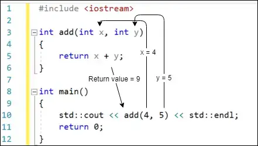

## **Bài 2.4: <u>Giới thiệu về tham số và đối số của hàm (function parameter and function argument)</u>**

Trong bài học trước, chúng ta đã học được rằng hàm có thể trả về giá trị cho chương trình gọi nó. Chúng ta đã sử dụng điều đó để tạo ra hàm `getValueFromUser` theo mô hình:

>```
>#include <iostream>
>
>int getValueFromUser()
>{
>  std::cout << "Nhập một số nguyên: ";
>  int input{};
>  std::cin >> input;
>
>  return input;
>}
>
>int main()
>{
>  int num{ getValueFromUser() };
>
>  std::cout << num << " nhân đôi là: " << num * 2 << '\n';
>
>  return 0;
>}
>```

Tuy nhiên, nếu chúng ta muốn đặt dòng xuất ra vào một hàm riêng biệt thì sao? Bạn có thể thử như thế này:

>```
>#include <iostream>
>
>int getValueFromUser()
>{
>  std::cout << "Nhập một số nguyên: ";
>  int input{};
>  std::cin >> input;
>
>  return input;
>}
>
>// Hàm này sẽ không được biên dịch
>void printDouble()
>{
>  std::cout << num << " doubled is: " << num * 2 << '\n';
>}
>
>int main()
>{
>  int num{ getValueFromUser() };
>
>  printDouble();
>
>  return 0;
>}
>```

Chương trình trên sẽ không được biên dịch, vì hàm `printDouble` không biết định danh `num` là gì. Bạn có thể thử định nghĩa `num` như một biến bên trong hàm `printDouble`:

>```
>void printDouble()
>{
>  int num{}; // chúng tôi đã thêm dòng này
>  std::cout << num << " doubled is: " << num * 2 << '\n';
>}
>```

Mặc dù điều này giải quyết lỗi trình biên dịch và khiến chương trình có thể biên dịch được, chương trình vẫn hoạt động không chính xác (nó luôn in `“0 nhân đôi là: 0”`). Vấn đề cốt lõi ở đây là hàm `printDouble` không có cách nào để truy cập vào giá trị do người dùng nhập.

Chúng ta cần một cách nào đó để truyền giá trị của biến `num` sang hàm `printDouble` để `printDouble` có thể sử dụng giá trị đó trong thân hàm.

### **Tham Số Hàm và Đối Số**

Trong nhiều trường hợp, việc có thể truyền thông tin cho một hàm được gọi là rất hữu ích, để hàm đó có dữ liệu để làm việc. Ví dụ, nếu chúng ta muốn viết một hàm để cộng hai số, chúng ta cần một cách nào đó để báo cho hàm biết hai số nào cần cộng khi chúng ta gọi nó. Bằng cách nào khác, hàm sẽ biết phải cộng cái gì? Chúng ta thực hiện điều đó thông qua tham số và đối số hàm.

- **Tham số hàm** là một biến được sử dụng trong tiêu đề của hàm. Tham số hàm hoạt động gần giống hệt với các biến được định nghĩa bên trong hàm, nhưng có một điểm khác biệt: chúng được khởi tạo với giá trị được cung cấp bởi hàm gọi của hàm đó.

Tham số hàm được định nghĩa trong tiêu đề hàm bằng cách đặt chúng vào giữa dấu ngoặc đơn sau tên hàm, với nhiều tham số được phân cách bằng dấu phẩy.

Dưới đây là một số ví dụ về hàm với số lượng tham số khác nhau:

>```
>// Hàm này không nhận tham số nào
>// Nó không phụ thuộc vào hàm gọi truyền vào thứ gì
>void doPrint()
>{
>  std::cout << "In doPrint()\n";
>}
>
>// Hàm này nhận một tham số nguyên có tên x
>// Hàm gọi sẽ cung cấp giá trị của x
>void printValue(int x)
>{
>  std::cout << x << '\n';
>}
>
>// Hàm này có hai tham số nguyên, một tên là x và một tên là y
>// Hàm gọi sẽ cung cấp giá trị của cả x và y
>int add(int x, int y)
>{
>  return x + y;
>}
>```

- **Đối số** là một giá trị được truyền từ caller cho hàm khi thực hiện một lời gọi hàm:

>`doPrint(); // Lời gọi này không có đối số`\
>`printValue(6); // 6 là đối số được truyền cho hàm printValue()`\
>`add(2, 3); // 2 và 3 là các đối số được truyền cho hàm add()`

Lưu ý rằng nhiều đối số cũng được phân cách bằng dấu phẩy.

### **Cách tham số hàm và đối số hoạt động cùng nhau**

Khi một hàm được gọi, tất cả các tham số của hàm được tạo thành các biến và giá trị của từng đối số được sao chép vào tham số tương ứng (sử dụng khởi tạo sao chép (copy initialization)). Quá trình này được gọi là **truyền theo giá trị (pass by value)**. Tham số hàm sử dụng truyền theo giá trị được gọi là **tham số giá trị (value parameter)**.

**Ví dụ:**

>```
>#include <iostream>
>
>// Hàm này có hai tham số nguyên, một tên là x và một tên là y
>// Giá trị của x và y được truyền vào bởi hàm gọi
>void printValues(int x, int y)
>{
>  std::cout << x << '\n';
>  std.cout << y << '\n';
>}
>
>int main()
>{
>  printValues(6, 7); // Lời gọi hàm này có hai đối số, 6 và 7
>
>  return 0;
>}
>```

Khi hàm `printValues` được gọi với đối số `6` và `7`, tham số `x` của `printValues` được tạo và khởi tạo với giá trị `6`, và tham số `y` của `printValues` được tạo và khởi tạo với giá trị `7`.

Điều này dẫn đến đầu ra:
>```
>6
>7
>```

Lưu ý rằng số lượng đối số nói chung phải khớp với số lượng tham số hàm, nếu không trình biên dịch sẽ báo lỗi. Đối số được truyền cho một hàm có thể là bất kỳ biểu thức hợp lệ nào (vì đối số về cơ bản chỉ là một bộ khởi tạo cho tham số và bộ khởi tạo có thể là bất kỳ biểu thức hợp lệ nào).

### **Khắc phục chương trình ở đầu bài**

Bây giờ chúng ta đã có công cụ cần thiết để sửa chữa chương trình được trình bày ở đầu bài học:

>```
>#include <iostream>
>
>int getValueFromUser()
>{
>    std::cout << "Nhập một số nguyên: ";
>    int input{};
>    std::cin >> input;
>
>    return input;
>}
>
>void printDouble(int value) // Hàm này bây giờ có một tham số kiểu nguyên
>{
>    std::cout << value << " doubled is: " << value * 2 << '\n';
>}
>
>int main()
>{
>    int num { getValueFromUser() };
>
>    printDouble(num);
>
>    return 0;
>}
>```

Trong chương trình này, biến `num` đầu tiên được khởi tạo với giá trị do người dùng nhập. Sau đó, hàm `printDouble` được gọi và giá trị của đối số `num` được sao chép vào tham số `value` của hàm `printDouble`. Hàm `printDouble` sau đó sử dụng giá trị của tham số `value`.

### **Sử dụng giá trị trả về của hàm làm đối số**

Trong bài toán trên, chúng ta có thể thấy rằng biến `num` chỉ được sử dụng một lần, để truyền giá trị trả về của hàm `getValueFromUser` cho đối số của hàm gọi `printDouble`.

Chúng ta có thể đơn giản hóa ví dụ trên một chút như sau:

>```
>#include <iostream>
>
>int getValueFromUser() {
>  std::cout << "Nhập một số nguyên: ";
>  int input{};
>  std::cin >> input;
>
>  return input;
>}
>
>void printDouble(int value) {
>  std::cout << value << " nhân đôi là: " << value * 2 << '\n';
>}
>
>int main() {
>  printDouble(getValueFromUser());
>
>  return 0;
>}
>```

Bây giờ, chúng ta đang sử dụng giá trị trả về của hàm `getValueFromUser` trực tiếp làm đối số cho hàm `printDouble`!

Mặc dù chương trình này gọn hơn (và làm rõ rằng giá trị do người dùng nhập sẽ không được sử dụng cho việc gì khác), bạn cũng có thể thấy cú pháp gọn này hơi khó đọc. Nếu bạn cảm thấy thoải mái hơn khi sử dụng phiên bản sử dụng biến thay thế, thì không sao cả.

### **Cách tham số hàm và giá trị trả về hoạt động cùng nhau**

Bằng cách sử dụng cả tham số và giá trị trả về, chúng ta có thể tạo các hàm nhận dữ liệu làm đầu vào, thực hiện một số phép tính với dữ liệu đó và trả về giá trị cho chương trình gọi.

Dưới đây là một ví dụ về một hàm rất đơn giản cộng hai số lại với nhau và trả về kết quả cho chương trình gọi:

>```
>#include <iostream>
>
>// Hàm add() nhận hai số nguyên làm tham số và trả về kết quả của tổng của chúng
>// Giá trị của x và y được xác định bởi hàm gọi add()
>int add(int x, int y)
>{
>    return x + y;
>}
>
>// Hàm main không nhận tham số
>int main()
>{
>    std::cout << add(4, 5) << '\n'; // Các đối số 4 và 5 được truyền cho hàm add()
>    return 0;
>}
>```

Thực thi bắt đầu từ đầu của hàm `main`. Khi `add(4, 5)` được đánh giá, hàm `add` được gọi, với tham số `x` được khởi tạo với giá trị `4` và tham số `y` được khởi tạo với giá trị `5`.

Câu lệnh `return` trong hàm `add` tính toán `x + y` để tạo ra giá trị `9`, sau đó trả về `main`. Giá trị `9` này sau đó được gửi đến `std::cout` để in ra console.

>**Kết quả:** `9`

**Minh họa bằng ảnh:**<br>
>

### **Các ví dụ thêm về tham số và giá trị trả về**

Hãy xem một số lời gọi hàm khác:

>```
>#include <iostream>
>
>int add(int x, int y)
>{
>    return x + y;
>}
>
>int multiply(int z, int w)
>{
>    return z * w;
>}
>
>int main()
>{
>    std::cout << add(4, 5) << '\n'; // Trong hàm add() x=4, y=5, nên x+y=9
>    std::cout << add(1 + 2, 3 * 4) << '\n'; // Trong hàm add() x=3, y=12, nên x+y=15
>
>    int a{ 5 };
>    std::cout << add(a, a) << '\n'; // tính toán (5 + 5)
>
>    std::cout << add(1, multiply(2, 3)) << '\n'; // tính toán 1 + (2 * 3)
>    std::cout << add(1, add(2, 3)) << '\n'; // tính toán 1 + (2 + 3)
>
>    return 0;
>}
>```

Chương trình này tạo ra đầu ra:

>```
>9
>15
>10
>7
>6
>```

- Câu lệnh đầu tiên đơn giản.
- Trong câu lệnh thứ hai, các đối số là các biểu thức được tính toán trước khi được truyền. Trong trường hợp này, `1 + 2` được tính toán thành `3`, vì vậy `3` được sao chép vào tham số `x`. `3 * 4` được tính toán thành `12`, vì vậy `12` được sao chép vào tham số `y`. `add(3, 12)` tương ứng với `15`.

- Cặp câu lệnh tiếp theo cũng tương đối dễ hiểu:
>```
>int a{ 5 };
>std::cout << add(a, a) << '\n'; // tính toán (5 + 5)
>```

    Trong trường hợp này, `add()` được gọi và giá trị của `a` được sao chép vào cả hai tham số `x` và `y`. Vì `a` có giá trị `5`, nên `add(a, a) = add(5, 5)`, tương ứng với giá trị `10`.

- Chúng ta hãy xem xét câu lệnh khó nhằn đầu tiên trong nhóm:
>`std::cout << add(1, multiply(2, 3)) << '\n'; // tính toán 1 + (2 * 3)`

    Khi hàm `add` được thực thi, chương trình cần xác định giá trị cho các tham số `x` và `y`. `x` đơn giản vì chúng ta vừa truyền cho nó số nguyên `1`. Để lấy giá trị cho tham số `y`, trước tiên nó cần tính toán `multiply(2, 3)`.

    Chương trình gọi `multiply` và khởi tạo `z = 2` và `w = 3`, vì vậy `multiply(2, 3)` trả về giá trị số nguyên `6`. Giá trị trả về `6` đó bây giờ có thể được sử dụng để khởi tạo tham số `y` của hàm `add`. `add(1, 6)` trả về số nguyên `7`, sau đó được truyền cho `std::cout` để in ra.

- Tóm gọn hơn: `add(1, multiply(2, 3))` tương ứng với `add(1, 6)` -> tương ứng với `7`

- Câu lệnh sau trông khó hiểu vì một trong các đối số được truyền cho `add` là một lời gọi khác cho `add`.
>`std::cout << add(1, add(2, 3)) << '\n'; // tính toán 1 + (2 + 3)`

    Nhưng trường hợp này hoạt động hoàn toàn giống như trường hợp trước đó. `add(2, 3)` giải quyết trước tiên, dẫn đến giá trị trả về là `5`. Bây giờ nó có thể giải quyết `add(1, 5)`, tương ứng với giá trị `6`, được truyền cho `std::cout` để in ra.

    Tóm gọn hơn: `add(1, add(2, 3))` tương ứng với `add(1, 5)` -> tương ứng với `6`

### **Tham Số Không Được Sử Dụng**

Trong một số trường hợp, bạn sẽ gặp các hàm có các tham số không được sử dụng trong thân hàm. Chúng được gọi là **tham số không tham chiếu hay tham số không được sử dụng (unreferenced parameters or unused parameter)**.

Điều này có thể xảy ra khi một tham số hàm đã từng được sử dụng nhưng không còn được sử dụng nữa.

**Ví dụ đơn giản:**

>```
>void doSomething(int count) // cảnh báo: tham số count không được tham chiếu
>{
>  // Hàm này đã từng làm gì đó với count nhưng không còn được sử dụng nữa
>}
>
>int main()
>{
>  doSomething(4);
>
>  return 0;
>}
>```

Giống như các biến cục bộ không được sử dụng, trình biên dịch của bạn có thể sẽ cảnh báo rằng biến count đã được định nghĩa nhưng không được sử dụng.

>**Điểm mấu chốt**<br>
Nếu đơn giản xóa tham số hàm không được sử dụng, thì bất kỳ lời gọi hàm hiện có nào cũng sẽ bị lỗi (vì lời gọi hàm sẽ cung cấp nhiều đối số hơn so với hàm có thể chấp nhận).

Trong định nghĩa hàm, tên của tham số hàm là tùy chọn. Do đó, trong trường hợp một tham số hàm cần tồn tại nhưng không được sử dụng trong thân hàm, bạn chỉ cần bỏ qua tên. Tham số không có tên được gọi là **tham số không tên (unnamed parameter)**:
>```
>void doSomething(int) // ok: unnamed parameter will not generate warning
>{
>}
>```

Hướng dẫn chuẩn C++ của Google khuyên nên sử dụng chú thích để ghi lại tham số không tên là gì:

>```
>void doSomething(int /*count*/) // Sử dụng cho người đọc nâng cao
>{
>}
>```

>**Đối với người đọc nâng cao**<br>
>Trong C++ nâng cao, có những trường hợp khác mà tham số hàm không được tham chiếu xảy ra. Ví dụ, C++ sử dụng sự tồn tại của một tham số hàm không được tham chiếu để phân biệt giữa toán tử tiền tố `++` (ví dụ: `++foo`) và toán tử hậu tố `++` (ví dụ: `foo++`). Chúng tôi sẽ đề cập đến điều này trong **bài học 21.8 - Nạp chồng toán tử tăng và giảm**.

>**Lưu ý từ tác giả**<br>
>Nếu tham số không tên vẫn chưa có ý nghĩa đối với bạn, đừng lo lắng. Chúng ta sẽ gặp lại chúng trong các bài học sau, khi chúng ta có nhiều ngữ cảnh hơn để giải thích khi nào chúng hữu ích.

>**Thực hành tốt**<br>
>Khi một tham số hàm tồn tại nhưng không được sử dụng trong thân hàm, thì không đặt tên cho nó. Bạn có thể tùy chọn đặt tên bên trong một chú thích.

### **Kết luận**

Tham số hàm và giá trị trả về là những cơ chế then chốt để viết các hàm theo cách có thể tái sử dụng được. Chúng cho phép chúng ta viết các hàm thực hiện các tác vụ và trả về kết quả đã truy xuất hoặc tính toán cho chương trình gọi mà không cần biết trước các đầu vào hoặc đầu ra cụ thể.
