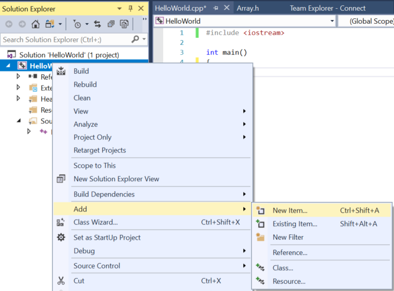
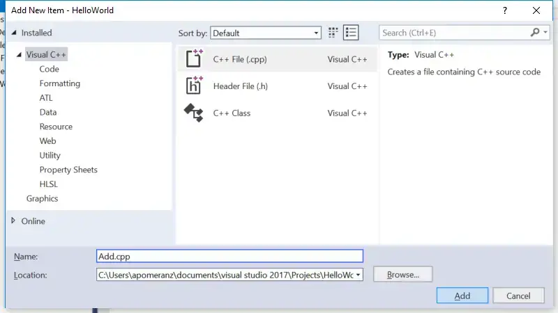
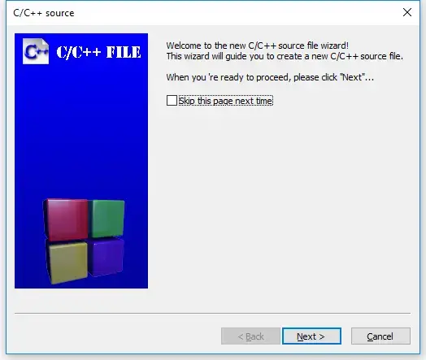
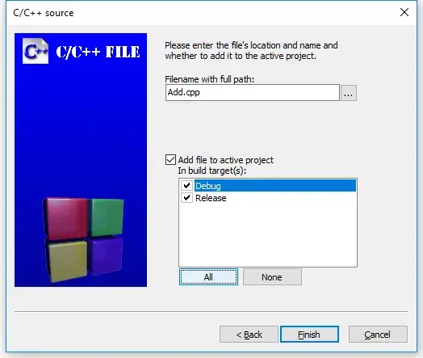

## **Bài 2.8: <u>Chương trình với nhiều tệp mã</u>**

Khi chương trình trở nên lớn hơn, việc chia chúng thành nhiều tệp khác nhau cho mục đích tổ chức hoặc tái sử dụng mã là điều thường thấy. Một lợi thế của việc làm việc với IDE là chúng giúp việc làm việc với nhiều tệp trở nên dễ dàng hơn nhiều. Bạn đã biết cách tạo và biên dịch các dự án tệp đơn. Thêm các tệp mới vào các dự án hiện có rất dễ dàng.

>**Thực hành tốt nhất**<br>
>Khi bạn thêm các tệp mã mới vào dự án của mình, hãy đặt cho chúng phần mở rộng .cpp

>**Đối với người dùng Visual Studio:**
>
>Nhấp chuột phải vào thư mục **Source Files** (hoặc tên dự án) trong cửa sổ **Solution Explorer**, và chọn **Add > New Item…** (**Thêm > Thêm Mục Mới…**).
>
>
>
>Kiểm tra xem bạn đã chọn **C++ File (.cpp)** (Tệp C++ (.cpp)) chưa. Đặt tên cho tệp mới và nó sẽ được thêm vào dự án của bạn.
>
>**Lưu ý:** Visual Studio của bạn có thể chọn hiển thị cho bạn chế độ xem gọn thay vì chế độ xem đầy đủ như được hiển thị ở trên. Bạn có thể sử dụng chế độ xem gọn hoặc nhấp vào **"Show all Templates"** (Hiển thị tất cả Mẫu) để chuyển sang chế độ xem đầy đủ.
>
>
>
>**Lưu ý:** Nếu bạn tạo một tệp mới từ menu **File** (Tệp) thay vì từ dự án của mình trong **Solution Explorer**, thì tệp mới sẽ không được tự động thêm vào dự án của bạn. Bạn sẽ phải thêm nó vào dự án theo cách thủ công. Để thực hiện việc này, hãy nhấp chuột phải vào **Source Files** trong **Solution Explorer**, chọn **Add > Existing Item** (Thêm > Mục Hiện Có), rồi chọn tệp của bạn.
>
>Bây giờ, khi bạn biên dịch chương trình của mình, bạn sẽ thấy trình biên dịch liệt kê tên tệp của mình khi nó biên dịch nó.

>**Đối với người dùng Code::Blocks**
>
>Trong Code::Blocks, hãy đi tới menu **File** (Tệp) và chọn **New > File…** (Mới > Tệp…).
>
>
>
>Trong hộp thoại **New from template** (Mới từ mẫu), chọn **C/C++ source** (Nguồn C/C++) và nhấp vào **Go** (Đi).
>
>
>
>Lúc này, bạn có thể thấy hoặc không thấy hộp thoại **welcome to the C/C++ source file wizard** (chào mừng đến trình hướng dẫn tệp nguồn C/C++). Nếu có, hãy nhấp vào **Next** (Tiếp theo).
>
>
>
>Trên trang tiếp theo của trình hướng dẫn, chọn "**C++**" và nhấp vào **Next** (Tiếp theo).
>
>
>
>Bây giờ, đặt tên cho tệp mới (đừng quên phần mở rộng .cpp), và nhấp vào nút **All** (Tất cả) để đảm bảo tất cả các mục tiêu xây dựng được chọn. Cuối cùng, chọn **Finish** (Hoàn thành).
>
>
>
>Bây giờ, khi bạn biên dịch chương trình của mình, bạn sẽ thấy trình biên dịch liệt kê tên tệp của mình khi nó biên dịch nó.

>**Đối với người dùng GCC/G++**
>
>Từ dòng lệnh, bạn có thể tự tạo tệp bổ sung bằng trình soạn thảo yêu thích của mình và đặt tên cho nó. Khi bạn biên dịch chương trình của mình, bạn cần bao gồm tất cả các tệp mã liên quan trên dòng biên dịch. Ví dụ: `g++ main.cpp add.cpp -o main` , trong đó `main.cpp` và `add.cpp` là tên các tệp mã của bạn và `main` là tên của tệp đầu ra.

>**Đối với người dùng VS Code**
>
>Để tạo một tệp mới, chọn **View > Explorer** từ thanh điều hướng trên cùng để mở ngăn **Explorer**, sau đó nhấp vào biểu tượng **New File** (Tệp mới) ở bên phải tên dự án. Hoặc, chọn **File > New File** (Tệp > Tệp mới) từ thanh điều hướng trên cùng. Sau đó, đặt tên cho tệp mới của bạn (đừng quên phần mở rộng .cpp). Nếu tệp xuất hiện bên trong thư mục .vscode, hãy kéo nó lên một cấp tới thư mục dự án.
>
>Tiếp theo, hãy mở tệp `tasks.json` và tìm dòng `"${file}"`,.
>
>Bạn có hai lựa chọn ở đây:
>
>Nếu bạn muốn rõ ràng về việc các tệp nào được biên dịch, hãy thay thế `"${file}"`, bằng tên của từng tệp bạn muốn biên dịch, mỗi tệp trên một dòng, giống như này:
>>```
>>"main.cpp",
>>"add.cpp",


### **Ví dụ về chương trình nhiều tệp mã**

Trong bài học [**2.7 - Tiền khai báo và định nghĩa hàm**](lesson2_7.ipynb), chúng tôi đã xem xét một chương trình tệp đơn không thể biên dịch được:
>```
>#include <iostream>
>
>int main()
>{
>  std::cout << "The sum of 3 and 4 is: " << add(3, 4) << '\n';
>  return 0;
>}
>
>int add(int x, int y)
>{
>  return x + y;
>}
>```

Khi trình biên dịch đến lệnh gọi hàm `add` trên dòng *5* của `main`, nó không biết `add` là gì, bởi vì chúng tôi chưa định nghĩa `add` cho đến dòng *9*! Giải pháp của chúng tôi là sắp xếp lại các hàm (đặt `add` lên đầu) hoặc sử dụng **tiền khai báo** cho `add`.

Bây giờ, chúng ta hãy xem xét một chương trình đa tệp tương tự:

**add.cpp:**
>```
>int add(int x, int y)
>{
>  return x + y;
>}

**main.cpp:**
>```
>#include <iostream>
>
>int main()
>{
>  std::cout << "The sum of 3 and 4 is: " << add(3, 4) << '\n'; // lỗi biên dịch
>  return 0;
>}

Trình biên dịch của bạn có thể biên dịch `add.cpp` hoặc `main.cpp` trước. Dù bằng cách nào, `main.cpp` sẽ không thể biên dịch được, dẫn đến lỗi trình biên dịch giống như ví dụ trước:
>`main.cpp(5) : error C3861: 'add': identifier not found`

Lý do cũng chính xác như vậy: khi trình biên dịch đến dòng *5* của `main.cpp`, nó không biết định danh `add` là gì.

Hãy nhớ rằng, trình biên dịch biên dịch từng tệp riêng lẻ. Nó không biết về nội dung của các tệp mã khác hoặc ghi nhớ bất kỳ điều gì nó đã thấy từ các tệp mã được biên dịch trước đó. Vì vậy, ngay cả khi trình biên dịch có thể đã thấy định nghĩa của hàm `add` trước đó (nếu nó biên dịch `add.cpp` trước), thì nó cũng không nhớ.

Khả năng hiển thị hạn chế và bộ nhớ ngắn này là có chủ đích, vì một vài lý do:
- Nó cho phép các tệp nguồn của một dự án được biên dịch theo bất kỳ thứ tự nào.
- Khi chúng tôi thay đổi một tệp nguồn, chỉ tệp nguồn đó cần được biên dịch lại.
- Nó giảm khả năng xung đột tên giữa các định danh trong các tệp khác nhau.

Chúng tôi sẽ khám phá những gì xảy ra khi tên xung đột trong bài học tiếp theo ([**2.9 - Xung đột tên và Giới thiệu về Không gian tên**](lesson2_9.cpp)).

Các tùy chọn giải pháp của chúng tôi ở đây giống như trước: đặt định nghĩa của hàm `add` trước hàm `main`, hoặc đáp ứng trình biên dịch bằng tiền khai báo. Trong trường hợp này, vì hàm `add` nằm trong một tệp khác, nên tùy chọn sắp xếp lại không khả thi.

Giải pháp ở đây là sử dụng tiền khai báo:

**main.cpp (với tiền khai báo):**
>```
>#include <iostream>
>
>int add(int x, int y); // cần thiết để main.cpp biết rằng add() là một hàm được định nghĩa ở nơi khác
>
>int main()
>{
>  std::cout << "The sum of 3 and 4 is: " << add(3, 4) << '\n';
>  return 0;
>}

**add.cpp**
>```
>int add(int x, int y)
>{
>  return x + y;
>}

Bây giờ, khi trình biên dịch đang biên dịch `main.cpp`, nó sẽ biết định danh `add` là gì và hài lòng. Trình liên kết sẽ kết nối lệnh gọi hàm `add` trong `main.cpp` với định nghĩa của hàm `add` trong `add.cpp`.

Sử dụng phương pháp này, chúng ta có thể cho các tệp truy cập vào các hàm nằm trong một tệp khác.

Hãy thử tự biên dịch `add.cpp` và `main.cpp` với tiền khai báo. Nếu bạn gặp lỗi trình liên kết, hãy đảm bảo bạn đã thêm `add.cpp` vào dự án hoặc dòng biên dịch của mình một cách chính xác.

>**Mẹo**<br>
>Do trình biên dịch biên dịch từng tệp mã riêng lẻ (và sau đó quên những gì nó đã thấy), mỗi tệp mã sử dụng `std::cout` hoặc `std::cin` đều cần `#include <iostream>`.
>
>Trong ví dụ trên, nếu `add.cpp` sử dụng `std::cout` hoặc `std::cin`, thì nó cũng cần `#include <iostream>`.

>**Kiến thức trọng tâm**<br>
>Khi một định danh được sử dụng trong một biểu thức, định danh đó phải được kết nối với định nghĩa của nó.
>- Nếu trình biên dịch không thấy khai báo trước hoặc định nghĩa cho định danh trong tệp đang được biên dịch, thì nó sẽ báo lỗi tại điểm mà định danh được sử dụng.
>- Hoặc là, nếu định nghĩa tồn tại trong cùng một tệp, trình biên dịch sẽ kết nối việc sử dụng định danh với định nghĩa của nó.
>- Hoặc là, nếu định nghĩa tồn tại trong một tệp khác (và trình liên kết có thể nhìn thấy), thì trình liên kết sẽ kết nối việc sử dụng định danh với định nghĩa của nó.
>
>Nếu không thì cuối cùng, trình liên kết sẽ báo lỗi cho biết nó không thể tìm thấy định nghĩa cho định danh.

