## **Bài 3.1: <u>Lỗi cú pháp và lỗi ngữ nghĩa</u>**

Lỗi phần mềm rất phổ biến. Rất dễ mắc phải chúng và khó khăn để tìm ra chúng. Trong chương này, chúng ta sẽ khám phá các chủ đề liên quan đến việc tìm và loại bỏ lỗi trong các chương trình C++ của mình, bao gồm cả việc học cách sử dụng trình gỡ lỗi tích hợp đi kèm với IDE của bạn.

Mặc dù các công cụ và kỹ thuật gỡ lỗi không phải là một phần của tiêu chuẩn C++, việc học cách tìm và loại bỏ lỗi trong các chương trình bạn viết là một phần cực kỳ quan trọng để trở thành một lập trình viên thành công. Do đó, chúng tôi sẽ dành một chút thời gian để đề cập đến các chủ đề như vậy, để khi các chương trình bạn viết trở nên phức tạp hơn, khả năng chẩn đoán và khắc phục sự cố của bạn cũng sẽ tiến triển theo cùng một nhịp độ.

Nếu bạn có kinh nghiệm gỡ lỗi chương trình trong một ngôn ngữ lập trình khác, thì phần lớn nội dung này sẽ quen thuộc với bạn.

### **Lỗi cú pháp và lỗi ngữ nghĩa**

Lập trình có thể đầy thử thách và C++ là một ngôn ngữ hơi lập dị. Kết hợp cả hai điều đó lại, sẽ có rất nhiều cách để mắc lỗi. Lỗi thường thuộc một trong hai loại: lỗi cú pháp và lỗi ngữ nghĩa (lỗi logic).

**Lỗi cú pháp** xảy ra khi bạn viết một câu lệnh không hợp lệ theo ngữ pháp của ngôn ngữ C++. Điều này bao gồm các lỗi như thiếu dấu chấm phẩy, sử dụng các biến chưa được khai báo, dấu ngoặc hoặc ngoặc nhọn không khớp, v.v. Ví dụ, chương trình sau đây chứa một vài lỗi cú pháp:

>```
>#include <iostream>
>
>int main()
>{
>    std::cout < "Hi there"; << x << '\n'; // Toán tử không hợp lệ (<), dấu chấm phẩy thừa, biến chưa được khai báo (x)
>    return 0 // Thiếu dấu chấm phẩy ở cuối câu lệnh
>}
>```

May mắn thay, trình biên dịch thường sẽ bắt được các lỗi cú pháp và tạo ra các cảnh báo hoặc lỗi, vì vậy bạn có thể dễ dàng xác định và khắc phục sự cố. Sau đó, bạn chỉ cần biên dịch lại cho đến khi loại bỏ được tất cả các lỗi.

Khi chương trình của bạn đã được biên dịch chính xác, việc khiến nó thực sự tạo ra kết quả mong muốn có thể khá khó khăn. **Lỗi ngữ nghĩa** xảy ra khi một câu lệnh hợp lệ về cú pháp nhưng không thực hiện những gì lập trình viên định hướng.

Đôi khi chúng sẽ khiến chương trình của bạn bị crash (chết), chẳng hạn như trong trường hợp chia cho `0`:
>```
>#include <iostream>
>
>int main()
>{
>    int a { 10 };
>    int b { 0 };
>    std::cout << a << " / " << b << " = " << a / b << '\n'; // Chia cho 0 là không xác định trong toán học
>    return 0;
>}
>```


Thông thường hơn, chúng sẽ chỉ tạo ra giá trị hoặc hành vi sai:
>```
>#include <iostream>
>
>int main()
>{
>    int x; // no initializer provided
>    std::cout << x << '\n'; // Use of uninitialized variable leads to undefined result
>
>    return 0;
>}
>```

Hoặc:

>```
>#include <iostream>
>
>int add(int x, int y) // Hàm này được cho là thực hiện phép cộng
>{
>    return x - y; // Nhưng nó không thực hiện được do sử dụng sai toán tử
>}
>
>int main()
>{
>    std::cout << "5 + 3 = " << add(5, 3) << '\n'; // Nên trả về 8, nhưng trả về 2
>
>    return 0;
>}
>```

hay:
>```
>#include <iostream>
>
>int main()
>{
>    return 0; // function returns here
>
>    std::cout << "Hello, world!\n"; // so this never executes
>}
>```

Trình biên dịch hiện đại đã được cải thiện hơn trong việc phát hiện một số loại lỗi ngữ nghĩa phổ biến (ví dụ: sử dụng biến chưa được khởi tạo). Tuy nhiên, trong hầu hết các trường hợp, trình biên dịch sẽ không thể bắt được hầu hết các loại vấn đề này, vì trình biên dịch được thiết kế để kiểm tra ngữ pháp, không phải ý định của người viết code.

Trong các ví dụ trên, lỗi khá dễ dàng để phát hiện. Nhưng trong hầu hết các chương trình phức tạp, lỗi ngữ nghĩa không dễ dàng tìm thấy bằng cách nhìn trực tiếp vào mã nguồn. Đây là lúc các kỹ thuật gỡ lỗi có thể hữu ích.

## **Bài 3.2: <u>Quá trình gỡ lỗi</u>**

**Tình huống:** Bạn đã viết một chương trình, nhưng nó không hoạt động chính xác - mã biên dịch tốt, nhưng khi chạy lại cho kết quả không mong đợi. Chắc chắn là có một lỗi logic (semantic error) ở đâu đó. Làm thế nào để tìm ra nó?

Nếu bạn đã tuân theo các thông lệ tốt bằng cách viết từng phần nhỏ của chương trình và kiểm tra nó, thì bạn có thể có một ý tưởng về vị trí của lỗi. Hoặc bạn có thể hoàn toàn không biết gì.

**Nguồn gốc của lỗi:** Tất cả các lỗi đều bắt nguồn từ một tiền đề đơn giản: Điều gì bạn nghĩ là đúng, thì hóa ra lại không đúng. Việc thực sự xác định vị trí của lỗi này có thể rất khó khăn. Trong bài học này, chúng ta sẽ phác thảo quy trình chung để gỡ lỗi chương trình.

**Lưu ý về độ phức tạp:** Do chúng ta chư đề cập nhiều chủ đề C++ cho đến thời điểm này, nên các chương trình ví dụ trong chương này sẽ khá cơ bản. Điều đó có thể khiến một số kỹ thuật mà chúng tôi trình bày ở đây có vẻ quá mức cần thiết. Tuy nhiên, hãy nhớ rằng các kỹ thuật này được thiết kế để sử dụng với các chương trình lớn hơn, phức tạp hơn và sẽ hữu ích hơn trong môi trường như vậy (đó là nơi bạn cần chúng nhất).

### **Cách tiếp cận chung để gỡ lỗi**

Khi một vấn đề được xác định, việc gỡ lỗi thường bao gồm sáu bước:

1. Tìm ra gốc rễ của vấn đề (thường là dòng code không hoạt động).
2. Đảm bảo bạn hiểu tại sao sự cố xảy ra.
3. Xác định cách bạn sẽ khắc phục sự cố.
4. Sửa chữa vấn đề gây ra trục trặc.
5. Kiểm tra lại để đảm bảo vấn đề đã được khắc phục.
6. Kiểm tra lại để đảm bảo không có vấn đề mới phát sinh.

**<u>Ví dụ thực tế:</u>**

Giả sử một buổi tối, bạn đi lấy đá từ ngăn chứa đá trong tủ lạnh. Bạn đặt cốc lên ngăn chứa, nhấn cần gạt và ... không có gì chảy ra. Ồ! Bạn đã phát hiện ra một số khiếm khuyết. Bạn sẽ làm gì? Bạn có thể sẽ bắt đầu một cuộc điều tra để xem liệu bạn có thể xác định được nguyên nhân gốc rễ của vấn đề hay không.

**Tìm ra nguyên nhân gốc rễ:** Vì bạn nghe thấy ngăn chứa đá đang cố gắng lấy đá, nên có thể vấn đề không nằm ở chính cơ chế lấy đá. Vì vậy, bạn mở tủ lạnh và kiểm tra khay đá. Không có đá. Liệu đó có phải là nguyên nhân gốc rễ của vấn đề? Không, đó chỉ là một triệu chứng khác. Sau khi kiểm tra thêm, bạn xác định rằng máy làm đá dường như không tạo ra đá. Vấn đề là do máy làm đá hay do yếu tố khác? Tủ lạnh vẫn lạnh, đường nước không bị tắc, và mọi thứ khác dường như hoạt động bình thường, vì vậy bạn kết luận rằng nguyên nhân gốc rễ là do máy làm đá không hoạt động.

**Hiểu vấn đề:** Điều này đơn giản trong trường hợp này. Một máy làm đá bị hỏng sẽ không tạo ra đá.

**Xác định cách sửa chữa:** Lúc này, bạn có một vài lựa chọn để sửa chữa: Bạn có thể giải quyết vấn đề tạm thời (mua túi đá từ cửa hàng). Bạn có thể cố gắng chẩn đoán thêm máy làm đá, để xem có bộ phận nào có thể sửa chữa được không. Bạn có thể mua một máy làm đá mới và lắp đặt nó thay thế cho máy hiện tại. Hoặc bạn có thể mua một tủ lạnh mới. Bạn quyết định mua một máy làm đá mới.

**Sửa chữa sự cố:** Khi máy làm đá đã đến, bạn tiến hành lắp đặt.

**Kiểm tra lại:** Sau khi bật lại điện và đợi qua đêm, máy làm đá mới của bạn bắt đầu tạo đá. Không có vấn đề mới được phát hiện.

Bây giờ hãy áp dụng quy trình này cho chương trình đơn giản của chúng ta từ bài học trước:
>```
>#include <iostream>
>
>int add(int x, int y) // hàm này có nghĩa là thực hiện phép cộng
>{
>    return x - y; // nhưng nó không thực hiện được do sử dụng sai toán tử
>}
>
>int main()
>{
>    std::cout << "5 + 3 = " << add(5, 3) << '\n'; // đáng ra phải in ra 8, nhưng lại in ra 2
>
>    return 0;
>}
>```

Đoạn code này khá hay ở một điểm: lỗi rất rõ ràng, vì câu trả lời sai được in ra màn hình thông qua dòng 10. Điều đó cung cấp cho chúng ta một điểm khởi đầu cho cuộc điều tra của mình.

**Tìm ra nguyên nhân gốc rễ:** Ở dòng 10, chúng ta có thể thấy rằng chúng ta đang truyền các giá trị cố định cho đối số (`5` và `3`), vì vậy không có chỗ cho sai sót ở đây. Vì các đầu vào của hàm `add` là chính xác, nhưng đầu ra lại không, thì rõ ràng là hàm `add` phải tạo ra giá trị không đúng. Câu lệnh duy nhất trong hàm `add` là câu lệnh `return`, đây chính là thủ phạm. Chúng ta đã tìm thấy dòng có vấn đề. Bây giờ, khi chúng ta đã biết cần tập trung sự chú ý vào đâu, việc nhận thấy rằng chúng ta đang trừ thay vì cộng là điều bạn có thể dễ dàng phát hiện thông qua kiểm tra.

**Hiểu vấn đề:** Trong trường hợp này, việc giá trị sai được tạo ra là điều hiển nhiên - chúng ta đang sử dụng sai toán tử.

**Xác định cách sửa chữa:** Chúng ta chỉ đơn giản là thay đổi toán tử trừ (`-`) thành toán tử cộng (`+`).

**Sửa chữa sự cố:** Thực tế việc này là thay đổi toán tử trừ (`-`) thành toán tử cộng (`+`) và đảm bảo chương trình được biên dịch lại.

**Kiểm tra lại:** Sau khi thực hiện thay đổi, chạy lại chương trình sẽ cho thấy chương trình hiện tại tạo ra giá trị chính xác là `8`. Đối với chương trình đơn giản này, thì đó là tất cả các thử nghiệm cần thiết.

Mặc dù ví dụ này rất đơn giản, nhưng nó minh họa quy trình cơ bản mà bạn sẽ trải qua khi chẩn đoán bất kỳ chương trình nào.

## **Bài 3.3: <u>Chiến lược gỡ lỗi</u>**

Trong quá trình gỡ lỗi chương trình, trong hầu hết các trường hợp, phần lớn thời gian của bạn sẽ được dành để cố gắng tìm ra vị trí thực sự của lỗi. Khi sự cố được tìm thấy, các bước còn lại (khắc phục sự cố và xác nhận rằng sự cố đã được khắc phục) thường đơn giản hơn nhiều so với việc tìm ra lỗi.

Trong bài học này, chúng ta sẽ bắt đầu khám phá cách tìm lỗi.

### **Tìm ra vấn đề thông qua kiểm tra mã**

Giả sử bạn đã nhận thấy một vấn đề và bạn muốn theo dõi nguyên nhân của vấn đề cụ thể đó. Trong nhiều trường hợp (đặc biệt là trong các chương trình nhỏ hơn), chúng ta có thể nhanh chóng xác định được vị trí tiềm ẩn của sự cố.

Xem xét đoạn mã sau:

>```
>int main()
>{
>    getNames(); // yêu cầu người dùng nhập một loạt tên
>    sortNames(); // sắp xếp chúng theo thứ tự bảng chữ cái
>    printNames(); // in danh sách tên đã được sắp xếp
>
>    return 0;
>}
>```

Nếu bạn mong đợi chương trình này in ra các tên theo thứ tự bảng chữ cái, nhưng thay vào đó nó lại in ra theo thứ tự ngược lại, thì vấn đề có thể nằm ở hàm `sortNames`. Trong trường hợp bạn có thể thu hẹp vấn đề xuống một hàm cụ thể, bạn có thể phát hiện ra vấn đề chỉ bằng cách nhìn vào mã.

Tuy nhiên, khi chương trình trở nên phức tạp hơn, việc tìm kiếm vấn đề bằng cách kiểm tra mã cũng trở nên phức tạp hơn.

Thứ nhất, có nhiều mã hơn để xem xét. Xem xét từng dòng code trong một chương trình dài hàng nghìn dòng có thể mất rất nhiều thời gian (chưa kể nó cực kỳ nhàm chán). Thứ hai, bản thân mã có xu hướng phức tạp hơn, với nhiều vị trí tiềm ẩn hơn để xảy ra lỗi. Thứ ba, hành vi của mã có thể không cung cấp cho bạn nhiều manh mối về việc mọi thứ đang diễn ra sai ở đâu. Nếu bạn viết một chương trình để đưa ra các đề xuất về cổ phiếu và nó thực sự không xuất ra bất kỳ nội dung gì, thì bạn có thể sẽ không có nhiều manh mối để bắt đầu tìm kiếm vấn đề.

Cuối cùng, lỗi có thể do đưa ra những giả định sai lầm. Gần như không thể phát hiện trực quan một lỗi do đưa ra giả định sai lầm, bởi vì bạn có thể sẽ đưa ra cùng một giả định sai lầm khi kiểm tra mã và không nhận thấy lỗi. Vì vậy, nếu chúng ta có một sự cố mà chúng ta không thể tìm thấy thông qua kiểm tra mã, làm thế nào để chúng ta tìm thấy nó?

### **Tìm ra vấn đề thông qua việc chạy chương trình**

May mắn thay, nếu chúng ta không thể tìm thấy sự cố thông qua kiểm tra mã, thì còn một cách khác mà chúng ta có thể thực hiện: chúng ta có thể theo dõi hành vi của chương trình khi nó chạy và cố gắng chẩn đoán sự cố từ đó. Cách tiếp cận này có thể được khái quát thành:

1. Tìm cách tái tạo sự cố
2. Chạy chương trình và thu thập thông tin để thu hẹp phạm vi nơi xảy ra sự cố
3. Lặp lại bước trước cho đến khi bạn tìm thấy sự cố

Trong phần còn lại của chương này, chúng tôi sẽ thảo luận về các kỹ thuật để hỗ trợ cách tiếp cận này.

### **Tái tạo sự cố**

Bước đầu tiên và quan trọng nhất trong việc tìm kiếm vấn đề là khả năng tái tạo vấn đề. Tái tạo sự cố có nghĩa là khiến sự cố xuất hiện một cách nhất quán. Lý do rất đơn giản: rất khó để tìm ra vấn đề trừ khi bạn có thể quan sát thấy nó xảy ra.

Quay trở lại phép loại suy về máy phân phối đá của chúng ta - giả sử một ngày nào đó bạn của bạn nói với bạn rằng máy phân phối đá của bạn không hoạt động. Bạn đến xem nó, và nó hoạt động tốt. Làm thế nào để bạn chẩn đoán vấn đề? Sẽ rất khó khăn. Tuy nhiên, nếu bạn thực sự có thể thấy sự cố của máy phân phối đá không hoạt động, thì bạn có thể bắt đầu chẩn đoán lý do tại sao nó không hoạt động hiệu quả hơn nhiều.

Nếu sự cố phần mềm là hiển nhiên (ví dụ: chương trình bị treo ở cùng một chỗ mỗi lần bạn chạy nó) thì việc tái tạo sự cố có thể rất đơn giản. Tuy nhiên, đôi khi việc tái tạo sự cố có thể khó khăn hơn nhiều. Vấn đề chỉ có thể xảy ra trên một số máy tính nhất định hoặc trong những trường hợp cụ thể (ví dụ: khi người dùng nhập một đầu vào nhất định). Trong những trường hợp như vậy, việc tạo ra một tập hợp các bước tái tạo có thể hữu ích. **Bước tái tạo** (**Reproduction steps**) là một danh sách các bước rõ ràng và chính xác có thể được thực hiện để khiến sự cố tái diễn lại với mức độ dự đoán cao. Mục tiêu là có thể khiến sự cố tái diễn càng nhiều càng tốt, vì vậy chúng ta có thể chạy chương trình nhiều lần và tìm kiếm manh mối để xác định nguyên nhân gây ra sự cố. Nếu sự cố có thể được tái tạo 100% thời gian thì đó là điều lý tưởng, nhưng khả năng tái tạo dưới 100% cũng có thể chấp nhận được. Một sự cố chỉ xảy ra 50% thời gian đơn giản có nghĩa là nó sẽ mất gấp đôi thời gian để chẩn đoán sự cố, vì một nửa thời gian chương trình sẽ không hiển thị sự cố và do đó không cung cấp bất kỳ thông tin chẩn đoán hữu ích nào.

### **Thu hẹp phạm vi sự cố**

Khi chúng ta đã có thể tái tạo vấn đề một cách hợp lý, bước tiếp theo là xác định vị trí trong code nơi xảy ra vấn đề. Dựa trên bản chất của vấn đề, điều này có thể dễ dàng hoặc khó khăn. Vì mục đích minh họa, giả sử chúng ta không có nhiều ý tưởng về vị trí thực sự của vấn đề. Làm thế nào để chúng ta tìm thấy nó?

Để minh họa cho việc thu hẹp phạm vi vấn đề trong quá trình gỡ lỗi, hãy cùng chơi một trò chơi đơn giản gọi là Hi-Lo. Trong trò chơi này, tôi sẽ nghĩ đến một số ngẫu nhiên từ 1 đến 10, và bạn sẽ lần lượt đưa ra các phán đoán về số đó. Sau mỗi phán đoán, tôi sẽ cho bạn biết liệu số bạn đoán là cao hơn, thấp hơn hay bằng số tôi đang nghĩ.

Hãy tưởng tượng bạn đang chơi Hi-Lo với một người bạn:

>**Bạn:** 5
>
>**Bạn của bạn:** Quá thấp!
>
>**Bạn:** 8
>
>**Bạn của bạn:** Quá cao!
>
>**Bạn:** 6
>
>**Bạn của bạn:** Vẫn thấp!
>
>**Bạn:** 7
>
>**Bạn của bạn:** Chính xác!

Trong trò chơi ở trên, bạn không cần phải đoán mọi số để tìm ra số tôi đang nghĩ. Thông qua quá trình đưa ra các phán đoán và xem xét thông tin bạn học được từ mỗi phán đoán, bạn có thể "thu hẹp" phạm vi tìm kiếm số chính xác chỉ với một vài lần đoán (nếu bạn sử dụng chiến lược tối ưu, bạn luôn có thể tìm ra số tôi đang nghĩ trong 4 lần đoán trở xuống).

Quá trình này tương tự như cách thu hẹp phạm vi vấn đề trong gỡ lỗi chương trình.

- **Bắt đầu với phạm vi rộng:** Khi bắt đầu gỡ lỗi, bạn thường không biết chính xác vị trí xảy ra lỗi. Tuy nhiên, bạn biết rằng lỗi phải nằm ở đâu đó trong đoạn mã được thực thi giữa đầu chương trình và điểm chương trình hiển thị triệu chứng không chính xác đầu tiên mà bạn có thể quan sát được.

- **Thu hẹp phạm vi:** Dựa trên thông tin thu thập được khi chạy chương trình (ví dụ: thông báo lỗi, giá trị biến), bạn có thể dần dần thu hẹp phạm vi tìm kiếm vị trí lỗi.

- **Sử dụng các kỹ thuật gỡ lỗi:** Có nhiều kỹ thuật gỡ lỗi khác nhau có thể giúp bạn thu hẹp phạm vi vấn đề, chẳng hạn như đặt điểm ngắt, theo dõi biến và phân tích luồng chương trình.

**Mục tiêu:** Việc thu hẹp phạm vi vấn đề giúp bạn xác định vị trí lỗi một cách nhanh chóng và hiệu quả, tiết kiệm thời gian và công sức cho quá trình gỡ lỗi.

Phép chơi Hi-Lo tuy hữu ích nhưng không hoàn toàn chính xác khi áp dụng vào việc gỡ lỗi chương trình. Đôi khi, chúng ta có thể loại bỏ hoàn toàn một số đoạn mã khỏi quá trình xem xét mà không thu được bất kỳ thông tin nào về việc vấn đề thực sự nằm trước hay sau đoạn mã đó.

Chúng tôi sẽ trình bày các ví dụ về cả ba trường hợp này trong bài học tiếp theo.

Cuối cùng, với đủ nhiều lần phán đoán và một số kỹ thuật tốt, chúng ta có thể xác định chính xác dòng lệnh gây ra sự cố! Nếu chúng ta đã đưa ra bất kỳ giả định sai lầm nào, điều này sẽ giúp chúng ta phát hiện ra vị trí sai lầm. Khi bạn đã loại trừ tất cả các khả năng khác, thì điều duy nhất còn lại chắc chắn phải là nguyên nhân gây ra sự cố. Sau đó, vấn đề chỉ còn là hiểu tại sao.

Chiến lược phán đoán nào bạn muốn sử dụng phụ thuộc vào bạn - chiến lược tốt nhất phụ thuộc vào loại lỗi, vì vậy bạn có thể muốn thử nhiều cách tiếp cận khác nhau để thu hẹp vấn đề. Khi bạn có thêm kinh nghiệm trong việc gỡ lỗi sự cố, trực giác của bạn sẽ giúp bạn định hướng.

Vậy làm thế nào để chúng ta "đưa ra những phán đoán"? Có nhiều cách để thực hiện việc này. Chúng ta sẽ bắt đầu với một số cách tiếp cận đơn giản trong chương tiếp theo, sau đó chúng ta sẽ xây dựng dựa trên những cách này và khám phá các cách khác trong các chương sau.

## **Bài 3.4: <u>Các chiến thuật gỡ lỗi cơ bản </u>**

Trong bài học trước, chúng ta đã khám phá một chiến lược để tìm ra vấn đề bằng cách chạy chương trình và sử dụng phỏng đoán để xác định vị trí của sự cố. Trong bài học này, chúng ta sẽ khám phá một số chiến thuật cơ bản để thực hiện những phỏng đoán đó và thu thập thông tin giúp tìm ra sự cố.

### **Chiến thuật gỡ lỗi #1: Ghi chú code**

**Ghi chú code (comment out code)** là một chiến thuật gỡ lỗi đơn giản nhưng hiệu quả giúp loại trừ những phần code không liên quan đến vấn đề đang gặp phải.

Hãy bắt đầu với một chiến thuật đơn giản. Nếu chương trình của bạn đang hiển thị hành vi lỗi, một cách để giảm thiểu lượng code bạn phải tìm kiếm là chú thích một phần code và xem sự cố có tiếp tục xảy ra hay không. Nếu sự cố vẫn không thay đổi, thì đoạn code được chú thích ra có thể không phải là nguyên nhân gây ra sự cố.

Hãy xem xét đoạn mã sau:
>```
>int main()
>{
>    getNames(); // yêu cầu người dùng nhập một loạt tên
>    doMaintenance(); // thực hiện một số công việc ngẫu nhiên
>    sortNames(); // sắp xếp chúng theo thứ tự bảng chữ cái
>    printNames(); // in danh sách tên đã được sắp xếp
>
>    return 0;
>}
>```

Giả sử chương trình này được cho là in ra các tên theo thứ tự bảng chữ cái mà lại in ra theo thứ tự ngược lại. Vấn đề ở đâu? Liệu `getNames` nhập tên không chính xác? Hay `sortNames` sắp xếp chúng theo thứ tự ngược? Hay `printNames` in chúng theo thứ tự ngược? Nó có thể là bất kỳ điều nào trong số những thứ đó. Nhưng chúng ta có thể nghi ngờ `doMaintenance` không liên quan gì đến vấn đề, vì vậy hãy bình luận nó ra.

**Có ba kết quả có thể xảy ra:**
- Nếu sự cố biến mất, thì `doMaintenance` phải là nguyên nhân gây ra sự cố và chúng ta nên tập trung sự chú ý vào đó.
- Nếu sự cố không thay đổi (xác suất cao hơn), thì chúng ta có thể hợp lý cho rằng `doMaintenance` không phải là lỗi và chúng ta có thể tạm thời loại trừ toàn bộ hàm khỏi quá trình tìm kiếm. Điều này không giúp chúng ta hiểu liệu vấn đề thực sự nằm trước hay sau lệnh gọi `doMaintenance`, nhưng nó giảm thiểu lượng code mà chúng ta phải xem xét sau đó.
- Nếu việc bình luận `doMaintenance` khiến sự cố chuyển sang một sự cố liên quan khác (ví dụ: chương trình ngừng in tên), thì có khả năng `doMaintenance` đang thực hiện một tác vụ hữu ích mà một số code khác phụ thuộc vào. Trong trường hợp này, chúng ta có thể không thể xác định liệu sự cố nằm trong `doMaintenance` hay ở nơi khác, vì vậy chúng ta có thể bỏ ghi chú cho `doMaintenance` và thử một cách tiếp cận khác.

>**Tóm tắt:**
>Cách thực hiện:
>1. Xác định vị trí xảy ra lỗi trong chương trình.
>2. Ghi chú một phần code nghi ngờ có liên quan đến lỗi.
>3. Chạy lại chương trình và quan sát kết quả.
>
>Kết quả có thể xảy ra:
>- *Vấn đề biến mất:* Phần code được ghi chú là nguyên nhân gây ra lỗi.
>- *Vấn đề vẫn tiếp tục:* Phần code được ghi chú không liên quan đến lỗi.
>- *Vấn đề thay đổi:* Phần code được ghi chú có thể đang thực hiện một tác vụ quan trọng ảnh hưởng đến các phần code khác.

>**Chú ý:**<br>
>Trong khi sử dụng chú thích code để gỡ lỗi, bạn cần lưu ý đến những điều sau:
>- **Không quên bỏ ghi chú code sau khi gỡ lỗi:** Sau khi xác định được phần code gây ra lỗi, bạn cần bỏ ghi chú lại phần code đó để chương trình có thể hoạt động bình thường. Quá trình gỡ lỗi thường bao gồm nhiều lần thêm, xóa và ghi chú/bỏ ghi chú code. Nếu bạn quên bỏ ghi chú một đoạn code nào đó, chương trình có thể bị lỗi hoặc hoạt động không mong đợi.
>- **Sử dụng hệ thống kiểm soát phiên bản:** Việc sử dụng hệ thống kiểm soát phiên bản (version control system) như ***Git*** sẽ giúp bạn theo dõi những thay đổi của code theo thời gian. Nhờ đó, bạn có thể dễ dàng quay lại phiên bản code hoạt động trước đó nếu việc bình luận code gây ra lỗi hoặc tạo ra các vấn đề khác. Hệ thống kiểm soát phiên bản cũng giúp bạn phân biệt các thay đổi liên quan đến gỡ lỗi với các thay đổi tính năng của chương trình.

>**Mẹo**<br>
>**Sử dụng thư viện debug tùy chọn:** Một cách tiếp cận khác để thêm các lệnh gỡ lỗi (debug statements) vào code là sử dụng thư viện của bên thứ ba. Các thư viện này cho phép bạn đưa các lệnh gỡ lỗi vào code nhưng sẽ loại bỏ chúng khi biên dịch ở chế độ phát hành (release mode). Điều này giúp bạn giữ code gọn gàng và tránh ảnh hưởng đến hiệu suất của chương trình khi nó đã hoạt động ổn định. `dbg` là một thư viện header-only tiêu biểu có chức năng này (thông qua macro tiền xử lý `DBG_MACRO_DISABLE`)
>
>Chúng ta sẽ thảo luận về các thư viện chỉ có tiêu đề trong bài 5.7 -- Các hàm và biến nội tuyến.

### **Chiến thuật gỡ lỗi #2: Kiểm tra luồng thực thi code**

Trong các chương trình phức tạp, một vấn đề thường gặp là việc một hàm được gọi quá nhiều lần, quá ít lần (hoặc thậm chí không được gọi).

Để kiểm tra xem các hàm có được gọi đúng cách hay không, bạn có thể đặt các lệnh in tên của hàm vào đầu mỗi hàm. Khi chương trình chạy, bạn sẽ theo dõi được thứ tự các hàm được gọi và xác định xem hàm nào không được gọi hoặc được gọi không đúng số lần.

>**Mẹo**<br>
>Khi in thông tin để gỡ lỗi, hãy sử dụng `std::cerr` thay vì `std::cout`. Có một lý do cho việc này: `std::cout` có thể được lưu trữ đệm (*buffere*), nghĩa là có thể có một khoảng dừng giữa lúc bạn yêu cầu `std::cout` xuất ra thông tin và khi nó thực sự xuất ra. Nếu bạn xuất thông tin bằng `std::cout` và sau đó chương trình của bạn bị lỗi ngay lập tức, `std::cout` có thể vẫn chưa xuất ra thông tin đó. Điều này có thể khiến bạn hiểu sai về vị trí của sự cố. Mặt khác, `std::cerr` không được lưu trữ đệm, nghĩa là bất kỳ thứ gì bạn gửi đến nó sẽ được xuất ra ngay lập tức. Điều này giúp đảm bảo tất cả đầu ra gỡ lỗi xuất hiện càng sớm càng tốt (mặc dù nó có thể ảnh hưởng một chút đến hiệu suất, nhưng hiệu suất thường không phải là vấn đề quan trọng khi gỡ lỗi).
>
>Sử dụng `std::cerr` cũng giúp phân biệt rõ ràng rằng thông tin được xuất ra là dành cho trường hợp lỗi chứ không phải trường hợp bình thường.
>
>Chúng ta sẽ thảo luận thêm về thời điểm sử dụng `std::cout` và `std::cerr` trong bài 9.4 -- Phát hiện và xử lý lỗi.

**Ví dụ:**

Xét chương trình đơn giản sau không hoạt động chính xác:
>```
>#include <iostream>
>
>int getValue()
>{
>    return 4;
>}
>
>int main()
>{
>    std::cout << getValue << '\n';
>
>    return 0;
>}
>```

Bạn có thể cần tắt "Treat warnings as errors" (Xử lý cảnh báo như lỗi) để biên dịch chương trình trên.

Mặc dù chúng ta mong đợi chương trình này sẽ in giá trị `4`, nhưng trên thực tế nó lại in giá trị 
>`1`.

Trên **Visual Studio** (và có thể một số trình biên dịch khác), nó có thể in ra thông tin sau:
>`00101424`

>**Nội dung liên quan**<br>
>Chúng ta sẽ thảo luận tại sao một số trình biên dịch in số `1` và địa chỉ (và phải làm gì nếu trình biên dịch của bạn in số `1` nhưng bạn muốn nó in địa chỉ) trong bài 20.1 -- Con trỏ hàm.

**Thêm lệnh gỡ lỗi:**

Chúng ta hãy thêm một số lệnh gỡ lỗi vào các hàm này:
>```
>#include <iostream>
>
>int getValue()
>{
>std::cerr << "getValue() called\n";
>    return 4;
>}
>
>int main()
>{
>std::cerr << "main() called\n";
>    std::cout << getValue << '\n';
>
>    return 0;
>}
>```

>**Mẹo**<br>
Khi thêm các câu lệnh gỡ lỗi tạm thời, việc không thụt lề chúng có thể hữu ích. Điều này làm cho chúng dễ dàng được tìm thấy để loại bỏ sau này. Nếu bạn đang sử dụng `clang-format` để định dạng mã của mình, nó sẽ cố gắng tự động thụt lề những dòng này. Bạn có thể chặn định dạng tự động như thế này:
>>```
>>// clang-format off
>>std::cerr << "main() called\n";
>>// clang-format on
>>```

Bây giờ khi các hàm này được thực thi, chúng sẽ xuất ra tên của chúng, cho biết chúng đã được gọi:
>```
>main() called
>1
>```

Bây giờ chúng ta có thể thấy rằng hàm `getValue` không bao giờ được gọi. Phải có vấn đề gì đó với dòng code gọi hàm. Hãy xem xét kỹ hơn dòng code đó:
>```
>std::cout << getValue << '\n';
>```

Ồ, quên mất dấu ngoặc đơn trong lệnh gọi hàm. Nó phải là:
>```
>#include <iostream>
>
>int getValue()
>{
>std::cerr << "getValue() called\n";
>    return 4;
>}
>
>int main()
>{
>std::cerr << "main() called\n";
>    std::cout << getValue() << '\n'; // thêm dấu ngoặc đơn ở đây
>
>    return 0;
>}
>```

Bây giờ chương trình sẽ tạo ra đầu ra chính xác:
>```
>main() called
>getValue() called
>4
>```

Và chúng ta có thể xóa các lệnh gỡ lỗi tạm thời.


### **Chiến thuật gỡ lỗi #3: In giá trị biến**

Một số lỗi trong chương trình có thể liên quan đến việc tính toán hoặc truyền sai giá trị biến.

Để đảm bảo các biến (bao gồm cả tham số) hoặc biểu thức có giá trị chính xác, chúng ta có thể in giá trị của chúng ra màn hình.

**Ví dụ:**

Xét chương trình sau đây được thiết kế để cộng hai số nhưng lại không hoạt động chính xác:
>```
>#include <iostream>
>
>int add(int x, int y)
>{
>    return x + y;
>}
>
>void printResult(int z)
>{
>    std::cout << "The answer is: " << z << '\n';
>}
>
>int getUserInput()
>{
>    std::cout << "Enter a number: ";
>    int x{};
>    std::cin >> x;
>    return x;
>}
>
>int main()
>{
>    int x{ getUserInput() };
>    int y{ getUserInput() };
>
>    std::cout << x << " + " << y << '\n';
>
>    int z{ add(x, 5) };
>    printResult(z);
>
>    return 0;
>}
>```

Kết quả chạy của chương trình này:
>```
>Enter a number: 4
>Enter a number: 3
>4 + 3
>The answer is: 9
>```


Kết quả không chính xác. Bạn có phát hiện ra lỗi không? Ngay cả trong chương trình ngắn này, việc xác định lỗi cũng có thể khó khăn. Hãy thêm một số lệnh gỡ lỗi để kiểm tra giá trị của các biến:
>```
>#include <iostream>
>
>int add(int x, int y)
>{
>    return x + y;
>}
>
>void printResult(int z)
>{
>    std::cout << "The answer is: " << z << '\n';
>}
>
>int getUserInput()
>{
>    std::cout << "Enter a number: ";
>    int x{};
>    std::cin >> x;
>    return x;
>}
>
>int main()
>{
>    int x{ getUserInput() };
>std::cerr << "main::x = " << x << '\n';
>    int y{ getUserInput() };
>std::cerr << "main::y = " << y << '\n';
>
>    std::cout << x << " + " << y << '\n';
>
>    int z{ add(x, 5) };
>std::cerr << "main::z = " << z << '\n';
>    printResult(z);
>
>	return 0;
>}
>```

Kết quả chạy với lệnh gỡ lỗi:
>```
>Enter a number: 4
>main::x = 4
>Enter a number: 3
>main::y = 3
>4 + 3
>main::z = 9
>The answer is: 9
>```

Các biến `x` và `y` đang nhận đúng giá trị, nhưng biến `z` thì không. Vấn đề có thể nằm giữa hai điểm đó, khiến hàm `add` trở thành nghi vấn chính.

**Sửa đổi hàm `add`:**
>```
>#include <iostream>
>
>int add(int x, int y)
>{
>std::cerr << "add() called (x=" << x <<", y=" << y << ")\n";
>    return x + y;
>}
>
>void printResult(int z)
>{
>    std::cout << "The answer is: " << z << '\n';
>}
>
>int getUserInput()
>{
>    std::cout << "Enter a number: ";
>    int x{};
>    std::cin >> x;
>    return x;
>}
>
>int main()
>{
>    int x{ getUserInput() };
>std::cerr << "main::x = " << x << '\n';
>    int y{ getUserInput() };
>std::cerr << "main::y = 3" << '\n';
>
>    std::cout << x << " + " << y << '\n';
>
>    int z{ add(x, 5) };
>std::cerr << "main::z = " << z << '\n';
>    printResult(z);
>
>    return 0;
>}
>```

Bây giờ chúng ta sẽ nhận được kết quả:
>```
>Enter a number: 4
>main::x = 4
>Enter a number: 3
>main::y = 3
>add() called (x=4, y=5)
>main::z = 9
>The answer is: 9
>```

Biến `y` có giá trị `3`, nhưng bằng cách nào đó hàm `add` của chúng ta lại nhận được giá trị `5` cho tham số `y`. Chắc hẳn chúng ta đã đưa ra lập luận sai lầm.  Chắc chắn chúng ta đã truyền nhầm đối số.
>`int z{ add(x, 5) };`

Đúng vậy. Chúng ta đã truyền `5` thay vì truyền giá trị của biến y làm đối số. Đây là lỗi dễ sửa và sau khi sửa xong, chúng ta có thể xóa các lệnh gỡ lỗi đi.

Xóa lệnh gỡ lỗi và sửa lỗi:
>`int z{ add(x, y) };`

Bây giờ chương trình sẽ hoạt động chính xác và bạn có thể xóa các lệnh gỡ lỗi `std::cerr`.

In giá trị biến là một chiến thuật gỡ lỗi hữu ích giúp bạn theo dõi giá trị của biến tại các điểm khác nhau trong chương trình. Bằng cách kiểm tra giá trị của biến, bạn có thể xác định chính xác vị trí xảy ra lỗi và sửa chữa nó một cách hiệu quả.

### **Một ví dụ khác**

Chương trình này rất giống với chương trình trước đó, nhưng cũng không hoạt động như mong đợi:
>```
>#include <iostream>
>
>int add(int x, int y)
>{
>    return x + y;
>}
>
>void printResult(int z)
>{
>    std::cout << "The answer is: " << z << '\n';
>}
>
>int getUserInput()
>{
>    std::cout << "Enter a number: ";
>    int x{};
>    std::cin >> x;
>    return --x;
>}
>
>int main()
>{
>    int x{ getUserInput() };
>    int y{ getUserInput() };
>
>    int z { add(x, y) };
>    printResult(z);
>
>    return 0;
>}
>```

Chạy đoạn code này và nhận được kết quả:
>```
>Enter a number: 4
>Enter a number: 3
>The answer is: 5
>```

Ồ, có gì đó không ổn. Nhưng ở đâu?

**Thêm lệnh gỡ lỗi:**

Chúng ta hãy thêm một số lệnh gỡ lỗi vào code:
>```
>#include <iostream>
>
>int add(int x, int y)
>{
>std::cerr << "add() called (x=" << x << ", y=" << y << ")\n";
>    return x + y;
>}
>
>void printResult(int z)
>{
>std::cerr << "printResult() called (z=" << z << ")\n";
>    std::cout << "The answer is: " << z << '\n';
>}
>
>int getUserInput()
>{
>std::cerr << "getUserInput() called\n";
>    std::cout << "Enter a number: ";
>    int x{};
>    std::cin >> x;
>    return --x;
>}
>
>int main()
>{
>std::cerr << "main() called\n";
>    int x{ getUserInput() };
>std::cerr << "main::x = " << x << '\n';
>    int y{ getUserInput() };
>std::cerr << "main::y = " << y << '\n';
>
>    int z{ add(x, y) };
>    std::cerr << "main::z = " << z << '\n';
>    printResult(z);
>
>    return 0;
>}
>```

Chạy lại chương trình với cùng dữ liệu đầu vào:
>```
>main() called
>getUserInput() called
>Enter a number: 4
>main::x = 3
>getUserInput() called
>Enter a number: 3
>main::y = 2
>add() called (x=3, y=2)
>main::z = 5
>printResult() called (z=5)
>The answer is: 5
>```

Bây giờ chúng ta có thể thấy ngay vấn đề: Người dùng nhập giá trị `4`, nhưng biến `x` của hàm `main` lại nhận giá trị `3`. Phải có gì đó không ổn giữa chỗ người dùng nhập dữ liệu và nơi gán giá trị đó cho biến `x` của hàm `main`.

Để đảm bảo chương trình nhận được giá trị chính xác từ người dùng, chúng ta hãy thêm một số lệnh gỡ lỗi vào hàm `getUserInput`:
>```
>#include <iostream>
>
>int add(int x, int y)
>{
>std::cerr << "add() called (x=" << x << ", y=" << y << ")\n";
>    return x + y;
>}
>
>void printResult(int z)
>{
>std::cerr << "printResult() called (z=" << z << ")\n";
>    std::cout << "The answer is: " << z << '\n';
>}
>
>int getUserInput()
>{
>std::cerr << "getUserInput() called\n";
>    std::cout << "Enter a number: ";
>    int x{};
>    std::cin >> x;
>std::cerr << "getUserInput::x = " << x << '\n'; // added this additional line of debugging
>    return --x;
>    }
>
>int main()
>{
>std::cerr << "main() called\n";
>    int x{ getUserInput() };
>std::cerr << "main::x = " << x << '\n';
>    int y{ getUserInput() };
>std::cerr << "main::y = " << y << '\n';
>
>    int z{ add(x, y) };
>std::cerr << "main::z = " << z << '\n';
>    printResult(z);
>
>    return 0;
>}
>```


Bây giờ hãy chạy lại chương trình với cùng thông tin đầu vào:

>```
>main() called
>getUserInput() called
>Enter a number: 4
>getUserInput::x = 4
>main::x = 3
>getUserInput() called
>Enter a number: 3
>getUserInput::x = 3
>main::y = 2
>add() called (x=3, y=2)
>main::z = 5
>printResult() called (z=5)
>The answer is: 5
>```

Với dòng gỡ lỗi bổ sung này, chúng ta có thể thấy giá trị người dùng nhập được lưu chính xác vào biến `x` của hàm `getUserInput`. Nhưng bằng cách nào đó biến `x` của hàm `main` lại nhận giá trị không mong đợi. Vấn đề phải nằm giữa hai điểm đó. Thủ phạm duy nhất còn lại là giá trị trả về từ hàm `getUserInput`. Hãy xem kỹ dòng code đó:
>`return --x;`

**Kiểm tra dòng code gây ra lỗi:**

Hmmm, đây là điều kỳ lạ. Ký hiệu `--` trước `x` là gì? Trong các bài hướng dẫn này, chúng ta chưa đề cập đến nó, vì vậy đừng lo lắng nếu bạn không biết nó có nghĩa là gì. Nhưng ngay cả khi không biết ý nghĩa của nó, thông qua các nỗ lực gỡ lỗi của bạn, bạn có thể tin chắc rằng dòng code cụ thể này có vấn đề - và do đó, ký hiệu `--` này có khả năng gây ra sự cố.

**Sửa lỗi:**

Vì mục đích của chúng ta là hàm `getUserInput` chỉ trả về giá trị của `x`, hãy xóa bỏ `--` và xem điều gì xảy ra:
>```
>#include <iostream>
>
>int add(int x, int y)
>{
>std::cerr << "add() called (x=" << x << ", y=" << y << ")\n";
>    return x + y;
>}
>
>void printResult(int z)
>{
>std::cerr << "printResult() called (z=" << z << ")\n";
>    std::cout << "The answer is: " << z << '\n';
>}
>
>int getUserInput()
>{
>std::cerr << "getUserInput() called\n";
>    std::cout << "Enter a number: ";
>    int x{};
>    std::cin >> x;
>std::cerr << "getUserInput::x = " << x << '\n';
>    return x; // Xóa bỏ -- trước x
>}
>
>int main()
>{
>std::cerr << "main() called\n";
>    int x{ getUserInput() };
>std::cerr << "main::x = " << x << '\n';
>    int y{ getUserInput() };
>std::cerr << "main::y = " << y << '\n';
>
>    int z{ add(x, y) };
>std::cerr << "main::z = " << z << '\n';
>    printResult(z);
>
>    return 0;
>}
>```

**Chạy chương trình đã sửa:**

Bây giờ đầu ra là:
>```
>main() called
>getUserInput() called
>Enter a number: 4
>getUserInput::x = 4
>main::x = 4
>getUserInput() called
>Enter a number: 3
>getUserInput::x = 3
>main::y = 3
>add() called (x=4, y=3)
>main::z = 7
>printResult() called (z=7)
>The answer is: 7
>```

Chương trình hiện hoạt động chính xác. Ngay cả khi không hiểu `--` làm gì, chúng ta vẫn có thể xác định dòng mã cụ thể gây ra sự cố và sau đó khắc phục sự cố.

### **Những hạn chế của việc sử dụng lệnh in để gỡ lỗi**

Mặc dù việc thêm lệnh in vào chương trình để chẩn đoán lỗi là một kỹ thuật phổ biến và hiệu quả (đặc biệt khi không có trình gỡ lỗi), nó không thực sự tốt vì một số lý do sau:
1. **Lệnh in làm lộn xộn mã code:**<br>
Lệnh in khiến mã code trở nên rối ren và khó đọc, đặc biệt là khi bạn có nhiều lệnh in.
2. **Lệnh in làm lộn xộn đầu ra chương trình:**<br>
Đầu ra từ chương trình có thể bị ngập lụt bởi các thông báo gỡ lỗi, khiến bạn khó tìm thấy thông tin thực sự cần thiết.
3. **Tốn thời gian và dễ mắc lỗi khi chỉnh sửa:**<br>
Việc thêm và xóa lệnh in đòi hỏi phải thay đổi mã code. Điều này có thể tốn thời gian và dễ mắc lỗi, tiềm ẩn nguy cơ phát sinh lỗi mới.
4. **Lệnh in không thể tái sử dụng:**
Lệnh in thường chỉ dành cho một phiên gỡ lỗi cụ thể. Sau khi bạn đã sửa lỗi, bạn cần xóa chúng, khiến chúng không thể tái sử dụng cho các nhu cầu gỡ lỗi trong tương lai.

**Có cách tốt hơn!**

Trong các bài học sau, bạn sẽ khám phá các kỹ thuật gỡ lỗi tiên tiến hơn có thể giải quyết những hạn chế này. Các kỹ thuật này có thể bao gồm sử dụng trình gỡ lỗi, một công cụ chuyên dụng cho phép bạn từng bước thực hiện mã code và kiểm tra giá trị của các biến tại bất kỳ điểm nào. Bạn cũng có thể tìm hiểu về các khung gỡ lỗi có thể được sử dụng để ghi lại các sự kiện quan trọng trong quá trình thực thi chương trình, giúp bạn dễ dàng theo dõi các vấn đề hơn.

## **Bài 3.5: <u>Các chiến thuật gỡ lỗi cơ bản (tiếp theo)</u>** 

Trong bài học trước [3.4 - Các chiến thuật gỡ lỗi cơ bản](lesson3_4.ipynb), chúng ta đã bắt đầu tìm hiểu cách gỡ lỗi thủ công các vấn đề. Trong bài học đó, chúng ta đã chỉ ra một số hạn chế của việc sử dụng lệnh in để xuất văn bản gỡ lỗi:
- Lệnh in làm lộn xộn mã code.
- Lệnh in làm lộn xộn đầu ra chương trình.
- Thêm và xóa lệnh in yêu cầu sửa đổi mã code, có thể gây ra lỗi mới.
- Lệnh in cần phải được xóa sau khi sử dụng, khiến chúng không thể tái sử dụng.

**Chúng ta có thể cải thiện một số vấn đề này.** Trong bài học này, chúng ta sẽ khám phá một số kỹ thuật cơ bản để thực hiện việc đó.

### **Điều kiện hóa mã gỡ lỗi**

Hãy xem xét chương trình sau đây chứa một số lệnh in gỡ lỗi:
>```
>#include <iostream>
>
>int getUserInput()
>{
>std::cerr << "getUserInput() called\n";
>    std::cout << "Enter a number: ";
>    int x{};
>    std::cin >> x;
>    return x;
>}
>
>int main()
>{
>std::cerr << "main() called\n";
>    int x{ getUserInput() };
>    std::cout << "You entered: " << x << '\n';
>
>    return 0;
>}
>```

Khi bạn hoàn thành việc sử dụng lệnh gỡ lỗi, bạn cần xóa chúng hoặc chú thích chúng thành comment. Sau đó, nếu bạn muốn sử dụng lại chúng sau này, bạn sẽ phải thêm chúng trở lại hoặc bỏ chú thích comment.

Một cách để bật và tắt gỡ lỗi dễ dàng hơn trong toàn chương trình là sử dụng các chỉ thị tiền xử lý (preprocessor directives) để thêm điều kiện cho lệnh gỡ lỗi:
>```
>#include <iostream>
>
>#define ENABLE_DEBUG // Bỏ comment để bật gỡ lỗi
>
>int getUserInput()
>{
>#ifdef ENABLE_DEBUG
>std::cerr << "getUserInput() called\n";
>#endif
>    std::cout << "Enter a number: ";
>    int x{};
>    std::cin >> x;
>    return x;
>}
>
>int main()
>{
>#ifdef ENABLE_DEBUG
>std::cerr << "main() called\n";
>#endif
>    int x{ getUserInput() };
>    std::cout << "You entered: " << x << '\n';
>
>    return 0;
>}
>```

Bây giờ chúng ta có thể bật gỡ lỗi đơn giản bằng cách comment hoặc bỏ comment dòng `#define ENABLE_DEBUG`. Điều này cho phép chúng ta tái sử dụng các lệnh gỡ lỗi đã thêm trước đó và chỉ cần tắt chúng đi khi hoàn thành, thay vì phải xóa chúng khỏi mã code. Nếu đây là một chương trình gồm nhiều file, thì dòng `#define ENABLE_DEBUG` sẽ được đặt trong một file header được bao gồm vào tất cả các file code để chúng ta có thể comment hoặc bỏ comment dòng `#define` ở một vị trí duy nhất và nó sẽ áp dụng cho tất cả các file code.

Cách này giải quyết vấn đề phải xóa các lệnh gỡ lỗi và rủi ro khi làm như vậy, nhưng đổi lại, mã code sẽ bị thêm nhiều dòng hơn. Một nhược điểm khác của phương pháp này là nếu bạn đánh máy sai (ví dụ: đánh sai `"DEBUG"`) hoặc quên đưa file header vào một file code, thì một phần hoặc toàn bộ chức năng gỡ lỗi cho file đó có thể không được bật. Vì vậy, mặc dù phương pháp này tốt hơn so với phiên bản không điều kiện, nhưng vẫn còn chỗ để cải thiện.

### **Sử dụng Logger**

Một cách tiếp cận khác để gỡ lỗi có điều kiện thông qua bộ tiền xử lý là gửi thông tin gỡ lỗi của bạn đến một **log**. **Log** là một bản ghi tuần tự các sự kiện đã xảy ra, thường được gắn dấu thời gian. Quá trình tạo log được gọi là **logging (ghi log)**. Thông thường, log được ghi vào một file trên ổ đĩa (gọi là file log) để có thể xem lại sau này. Hầu hết các ứng dụng và hệ điều hành đều ghi file log có thể được sử dụng để giúp chẩn đoán các sự cố xảy ra.

File log có một vài ưu điểm. Vì thông tin được ghi vào file log được tách riêng khỏi đầu ra của chương trình của bạn, bạn có thể tránh được sự lộn xộn do việc trộn lẫn đầu ra thông thường và đầu ra gỡ lỗi. File log cũng có thể dễ dàng được gửi cho người khác để chẩn đoán - vì vậy nếu ai đó sử dụng phần mềm của bạn gặp sự cố, bạn có thể yêu cầu họ gửi cho bạn file log và nó có thể giúp bạn gợi ý vấn đề nằm ở đâu.

C++ chứa một luồng đầu ra được đặt tên là `std::clog` được dùng để ghi thông tin logging. Tuy nhiên, theo mặc định, `std::clog` ghi vào luồng lỗi chuẩn (giống như `std::cerr`). Mặc dù bạn có thể chuyển hướng nó sang file thay thế, đây là một lĩnh vực mà nhìn chung bạn nên sử dụng một trong nhiều công cụ logging của bên thứ ba hiện có. Công cụ nào bạn sử dụng phụ thuộc vào bạn.

Để minh họa, chúng tôi sẽ chỉ cho bạn cách xuất ra file log trông như thế nào bằng cách sử dụng logger **`plog`**. **`Plog`** được triển khai dưới dạng một tập hợp các file header, vì vậy nó có thể dễ dàng *include* bất cứ nơi nào bạn cần, và nó nhẹ và dễ sử dụng.

**Ví dụ sử dụng plog:**
>```
>#include <plog/Log.h> // Bước 1: include các header của logger
>#include <plog/Initializers/RollingFileInitializer.h>
>#include <iostream>
>
>int getUserInput()
>{
>    PLOGD << "getUserInput() called"; // PLOGD được định nghĩa bởi thư viện plog
>
>    std::cout << "Enter a number: ";
>    int x{};
>    std::cin >> x;
>    return x;
>}
>
>int main()
>{
>    plog::init(plog::debug, "Logfile.txt"); // Bước 2: khởi tạo logger
>
>    PLOGD << "main() called"; // Bước 3: Ghi thông tin vào log
>
>    int x{ getUserInput() };
>    std::cout << "You entered: " << x << '\n';
>
>    return 0;
>}
>```

Đoạn code ví dụ ở trên sử dụng thư viện logger plog để ghi thông tin ra file Logfile.txt. Đây là nội dung mẫu của file log:
>```
>2018-12-26 20:03:33.295 DEBUG [4752] [main@19] main() called
>2018-12-26 20:03:33.296 DEBUG [4752] [getUserInput@7] getUserInput() called
>```

Mỗi dòng trong file log đại diện cho một thông tin gỡ lỗi được ghi ra.

Các thông tin bao gồm:
- Ngày giờ (timestamp)
- Mức độ chi tiết (DEBUG trong trường hợp này)
- ID tiến trình
- Vị trí trong code gọi hàm logging (ví dụ: `main@19` nghĩa là hàm main dòng `19`)
- Nội dung thông tin gỡ lỗi ("`main() called`" và "`getUserInput() called`")

Trong bài học này, chúng tôi đã sử dụng thư viện `plog` để minh họa cách sử dụng logger. Tuy nhiên, các bài học sau sẽ không dùng `plog`.

>**Ngoài lề**<br>
>Nếu bạn muốn tự biên dịch code ví dụ ở trên hoặc sử dụng `plog` trong dự án của mình, bạn có thể làm theo các hướng dẫn sau (có thể bỏ qua nếu không cần):
>- Tải phiên bản plog mới nhất:
>- Truy cập kho lưu trữ [plog](https://github.com/SergiusTheBest/plog): 
>- Nhấp vào nút <span style="color:green">**Code**</span> màu xanh lá cây ở góc trên cùng bên phải và chọn `**"Download zip"**`.
>- Giải nén thư mục:
>- Giải nén toàn bộ file zip đã tải về một thư mục `somewhere` bất kỳ  trên ổ cứng.
>- Cấu hình thư mục include trong IDE:
>- Thiết lập thư mục `somewhere\plog-master\include\` (thay thế `somewhere` bằng đường dẫn thư mục giải nén) là thư mục include trong IDE của bạn.
>- Bạn có thể tham khảo hướng dẫn cụ thể cho Visual Studio tại [đây:](https://www.learncpp.com/cpp-tutorial/a2-using-libraries-with-visual-studio-2005-express/)
>- Và hướng dẫn cho Code::Blocks tại [đây:](https://www.learncpp.com/cpp-tutorial/a3-using-libraries-with-codeblocks/)
>
>**Vị trí file log:**
>- File log thường được tạo cùng thư mục với file thực thi của chương trình.

>**Lời khuyên:**<br>
>Trong các dự án lớn hoặc yêu cầu hiệu suất cao, bạn nên cân nhắc sử dụng các logger nhanh hơn và nhiều tính năng hơn, chẳng hạn như `spdlog`.

## **Bài 3.6: <u>Sử dụng trình gỡ lỗi tích hợp (integrated debugger): Stepping (Kiểm tra từng bước)</u>**

Khi bạn chạy chương trình, quá trình thực thi bắt đầu từ đầu hàm `main`, sau đó tiến hành tuần tự từng câu lệnh cho đến khi chương trình kết thúc. Tại bất kỳ thời điểm nào khi chương trình đang chạy, chương trình sẽ theo dõi rất nhiều thứ: giá trị của các biến bạn đang sử dụng, các hàm đã được gọi (để khi các hàm đó trả về, chương trình sẽ biết quay lại từ đâu), và điểm thực thi hiện tại trong chương trình (để biết câu lệnh nào cần thực thi tiếp theo). Tất cả thông tin được theo dõi này được gọi là **trạng thái chương trình** (hay ngắn gọn là **trạng thái**).

Trong các bài học trước, chúng ta đã khám phá các cách khác nhau để thay đổi code để hỗ trợ gỡ lỗi, bao gồm in thông tin chẩn đoán hoặc sử dụng logger. Đây là những phương pháp đơn giản để kiểm tra trạng thái của chương trình trong khi nó đang chạy. Mặc dù chúng có thể hiệu quả nếu được sử dụng đúng cách, nhưng chúng vẫn có nhược điểm:
- Yêu cầu sửa đổi code, tốn thời gian và có thể gây ra lỗi mới.
- Làm lộn xộn code, khiến code hiện có khó hiểu hơn.

Bên cạnh các kỹ thuật đã trình bày cho đến nay, còn một giả định ngầm hiểu: sau khi chạy code, nó sẽ chạy đến hoàn thành (chỉ tạm dừng để chấp nhận đầu vào) mà không có cơ hội để chúng ta can thiệp và kiểm tra kết quả của chương trình tại bất kỳ điểm nào mong muốn.

Tuy nhiên, điều gì sẽ xảy ra nếu chúng ta có thể loại bỏ giả định này? May mắn thay, hầu hết các IDE hiện đại đều đi kèm với một công cụ tích hợp gọi là **debugger** được thiết kế để thực hiện chính xác việc này.

### **Debugger là gì?**

**Debugger (trình gỡ lỗi)** là một chương trình máy tính cho phép lập trình viên kiểm soát cách một chương trình khác thực thi và kiểm tra trạng thái của chương trình đó trong khi chương trình đó đang chạy. Ví dụ, lập trình viên có thể sử dụng debugger để chạy từng dòng chương trình, đồng thời kiểm tra giá trị của các biến. Bằng cách so sánh giá trị thực tế của các biến với giá trị mong đợi, hoặc theo dõi đường dẫn thực thi thông qua code, debugger có thể giúp rất nhiều trong việc theo dõi các lỗi logic (ngữ nghĩa).

Sức mạnh của debugger đến từ hai yếu tố: khả năng kiểm soát chính xác việc thực thi chương trình và khả năng xem (và sửa đổi, nếu cần) trạng thái của chương trình.

**Các loại debugger:**
- **Debugger dòng lệnh (command-line debugger):** Các debugger ban đầu (chẳng hạn như `**gdb**`) là các chương trình riêng biệt có giao diện dòng lệnh, nơi lập trình viên phải gõ các lệnh khó hiểu để chúng hoạt động.
- **Debugger giao diện đồ họa (graphical debugger):** Các debugger sau này (chẳng hạn như các phiên bản đầu của [turbo debugger của Borland](https://en.wikipedia.org/wiki/Turbo_Debugger)) vẫn là các chương trình riêng biệt, nhưng cung cấp giao diện "được đồ họa hóa" để làm việc với chúng dễ dàng hơn.
- **Debugger tích hợp (Integrated debugger):** Ngày nay, nhiều IDE hiện đại có một debugger tích hợp - đó là một debugger sử dụng cùng giao diện với trình soạn thảo code, vì vậy bạn có thể gỡ lỗi bằng cùng môi trường mà bạn sử dụng để viết code (thay vì phải chuyển đổi chương trình).

Mặc dù debugger tích hợp rất tiện lợi và được khuyến khích cho người mới bắt đầu, nhưng debugger dòng lệnh vẫn được hỗ trợ tốt và thường được sử dụng trong các môi trường không hỗ trợ giao diện đồ họa (ví dụ: hệ thống nhúng).


**Các tính năng của debugger:**

Hầu hết các debugger hiện đại đều chứa cùng một bộ tính năng cơ bản chuẩn. Tuy nhiên, cách sắp xếp menu để truy cập các tính năng này và thậm chí cả phím tắt bàn phím đều không thống nhất. Mặc dù các ví dụ của chúng tôi sẽ sử dụng ảnh chụp màn hình từ Microsoft Visual Studio (và chúng tôi cũng sẽ hướng dẫn cách thực hiện mọi thứ trong Code::Blocks), bạn sẽ không gặp khó khăn trong việc tìm cách truy cập từng tính năng mà chúng tôi thảo luận bất kể IDE nào bạn đang sử dụng.

Lưu ý: Phím tắt bàn phím của debugger sẽ chỉ hoạt động nếu IDE/debugger tích hợp là cửa sổ đang hoạt động.

Trong phần còn lại của bài học này, chúng ta sẽ tìm hiểu cách sử dụng debugger.

>**Mẹo**<br>
>Đừng bỏ qua việc học cách sử dụng debugger. Khi chương trình của bạn trở nên phức tạp hơn, thời gian bạn dành để học cách sử dụng debugger tích hợp hiệu quả sẽ không đáng kể so với thời gian bạn tiết kiệm được để tìm và sửa lỗi.

>**Cảnh báo:**
>Trước khi bắt đầu bài học này (và các bài học tiếp theo về debugger), hãy đảm bảo bạn đã biên dịch dự án với cấu hình gỡ lỗi (đã hướng dẫn ở bài 0.9).
>Nếu bạn biên dịch dự án với cấu hình release, debugger có thể không hoạt động chính xác (ví dụ: khi bạn cố gắng bước vào chương trình, nó sẽ tự động chạy chương trình thay vì cho phép bạn kiểm tra từng bước).

>**Hướng dẫn cho người dùng Code::Blocks:**
>Kiểm tra xem debugger của bạn đã được thiết lập chính xác hay chưa:
>- Vào menu *Settings > Debugger....*
>- Mở cây *GDB/CDB debugger* ở bên trái và chọn **Default**.
>
>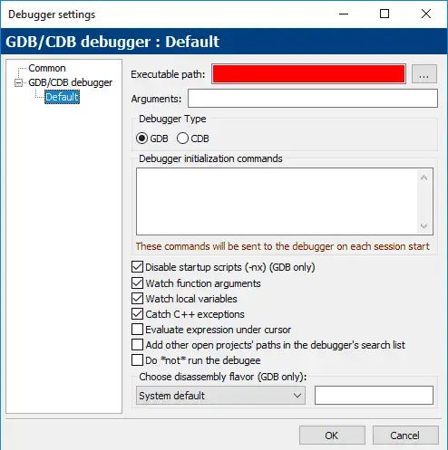
>
>Nếu bạn thấy một thanh màu đỏ lớn ở chỗ *"Đường dẫn tệp thực thi" (Executable path)*, hãy thực hiện theo các bước sau để xác định vị trí của debugger:
>- Nhấp vào nút *"..."* ở bên phải trường *"Đường dẫn tệp thực thi"*.
>- Tìm tệp *"gdb32.exe"* trên hệ thống của bạn (ví dụ: *C:\Program Files (x86)\CodeBlocks\MinGW\bin\gdb32.exe*).
>- Nhấp vào OK.

>**Lưu ý cho người dùng Code::Blocks:**<br>
>Debugger tích hợp Code::Blocks (`GDB`) có thể gặp vấn đề khi nhận dạng một số đường dẫn tệp chứa dấu cách hoặc ký tự không phải tiếng Anh. Nếu debugger hoạt động không bình thường, đây có thể là lý do.

>**Hướng dẫn cho người dùng VS Code:**<br>
>Thiết lập gỡ lỗi:
>- Nhấn *Ctrl + Shift + P* và chọn *"C/C++: Add Debug Configuration"*.
>- Chọn *"C/C++: g++ build and debug active file"*.
>- File cấu hình `launch.json` sẽ được tạo và mở.
>- Thay đổi *"stopAtEntry"* thành `true`:
>
>>**JSON**<br>
>>`"stopAtEntry": true,`
>
>Mở `main.cpp` và bắt đầu gỡ lỗi bằng cách nhấn *F5* hoặc *Ctrl + Shift + P* và chọn *"Debug: Start Debugging and Stop on Entry"*.


### **Kiểm tra từng bước (Stepping)**


Bây giờ chúng ta sẽ bắt đầu khám phá debugger bằng cách xem xét một số công cụ gỡ lỗi cho phép kiểm soát cách chương trình thực thi.

**Kiểm tra từng bước (Stepping)** là tên gọi chung cho một nhóm các tính năng của debugger cho phép chúng ta thực thi (đi từng bước) code theo từng câu lệnh.

Có một số lệnh kiểm tra từng bước liên quan mà chúng ta sẽ lần lượt tìm hiểu.

### **Step Into (nhảy vào)**

Lệnh **step into (nhảy vào)** thực hiện câu lệnh tiếp theo trong đường dẫn thực thi thông thường của chương trình, sau đó tạm dừng thực thi chương trình để chúng ta có thể kiểm tra trạng thái của chương trình thông qua debugger. Nếu câu lệnh đang được thực thi chứa một hàm gọi, thì step into sẽ khiến chương trình nhảy đến đầu của hàm được gọi và tạm dừng tại đó.

**Ví dụ:**
>```
>#include <iostream>
>
>void printValue(int value)
>{
>    std::cout << value << '\n';
>}
>
>int main()
>{
>    printValue(5);
>
>    return 0;
>}
>```

Chúng ta hãy gỡ lỗi chương trình này bằng cách sử dụng lệnh **step into**.

**Truy cập lệnh Step Into:**

>**Đối với người dùng Visual Studio:**<br>
>Truy cập menu *Debug > Step Into* hoặc nhấn phím tắt *F11*.

>**Đối với người dùng Code::Blocks:**<br>
>Truy cập menu Debug > Step Into hoặc nhấn tổ hợp phím tắt *Shift-F7*.

>**Đối với người dùng VS Code:**<br>
>Truy cập menu *Run > Step Into*.

>**Đối với các trình biên dịch / IDE khác:**
Lệnh **step into** thường nằm trong menu *Debug* hoặc *Run*.

Khi chương trình của bạn không chạy và bạn thực hiện lệnh gỡ lỗi đầu tiên, bạn có thể thấy một vài điều xảy ra:

- Chương trình sẽ được biên dịch lại nếu cần thiết.
- Chương trình sẽ bắt đầu chạy. Vì ứng dụng của chúng ta là chương trình console, một cửa sổ đầu ra console sẽ mở ra. Nó sẽ trống vì chúng ta chưa xuất ra bất kỳ thứ gì.
- IDE của bạn có thể mở một số cửa sổ chẩn đoán, có thể có tên như *"Diagnostic Tools"* (Công cụ chẩn đoán), *"Call Stack"* (Ngăn xếp gọi) và *"Watch"* (Theo dõi). Chúng ta sẽ tìm hiểu về một số tính năng này sau - bây giờ bạn có thể bỏ qua chúng.

Vì bạn đã thực hiện **step into**, bạn sẽ thấy một dấu hiệu xuất hiện bên trái của dấu ngoặc nhọn mở của hàm `main` (dòng `9`). Trong **Visual Studio**, dấu hiệu này là một mũi tên màu vàng (Code::Blocks sử dụng một hình tam giác màu vàng). Nếu bạn đang sử dụng một IDE khác, bạn sẽ thấy một thứ gì đó có cùng mục đích.

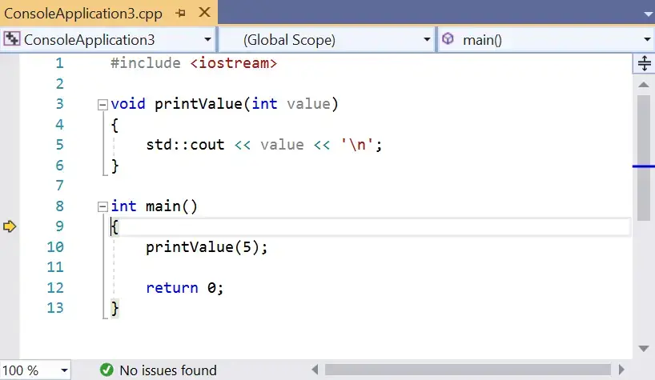

Dấu mũi tên này cho biết dòng được trỏ tới sẽ được thực thi tiếp theo. Trong trường hợp này, debugger đang cho chúng ta biết rằng dòng tiếp theo được thực thi là dấu ngoặc nhọn mở của hàm `main` (dòng `9`).

Chọn step into (sử dụng lệnh phù hợp cho IDE của bạn, được liệt kê ở trên) để thực thi dấu ngoặc nhọn mở và mũi tên sẽ di chuyển đến câu lệnh tiếp theo (dòng `10`).

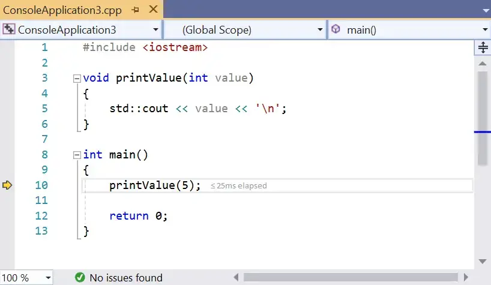

Điều này có nghĩa là dòng tiếp theo sẽ được thực thi là lệnh gọi đến hàm `printValue`.

Chọn **step into** một lần nữa. Vì câu lệnh này chứa một hàm gọi đến `printValue`, chúng ta sẽ bước vào hàm và mũi tên sẽ di chuyển đến đầu thân của `printValue` (dòng `4`).

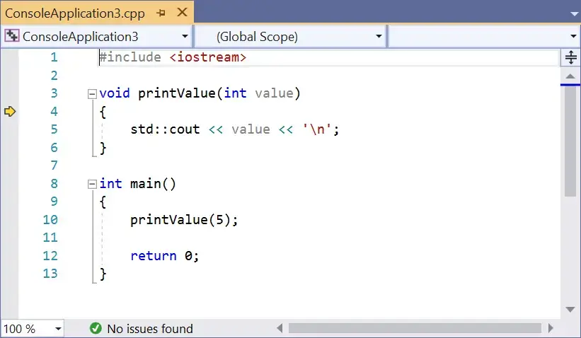

Chọn **step into** lại để thực thi dấu ngoặc nhọn mở của hàm `printValue`, điều này sẽ di chuyển mũi tên đến dòng `5`.

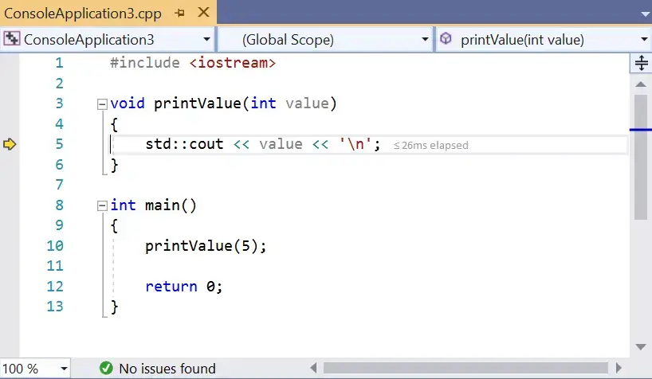

Chọn **step into** một lần nữa, lệnh này sẽ thực thi câu lệnh `std::cout << value << '\n'` và di chuyển mũi tên đến dòng 6.

>**Mẹo**<br>
>Trong bài học trước, chúng tôi đã đề cập rằng `std::cout` được đệm, nghĩa là có thể có một khoảng trễ giữa khi bạn yêu cầu `std::cout` in giá trị và khi nó thực sự in. Do đó, bạn có thể không thấy giá trị `5` xuất hiện tại thời điểm này. Để đảm bảo tất cả đầu ra từ `std::cout` được xuất ngay lập tức, bạn có thể tạm thời thêm câu lệnh sau vào đầu hàm `main()`:
>>`std::cout << std::unitbuf; // Bật tự động đẩy (flush) cho std::cout (để gỡ lỗi)`
>
>Vì lý do hiệu suất, câu lệnh này nên được loại bỏ hoặc chú thích lại sau khi gỡ lỗi.
>
>Nếu bạn không muốn liên tục thêm/xóa/chú thích/bỏ chú thích cho lệnh trên, bạn có thể bọc lệnh trong một chỉ thị tiền xử lý biên dịch theo điều kiện (được đề cập trong bài học 2.10 - Giới thiệu về bộ tiền xử lý):
>>```
>>#ifdef DEBUG
>>std::cout << std::unitbuf; // Bật tự động đẩy (flush) cho std::cout (để gỡ lỗi)
>>#endif
>>```
>
>Bạn sẽ cần đảm bảo rằng *macro* tiền xử lý `DEBUG` được định nghĩa, ở đâu đó phía trên câu lệnh này hoặc là một phần trong cài đặt trình biên dịch của bạn.

Chọn **step into** một lần nữa để thực thi dấu ngoặc nhọn đóng của hàm `printValue`. Lúc này, `printValue` đã thực thi xong và quyền điều khiển được trả về cho `main`.

Bạn sẽ nhận thấy rằng mũi tên lại trỏ đến `printValue`!


Mặc dù bạn có thể nghĩ rằng debugger định gọi lại `printValue`, nhưng trên thực tế, debugger chỉ đang cho bạn biết rằng nó đang trả về từ lệnh gọi hàm.

Chọn **step into** thêm ba lần nữa. Lúc này, chúng ta đã thực thi tất cả các dòng trong chương trình, vì vậy quá trình đã hoàn thành. Một số debugger sẽ tự động kết thúc phiên gỡ lỗi tại thời điểm này, một số khác thì không. Nếu debugger của bạn không tự kết thúc, bạn có thể cần tìm lệnh *"Stop Debugging"* trong menu (trong **Visual Studio**, lệnh này nằm trong *Debug > Stop Debugging*).

Lưu ý rằng *Stop Debugging* có thể được sử dụng bất kỳ lúc nào trong quá trình gỡ lỗi để kết thúc phiên gỡ lỗi.

Chúc mừng! Bạn vừa bước qua tất cả các bước trong chương trình và theo dõi từng dòng thực thi.

>**Mẹo**<br>
>Trong các bài học tiếp theo, chúng ta sẽ khám phá các lệnh gỡ lỗi khác, một số lệnh có thể không khả dụng trừ khi debugger đã chạy. Nếu lệnh gỡ lỗi mong muốn không khả dụng, hãy sử dụng step into cho code của bạn để khởi động debugger và thử lại.

### **Step Over (Nhảy qua)**

Giống như **step into** (nhảy vào), lệnh **step over** (nhảy qua) thực thi câu lệnh tiếp theo trong đường dẫn thực thi thông thường của chương trình.

Tuy nhiên, điểm khác biệt là:

- **Step into** sẽ đi vào các hàm được gọi và thực thi từng dòng bên trong hàm đó.
- **Step over** sẽ thực thi toàn bộ hàm mà không dừng lại và trả quyền điều khiển cho bạn sau khi hàm đã được thực thi xong.

**Truy cập lệnh Step Over:**
>**Đối với người dùng Visual Studio:**<br>
>Truy cập menu *Debug > Step Over* hoặc nhấn phím tắt *F10*.

>**Đối với người dùng Code::Blocks:**<br>
>Lệnh **step over** được gọi là **Next line** (dòng tiếp theo), truy cập menu *Debug > Next line* hoặc nhấn phím tắt *F7*.

>**Đối với người dùng VS Code:**<br>
>Truy cập menu *Run > Step Over* hoặc nhấn phím tắt F10.

**Ví dụ:**
>```
>#include <iostream>
>
>void printValue(int value)
>{
>    std::cout << value << '\n';
>}
>
>int main()
>{
>    printValue(5);
>
>    return 0;
>}
>```

Trong ví dụ này, chúng ta sẽ sử dụng lệnh **step over** để bỏ qua việc bước vào hàm `printValue`.

Đầu tiên, sử dụng lệnh **step into** nhiều lần cho đến khi dấu hiệu thực thi (mũi tên) nằm trên dòng `10`:
Lúc này, chương trình đang chuẩn bị thực thi dòng gọi hàm `printValue(5)`.


Bây giờ, chọn lệnh **step over**.

Debugger sẽ thực thi hàm `printValue` (in giá trị `5` ra cửa sổ console) và sau đó trả quyền điều khiển cho bạn trên dòng lệnh tiếp theo (dòng `12`).
Lệnh **step over** cung cấp một cách thuận tiện để bỏ qua các hàm khi bạn đã chắc chắn chúng hoạt động bình thường hoặc không muốn gỡ lỗi chúng ngay bây giờ.

### **Step Out (Thoát ra)**

Không giống như hai lệnh Step khác (**Step Into** và **Step Over**), lệnh **Step Out (thoát ra)** không chỉ đơn giản là thực thi dòng code tiếp theo. Thay vào đó, nó thực thi toàn bộ mã còn lại trong hàm hiện đang được thực thi và sau đó trả quyền điều khiển lại cho bạn khi hàm đã trả về.

>**Đối với người dùng Visual Studio**<br>
>Trong Visual Studio, bạn có thể truy cập lệnh **Step Out** thông qua menu *Debug > Step Out* hoặc bằng cách nhấn tổ hợp phím *Shift-F11*.

>**Đối với người dùng Code::Blocks**<br>
>Trong Code::Blocks, bạn có thể truy cập lệnh Step Out thông qua menu *Debug > Step Out* hoặc bằng cách nhấn tổ hợp phím *Ctrl-F7*.

>**Đối với người dùng VS Code**<br>
>Trong VS Code, bạn có thể truy cập lệnh Thoát ra thông qua menu *Run > Step Out* hoặc bằng cách nhấn tổ hợp phím *Shift-F11*.

**Ví dụ**

Chúng ta hãy xem một ví dụ về cách sử dụng lệnh này bằng chương trình tương tự như ở trên:

>```
>#include <iostream>
>
>void inGiaTri(int value) // inGiaTri = printValue
>{
>    std::cout << value << '\n';
>}
>
>int main()
>{
>    inGiaTri(5); // inGiaTri(5) = printValue(5)
>
>    return 0;
>}
>```

**Step Into** chương trình cho đến khi bạn vào bên trong hàm `inGiaTri` (`printValue`), với dấu nhọn đánh dấu trên dòng `4`.


Sau đó chọn **Step Out**. Bạn sẽ thấy giá trị `5` xuất hiện trong cửa sổ đầu ra và trình gỡ rối trả lại quyền điều khiển cho bạn sau khi hàm kết thúc (trên dòng `10`).


Lệnh này hữu ích nhất khi bạn vô tình bước vào một hàm mà bạn không muốn gỡ rối.

### **Bước quá xa**

Khi nhảy từng bước trong chương trình, thông thường bạn chỉ có thể nhảy về phía trước. Rất dễ dàng để vô tình nhảy qua (vượt quá) vị trí bạn muốn kiểm tra.

Nếu bạn vượt qua điểm đến dự định, bạn thường sẽ dừng gỡ rối và bắt đầu lại quá trình gỡ rối, cẩn thận hơn một chút để không vượt qua mục tiêu lần này.

### **Step Back (Nhảy lùi)** 

Một số trình gỡ lỗi (chẳng hạn như Visual Studio Enterprise Edition và [rr](https://github.com/rr-debugger/rr)) đã giới thiệu khả năng nhảy thường được gọi là **Step Back (Nhảy lùi)** hoặc **Reverse Debugging (Gỡ lỗi ngược)**. Mục tiêu của **Step Back** là tua lại bước cuối cùng, để bạn có thể đưa chương trình trở lại trạng thái trước đó. Điều này có thể hữu ích nếu bạn vượt quá hoặc nếu bạn muốn kiểm tra lại một câu lệnh vừa mới thực thi.

Việc triển khai **Step Back** đòi hỏi trình gỡ rối phải rất tinh vi (vì nó phải theo dõi trạng thái chương trình riêng biệt cho mỗi bước). Do tính phức tạp, khả năng này chưa được chuẩn hóa và thay đổi tùy theo trình gỡ rối. Tại thời điểm viết bài (tháng 1 năm 2019), cả Visual Studio Community Edition và phiên bản Code::Blocks mới nhất đều không hỗ trợ khả năng này. Hy vọng rằng trong tương lai, nó sẽ được tích hợp vào các sản phẩm này và có sẵn để sử dụng rộng rãi hơn.

## **Bài 3.7: <u>Sử dụng trình gỡ lỗi tích hợp: Run to cursor (Chạy đến con trỏ) và Breakpoints (Điểm dừng)</u>**

Mặc dù việc sử dụng bước nhảy (được đề cập trong bài học [3.6 - Sử dụng trình gỡ lỗi tích hợp: Kiểm tra từng bước](lesson3_6.ipynb)) rất hữu ích để kiểm tra từng dòng code riêng lẻ, nhưng trong một chương trình lớn, việc nhảy từng bước qua toàn bộ code để đến điểm bạn muốn kiểm tra chi tiết hơn có thể mất nhiều thời gian.

May mắn thay, các trình gỡ lỗi hiện đại cung cấp nhiều công cụ hơn để giúp chúng ta gỡ rối chương trình hiệu quả. Trong bài học này, chúng ta sẽ xem xét một số tính năng của trình gỡ lỗi cho phép chúng ta điều hướng code nhanh hơn.

### **Run to Cursor (Chạy đến con trỏ)**

Lệnh hữu ích đầu tiên thường được gọi là **Run to Cursor (Chạy đến con trỏ)**. Lệnh **Run to Cursor** này thực thi chương trình cho đến khi thực thi đạt đến câu lệnh được chọn bởi con trỏ chuột (cursor) của bạn. Sau đó, nó trả lại quyền điều khiển cho bạn để bạn có thể bắt đầu gỡ rối từ điểm đó. Điều này giúp cho việc bắt đầu gỡ lỗi tại một điểm cụ thể trong code của bạn trở nên hiệu quả, hoặc nếu đã gỡ lỗi, để di chuyển thẳng đến một số vị trí bạn muốn kiểm tra thêm.

>**Đối với người dùng Visual Studioo**<br>
>Trong Visual Studio, bạn có thể truy cập lệnh **Run to Cursor** bằng cách nhấp chuột phải vào một câu lệnh trong code và chọn*Run to Cursor* từ menu ngữ cảnh, hoặc bằng cách nhấn tổ hợp phím *Ctrl-F10*.

>**Đối với người dùng Code::Blocks**<br>
>Trong Code::Blocks, bạn có thể truy cập lệnh **Run to Cursor** bằng cách nhấp chuột phải vào một câu lệnh trong code và chọn *Run to Cursor* từ menu ngữ cảnh hoặc menu *Debug > Run to Cursor*, hoặc bằng cách nhấn phím tắt *F4>*

>**Đối với người dùng VS Code**<br>
>Trong VS Code, bạn có thể truy cập lệnh **Run to Cursor** trong khi đang gỡ lỗi chương trình bằng cách nhấp chuột phải vào một câu lệnh trong code và chọn *Run to Cursor* từ menu ngữ cảnh.


Chúng ta hãy thử sử dụng chương trình tương tự như những gì chúng ta đã sử dụng:

>```
>#include <iostream>
>
>void inGiaTri(int value) // inGiaTri = printValue
>{
>    std::cout << value << '\n';
>}
>
>int main()
>{
>    inGiaTri(5); // inGiaTri(5) = printValue(5)
>
>    return 0;
>}
>```

Chỉ cần nhấp chuột phải vào bất kỳ vị trí nào trên dòng `5`, sau đó chọn *“Run to Cursor”*.

Bạn sẽ thấy chương trình bắt đầu chạy và dấu thực thi di chuyển đến dòng bạn vừa chọn. Chương trình của bạn đã thực thi đến thời điểm này và hiện đang chờ các lệnh gỡ lỗi tiếp theo của bạn. Từ đây, bạn có thể bước từng bước qua chương trình, Chạy đến con trỏ đến một vị trí khác, v.v.

Nếu bạn Run to Cursor đến một vị trí không được thực thi, Run to Cursor sẽ đơn giản chỉ chạy chương trình của bạn cho đến khi kết thúc.

### **Continue (Tiếp tục)**

Khi bạn đang ở giữa phiên gỡ lỗi, bạn có thể chỉ muốn chạy chương trình từ điểm đó trở đi. Cách dễ nhất để thực hiện điều này là sử dụng lệnh **Continue (Tiếp tục)**. Lệnh gỡ lỗi **Continue** đơn giản là tiếp tục chạy chương trình theo bình thường, cho đến khi chương trình kết thúc hoặc cho đến khi có thứ gì đó kích hoạt quyền điều khiển quay trở lại với bạn (chẳng hạn như **Breakpoint (điểm dừng)**, chúng ta sẽ đề cập sau trong bài học này).

>**Đối với người dùng Visual Studio**<br>
>Trong Visual Studio, bạn có thể truy cập lệnh **Continue** trong khi đang gỡ lỗi chương trình thông qua menu *Debug > Continue*, hoặc bằng cách nhấn phím tắt *F5*.

>**Đối với người dùng Code::Blocks**
>Trong Code::Blocks, bạn có thể truy cập lệnh **Continue** trong khi đang gỡ lỗi chương trình thông qua menu *Debug > Start / Continue*, hoặc bằng cách nhấn phím tắt *F8*.

>**Đối với người dùng VS Code**<br>
>Trong VS Code, bạn có thể truy cập lệnh **Continue** trong khi đang gỡ lỗi chương trình thông qua menu *Run > Continue*, hoặc bằng cách nhấn phím tắt *F5*.

Chúng ta hãy thử nghiệm lệnh **Continue**. Nếu dấu thực thi của bạn chưa nằm trên dòng `5`, hãy chạy đến con trỏ đến dòng `5`. Sau đó chọn **Continue** từ điểm này. Chương trình của bạn sẽ chạy xong và sau đó dừng lại.

### **Start (Bắt đầu)**

Lệnh **Continue** có một người anh em song sinh tên là **Start** (Bắt đầu). Lệnh **Start** thực hiện hành động giống như **Continue**, chỉ khác là bắt đầu từ đầu chương trình. Nó chỉ có thể được kích hoạt khi <u>đang không trong phiên gỡ lỗi</u>.

>**Đối với người dùng Visual Studio**<br>
>Trong Visual Studio, bạn có thể truy cập lệnh **Start** trong khi không gỡ lỗi chương trình thông qua menu *Debug > Start Debugging*, hoặc bằng cách nhấn phím tắt *F5*.

>**Đối với người dùng Code::Blocks**<br>
>Trong Code::Blocks, bạn có thể truy cập lệnh **Start** trong khi không gỡ lỗi chương trình thông qua menu *Debug > Start / Continue*, hoặc bằng cách nhấn phím tắt *F8*.

>**Đối với người dùng VS Code**<br>
>Trong VS Code, bạn có thể truy cập lệnh **Start** trong khi không gỡ lỗi chương trình thông qua menu *Run > Start Debugging*, hoặc bằng cách nhấn phím tắt *F5*.

Nếu bạn sử dụng lệnh **Start** trên chương trình mẫu ở trên, nó sẽ chạy toàn bộ mà không bị gián đoạn (ngoại trừ trên VS Code, vì chúng ta đã đặt `stopAtEntry: true` trong bài học trước). Mặc dù điều này có vẻ không đáng chú ý, nhưng đó chỉ là vì chúng ta chưa yêu cầu trình gỡ lỗi dừng chương trình. Chúng ta sẽ sử dụng lệnh này hiệu quả hơn trong phần tiếp theo.

### **Breakpoints (Điểm dừng)**

Chủ đề cuối cùng chúng ta sẽ đề cập trong phần này là **Breakpoints (Điểm dừng). **Breakpoints** là một ký hiệu đặc biệt báo cho trình gỡ lỗi dừng thực thi chương trình tại **breakpoints** khi chạy ở chế độ gỡ lỗi.

>**Đối với người dùng Visual Studio**<br>
>Trong Visual Studio, bạn có thể đặt hoặc xóa điểm dừng thông qua menu *Debug > Toggle Breakpoint*, hoặc bằng cách nhấp chuột phải vào một câu lệnh và chọn *Toggle Breakpoint* từ menu ngữ cảnh, hoặc bằng cách nhấn phím tắt *F9*, hoặc bằng cách nhấp vào bên trái của số dòng (trong vùng màu xám nhạt).

>**Đối với người dùng Code::Blocks**<br>
>Trong Code::Blocks, bạn có thể đặt hoặc xóa điểm dừng thông qua menu **Debug > Toggle Breakpoint*, hoặc bằng cách nhấp chuột phải vào một câu lệnh và chọn *Toggle Breakpoint* từ menu ngữ cảnh, hoặc bằng cách nhấn phím tắt *F5*, hoặc bằng cách nhấp vào bên phải của số dòng.

>**Đối với người dùng VS Code**<br>
>Trong VS Code, bạn có thể đặt hoặc xóa điểm dừng thông qua menu *Run > Toggle Breakpoint*, hoặc bằng cách nhấn phím tắt *F9*, hoặc bằng cách nhấp vào bên trái của số dòng.

Khi bạn đặt một điểm dừng, bạn sẽ thấy một loại biểu tượng mới xuất hiện. **Visual Studio** sử dụng một vòng tròn màu đỏ, **Code::Blocks** sử dụng một hình bát giác màu đỏ (giống như biển báo dừng):

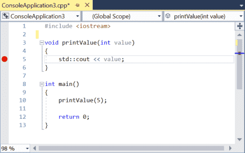

Hãy tiếp tục và đặt một điểm dừng trên dòng `5`, như trong hình ảnh ở trên.

Bây giờ, chọn lệnh **Start** để trình gỡ lỗi chạy code của bạn và chúng ta hãy xem điểm dừng hoạt động như thế nào. Bạn sẽ nhận thấy rằng thay vì chạy đến hết chương trình, trình gỡ lỗi dừng lại ở **breakpoint** (với dấu thực thi nằm trên biểu tượng điểm dừng):

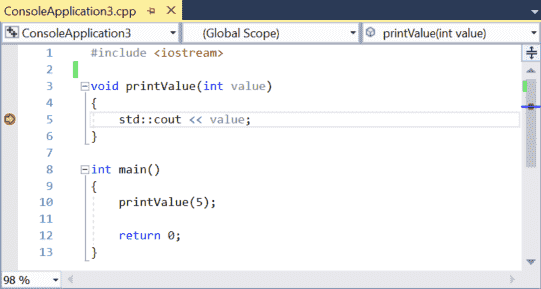

Giống như bạn đã chạy đến con trỏ đến điểm này.

**Breakpoints** có một vài ưu điểm so với **Run to Cursor**. Thứ nhất, **breakpoints** sẽ khiến trình gỡ lỗi trả quyền điều khiển cho bạn mỗi khi gặp chúng (không giống như **Run to Cursor**, chỉ chạy đến con trỏ một lần mỗi lần được kích hoạt). Thứ hai, bạn có thể đặt một **breakpoint** và nó sẽ tồn tại cho đến khi bạn xóa nó, trong khi với **Run to Cursor**, bạn phải xác định vị trí bạn muốn chạy đến mỗi lần bạn kích hoạt lệnh.

Lưu ý rằng các **breakpoint** được đặt trên các dòng không nằm trên luồng thực thi sẽ không khiến trình gỡ lỗi dừng thực thi code.

Chúng ta hãy xem một chương trình được sửa đổi một chút để minh họa rõ hơn sự khác biệt giữa điểm dừng và chạy đến con trỏ:

>```
>#include <iostream>
>
>void inGiaTri(int value) // inGiaTri = printValue
>{
>    std::cout << value << '\n';
>}
>
>int main()
>{
>    inGiaTri(5);
>    inGiaTri(6);
>    inGiaTri(7);
>
>    return 0;
>}
>```

Đầu tiên, hãy bắt đầu một phiên gỡ lỗi mới và sau đó thực hiện **Run to Cursor** đến dòng `5`. Bây giờ chọn **Continue**. Chương trình sẽ tiếp tục chạy đến cuối (nó sẽ không dừng lại trên dòng `5` nữa, ngay cả khi dòng `5` được thực thi thêm hai lần).

Tiếp theo, đặt một điểm dừng trên dòng `5`, sau đó chọn **Start**. Chương trình sẽ dừng lại trên dòng `5`. Bây giờ chọn **Continue**. Chương trình sẽ dừng lại trên dòng `5` lần thứ hai. Chọn **Continue** một lần nữa và nó sẽ dừng lại lần thứ ba. Thực hiện thêm một lần **Continue** nữa và chương trình sẽ kết thúc. Bạn có thể thấy rằng **breakpoint** khiến chương trình dừng lại nhiều lần như số lần dòng đó được thực thi.

### **Set Next Statement (Thiết lập câu lệnh tiếp theo)**

Còn một lệnh gỡ rối nữa được sử dụng khá hiếm, nhưng vẫn đáng để biết, ngay cả khi bạn không sử dụng nó thường xuyên. Lệnh **Set Next Statement (Thiết lập câu lệnh tiếp theo)** cho phép chúng ta thay đổi điểm thực thi thành một câu lệnh khác. Điều này có thể được sử dụng để nhảy điểm thực thi về phía trước và bỏ qua một số code lẽ ra sẽ được thực thi, hoặc nhảy ngược lại và thực thi lại một đoạn code đã được thực thi trước đó.

>**Đối với người dùng Visual Studio**<br>
>Trong Visual Studio, bạn có thể nhảy đến điểm thực thi bằng cách nhấp chuột phải vào một câu lệnh và chọn *Set Next Statement* từ menu ngữ cảnh, hoặc bằng cách nhấn tổ hợp phím tắt *Ctrl-Shift-F10*. Tùy chọn này theo ngữ cảnh và chỉ xuất hiện khi đang gỡ rối chương trình.

>**Đối với người dùng Code::Blocks**<br>
>Trong Code::Blocks, bạn có thể nhảy đến điểm thực thi thông qua menu *Debug > Set Next Statement*, hoặc bằng cách nhấp chuột phải vào một câu lệnh và chọn *Set Next Statement* từ menu ngữ cảnh. Code::Blocks không có phím tắt bàn phím cho lệnh này.

>**Đối với người dùng VS Code**<br>
>Trong VS Code, bạn có thể nhảy đến điểm thực thi bằng cách nhấp chuột phải vào một câu lệnh và chọn *Jump to Cursor* từ menu ngữ cảnh. Tùy chọn này theo ngữ cảnh và chỉ xuất hiện khi đang gỡ rối chương trình.

**Ví dụ:**

Giả sử bạn có đoạn code sau:

>```
>void printValue(int value) {
>  std::cout << value << '\n';
>}
>
>int main() {
>  printValue(5);
>  printValue(6);
>  printValue(7);
>
>  return 0;
>}
>```

Đầu tiên, chạy đến con trỏ đến dòng `11`. Lúc này, bạn sẽ thấy giá trị của `5` trong cửa sổ đầu ra console.
Bây giờ, nhấp chuột phải vào dòng `12` và chọn *Set Next Statement*. Điều này khiến dòng `11` bị bỏ qua và không được thực thi. Sau đó chọn *Continue* để hoàn thành việc thực thi chương trình của bạn.

Đầu ra của chương trình của bạn sẽ trông như thế này:
>```
>5
>7
>```

Chúng ta có thể thấy rằng `printValue(6)` đã bị bỏ qua.

Tính năng này có thể hữu ích trong một số ngữ cảnh.

Trong mục khám phá các kỹ thuật gỡ rối cơ bản, chúng ta đã thảo luận về việc đóng chú thích một hàm như một cách để xác định xem hàm đó có vai trò gì trong việc gây ra sự cố hay không. Điều này yêu cầu sửa đổi code của chúng ta và nhớ bỏ chú thích hàm sau đó. Trong trình gỡ rối, không có cách trực tiếp nào để bỏ qua một hàm, vì vậy nếu bạn muốn thực hiện điều này, sử dụng **Set Next Statement** để nhảy qua một lệnh gọi hàm là cách dễ nhất để thực hiện.

Nhảy ngược lại cũng có thể hữu ích nếu chúng ta muốn xem lại một hàm vừa mới thực thi, để chúng ta có thể xem nó đang làm gì.

Với cùng code ở trên, chạy đến con trỏ đến dòng `12`. Sau đó thiết lập câu lệnh tiếp theo trên dòng `11` và *Continue*. Đầu ra của chương trình sẽ là:
>```
>5
>6
>6
>7
>```

>**Cảnh báo**<br>
>Lệnh **Set Next Statement** sẽ thay đổi điểm thực thi, nhưng không làm thay đổi trạng thái chương trình. Biến của bạn sẽ giữ lại bất kỳ giá trị nào chúng có trước khi nhảy. Do đó, việc nhảy có thể khiến chương trình của bạn tạo ra các giá trị, kết quả hoặc hành vi khác so với bình thường. Sử dụng khả năng này một cách thận trọng (đặc biệt là nhảy ngược).

>**Cảnh báo**<br>
>Bạn không nên sử dụng **Set Next Statement** để thay đổi điểm thực thi sang một hàm khác. Điều này có thể dẫn đến hành vi không xác định và có khả năng gây ra *crash*.

### **"Step back" (Bước lùi) vs nhảy ngược thông qua "Set Next Statement" (Thiết lập câu lệnh tiếp theo)**

**Step Back** và **Set Next Statement** đều là các tính năng gỡ lỗi giúp bạn quay lại một điểm trước đó trong chương trình, nhưng chúng hoạt động theo những cách khác nhau.

**Step Back**: Giống như nút "quay lại" vậy. Nó **tua** lại toàn bộ trạng thái của chương trình, bao gồm cả giá trị của các biến, về trạng thái mà chúng có ở điểm trước đó. Điều này hữu ích nếu bạn muốn xem lại một phần code đã thực thi và muốn chương trình hoạt động như thể nó chưa từng xảy ra.

**Set Next Statement**: Chỉ thay đổi điểm mà chương trình sẽ tiếp tục chạy từ đó. Nó không tua lại trạng thái của chương trình. Giá trị của các biến vẫn giữ nguyên như trước khi nhảy. Tính năng này hữu ích để bỏ qua một phần code cụ thể mà bạn không muốn xem xét chi tiết.

>**Tóm lại**
>- **Step Back** (Bước lùi): Hoàn tác hoàn toàn các bước đã thực hiện, đưa chương trình về trạng thái trước đó.
>- **Set Next Statement** (Thiết lập câu lệnh tiếp theo): Chỉ thay đổi điểm thực thi tiếp theo, không ảnh hưởng đến trạng thái chương trình.

### **Kết luận**

Bây giờ bạn đã biết những cách chính để sử dụng trình gỡ lỗi tích hợp để theo dõi và kiểm soát cách chương trình của bạn thực thi. Mặc dù các lệnh này hữu ích để chẩn đoán các vấn đề về luồng code (ví dụ: xác định xem một số hàm có được gọi hay không), chúng chỉ là một phần lợi ích mà trình gỡ lỗi tích hợp mang lại. Trong bài học tiếp theo, chúng tôi sẽ bắt đầu khám phá các cách bổ sung để kiểm tra trạng thái chương trình của bạn, việc này yêu cầu bạn phải nắm vững các lệnh này như là điều kiện tiên quyết. Bắt đầu thôi!

## **Bài 3.8: <u>Sử dụng trình gỡ lỗi tích hợp: Watching variables (Theo dõi biến)</u>**

Trong các bài học trước ([3.6 - Sử dụng trình gỡ lỗi tích hợp: Kiểm tra từng bước](lesson3_6.ipynb) và [3.7 - Sử dụng trình gỡ lỗi tích hợp: Chạy đến con trỏ và điểm dừng](lesson3_7.ipynb)), bạn đã học cách sử dụng trình gỡ lỗi để theo dõi đường thực thi của chương trình. Tuy nhiên, việc bước từng bước qua chương trình chỉ là một nửa tính năng hữu ích của trình gỡ lỗi. Trình gỡ lỗi cũng cho phép bạn kiểm tra giá trị của các biến khi bạn bước qua code, tất cả mà không cần sửa đổi code của bạn.

Giống như các bài học trước, các ví dụ ở đây sẽ sử dụng Visual Studio - nếu bạn đang sử dụng IDE/trình gỡ rối khác, các lệnh có thể có tên hơi khác nhau hoặc nằm ở các vị trí khác nhau.

>**Cảnh báo**<br>
>Hãy đảm bảo dự án của bạn được biên dịch bằng *Cấu hình gỡ lỗi (Debug build configuration)* (xem thêm 0.9 - Cấu hình trình biên dịch của bạn: Cấu hình xây dựng để biết thêm thông tin). Nếu thay vào đó bạn đang biên dịch dự án của mình bằng *Cấu hình phát hành (Release Configuration)*, thì chức năng của trình gỡ rối có thể không hoạt động chính xác.

### **Theo dõi biến (Watching variables)** 

**Theo dõi biến** là quá trình kiểm tra giá trị của một biến trong khi chương trình đang chạy ở chế độ gỡ lỗi. Hầu hết các trình gỡ lỗi cung cấp một số cách để thực hiện việc này.

**Ví dụ minh họa:**

>```
>#include <iostream>
>
>int main()
>{
>    int x{ 1 };
>    std::cout << x << ' ';
>
>    x = x + 2;
>    std.cout << x << ' ';
>
>    x = x + 3;
>    std::cout << x << ' ';

>    return 0;
>}
>```

Đây là một chương trình mẫu khá đơn giản - nó in ra các số `1`, `3` và `6`.

Đầu tiên, hãy chạy đến con trỏ đến dòng `6`.

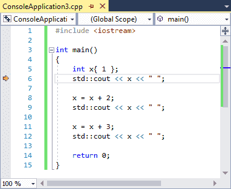

Lúc này, biến `x` đã được tạo và khởi tạo với giá trị `1`, vì vậy khi chúng ta kiểm tra giá trị của `x`, chúng ta nên mong đợi thấy giá trị `1`.

**Cách kiểm tra giá trị biến:**
- *Di chuột qua biến*: Cách dễ nhất để kiểm tra giá trị của một biến đơn giản như `x` là di chuột qua biến `x`. Một số trình gỡ lỗi hiện đại hỗ trợ phương pháp kiểm tra các biến đơn giản này và đây là cách trực tiếp nhất để thực hiện.

>**Lưu ý:**<br>
>Tùy chọn này có thể bị tắt theo mặc định trong Code::Blocks. Để bật lên, vào menu *Settings) > Debugger…*, chọn *Default* dưới nút *GDB/CDB debugger*, bật chọn *Evaluate expression under cursor*.
>
>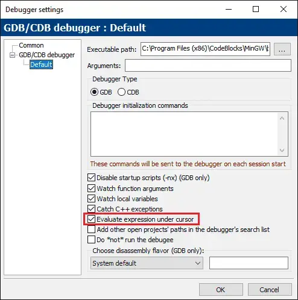
>
>*Visual Studio - QuickWatch:* Tô sáng tên biến x bằng chuột, sau đó chọn *"QuickWatch"* từ menu chuột phải.

>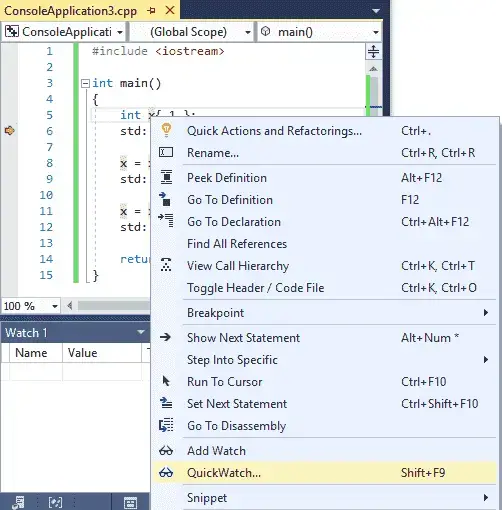
>
>Hành động này sẽ mở ra một cửa sổ phụ chứa giá trị hiện tại của biến.
>
>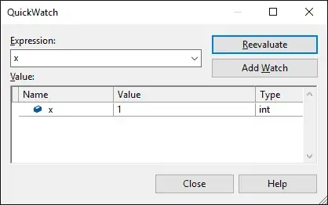

**Xem sự thay đổi của biến:**

Bây giờ hãy theo dõi sự thay đổi của biến này khi chúng ta kiểm tra từng bước qua chương trình. Chọn **Step over** hai lần hoặc **Run to Cursor** đến dòng `9`. Biến `x` bây giờ sẽ có giá trị `3`. Hãy kiểm tra lại để đảm bảo!

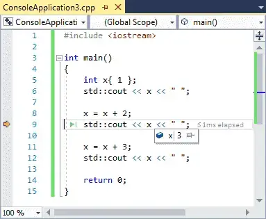


### **Cửa sổ theo dõi (Watch Window)**

Sử dụng phương pháp *di chuột qua biến* hoặc *QuickWatch* để kiểm tra giá trị của biến chỉ phù hợp khi bạn muốn biết giá trị của biến tại một thời điểm cụ thể. Chúng không thực sự phù hợp để theo dõi sự thay đổi giá trị của biến khi bạn chạy chương trình vì bạn phải liên tục di chuột lại/chọn lại biến đó.

Để giải quyết vấn đề này, tất cả các trình gỡ lỗi tích hợp hiện đại đều cung cấp một tính năng khác, gọi là **cửa sổ theo dõi (watch window)**. **Cửa sổ theo dõi** là một cửa sổ nơi bạn có thể thêm các biến mà bạn muốn kiểm tra liên tục và các biến này sẽ được cập nhật khi bạn nhảy qua từng bước trong chương trình. **Cửa sổ theo dõi** có thể đã có trên màn hình của bạn khi bạn vào chế độ gỡ lỗi, nhưng nếu chưa, bạn có thể bật nó lên thông qua các lệnh cửa sổ của IDE (thường được tìm thấy trong menu *View* hoặc *Debug*).

>**Visual Studio**: Menu *Debug > Windows > Watch > Watch 1**. Lưu ý rằng bạn phải ở chế độ gỡ lỗi để tùy chọn này được bật, vì vậy hãy **Step into** chương trình của bạn trước. Vị trí xuất hiện của cửa sổ này (bên trái, bên phải hoặc bên dưới được neo) có thể thay đổi. Bạn có thể thay đổi vị trí neo của nó bằng cách kéo tab *Watch 1* sang một cạnh khác của cửa sổ ứng dụng.

>**Code::Blocks**: Menu *Debug > Debugging windows > Watches**. Cửa sổ này có thể xuất hiện như một cửa sổ riêng biệt. Bạn có thể neo nó vào cửa sổ chính của bạn bằng cách kéo nó qua.

>**VS Code**: Trong VS Code, cửa sổ theo dõi xuất hiện ở chế độ gỡ lỗi, được neo bên trái phía trên ngăn xếp lệnh gọi (call stack).


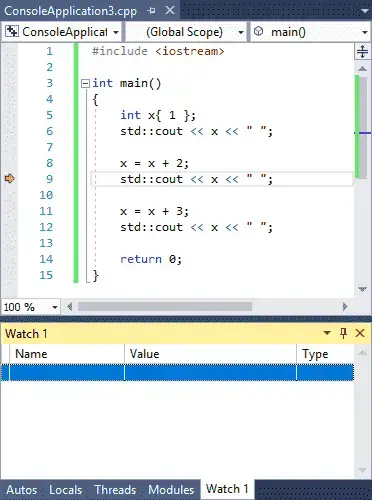

Cửa sổ theo dõi có thể trống hoặc đã chứa một số nội dung.

**Cách thêm biến vào cửa sổ theo dõi:**

Thông thường có hai cách khác nhau để thêm biến vào cửa sổ theo dõi:
- Mở cửa sổ theo dõi và nhập tên của biến bạn muốn theo dõi vào cột ngoài cùng bên trái của cửa sổ theo dõi.
- Trong cửa sổ code, nhấp chuột phải vào biến bạn muốn theo dõi và chọn *Add Watch* (Visual Studio) hoặc *Watch x* (thay thế `x` bằng tên của biến) (Code::Blocks).

**Bắt đầu theo dõi sự thay đổi của biến:**

Nếu bạn chưa bắt đầu phiên gỡ lỗi với dấu thực thi trên dòng `9` của chương trình, hãy bắt đầu một phiên gỡ lỗi mới và chạy đến con trỏ đến dòng `9`.

Bây giờ, hãy thêm biến `x` vào danh sách theo dõi của bạn. Bạn sẽ thấy:

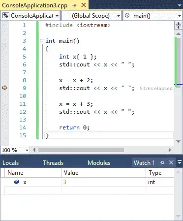

**Step over** hai lần hoặc Run to Cursor đến dòng `12`, và bạn sẽ thấy giá trị của `x` thay đổi từ `3` thành `6`.

**Lưu ý về biến hết hiệu lực (out of scope):**

Các biến hết hiệu lực (ví dụ: biến cục bộ bên trong một hàm đã trả về cho hàm gọi) sẽ vẫn nằm trong cửa sổ theo dõi của bạn, nhưng thường sẽ được đánh dấu là "không khả dụng" (not available) hoặc có thể hiển thị giá trị được biết cuối cùng nhưng mờ đi. Nếu biến quay lại phạm vi (ví dụ: hàm được gọi lại), giá trị của nó sẽ bắt đầu hiển thị lại. Do đó, việc để các biến trong cửa sổ theo dõi là hoàn toàn bình thường, ngay cả khi chúng đã hết hiệu lực.

Sử dụng **cửa sổ theo dõi** là cách tốt nhất để theo dõi sự thay đổi giá trị của biến theo thời gian khi bạn kiểm tra từng bước qua chương trình.

### **Đặt breakpoint (điểm dừng) trên biến được theo dõi**

Một số trình gỡ lỗi cho phép bạn đặt breakpoint trên một biến được theo dõi thay vì một dòng. Điều này sẽ khiến chương trình dừng thực thi bất cứ khi nào giá trị của biến đó thay đổi.

Ví dụ, đặt một breakpoint như vậy trên biến `x` trong chương trình ở trên sẽ khiến trình gỡ lỗi dừng sau khi thực hiện các dòng `8` và `11` (nơi giá trị của `x` được thay đổi).

>**Cách đặt điểm dừng trên biến được theo dõi trong Visual Studio:**
>- Đảm bảo biến của bạn đang được theo dõi.
>- Tiếp theo, **"Step into"** chương trình của bạn và đi đến cửa sổ theo dõi.
>- Nhấp chuột phải vào biến và chọn *"Break when value changes" (Dừng khi giá trị thay đổi)*. 
>
>Lưu ý: Bạn cần bật lại *"Break when value changes"* mỗi lần bạn bắt đầu phiên gỡ lỗi.


### **Cửa sổ theo dõi cũng có thể đánh giá biểu thức**

Cửa sổ theo dõi cũng cho phép bạn đánh giá các biểu thức đơn giản. Nếu bạn chưa thực hiện, hãy *"Run to cursor"* đến dòng `12`. Sau đó thử nhập `x + 2` vào cửa sổ theo dõi và xem điều gì xảy ra (nó sẽ được đánh giá thành `8`).

Bạn cũng có thể tô sáng một biểu thức trong code của mình và sau đó kiểm tra giá trị của biểu thức đó bằng cách di chuột qua hoặc thêm nó vào cửa sổ theo dõi thông qua menu chuột phải.

>**Cảnh báo:**<br>
>Các định danh trong biểu thức được theo dõi sẽ được đánh giá theo giá trị hiện tại của chúng. Nếu bạn muốn biết giá trị của một biểu thức trong code của bạn thực sự được đánh giá thành gì, hãy *"Run to Cursor"* đến biểu thức đó trước, để tất cả các định danh có giá trị chính xác.

### **Theo dõi cục bộ (Local watches)**

Do việc kiểm tra giá trị của các biến cục bộ bên trong một hàm là phổ biến trong khi gỡ rối, nhiều trình gỡ rối sẽ cung cấp một số cách để nhanh chóng theo dõi giá trị của tất cả các biến cục bộ trong phạm vi.

>**Cách xem tất cả các biến cục bộ trong Visual Studio:**<br>
>Trong Visual Studio, bạn có thể xem giá trị của tất cả các biến cục bộ trong cửa sổ *Locals (Biến cục bộ)*, có thể được tìm thấy tại Menu *Debug > Windows > Locals (Biến cục bộ)*. Lưu ý rằng bạn phải ở trong phiên gỡ lỗi để kích hoạt cửa sổ này.

>**Cách xem tất cả các biến cục bộ trong Code::Blocks:**<br>
>Trong Code::Blocks, tính năng này được tích hợp vào cửa sổ *Watch (Theo dõi)*, dưới nút *Locals (Biến cục bộ)*. Nếu bạn không thấy bất kỳ nút nào, thì có thể không có biến cục bộ nào hoặc bạn cần bung rộng nút đó ra.

>**Cách xem tất cả các biến cục bộ trong VS Code:**<br>
>Trong VS Code, giá trị của các biến cục bộ có thể được tìm thấy trong phần *VARIABLES (BIẾN)* xuất hiện được neo bên trái ở chế độ gỡ lỗi. Bạn có thể cần bung rộng nút *Locals (Biến cục bộ)*.

Nếu bạn chỉ muốn theo dõi giá trị của một biến cục bộ, hãy kiểm tra cửa sổ *Locals (Biến cục bộ)* trước. Biến đó thường đã có sẵn ở đó.

## **Bài 3.9: <u>Sử dụng trình gỡ lỗi tích hợp: Call Stack (Ngăn xếp lệnh gọi)</u>** 

Trình gỡ lỗi hiện đại chứa thêm một cửa sổ thông tin gỡ lỗi khác có thể rất hữu ích trong việc gỡ lỗi chương trình của bạn, đó là **cửa sổ ngăn xếp lệnh gọi (call stack)**.

Khi chương trình của bạn gọi một hàm, bạn đã biết nó đánh dấu vị trí hiện tại, thực hiện lệnh gọi hàm và sau đó trả về. Làm thế nào nó biết được nơi để quay lại? Câu trả lời là nó được theo dõi trong **ngăn xếp lệnh gọi**.

### **Ngăn xếp lệnh gọi (Call Stack) là gì?**

**Ngăn xếp lệnh gọi** là một danh sách tất cả các hàm đang hoạt động đã được gọi để đến điểm thực thi hiện tại. Ngăn xếp lệnh gọi bao gồm một mục cho mỗi hàm được gọi, cũng như dòng code nào sẽ được trả về khi hàm đó trả về. Bất cứ khi nào một hàm mới được gọi, hàm đó sẽ được thêm vào đầu của ngăn xếp lệnh gọi. Khi hàm hiện tại trả về cho hàm gọi, nó sẽ bị xóa khỏi đầu của ngăn xếp lệnh gọi và quyền điều khiển được trả lại cho hàm ngay bên dưới nó.

**Cửa sổ ngăn xếp lệnh gọi** là một cửa sổ gỡ rối hiển thị ngăn xếp lệnh gọi hiện tại. Nếu bạn không thấy cửa sổ ngăn xếp lệnh gọi, bạn sẽ cần yêu cầu IDE hiển thị nó.


>**Cách truy cập cửa sổ ngăn xếp lệnh gọi:**
>- **Visual Studio**: Menu *Debug > Windows > Call Stack*. Lưu ý rằng bạn phải ở trong phiên gỡ lỗi để kích hoạt cửa sổ này.
>- **Code::Blocks**: Menu *Debug > Debugging windows > Call Stack*.
>- **VS Code**: Trong VS Code, cửa sổ ngăn xếp lệnh gọi xuất hiện ở chế độ gỡ lỗi, được neo bên trái.


**Ví dụ minh họa:**

>```
>#include <iostream>
>
>void a()
>{
>    std::cout << "a() called\n";
>}
>
>void b()
>{
>    std::cout << "b() called\n";
>    a();
>}
>
>int main()
>{
>    a();
>    b();
>
>    return 0;
>}
>```

Đặt điểm dừng trên dòng `5` và `10` của chương trình này, sau đó bắt đầu chế độ gỡ lỗi. Do hàm `a` được gọi đầu tiên, nên điểm dừng trên dòng `5` sẽ được chạy tới trước.

Lúc này, bạn sẽ thấy thứ gì đó giống như này:

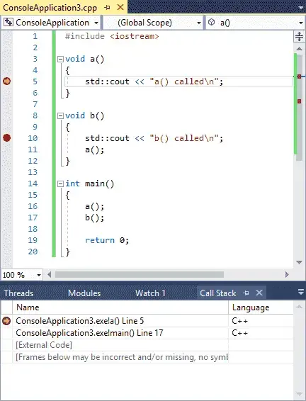


**IDE** của bạn có thể biểu hiện hiện một số khác biệt:
- Định dạng tên hàm và số dòng của bạn có thể khác nhau.
- Số dòng của bạn có thể hơi khác (chênh lệch 1).
- Thay vì `[External Code]`, bạn có thể thấy một loạt các hàm khác có tên kỳ lạ.

Những điểm khác biệt này không quan trọng.

Điều quan trọng ở đây là hai dòng đầu tiên. Từ dưới lên trên, chúng ta có thể thấy rằng hàm `main` được gọi trước tiên, và sau đó hàm `a` được gọi tiếp theo.

Dòng `5` bên cạnh hàm `a` cho chúng ta biết điểm thực thi hiện tại là ở đâu (phù hợp với dấu thực thi trong cửa sổ code). Dòng `17` trên dòng thứ hai cho biết dòng sẽ được trả về khi quyền điều khiển quay trở lại hàm `main`.

>**Mẹo**
>- Các số dòng sau tên hàm hiển thị dòng tiếp theo sẽ được thực thi trong mỗi hàm.
>- Do mục đầu trên ngăn xếp lệnh gọi biểu thị cho hàm hiện đang được thực thi, số dòng ở đây hiển thị dòng tiếp theo sẽ được thực thi khi thực thi tiếp tục. Các mục còn lại trong ngăn xếp lệnh gọi đại diện cho các hàm sẽ được trả về tại một điểm nào đó, vì vậy số dòng cho những mục này đại diện cho lệnh tiếp theo sẽ được thực thi sau khi hàm được trả về.


Bây giờ, hãy chọn lệnh gỡ rối *Continue* để tiến hành thực thi đến điểm dừng tiếp theo, điểm dừng này sẽ nằm trên dòng `10`. Ngăn xếp lệnh gọi sẽ được cập nhật để phản ánh trạng thái mới:

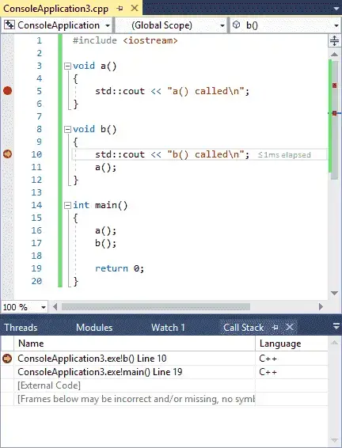

Bạn sẽ nhận thấy rằng hàm `b` bây giờ là dòng trên cùng của ngăn xếp lệnh gọi, phản ánh thực tế rằng hàm `b` là hàm đang được thực thi. Lưu ý rằng hàm `a` không còn được biểu diễn trên ngăn xếp lệnh gọi nữa. Điều này là do hàm `a` đã bị xóa khỏi ngăn xếp lệnh gọi khi nó trả về.

Chọn lại lệnh gỡ rối *Continue* một lần nữa và chúng ta sẽ chạm lại điểm dừng trên dòng `5` (bởi vì hàm `b` gọi hàm `a`). Ngăn xếp lệnh gọi sẽ trông như thế này:

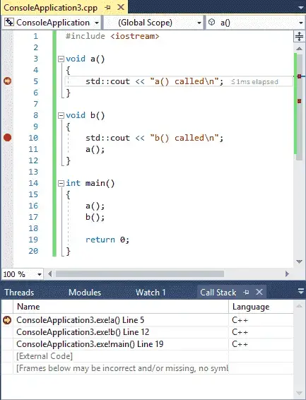

Bây giờ có ba hàm trên ngăn xếp lệnh gọi: (từ dưới lên trên) `main`, chính là hàm gọi `b`, và hàm `b` là hàm gọi lại `a`.

Ngăn xếp lệnh gọi hữu ích khi kết hợp với các **breakpoint** (điểm dừng), khi breakpoint của bạn được chạm tới và bạn muốn biết những hàm nào được gọi để đến điểm cụ thể đó trong code.

### **Kết luận**

Chúc mừng, bây giờ bạn đã biết những điều cơ bản về việc sử dụng trình gỡ lỗi tích hợp! Sử dụng các tính năng **kiểm tra từng bước (stepping)**, **điểm dừng (breakpoints)**, **theo dõi biến (watches)** và **cửa sổ ngăn xếp lệnh gọi (call stack window)**, bạn giờ đây đã có những nền tảng cơ bản để có thể gỡ lỗi hầu hết mọi vấn đề. Giống như nhiều thứ khác, việc trở nên giỏi sử dụng trình gỡ rối cần một chút thực hành và thử nghiệm. Nhưng một lần nữa, chúng tôi xin nhắc lại rằng thời gian dành cho việc học cách sử dụng hiệu quả trình gỡ lỗi tích hợp sẽ được đền đáp nhiều lần trong thời gian tiết kiệm gỡ lỗi các chương trình của bạn!

## **Bài 3.10: <u>Tìm kiếm lỗi trước khi chúng trở thành vấn đề</u>**

Khi bạn mắc **lỗi ngữ nghĩa (semantic error)**, lỗi đó có thể không được phát hiện ngay lập tức khi bạn chạy chương trình. Một vấn đề có thể ẩn náu không được phát hiện trong code của bạn trong một thời gian dài trước khi code mới được thêm vào hoặc các tình huống thay đổi khiến nó biểu hiện thành trục trặc của chương trình. Lỗi tồn tại trong code base càng lâu trước khi được tìm thấy thì càng khó tìm ra và thứ ban đầu có thể dễ sửa chữa lại biến thành một cuộc phiêu lưu gỡ rối tốn thời gian và năng lượng.

Vậy chúng ta có thể làm gì về điều đó?

### **Tránh lỗi ngay từ đầu: Bí kíp cho code "sạch"**

Cách tốt nhất là ngay từ đầu không mắc lỗi. Dưới đây là một số điều có thể giúp tránh mắc lỗi:
1. **Luôn tuân thủ các nguyên tắc lập trình tốt nhất:** Mỗi ngôn ngữ lập trình đều có những quy tắc riêng để đảm bảo code "sạch" và dễ hiểu. Hãy dành thời gian tìm hiểu và áp dụng các nguyên tắc này một cách nhất quán.
2. **Giữ "tinh thần minh mẫn" khi viết code:** Tránh lập trình khi bạn cảm thấy mệt mỏi hoặc căng thẳng. Hãy dành thời gian nghỉ ngơi và quay lại với tinh thần sảng khoái để đảm bảo sự tập trung và chính xác.
3. **Nắm rõ những "vùng nguy hiểm" trong ngôn ngữ:** Mỗi ngôn ngữ đều có những lỗi thường gặp mà người lập trình hay mắc phải. Hãy dành thời gian tìm hiểu và ghi nhớ những lỗi này để chủ động tránh mắc phải trong quá trình viết code.
4. **Giữ cho hàm ngắn gọn:** Hàm dài thường khiến code khó hiểu và dễ xảy ra lỗi. Hãy chia nhỏ các hàm dài thành nhiều hàm nhỏ hơn, mỗi hàm chỉ thực hiện một chức năng cụ thể.
5. **Tận dụng thư viện chuẩn:** Thay vì viết code "từ con số 0", hãy tận dụng các thư viện chuẩn được cung cấp sẵn bởi ngôn ngữ. Điều này giúp tiết kiệm thời gian và đảm bảo độ tin cậy cho code.
6. **Sử dụng comment (chú thích):** Thêm comment cho code sẽ giúp bạn dễ dàng hiểu lại code sau một thời gian hoặc chia sẻ code với người khác.
7. **Lập kế hoạch rõ ràng:** Hãy bắt đầu với các giải pháp đơn giản và dần dần thêm vào các tính năng phức tạp hơn. Tránh "tham lam" ôm đồm quá nhiều thứ ngay từ đầu.
8. **Ưu tiên sự đơn giản và dễ hiểu:** Tránh sử dụng những giải pháp "ảo diệu" hoặc khó hiểu. Hãy tập trung viết code dễ đọc và dễ bảo trì để việc sửa lỗi sau này trở nên dễ dàng hơn.
9. **Tối ưu hóa cho khả năng đọc và bảo trì:** Hiệu suất là quan trọng, nhưng không phải là yếu tố quyết định. Hãy ưu tiên viết code dễ đọc và dễ bảo trì để việc sửa lỗi và nâng cấp sau này trở nên thuận tiện hơn.

**Brian Kernighan**, tác giả của quyển ***"THE ELEMENTS OF PROGRAMMING STYLE"***, ấn bản thứ 2, đã từng nói: 
>*"Mọi người đều biết rằng gỡ rối khó gấp đôi so với việc viết chương trình ngay từ đầu. Vì vậy, nếu bạn cố gắng hết sức để thông minh khi viết code, làm thế nào bạn có thể gỡ rối nó?"*

### **Tái cấu trúc code (Refactoring)**

Khi bạn thêm các tính năng mới cho chương trình của mình ("thay đổi hành vi"), bạn sẽ thấy một số hàm của bạn dài hơn. Khi các hàm dài hơn, chúng trở nên phức tạp hơn và khó hiểu hơn.

Một cách để giải quyết vấn đề này là chia một hàm dài thành nhiều hàm ngắn hơn. Quá trình thực hiện các thay đổi cấu trúc cho code của bạn mà không làm thay đổi hành vi của nó được gọi là **tái cấu trúc (refactoring)**. Mục đích của tái cấu trúc là làm cho chương trình của bạn ít phức tạp hơn bằng cách tăng tính tổ chức và tính mô-đun của nó.

Vậy bao nhiêu dòng thì được coi là quá dài cho một hàm? Một hàm chiếm một màn hình theo chiều dọc được coi là quá dài - nếu bạn phải cuộn để đọc toàn bộ hàm, khả năng hiểu của hàm giảm đáng kể. Lý tưởng nhất, một hàm nên ít hơn mười dòng. Thậm chí các hàm dưới năm dòng còn tốt hơn.

Hãy nhớ rằng mục tiêu ở đây là tối đa hóa khả năng hiểu và bảo trì, chứ không phải giảm thiểu độ dài hàm - việc từ bỏ các thực hành tốt nhất hoặc sử dụng các kỹ thuật lập trình khó hiểu để tiết kiệm một hoặc hai dòng không có lợi cho code của bạn.

>**Lưu ý quan trọng**<br>
>Khi thực hiện thay đổi cho code của bạn, hãy thực hiện các thay đổi về hành vi HOẶC các thay đổi về cấu trúc, sau đó kiểm tra lại tính chính xác. Thực hiện các thay đổi về hành vi và cấu trúc cùng một lúc có xu hướng dẫn đến nhiều lỗi hơn cũng như các lỗi khó tìm hơn.

### **Giới thiệu về Lập trình phòng thủ (Defensive Programming)**

Lỗi không chỉ đến từ chính bạn (ví dụ: logic không chính xác) mà còn có thể xảy ra khi người dùng sử dụng ứng dụng theo cách bạn không lường trước. Ví dụ, nếu bạn yêu cầu người dùng nhập một số nguyên, nhưng họ lại nhập một chữ cái, chương trình của bạn sẽ hoạt động như thế nào trong trường hợp đó? Nếu bạn không lường trước điều này và thêm xử lý lỗi cho trường hợp này, thì có thể chương trình sẽ không hoạt động tốt.

Lập trình phòng thủ là một phương pháp mà lập trình viên cố gắng dự đoán tất cả các cách phần mềm có thể bị sử dụng sai cách bởi người dùng cuối, hoặc bởi các nhà phát triển khác (bao gồm cả chính lập trình viên) sử dụng code. Những cách sử dụng sai này thường có thể được phát hiện và sau đó giảm thiểu (ví dụ: yêu cầu người dùng nhập sai dữ liệu thử lại).

Chúng ta sẽ khám phá các chủ đề liên quan đến xử lý lỗi (error handling) trong các bài học tiếp theo.

### **Tìm lỗi nhanh chóng** 

Vì việc không mắc lỗi trong các chương trình lớn là khó khăn, nên điều tốt nhất tiếp theo là bắt lỗi bạn mắc phải một cách nhanh chóng.

Cách tốt nhất để thực hiện việc này là lập trình từng phần nhỏ một, sau đó kiểm tra code của bạn và đảm bảo nó hoạt động.

Tuy nhiên, còn một vài kỹ thuật khác mà chúng ta cũng có thể sử dụng.

### **Giới thiệu về hàm kiểm thử (Testing functions)** 

Một cách phổ biến để giúp phát hiện các vấn đề với chương trình của bạn là viết các hàm kiểm thử để "kiểm tra" code bạn đã viết. Đây là một ví dụ cơ bản, nhằm mục đích minh họa hơn bất cứ điều gì khác:

>```
>#include <iostream>
>
>int add(int x, int y)
>{
>    return x + y;
>}
>
>void testadd()
>{
>    std::cout << "Hàm này sẽ in: 2 0 0 -2\n";
>    std::cout << add(1, 1) << ' ';
>    std::cout << add(-1, 1) << ' ';
>    std::cout << add(1, -1) << ' ';
>    std::cout << add(-1, -1) << ' ';
>}
>
>int main()
>{
>    testadd();
>
>    return 0;
>}
>```

Hàm `testadd()` kiểm thử hàm `add()` bằng cách gọi nó với các giá trị khác nhau. Nếu tất cả các giá trị khớp với mong đợi của chúng tôi, thì chúng tôi có thể tin tưởng hợp lý rằng hàm hoạt động. Thậm chí tốt hơn, chúng ta có thể giữ hàm này xung quanh và chạy nó bất cứ khi nào chúng ta thay đổi hàm `add` để đảm bảo chúng ta không vô tình làm hỏng nó.

Đây là một dạng đơn giản của **kiểm thử đơn vị (unit testing)**, đây là một phương pháp kiểm thử phần mềm theo đó các đơn vị nhỏ của mã nguồn được kiểm thử để xác định xem chúng có chính xác hay không.

Giống như các **khung ghi nhật ký (logging frameworks)**, có nhiều khung kiểm thử đơn vị của bên thứ 3 có thể được sử dụng. Cũng có thể viết khung của riêng bạn, mặc dù chúng ta sẽ cần nhiều tính năng ngôn ngữ hơn để thực hiện chủ đề một cách công bằng. Chúng ta sẽ quay lại một số điều này trong bài học sau.

### **Giới thiệu về Ràng buộc (Constraints)**

Ràng buộc là một kỹ thuật lập trình nhằm **kiểm soát** và **đảm bảo** tính chính xác của chương trình bằng cách **thiết lập các điều kiện** mà chương trình phải tuân theo. Kỹ thuật này đặc biệt hữu ích khi xử lý các vấn đề phức tạp có nhiều yếu tố liên quan và cần đảm bảo sự nhất quán trong dữ liệu.

**Cách thức hoạt động:**
- **Xác định ràng buộc:** Bắt đầu bằng cách xác định các ràng buộc mà chương trình cần đáp ứng. Ví dụ: trong bài toán tính giai thừa, ràng buộc là số đầu vào phải không âm.
- **Thêm điều kiện kiểm tra:** Viết code để kiểm tra xem các ràng buộc có được đáp ứng hay không. Sử dụng các câu lệnh như `assert` hoặc `static_assert` để báo lỗi nếu có bất kỳ ràng buộc nào bị vi phạm. Chúng ta sẽ đề cập trong bài học 9.6 - `assert` và `static_assert`.

**Lợi ích:**
- **Phát hiện lỗi sớm:** Ràng buộc giúp phát hiện lỗi ngay lập tức, ngay khi chúng xảy ra, thay vì đợi đến khi chương trình chạy và tạo ra kết quả sai.
- **Tăng độ tin cậy:** Bằng cách đảm bảo các ràng buộc luôn được tuân thủ, ràng buộc giúp tăng độ tin cậy và tính chính xác của chương trình.
- **Cải thiện khả năng bảo trì:** Code sử dụng ràng buộc thường dễ đọc và dễ hiểu hơn, giúp việc bảo trì và sửa lỗi sau này trở nên dễ dàng hơn.

**Ví dụ:**
>```
>int factorial(int n) {
>  // Kiểm tra ràng buộc: số đầu vào phải không âm
>  assert(n >= 0);
>
>  // Tính giai thừa
>  if (n == 0) {
>    return 1;
>  } else {
>    return n * factorial(n - 1);
>  }
>}
>```

Trong ví dụ này, hàm `factorial` sử dụng câu lệnh `assert` để kiểm tra xem số đầu vào `n` có không âm hay không. Nếu điều kiện không được đáp ứng, hàm sẽ báo lỗi ngay lập tức, ngăn chặn việc tính toán sai và giúp lập trình viên phát hiện lỗi sớm.

>**Lưu ý:**
>- Ràng buộc có thể làm giảm hiệu suất chương trình do các phép kiểm tra bổ sung.
>- Cần sử dụng ràng buộc một cách hợp lý và tránh lạm dụng, vì có thể dẫn đến code rườm rà và khó hiểu.

### **Săn lùng lỗi tiềm ẩn với Static Analysis Tool**

Lập trình viên thường mắc phải những lỗi phổ biến nhất định, và một số lỗi đó có thể được phát hiện bởi các **công cụ chuyên dụng**. Các công cụ này, được gọi là **công cụ phân tích tĩnh (static analysis tool)** hay **linter**, sẽ phân tích code của bạn để xác định các vấn đề ngữ nghĩa cụ thể.

**Phân tích tĩnh** hoạt động trên code nguồn, giúp nhận diện các lỗi tiềm ẩn mà không cần chạy chương trình. Các vấn đề được phát hiện bởi công cụ này có thể hoặc không phải là nguyên nhân của lỗi thực tế, nhưng nó sẽ giúp bạn xác định các khu vực code dễ hỏng hoặc có thể gây ra rắc rối trong một số trường hợp.

Bạn đã có một công cụ phân tích tĩnh sẵn có - đó chính là **trình biên dịch** của bạn. Ngoài việc đảm bảo chương trình cú pháp chính xác, hầu hết các trình biên dịch C++ hiện đại đều thực hiện phân tích tĩnh cơ bản để xác định một số vấn đề phổ biến. Ví dụ: trình biên dịch sẽ cảnh báo bạn nếu bạn cố gắng sử dụng một biến chưa được khởi tạo. Nếu bạn chưa thực hiện, việc bật cảnh báo và mức lỗi của trình biên dịch (xem bài học 0.11 - Cấu hình trình biên dịch: Cảnh báo và mức lỗi) có thể giúp hiển thị các vấn đề này.

Ngoài trình biên dịch, còn có rất nhiều công cụ phân tích tĩnh khác với khả năng xác định hơn 300 loại lỗi lập trình. Việc sử dụng công cụ phân tích tĩnh là tùy chọn cho các chương trình học thuật nhỏ, nhưng được khuyến nghị mạnh mẽ cho các chương trình lớn vì nó có thể phát hiện hàng chục hoặc hàng trăm vấn đề tiềm ẩn.

>**Khuyến nghị**<br>
>Sử dụng công cụ phân tích tĩnh trên chương trình của bạn để tìm các khu vực code không tuân theo các thực hành tốt nhất.

>**Dành cho người dùng Visual Studio**<br>
>Visual Studio 2019 trở lên đi kèm với công cụ phân tích tĩnh tích hợp. Bạn có thể truy cập nó bằng cách *Build > Run Code Analysis on Solution (Alt+F11)*.

>**Mẹo**<br>
>Dưới đây là một số công cụ phân tích tĩnh phổ biến:
>
>**Miễn phí:**
>- [clang-tidy](https://clang.llvm.org/extra/clang-tidy/)
>- [cpplint](https://github.com/cpplint/cpplint)
>- [cppcheck](https://cppcheck.sourceforge.io/) (đã tích hợp vào Code::Blocks)
>- [SonarLint](https://www.sonarsource.com/open-source-editions/)
>
>Hầu hết các công cụ này đều có extensions để tích hợp vào IDE của bạn. Ví dụ: [Clang Power Tools](https://marketplace.visualstudio.com/items?itemName=caphyon.ClangPowerTools).
>
>**Trả phí (có thể miễn phí cho các dự án Mã nguồn mở):**
>- [Coverity](https://www.synopsys.com/software-integrity/security-testing/static-analysis-sast.html)
>- [SonarQube](https://www.sonarsource.com/products/sonarqube/)

Sử dụng công cụ phân tích tĩnh là một cách hiệu quả để tăng độ tin cậy, chính xác và khả năng bảo trì của chương trình. Bằng cách phát hiện sớm các lỗi tiềm ẩn, bạn có thể tiết kiệm thời gian và công sức trong quá trình phát triển phần mềm.

## **Bài 3.x: <u>Tổng kết và Bài tập</u>** 

### **Tổng quan chương**

- **Lỗi cú pháp (syntax error):** Là lỗi xảy ra khi bạn viết một câu lệnh không hợp lệ theo ngữ pháp của ngôn ngữ C++. Trình biên dịch sẽ phát hiện ra những lỗi này.
- **Lỗi ngữ nghĩa (semantic error):** Là lỗi xảy ra khi một câu lệnh tuy hợp ngữ pháp nhưng không thực hiện được như ý định của lập trình viên.
- **Gỡ lỗi (debugging):** Là quá trình tìm và loại bỏ lỗi ra khỏi chương trình.
- **Quy trình gỡ lỗi gồm 5 bước:**
    - Tìm nguyên nhân gốc.
    - Hiểu rõ vấn đề.
    - Xác định cách sửa chữa.
    - Sửa chữa vấn đề.
    - Kiểm tra lại.

- Thường thì việc tìm ra lỗi là bước khó nhất trong quá trình gỡ lỗi.

- **Công cụ phân tích tĩnh (static analysis tool):** Là các công cụ phân tích code của bạn và tìm kiếm các vấn đề ngữ nghĩa có thể cho thấy trục trặc trong code.

- Để gỡ lỗi hiệu quả, bước đầu tiên và quan trọng nhất là phải tái tạo lại được lỗi một cách đáng tin cậy.

- **Một số chiến thuật giúp tìm lỗi:**
    - Chú thích code (commenting out code).
    - Sử dụng các câu lệnh xuất ra màn hình (output statements) để xác nhận luồng code.
    - In ra giá trị các biến (printing values).

- Khi sử dụng các câu lệnh in để gỡ lỗi, nên dùng std::cerr thay vì std::cout. Tuy nhiên, cách tốt nhất là tránh gỡ lỗi hoàn toàn bằng cách in ra màn hình.

- **Tệp nhật ký (log file):** Là một tệp tin ghi lại các sự kiện xảy ra trong chương trình. Quá trình ghi thông tin vào tệp nhật ký được gọi là **ghi nhật ký (logging).**

- **Tái cấu trúc (refactoring):** Là quá trình sắp xếp lại code mà không làm thay đổi chức năng của nó. Thường được thực hiện để làm cho chương trình được tổ chức tốt hơn, mô đun hơn hoặc hoạt động hiệu quả hơn.

- **Kiểm thử đơn vị (unit testing):** Là một phương pháp kiểm thử phần mềm theo đó các đơn vị nhỏ của mã nguồn được kiểm thử để xác định xem chúng có chính xác hay không.
- **Lập trình phòng thủ (defensive programming):** Là một kỹ thuật mà lập trình viên cố gắng dự đoán tất cả các cách phần mềm có thể bị sử dụng sai. Những cách sử dụng sai này thường có thể được phát hiện và giảm thiểu.
- **Trạng thái chương trình (program state):** Là tất cả thông tin được theo dõi trong một chương trình (giá trị biến, các hàm đã được gọi, điểm thực thi hiện tại).
- **Bộ gỡ lỗi (debugger):** Là một công cụ cho phép lập trình viên kiểm soát cách chương trình thực thi và kiểm tra trạng thái chương trình trong khi chương trình đang chạy.
- **Bộ gỡ lỗi tích hợp (integrated debugger):** Là một bộ gỡ lỗi tích hợp vào trình soạn thảo code.
- **Kiểm tra từng bước (stepping):** Là tên gọi chung cho một tập hợp các tính năng gỡ lỗi liên quan cho phép bạn từng bước đi qua code theo từng câu lệnh.
    - **Nhảy vào (step into):** Thực thi câu lệnh tiếp theo trong đường dẫn thực thi thông thường của chương trình, sau đó tạm dừng thực thi. Nếu câu lệnh chứa một lời gọi hàm, **step into** sẽ khiến chương trình nhảy đến đầu hàm được gọi.
    - **Nhảy qua (step over):** Thực thi câu lệnh tiếp theo trong đường dẫn thực thi thông thường của chương trình, sau đó tạm dừng thực thi. Nếu câu lệnh chứa một lời gọi hàm, **step over** sẽ thực thi hàm đó và trả quyền điều khiển cho bạn sau khi hàm đã được thực thi.

    - **Thoát ra (step out):** Thực thi tất cả mã còn lại trong hàm đang được thực thi và sau đó trả quyền điều khiển cho bạn khi hàm đã trả về.
- **Chạy đến con trỏ chuột (run to cursor):** Thực thi chương trình cho đến khi thực thi đạt đến câu lệnh được chọn bởi con trỏ chuột của bạn.
- **Tiếp tục (continue):** Chạy chương trình, cho đến khi chương trình kết thúc hoặc gặp **điểm dừng (breakpoint)**. **Bắt đầu (start)** giống như **Continue**, chỉ khác là bắt đầu từ đầu chương trình.
- **Điểm dừng (breakpoint):** Là một đánh dấu đặc biệt trong code, thông báo cho bộ gỡ lỗi tạm dừng thực thi chương trình khi chạy đến điểm dừng này.
- **Thiết lập câu lệnh tiếp theo (set next statement):** Lệnh này cho phép bạn thay đổi điểm thực thi sang một câu lệnh khác (đôi khi được gọi không chính thức là "nhảy"). Tính năng này có thể được sử dụng để:
  - Nhảy đến một câu lệnh phía trước và bỏ qua một số đoạn code lẽ ra sẽ được thực thi.
  - Nhảy ngược lại và thực thi lại một đoạn code đã được thực thi trước đó.
- **Theo dõi biến (watching a variable):** Cho phép bạn kiểm tra giá trị của một biến trong khi chương trình đang chạy ở chế độ gỡ lỗi. **Cửa sổ theo dõi (watch window):** Là cửa sổ trong bộ gỡ lỗi hiển thị giá trị của các biến hoặc biểu thức.
- **Ngăn xếp lệnh gọi (call stack):** Là danh sách tất cả các hàm đang hoạt động đã được thực thi để đến được điểm thực thi hiện tại. **Cửa sổ ngăn xếp lệnh gọi (call stack window):** Là cửa sổ trong bộ gỡ lỗi hiển thị ngăn xếp gọi.

### **Bài tập**

#### **Câu hỏi #1:**

Chương trình sau đây được thiết kế để cộng hai số, nhưng không hoạt động chính xác. Sử dụng bộ gỡ lỗi tích hợp để kiểm tra từng bước thực thi chương trình này và theo dõi giá trị của `x`. Dựa trên thông tin bạn tìm được, hãy sửa lỗi cho chương trình sau:
>```
>#include <iostream>
>
>int readNumber(int x) {
>  std::cout << "Please enter a number: ";
>  std::cin >> x;
>  return x;
>}
>
>void writeAnswer(int x) {
>  std::cout << "The sum is: " << x << '\n';
>}
>
>int main() {
>  int x {};
>  readNumber(x);
>  x = x + readNumber(x);
>  writeAnswer(x);
>
>  return 0;
>}
>```

#### ****Gợi ý giải:****

Vấn đề nằm ở dòng `x = x + readNumber(x)`. Hàm `readNumber` yêu cầu nhập giá trị nhưng không gán giá trị trả về cho `x` bên trong hàm `main`. Do đó, `readNumber(x)` được gọi lần thứ hai sẽ không ghi đè lên giá trị cũ của `x` mà cộng với giá trị cũ, dẫn đến kết quả sai.

**Sửa chữa:**
>```
>x = x + readNumber();  // Gọi readNumber() mà không truyền tham số x
>```

#### **Câu hỏi #2** 

Chương trình sau đây được thiết kế để chia hai số nhưng không hoạt động chính xác. Sử dụng bộ gỡ lỗi tích hợp để từng bước thực thi chương trình. Với đầu vào là 8 và 4. Dựa trên thông tin bạn tìm được, hãy sửa lỗi cho chương trình sau:
>```
>#include <iostream>
>
>int readNumber() {
>  std::cout << "Please enter a number: ";
>  int x {};
>  std::cin >> x;
>  return x;
>}
>
>void writeAnswer(int x) {
>  std::cout << "The quotient is: " << x << '\n';
>}
>
>int main() {
>  int x {};
>  int y {};
>  x = readNumber();
>  x = readNumber();
>  writeAnswer(x / y);
>
>  return 0;
>}
>```

#### **Gợi ý giải:**

Vấn đề nằm ở dòng `writeAnswer(x / y)`. Biến `y` chưa được gán giá trị trước khi sử dụng trong phép chia. Chia cho một biến chưa được khởi tạo thường dẫn đến lỗi.

**Sửa chữa:**
>```
>y = readNumber();  // Đọc giá trị cho y trước khi thực hiện phép chia
>writeAnswer(x / y);
>```

#### **Câu hỏi #3:**

Ngăn xếp gọi trông như thế nào trong chương trình sau khi thực thi đến dòng `4`? Chỉ cần cung cấp tên hàm, không cần số dòng biểu thị điểm trả về.
>```
>#include <iostream>
>
>void d() { // here }
>
>void c() {
>}
>
>void b() {
>  c();
>  d();
>}
>
>void a() {
>  b();
>}
>
>int main() {
>  a();
>
>  return 0;
>}
>```

#### **Trả lời:**

Ngăn xếp gọi khi thực thi đến dòng `4` sẽ là:
>```
>d  // Hàm hiện tại đang được thực thi
>b  // Hàm b gọi hàm c và d
>a  // Hàm a gọi hàm b
>main  // Hàm main gọi hàm a
>```

Ngăn xếp gọi lưu trữ các hàm đang hoạt động theo thứ tự gọi, với hàm được gọi gần nhất nằm ở trên cùng.
