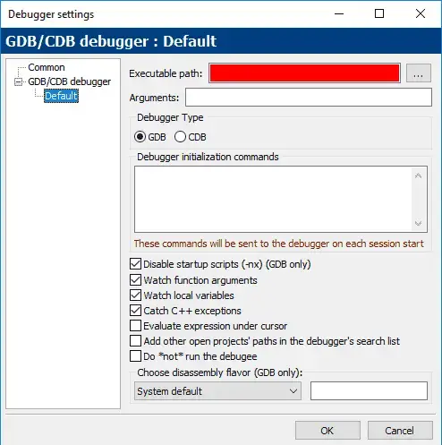
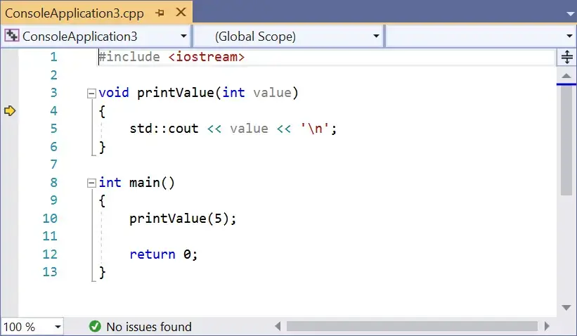

## **Bài 3.6: <u>Sử dụng Trình gỡ lỗi tích hợp (integrated debugger): Stepping</u>**


Khi bạn chạy chương trình, quá trình thực thi bắt đầu từ đầu hàm `main`, sau đó tiến hành tuần tự từng câu lệnh cho đến khi chương trình kết thúc. Tại bất kỳ thời điểm nào khi chương trình đang chạy, chương trình sẽ theo dõi rất nhiều thứ: giá trị của các biến bạn đang sử dụng, các hàm đã được gọi (để khi các hàm đó trả về, chương trình sẽ biết quay lại từ đâu), và điểm thực thi hiện tại trong chương trình (để biết câu lệnh nào cần thực thi tiếp theo). Tất cả thông tin được theo dõi này được gọi là **trạng thái chương trình** (hay ngắn gọn là **trạng thái**).

Trong các bài học trước, chúng ta đã khám phá các cách khác nhau để thay đổi code để hỗ trợ gỡ lỗi, bao gồm in thông tin chẩn đoán hoặc sử dụng logger. Đây là những phương pháp đơn giản để kiểm tra trạng thái của chương trình trong khi nó đang chạy. Mặc dù chúng có thể hiệu quả nếu được sử dụng đúng cách, nhưng chúng vẫn có nhược điểm:
- Yêu cầu sửa đổi code, tốn thời gian và có thể gây ra lỗi mới.
- Làm lộn xộn code, khiến code hiện có khó hiểu hơn.

Bên cạnh các kỹ thuật đã trình bày cho đến nay, còn một giả định ngầm hiểu: sau khi chạy code, nó sẽ chạy đến hoàn thành (chỉ tạm dừng để chấp nhận đầu vào) mà không có cơ hội để chúng ta can thiệp và kiểm tra kết quả của chương trình tại bất kỳ điểm nào mong muốn.

Tuy nhiên, điều gì sẽ xảy ra nếu chúng ta có thể loại bỏ giả định này? May mắn thay, hầu hết các IDE hiện đại đều đi kèm với một công cụ tích hợp gọi là **debugger** được thiết kế để thực hiện chính xác việc này.

### **Debugger là gì?**

**Debugger (trình gỡ lỗi)** là một chương trình máy tính cho phép lập trình viên kiểm soát cách một chương trình khác thực thi và kiểm tra trạng thái của chương trình đó trong khi chương trình đó đang chạy. Ví dụ, lập trình viên có thể sử dụng debugger để chạy từng dòng chương trình, đồng thời kiểm tra giá trị của các biến. Bằng cách so sánh giá trị thực tế của các biến với giá trị mong đợi, hoặc theo dõi đường dẫn thực thi thông qua code, debugger có thể giúp rất nhiều trong việc theo dõi các lỗi logic (ngữ nghĩa).

Sức mạnh của debugger đến từ hai yếu tố: khả năng kiểm soát chính xác việc thực thi chương trình và khả năng xem (và sửa đổi, nếu cần) trạng thái của chương trình.

**Các loại debugger:**
- **Debugger dòng lệnh (command-line debugger):** Các debugger ban đầu (chẳng hạn như `**gdb**`) là các chương trình riêng biệt có giao diện dòng lệnh, nơi lập trình viên phải gõ các lệnh khó hiểu để chúng hoạt động.
- **Debugger giao diện đồ họa (graphical debugger):** Các debugger sau này (chẳng hạn như các phiên bản đầu của [turbo debugger của Borland](https://en.wikipedia.org/wiki/Turbo_Debugger)) vẫn là các chương trình riêng biệt, nhưng cung cấp giao diện "được đồ họa hóa" để làm việc với chúng dễ dàng hơn.
- **Debugger tích hợp (Integrated debugger):** Ngày nay, nhiều IDE hiện đại có một debugger tích hợp - đó là một debugger sử dụng cùng giao diện với trình soạn thảo code, vì vậy bạn có thể gỡ lỗi bằng cùng môi trường mà bạn sử dụng để viết code (thay vì phải chuyển đổi chương trình).

Mặc dù debugger tích hợp rất tiện lợi và được khuyến khích cho người mới bắt đầu, nhưng debugger dòng lệnh vẫn được hỗ trợ tốt và thường được sử dụng trong các môi trường không hỗ trợ giao diện đồ họa (ví dụ: hệ thống nhúng).


**Các tính năng của debugger:**

Hầu hết các debugger hiện đại đều chứa cùng một bộ tính năng cơ bản chuẩn. Tuy nhiên, cách sắp xếp menu để truy cập các tính năng này và thậm chí cả phím tắt bàn phím đều không thống nhất. Mặc dù các ví dụ của chúng tôi sẽ sử dụng ảnh chụp màn hình từ Microsoft Visual Studio (và chúng tôi cũng sẽ hướng dẫn cách thực hiện mọi thứ trong Code::Blocks), bạn sẽ không gặp khó khăn trong việc tìm cách truy cập từng tính năng mà chúng tôi thảo luận bất kể IDE nào bạn đang sử dụng.

Lưu ý: Phím tắt bàn phím của debugger sẽ chỉ hoạt động nếu IDE/debugger tích hợp là cửa sổ đang hoạt động.

Trong phần còn lại của bài học này, chúng ta sẽ tìm hiểu cách sử dụng debugger.

>**Mẹo**<br>
>Đừng bỏ qua việc học cách sử dụng debugger. Khi chương trình của bạn trở nên phức tạp hơn, thời gian bạn dành để học cách sử dụng debugger tích hợp hiệu quả sẽ không đáng kể so với thời gian bạn tiết kiệm được để tìm và sửa lỗi.

>**Cảnh báo:**
>Trước khi bắt đầu bài học này (và các bài học tiếp theo về debugger), hãy đảm bảo bạn đã biên dịch dự án với cấu hình gỡ lỗi (đã hướng dẫn ở bài 0.9).
>Nếu bạn biên dịch dự án với cấu hình release, debugger có thể không hoạt động chính xác (ví dụ: khi bạn cố gắng bước vào chương trình, nó sẽ tự động chạy chương trình thay vì cho phép bạn kiểm tra từng bước).

>**Hướng dẫn cho người dùng Code::Blocks:**
>Kiểm tra xem debugger của bạn đã được thiết lập chính xác hay chưa:
>- Vào menu *Settings > Debugger....*
>- Mở cây *GDB/CDB debugger* ở bên trái và chọn **Default**.
>
>
>
>Nếu bạn thấy một thanh màu đỏ lớn ở chỗ *"Đường dẫn tệp thực thi" (Executable path)*, hãy thực hiện theo các bước sau để xác định vị trí của debugger:
>- Nhấp vào nút *"..."* ở bên phải trường *"Đường dẫn tệp thực thi"*.
>- Tìm tệp *"gdb32.exe"* trên hệ thống của bạn (ví dụ: *C:\Program Files (x86)\CodeBlocks\MinGW\bin\gdb32.exe*).
>- Nhấp vào OK.

>**Lưu ý cho người dùng Code::Blocks:**<br>
>Debugger tích hợp Code::Blocks (`GDB`) có thể gặp vấn đề khi nhận dạng một số đường dẫn tệp chứa dấu cách hoặc ký tự không phải tiếng Anh. Nếu debugger hoạt động không bình thường, đây có thể là lý do.

>**Hướng dẫn cho người dùng VS Code:**<br>
>Thiết lập gỡ lỗi:
>- Nhấn *Ctrl + Shift + P* và chọn *"C/C++: Add Debug Configuration"*.
>- Chọn *"C/C++: g++ build and debug active file"*.
>- File cấu hình `launch.json` sẽ được tạo và mở.
>- Thay đổi *"stopAtEntry"* thành `true`:
>
>>**JSON**<br>
>>`"stopAtEntry": true,`
>
>Mở `main.cpp` và bắt đầu gỡ lỗi bằng cách nhấn *F5* hoặc *Ctrl + Shift + P* và chọn *"Debug: Start Debugging and Stop on Entry"*.


### **Kiểm tra từng bước (Stepping)**


Bây giờ chúng ta sẽ bắt đầu khám phá debugger bằng cách xem xét một số công cụ gỡ lỗi cho phép kiểm soát cách chương trình thực thi.

**Kiểm tra từng bước (Stepping)** là tên gọi chung cho một nhóm các tính năng của debugger cho phép chúng ta thực thi (đi từng bước) code theo từng câu lệnh.

Có một số lệnh kiểm tra từng bước liên quan mà chúng ta sẽ lần lượt tìm hiểu.

### **Step Into (nhảy vào)**

Lệnh **step into (nhảy vào)** thực hiện câu lệnh tiếp theo trong đường dẫn thực thi thông thường của chương trình, sau đó tạm dừng thực thi chương trình để chúng ta có thể kiểm tra trạng thái của chương trình thông qua debugger. Nếu câu lệnh đang được thực thi chứa một hàm gọi, thì step into sẽ khiến chương trình nhảy đến đầu của hàm được gọi và tạm dừng tại đó.

**Ví dụ:**
>```
>#include <iostream>
>
>void printValue(int value)
>{
>    std::cout << value << '\n';
>}
>
>int main()
>{
>    printValue(5);
>
>    return 0;
>}
>```

Chúng ta hãy gỡ lỗi chương trình này bằng cách sử dụng lệnh **step into**.

**Truy cập lệnh Step Into:**

>**Đối với người dùng Visual Studio:**<br>
>Truy cập menu *Debug > Step Into* hoặc nhấn phím tắt *F11*.

>**Đối với người dùng Code::Blocks:**<br>
>Truy cập menu Debug > Step Into hoặc nhấn tổ hợp phím tắt *Shift-F7*.

>**Đối với người dùng VS Code:**<br>
>Truy cập menu *Run > Step Into*.

>**Đối với các trình biên dịch / IDE khác:**
Lệnh **step into** thường nằm trong menu *Debug* hoặc *Run*.

Khi chương trình của bạn không chạy và bạn thực hiện lệnh gỡ lỗi đầu tiên, bạn có thể thấy một vài điều xảy ra:

- Chương trình sẽ được biên dịch lại nếu cần thiết.
- Chương trình sẽ bắt đầu chạy. Vì ứng dụng của chúng ta là chương trình console, một cửa sổ đầu ra console sẽ mở ra. Nó sẽ trống vì chúng ta chưa xuất ra bất kỳ thứ gì.
- IDE của bạn có thể mở một số cửa sổ chẩn đoán, có thể có tên như *"Diagnostic Tools"* (Công cụ chẩn đoán), *"Call Stack"* (Ngăn xếp gọi) và *"Watch"* (Theo dõi). Chúng ta sẽ tìm hiểu về một số tính năng này sau - bây giờ bạn có thể bỏ qua chúng.

Vì bạn đã thực hiện **step into**, bạn sẽ thấy một dấu hiệu xuất hiện bên trái của dấu ngoặc nhọn mở của hàm `main` (dòng `9`). Trong **Visual Studio**, dấu hiệu này là một mũi tên màu vàng (Code::Blocks sử dụng một hình tam giác màu vàng). Nếu bạn đang sử dụng một IDE khác, bạn sẽ thấy một thứ gì đó có cùng mục đích.


Dấu mũi tên này cho biết dòng được trỏ tới sẽ được thực thi tiếp theo. Trong trường hợp này, debugger đang cho chúng ta biết rằng dòng tiếp theo được thực thi là dấu ngoặc nhọn mở của hàm `main` (dòng `9`).

Chọn step into (sử dụng lệnh phù hợp cho IDE của bạn, được liệt kê ở trên) để thực thi dấu ngoặc nhọn mở và mũi tên sẽ di chuyển đến câu lệnh tiếp theo (dòng `10`).


Điều này có nghĩa là dòng tiếp theo sẽ được thực thi là lệnh gọi đến hàm `printValue`.

Chọn **step into** một lần nữa. Vì câu lệnh này chứa một hàm gọi đến `printValue`, chúng ta sẽ bước vào hàm và mũi tên sẽ di chuyển đến đầu thân của `printValue` (dòng `4`).



Chọn **step into** lại để thực thi dấu ngoặc nhọn mở của hàm `printValue`, điều này sẽ di chuyển mũi tên đến dòng `5`.


Chọn **step into** một lần nữa, lệnh này sẽ thực thi câu lệnh `std::cout << value << '\n'` và di chuyển mũi tên đến dòng 6.

>**Mẹo**<br>
>Trong bài học trước, chúng tôi đã đề cập rằng `std::cout` được đệm, nghĩa là có thể có một khoảng trễ giữa khi bạn yêu cầu `std::cout` in giá trị và khi nó thực sự in. Do đó, bạn có thể không thấy giá trị `5` xuất hiện tại thời điểm này. Để đảm bảo tất cả đầu ra từ `std::cout` được xuất ngay lập tức, bạn có thể tạm thời thêm câu lệnh sau vào đầu hàm `main()`:
>>`std::cout << std::unitbuf; // Bật tự động đẩy (flush) cho std::cout (để gỡ lỗi)`
>
>Vì lý do hiệu suất, câu lệnh này nên được loại bỏ hoặc chú thích lại sau khi gỡ lỗi.
>
>Nếu bạn không muốn liên tục thêm/xóa/chú thích/bỏ chú thích cho lệnh trên, bạn có thể bọc lệnh trong một chỉ thị tiền xử lý biên dịch theo điều kiện (được đề cập trong bài học 2.10 - Giới thiệu về bộ tiền xử lý):
>>```
>>#ifdef DEBUG
>>std::cout << std::unitbuf; // Bật tự động đẩy (flush) cho std::cout (để gỡ lỗi)
>>#endif
>>```
>
>Bạn sẽ cần đảm bảo rằng *macro* tiền xử lý `DEBUG` được định nghĩa, ở đâu đó phía trên câu lệnh này hoặc là một phần trong cài đặt trình biên dịch của bạn.

Chọn **step into** một lần nữa để thực thi dấu ngoặc nhọn đóng của hàm `printValue`. Lúc này, `printValue` đã thực thi xong và quyền điều khiển được trả về cho `main`.

Bạn sẽ nhận thấy rằng mũi tên lại trỏ đến `printValue`!


Mặc dù bạn có thể nghĩ rằng debugger định gọi lại `printValue`, nhưng trên thực tế, debugger chỉ đang cho bạn biết rằng nó đang trả về từ lệnh gọi hàm.

Chọn **step into** thêm ba lần nữa. Lúc này, chúng ta đã thực thi tất cả các dòng trong chương trình, vì vậy quá trình đã hoàn thành. Một số debugger sẽ tự động kết thúc phiên gỡ lỗi tại thời điểm này, một số khác thì không. Nếu debugger của bạn không tự kết thúc, bạn có thể cần tìm lệnh *"Stop Debugging"* trong menu (trong **Visual Studio**, lệnh này nằm trong *Debug > Stop Debugging*).

Lưu ý rằng *Stop Debugging* có thể được sử dụng bất kỳ lúc nào trong quá trình gỡ lỗi để kết thúc phiên gỡ lỗi.

Chúc mừng! Bạn vừa bước qua tất cả các bước trong chương trình và theo dõi từng dòng thực thi.

>**Mẹo**<br>
>Trong các bài học tiếp theo, chúng ta sẽ khám phá các lệnh gỡ lỗi khác, một số lệnh có thể không khả dụng trừ khi debugger đã chạy. Nếu lệnh gỡ lỗi mong muốn không khả dụng, hãy sử dụng step into cho code của bạn để khởi động debugger và thử lại.

### **Step Over (Nhảy qua)**

Giống như **step into** (nhảy vào), lệnh **step over** (nhảy qua) thực thi câu lệnh tiếp theo trong đường dẫn thực thi thông thường của chương trình.

Tuy nhiên, điểm khác biệt là:

- **Step into** sẽ đi vào các hàm được gọi và thực thi từng dòng bên trong hàm đó.
- **Step over** sẽ thực thi toàn bộ hàm mà không dừng lại và trả quyền điều khiển cho bạn sau khi hàm đã được thực thi xong.

**Truy cập lệnh Step Over:**
>**Đối với người dùng Visual Studio:**<br>
>Truy cập menu *Debug > Step Over* hoặc nhấn phím tắt *F10*.

>**Đối với người dùng Code::Blocks:**<br>
>Lệnh **step over** được gọi là **Next line** (dòng tiếp theo), truy cập menu *Debug > Next line* hoặc nhấn phím tắt *F7*.

>**Đối với người dùng VS Code:**<br>
>Truy cập menu *Run > Step Over* hoặc nhấn phím tắt F10.

**Ví dụ:**
>```
>#include <iostream>
>
>void printValue(int value)
>{
>    std::cout << value << '\n';
>}
>
>int main()
>{
>    printValue(5);
>
>    return 0;
>}
>```

Trong ví dụ này, chúng ta sẽ sử dụng lệnh **step over** để bỏ qua việc bước vào hàm `printValue`.

Đầu tiên, sử dụng lệnh **step into** nhiều lần cho đến khi dấu hiệu thực thi (mũi tên) nằm trên dòng `10`:
Lúc này, chương trình đang chuẩn bị thực thi dòng gọi hàm `printValue(5)`.


Bây giờ, chọn lệnh **step over**.

Debugger sẽ thực thi hàm `printValue` (in giá trị `5` ra cửa sổ console) và sau đó trả quyền điều khiển cho bạn trên dòng lệnh tiếp theo (dòng `12`).
Lệnh **step over** cung cấp một cách thuận tiện để bỏ qua các hàm khi bạn đã chắc chắn chúng hoạt động bình thường hoặc không muốn gỡ lỗi chúng ngay bây giờ.

### **Step Out (Thoát ra)**

Không giống như hai lệnh Step khác (**Step Into** và **Step Over**), lệnh **Step Out (thoát ra)** không chỉ đơn giản là thực thi dòng code tiếp theo. Thay vào đó, nó thực thi toàn bộ mã còn lại trong hàm hiện đang được thực thi và sau đó trả quyền điều khiển lại cho bạn khi hàm đã trả về.

>**Đối với người dùng Visual Studio**<br>
>Trong Visual Studio, bạn có thể truy cập lệnh **Step Out** thông qua menu *Debug > Step Out* hoặc bằng cách nhấn tổ hợp phím *Shift-F11*.

>**Đối với người dùng Code::Blocks**<br>
>Trong Code::Blocks, bạn có thể truy cập lệnh Step Out thông qua menu *Debug > Step Out* hoặc bằng cách nhấn tổ hợp phím *Ctrl-F7*.

>**Đối với người dùng VS Code**<br>
>Trong VS Code, bạn có thể truy cập lệnh Thoát ra thông qua menu *Run > Step Out* hoặc bằng cách nhấn tổ hợp phím *Shift-F11*.

**Ví dụ**

Chúng ta hãy xem một ví dụ về cách sử dụng lệnh này bằng chương trình tương tự như ở trên:

>```
>#include <iostream>
>
>void inGiaTri(int value) // inGiaTri = printValue
>{
>    std::cout << value << '\n';
>}
>
>int main()
>{
>    inGiaTri(5); // inGiaTri(5) = printValue(5)
>
>    return 0;
>}
>```

**Step Into** chương trình cho đến khi bạn vào bên trong hàm `inGiaTri` (`printValue`), với dấu nhọn đánh dấu trên dòng `4`.


Sau đó chọn **Step Out**. Bạn sẽ thấy giá trị `5` xuất hiện trong cửa sổ đầu ra và trình gỡ rối trả lại quyền điều khiển cho bạn sau khi hàm kết thúc (trên dòng `10`).


Lệnh này hữu ích nhất khi bạn vô tình bước vào một hàm mà bạn không muốn gỡ rối.

### **Bước quá xa**

Khi nhảy từng bước trong chương trình, thông thường bạn chỉ có thể nhảy về phía trước. Rất dễ dàng để vô tình nhảy qua (vượt quá) vị trí bạn muốn kiểm tra.

Nếu bạn vượt qua điểm đến dự định, bạn thường sẽ dừng gỡ rối và bắt đầu lại quá trình gỡ rối, cẩn thận hơn một chút để không vượt qua mục tiêu lần này.

### **Step Back (Nhảy lùi)** 

Một số trình gỡ lỗi (chẳng hạn như Visual Studio Enterprise Edition và [rr](https://github.com/rr-debugger/rr)) đã giới thiệu khả năng nhảy thường được gọi là **Step Back (Nhảy lùi)** hoặc **Reverse Debugging (Gỡ lỗi ngược)**. Mục tiêu của **Step Back** là tua lại bước cuối cùng, để bạn có thể đưa chương trình trở lại trạng thái trước đó. Điều này có thể hữu ích nếu bạn vượt quá hoặc nếu bạn muốn kiểm tra lại một câu lệnh vừa mới thực thi.

Việc triển khai **Step Back** đòi hỏi trình gỡ rối phải rất tinh vi (vì nó phải theo dõi trạng thái chương trình riêng biệt cho mỗi bước). Do tính phức tạp, khả năng này chưa được chuẩn hóa và thay đổi tùy theo trình gỡ rối. Tại thời điểm viết bài (tháng 1 năm 2019), cả Visual Studio Community Edition và phiên bản Code::Blocks mới nhất đều không hỗ trợ khả năng này. Hy vọng rằng trong tương lai, nó sẽ được tích hợp vào các sản phẩm này và có sẵn để sử dụng rộng rãi hơn.
