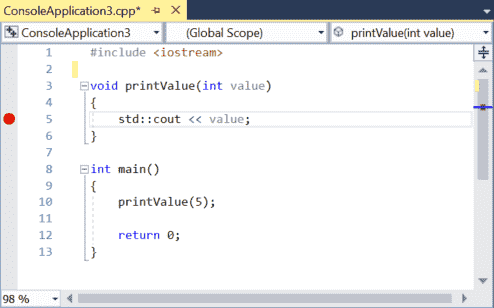

## **Bài 3.7: <u>Sử dụng trình gỡ lỗi tích hợp: Chạy đến con trỏ (Run to cursor) và Điểm dừng (Breakpoints)</u>**

Mặc dù việc sử dụng bước nhảy (được đề cập trong bài học [3.6 - Sử dụng trình gỡ lỗi tích hợp: Kiểm tra từng bước](lesson3_6.ipynb)) rất hữu ích để kiểm tra từng dòng code riêng lẻ, nhưng trong một chương trình lớn, việc nhảy từng bước qua toàn bộ code để đến điểm bạn muốn kiểm tra chi tiết hơn có thể mất nhiều thời gian.

May mắn thay, các trình gỡ lỗi hiện đại cung cấp nhiều công cụ hơn để giúp chúng ta gỡ rối chương trình hiệu quả. Trong bài học này, chúng ta sẽ xem xét một số tính năng của trình gỡ lỗi cho phép chúng ta điều hướng code nhanh hơn.

### **Run to Cursor (Chạy đến con trỏ)**

Lệnh hữu ích đầu tiên thường được gọi là **Run to Cursor (Chạy đến con trỏ)**. Lệnh **Run to Cursor** này thực thi chương trình cho đến khi thực thi đạt đến câu lệnh được chọn bởi con trỏ chuột (cursor) của bạn. Sau đó, nó trả lại quyền điều khiển cho bạn để bạn có thể bắt đầu gỡ rối từ điểm đó. Điều này giúp cho việc bắt đầu gỡ lỗi tại một điểm cụ thể trong code của bạn trở nên hiệu quả, hoặc nếu đã gỡ lỗi, để di chuyển thẳng đến một số vị trí bạn muốn kiểm tra thêm.

>**Đối với người dùng Visual Studioo**<br>
>Trong Visual Studio, bạn có thể truy cập lệnh **Run to Cursor** bằng cách nhấp chuột phải vào một câu lệnh trong code và chọn*Run to Cursor* từ menu ngữ cảnh, hoặc bằng cách nhấn tổ hợp phím *Ctrl-F10*.

>**Đối với người dùng Code::Blocks**<br>
>Trong Code::Blocks, bạn có thể truy cập lệnh **Run to Cursor** bằng cách nhấp chuột phải vào một câu lệnh trong code và chọn *Run to Cursor* từ menu ngữ cảnh hoặc menu *Debug > Run to Cursor*, hoặc bằng cách nhấn phím tắt *F4>*

>**Đối với người dùng VS Code**<br>
>Trong VS Code, bạn có thể truy cập lệnh **Run to Cursor** trong khi đang gỡ lỗi chương trình bằng cách nhấp chuột phải vào một câu lệnh trong code và chọn *Run to Cursor* từ menu ngữ cảnh.


Chúng ta hãy thử sử dụng chương trình tương tự như những gì chúng ta đã sử dụng:

>```
>#include <iostream>
>
>void inGiaTri(int value) // inGiaTri = printValue
>{
>    std::cout << value << '\n';
>}
>
>int main()
>{
>    inGiaTri(5); // inGiaTri(5) = printValue(5)
>
>    return 0;
>}
>```

Chỉ cần nhấp chuột phải vào bất kỳ vị trí nào trên dòng `5`, sau đó chọn *“Run to Cursor”*.

Bạn sẽ thấy chương trình bắt đầu chạy và dấu thực thi di chuyển đến dòng bạn vừa chọn. Chương trình của bạn đã thực thi đến thời điểm này và hiện đang chờ các lệnh gỡ lỗi tiếp theo của bạn. Từ đây, bạn có thể bước từng bước qua chương trình, Chạy đến con trỏ đến một vị trí khác, v.v.

Nếu bạn Run to Cursor đến một vị trí không được thực thi, Run to Cursor sẽ đơn giản chỉ chạy chương trình của bạn cho đến khi kết thúc.

### **Continue (Tiếp tục)**

Khi bạn đang ở giữa phiên gỡ lỗi, bạn có thể chỉ muốn chạy chương trình từ điểm đó trở đi. Cách dễ nhất để thực hiện điều này là sử dụng lệnh **Continue (Tiếp tục)**. Lệnh gỡ lỗi **Continue** đơn giản là tiếp tục chạy chương trình theo bình thường, cho đến khi chương trình kết thúc hoặc cho đến khi có thứ gì đó kích hoạt quyền điều khiển quay trở lại với bạn (chẳng hạn như **Breakpoint (điểm dừng)**, chúng ta sẽ đề cập sau trong bài học này).

>**Đối với người dùng Visual Studio**<br>
>Trong Visual Studio, bạn có thể truy cập lệnh **Continue** trong khi đang gỡ lỗi chương trình thông qua menu *Debug > Continue*, hoặc bằng cách nhấn phím tắt *F5*.

>**Đối với người dùng Code::Blocks**
>Trong Code::Blocks, bạn có thể truy cập lệnh **Continue** trong khi đang gỡ lỗi chương trình thông qua menu *Debug > Start / Continue*, hoặc bằng cách nhấn phím tắt *F8*.

>**Đối với người dùng VS Code**<br>
>Trong VS Code, bạn có thể truy cập lệnh **Continue** trong khi đang gỡ lỗi chương trình thông qua menu *Run > Continue*, hoặc bằng cách nhấn phím tắt *F5*.

Chúng ta hãy thử nghiệm lệnh **Continue**. Nếu dấu thực thi của bạn chưa nằm trên dòng `5`, hãy chạy đến con trỏ đến dòng `5`. Sau đó chọn **Continue** từ điểm này. Chương trình của bạn sẽ chạy xong và sau đó dừng lại.

### **Start (Bắt đầu)**

Lệnh **Continue** có một người anh em song sinh tên là **Start** (Bắt đầu). Lệnh **Start** thực hiện hành động giống như **Continue**, chỉ khác là bắt đầu từ đầu chương trình. Nó chỉ có thể được kích hoạt khi <u>đang không trong phiên gỡ lỗi</u>.

>**Đối với người dùng Visual Studio**<br>
>Trong Visual Studio, bạn có thể truy cập lệnh **Start** trong khi không gỡ lỗi chương trình thông qua menu *Debug > Start Debugging*, hoặc bằng cách nhấn phím tắt *F5*.

>**Đối với người dùng Code::Blocks**<br>
>Trong Code::Blocks, bạn có thể truy cập lệnh **Start** trong khi không gỡ lỗi chương trình thông qua menu *Debug > Start / Continue*, hoặc bằng cách nhấn phím tắt *F8*.

>**Đối với người dùng VS Code**<br>
>Trong VS Code, bạn có thể truy cập lệnh **Start** trong khi không gỡ lỗi chương trình thông qua menu *Run > Start Debugging*, hoặc bằng cách nhấn phím tắt *F5*.

Nếu bạn sử dụng lệnh **Start** trên chương trình mẫu ở trên, nó sẽ chạy toàn bộ mà không bị gián đoạn (ngoại trừ trên VS Code, vì chúng ta đã đặt `stopAtEntry: true` trong bài học trước). Mặc dù điều này có vẻ không đáng chú ý, nhưng đó chỉ là vì chúng ta chưa yêu cầu trình gỡ lỗi dừng chương trình. Chúng ta sẽ sử dụng lệnh này hiệu quả hơn trong phần tiếp theo.

### **Breakpoints (Điểm dừng)**

Chủ đề cuối cùng chúng ta sẽ đề cập trong phần này là **Breakpoints (Điểm dừng). **Breakpoints** là một ký hiệu đặc biệt báo cho trình gỡ lỗi dừng thực thi chương trình tại **breakpoints** khi chạy ở chế độ gỡ lỗi.

>**Đối với người dùng Visual Studio**<br>
>Trong Visual Studio, bạn có thể đặt hoặc xóa điểm dừng thông qua menu *Debug > Toggle Breakpoint*, hoặc bằng cách nhấp chuột phải vào một câu lệnh và chọn *Toggle Breakpoint* từ menu ngữ cảnh, hoặc bằng cách nhấn phím tắt *F9*, hoặc bằng cách nhấp vào bên trái của số dòng (trong vùng màu xám nhạt).

>**Đối với người dùng Code::Blocks**<br>
>Trong Code::Blocks, bạn có thể đặt hoặc xóa điểm dừng thông qua menu **Debug > Toggle Breakpoint*, hoặc bằng cách nhấp chuột phải vào một câu lệnh và chọn *Toggle Breakpoint* từ menu ngữ cảnh, hoặc bằng cách nhấn phím tắt *F5*, hoặc bằng cách nhấp vào bên phải của số dòng.

>**Đối với người dùng VS Code**<br>
>Trong VS Code, bạn có thể đặt hoặc xóa điểm dừng thông qua menu *Run > Toggle Breakpoint*, hoặc bằng cách nhấn phím tắt *F9*, hoặc bằng cách nhấp vào bên trái của số dòng.

Khi bạn đặt một điểm dừng, bạn sẽ thấy một loại biểu tượng mới xuất hiện. **Visual Studio** sử dụng một vòng tròn màu đỏ, **Code::Blocks** sử dụng một hình bát giác màu đỏ (giống như biển báo dừng):



Hãy tiếp tục và đặt một điểm dừng trên dòng `5`, như trong hình ảnh ở trên.

Bây giờ, chọn lệnh **Start** để trình gỡ lỗi chạy code của bạn và chúng ta hãy xem điểm dừng hoạt động như thế nào. Bạn sẽ nhận thấy rằng thay vì chạy đến hết chương trình, trình gỡ lỗi dừng lại ở **breakpoint** (với dấu thực thi nằm trên biểu tượng điểm dừng):


Giống như bạn đã chạy đến con trỏ đến điểm này.

**Breakpoints** có một vài ưu điểm so với **Run to Cursor**. Thứ nhất, **breakpoints** sẽ khiến trình gỡ lỗi trả quyền điều khiển cho bạn mỗi khi gặp chúng (không giống như **Run to Cursor**, chỉ chạy đến con trỏ một lần mỗi lần được kích hoạt). Thứ hai, bạn có thể đặt một **breakpoint** và nó sẽ tồn tại cho đến khi bạn xóa nó, trong khi với **Run to Cursor**, bạn phải xác định vị trí bạn muốn chạy đến mỗi lần bạn kích hoạt lệnh.

Lưu ý rằng các **breakpoint** được đặt trên các dòng không nằm trên luồng thực thi sẽ không khiến trình gỡ lỗi dừng thực thi code.

Chúng ta hãy xem một chương trình được sửa đổi một chút để minh họa rõ hơn sự khác biệt giữa điểm dừng và chạy đến con trỏ:

>```
>#include <iostream>
>
>void inGiaTri(int value) // inGiaTri = printValue
>{
>    std::cout << value << '\n';
>}
>
>int main()
>{
>    inGiaTri(5);
>    inGiaTri(6);
>    inGiaTri(7);
>
>    return 0;
>}
>```

Đầu tiên, hãy bắt đầu một phiên gỡ lỗi mới và sau đó thực hiện **Run to Cursor** đến dòng `5`. Bây giờ chọn **Continue**. Chương trình sẽ tiếp tục chạy đến cuối (nó sẽ không dừng lại trên dòng `5` nữa, ngay cả khi dòng `5` được thực thi thêm hai lần).

Tiếp theo, đặt một điểm dừng trên dòng `5`, sau đó chọn **Start**. Chương trình sẽ dừng lại trên dòng `5`. Bây giờ chọn **Continue**. Chương trình sẽ dừng lại trên dòng `5` lần thứ hai. Chọn **Continue** một lần nữa và nó sẽ dừng lại lần thứ ba. Thực hiện thêm một lần **Continue** nữa và chương trình sẽ kết thúc. Bạn có thể thấy rằng **breakpoint** khiến chương trình dừng lại nhiều lần như số lần dòng đó được thực thi.

### **Set Next Statement (Thiết lập câu lệnh tiếp theo)**

Còn một lệnh gỡ rối nữa được sử dụng khá hiếm, nhưng vẫn đáng để biết, ngay cả khi bạn không sử dụng nó thường xuyên. Lệnh **Set Next Statement (Thiết lập câu lệnh tiếp theo)** cho phép chúng ta thay đổi điểm thực thi thành một câu lệnh khác. Điều này có thể được sử dụng để nhảy điểm thực thi về phía trước và bỏ qua một số code lẽ ra sẽ được thực thi, hoặc nhảy ngược lại và thực thi lại một đoạn code đã được thực thi trước đó.

>**Đối với người dùng Visual Studio**<br>
>Trong Visual Studio, bạn có thể nhảy đến điểm thực thi bằng cách nhấp chuột phải vào một câu lệnh và chọn *Set Next Statement* từ menu ngữ cảnh, hoặc bằng cách nhấn tổ hợp phím tắt *Ctrl-Shift-F10*. Tùy chọn này theo ngữ cảnh và chỉ xuất hiện khi đang gỡ rối chương trình.

>**Đối với người dùng Code::Blocks**<br>
>Trong Code::Blocks, bạn có thể nhảy đến điểm thực thi thông qua menu *Debug > Set Next Statement*, hoặc bằng cách nhấp chuột phải vào một câu lệnh và chọn *Set Next Statement* từ menu ngữ cảnh. Code::Blocks không có phím tắt bàn phím cho lệnh này.

>**Đối với người dùng VS Code**<br>
>Trong VS Code, bạn có thể nhảy đến điểm thực thi bằng cách nhấp chuột phải vào một câu lệnh và chọn *Jump to Cursor* từ menu ngữ cảnh. Tùy chọn này theo ngữ cảnh và chỉ xuất hiện khi đang gỡ rối chương trình.

**Ví dụ:**

Giả sử bạn có đoạn code sau:

>```
>void printValue(int value) {
>  std::cout << value << '\n';
>}
>
>int main() {
>  printValue(5);
>  printValue(6);
>  printValue(7);
>
>  return 0;
>}
>```

Đầu tiên, chạy đến con trỏ đến dòng `11`. Lúc này, bạn sẽ thấy giá trị của `5` trong cửa sổ đầu ra console.
Bây giờ, nhấp chuột phải vào dòng `12` và chọn *Set Next Statement*. Điều này khiến dòng `11` bị bỏ qua và không được thực thi. Sau đó chọn *Continue* để hoàn thành việc thực thi chương trình của bạn.

Đầu ra của chương trình của bạn sẽ trông như thế này:
>```
>5
>7
>```

Chúng ta có thể thấy rằng `printValue(6)` đã bị bỏ qua.

Tính năng này có thể hữu ích trong một số ngữ cảnh.

Trong mục khám phá các kỹ thuật gỡ rối cơ bản, chúng ta đã thảo luận về việc đóng chú thích một hàm như một cách để xác định xem hàm đó có vai trò gì trong việc gây ra sự cố hay không. Điều này yêu cầu sửa đổi code của chúng ta và nhớ bỏ chú thích hàm sau đó. Trong trình gỡ rối, không có cách trực tiếp nào để bỏ qua một hàm, vì vậy nếu bạn muốn thực hiện điều này, sử dụng **Set Next Statement** để nhảy qua một lệnh gọi hàm là cách dễ nhất để thực hiện.

Nhảy ngược lại cũng có thể hữu ích nếu chúng ta muốn xem lại một hàm vừa mới thực thi, để chúng ta có thể xem nó đang làm gì.

Với cùng code ở trên, chạy đến con trỏ đến dòng `12`. Sau đó thiết lập câu lệnh tiếp theo trên dòng `11` và *Continue*. Đầu ra của chương trình sẽ là:
>```
>5
>6
>6
>7
>```

>**Cảnh báo**<br>
>Lệnh **Set Next Statement** sẽ thay đổi điểm thực thi, nhưng không làm thay đổi trạng thái chương trình. Biến của bạn sẽ giữ lại bất kỳ giá trị nào chúng có trước khi nhảy. Do đó, việc nhảy có thể khiến chương trình của bạn tạo ra các giá trị, kết quả hoặc hành vi khác so với bình thường. Sử dụng khả năng này một cách thận trọng (đặc biệt là nhảy ngược).

>**Cảnh báo**<br>
>Bạn không nên sử dụng **Set Next Statement** để thay đổi điểm thực thi sang một hàm khác. Điều này có thể dẫn đến hành vi không xác định và có khả năng gây ra *crash*.

### **"Step back" (Bước lùi) vs nhảy ngược thông qua "Set Next Statement" (Thiết lập câu lệnh tiếp theo)**

**Step Back** và **Set Next Statement** đều là các tính năng gỡ lỗi giúp bạn quay lại một điểm trước đó trong chương trình, nhưng chúng hoạt động theo những cách khác nhau.

**Step Back**: Giống như nút "quay lại" vậy. Nó **tua** lại toàn bộ trạng thái của chương trình, bao gồm cả giá trị của các biến, về trạng thái mà chúng có ở điểm trước đó. Điều này hữu ích nếu bạn muốn xem lại một phần code đã thực thi và muốn chương trình hoạt động như thể nó chưa từng xảy ra.

**Set Next Statement**: Chỉ thay đổi điểm mà chương trình sẽ tiếp tục chạy từ đó. Nó không tua lại trạng thái của chương trình. Giá trị của các biến vẫn giữ nguyên như trước khi nhảy. Tính năng này hữu ích để bỏ qua một phần code cụ thể mà bạn không muốn xem xét chi tiết.

>**Tóm lại**
>- **Step Back** (Bước lùi): Hoàn tác hoàn toàn các bước đã thực hiện, đưa chương trình về trạng thái trước đó.
>- **Set Next Statement** (Thiết lập câu lệnh tiếp theo): Chỉ thay đổi điểm thực thi tiếp theo, không ảnh hưởng đến trạng thái chương trình.

### **Kết luận**

Bây giờ bạn đã biết những cách chính để sử dụng trình gỡ lỗi tích hợp để theo dõi và kiểm soát cách chương trình của bạn thực thi. Mặc dù các lệnh này hữu ích để chẩn đoán các vấn đề về luồng code (ví dụ: xác định xem một số hàm có được gọi hay không), chúng chỉ là một phần lợi ích mà trình gỡ lỗi tích hợp mang lại. Trong bài học tiếp theo, chúng tôi sẽ bắt đầu khám phá các cách bổ sung để kiểm tra trạng thái chương trình của bạn, việc này yêu cầu bạn phải nắm vững các lệnh này như là điều kiện tiên quyết. Bắt đầu thôi!
