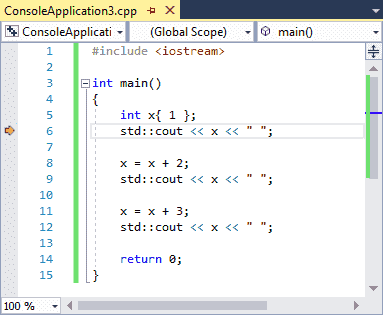
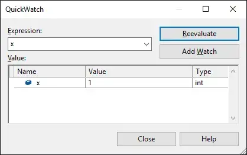

## **Bài 3.8: <u>Sử dụng trình gỡ lỗi tích hợp: Watching variables (Theo dõi biến)</u>**

Trong các bài học trước ([3.6 - Sử dụng trình gỡ lỗi tích hợp: Kiểm tra từng bước](lesson3_6.ipynb) và [3.7 - Sử dụng trình gỡ lỗi tích hợp: Chạy đến con trỏ và điểm dừng](lesson3_7.ipynb)), bạn đã học cách sử dụng trình gỡ lỗi để theo dõi đường thực thi của chương trình. Tuy nhiên, việc bước từng bước qua chương trình chỉ là một nửa tính năng hữu ích của trình gỡ lỗi. Trình gỡ lỗi cũng cho phép bạn kiểm tra giá trị của các biến khi bạn bước qua code, tất cả mà không cần sửa đổi code của bạn.

Giống như các bài học trước, các ví dụ ở đây sẽ sử dụng Visual Studio - nếu bạn đang sử dụng IDE/trình gỡ rối khác, các lệnh có thể có tên hơi khác nhau hoặc nằm ở các vị trí khác nhau.

>**Cảnh báo**<br>
>Hãy đảm bảo dự án của bạn được biên dịch bằng *Cấu hình gỡ lỗi (Debug build configuration)* (xem thêm 0.9 - Cấu hình trình biên dịch của bạn: Cấu hình xây dựng để biết thêm thông tin). Nếu thay vào đó bạn đang biên dịch dự án của mình bằng *Cấu hình phát hành (Release Configuration)*, thì chức năng của trình gỡ rối có thể không hoạt động chính xác.

### **Theo dõi biến (Watching variables)** 

**Theo dõi biến** là quá trình kiểm tra giá trị của một biến trong khi chương trình đang chạy ở chế độ gỡ lỗi. Hầu hết các trình gỡ lỗi cung cấp một số cách để thực hiện việc này.

**Ví dụ minh họa:**

>```
>#include <iostream>
>
>int main()
>{
>    int x{ 1 };
>    std::cout << x << ' ';
>
>    x = x + 2;
>    std.cout << x << ' ';
>
>    x = x + 3;
>    std::cout << x << ' ';

>    return 0;
>}
>```

Đây là một chương trình mẫu khá đơn giản - nó in ra các số `1`, `3` và `6`.

Đầu tiên, hãy chạy đến con trỏ đến dòng `6`.



Lúc này, biến `x` đã được tạo và khởi tạo với giá trị `1`, vì vậy khi chúng ta kiểm tra giá trị của `x`, chúng ta nên mong đợi thấy giá trị `1`.

**Cách kiểm tra giá trị biến:**
- *Di chuột qua biến*: Cách dễ nhất để kiểm tra giá trị của một biến đơn giản như `x` là di chuột qua biến `x`. Một số trình gỡ lỗi hiện đại hỗ trợ phương pháp kiểm tra các biến đơn giản này và đây là cách trực tiếp nhất để thực hiện.

>**Lưu ý:**<br>
>Tùy chọn này có thể bị tắt theo mặc định trong Code::Blocks. Để bật lên, vào menu *Settings) > Debugger…*, chọn *Default* dưới nút *GDB/CDB debugger*, bật chọn *Evaluate expression under cursor*.
>
>
>
>*Visual Studio - QuickWatch:* Tô sáng tên biến x bằng chuột, sau đó chọn *"QuickWatch"* từ menu chuột phải.

>
>
>Hành động này sẽ mở ra một cửa sổ phụ chứa giá trị hiện tại của biến.
>
>

**Xem sự thay đổi của biến:**

Bây giờ hãy theo dõi sự thay đổi của biến này khi chúng ta kiểm tra từng bước qua chương trình. Chọn **Step over** hai lần hoặc **Run to Cursor** đến dòng `9`. Biến `x` bây giờ sẽ có giá trị `3`. Hãy kiểm tra lại để đảm bảo!


### **Cửa sổ theo dõi (Watch Window)**

Sử dụng phương pháp *di chuột qua biến* hoặc *QuickWatch* để kiểm tra giá trị của biến chỉ phù hợp khi bạn muốn biết giá trị của biến tại một thời điểm cụ thể. Chúng không thực sự phù hợp để theo dõi sự thay đổi giá trị của biến khi bạn chạy chương trình vì bạn phải liên tục di chuột lại/chọn lại biến đó.

Để giải quyết vấn đề này, tất cả các trình gỡ lỗi tích hợp hiện đại đều cung cấp một tính năng khác, gọi là **cửa sổ theo dõi (watch window)**. **Cửa sổ theo dõi** là một cửa sổ nơi bạn có thể thêm các biến mà bạn muốn kiểm tra liên tục và các biến này sẽ được cập nhật khi bạn nhảy qua từng bước trong chương trình. **Cửa sổ theo dõi** có thể đã có trên màn hình của bạn khi bạn vào chế độ gỡ lỗi, nhưng nếu chưa, bạn có thể bật nó lên thông qua các lệnh cửa sổ của IDE (thường được tìm thấy trong menu *View* hoặc *Debug*).

>**Visual Studio**: Menu *Debug > Windows > Watch > Watch 1**. Lưu ý rằng bạn phải ở chế độ gỡ lỗi để tùy chọn này được bật, vì vậy hãy **Step into** chương trình của bạn trước. Vị trí xuất hiện của cửa sổ này (bên trái, bên phải hoặc bên dưới được neo) có thể thay đổi. Bạn có thể thay đổi vị trí neo của nó bằng cách kéo tab *Watch 1* sang một cạnh khác của cửa sổ ứng dụng.

>**Code::Blocks**: Menu *Debug > Debugging windows > Watches**. Cửa sổ này có thể xuất hiện như một cửa sổ riêng biệt. Bạn có thể neo nó vào cửa sổ chính của bạn bằng cách kéo nó qua.

>**VS Code**: Trong VS Code, cửa sổ theo dõi xuất hiện ở chế độ gỡ lỗi, được neo bên trái phía trên ngăn xếp lệnh gọi (call stack).


Cửa sổ theo dõi có thể trống hoặc đã chứa một số nội dung.

**Cách thêm biến vào cửa sổ theo dõi:**

Thông thường có hai cách khác nhau để thêm biến vào cửa sổ theo dõi:
- Mở cửa sổ theo dõi và nhập tên của biến bạn muốn theo dõi vào cột ngoài cùng bên trái của cửa sổ theo dõi.
- Trong cửa sổ code, nhấp chuột phải vào biến bạn muốn theo dõi và chọn *Add Watch* (Visual Studio) hoặc *Watch x* (thay thế `x` bằng tên của biến) (Code::Blocks).

**Bắt đầu theo dõi sự thay đổi của biến:**

Nếu bạn chưa bắt đầu phiên gỡ lỗi với dấu thực thi trên dòng `9` của chương trình, hãy bắt đầu một phiên gỡ lỗi mới và chạy đến con trỏ đến dòng `9`.

Bây giờ, hãy thêm biến `x` vào danh sách theo dõi của bạn. Bạn sẽ thấy:


**Step over** hai lần hoặc Run to Cursor đến dòng `12`, và bạn sẽ thấy giá trị của `x` thay đổi từ `3` thành `6`.

**Lưu ý về biến hết hiệu lực (out of scope):**

Các biến hết hiệu lực (ví dụ: biến cục bộ bên trong một hàm đã trả về cho hàm gọi) sẽ vẫn nằm trong cửa sổ theo dõi của bạn, nhưng thường sẽ được đánh dấu là "không khả dụng" (not available) hoặc có thể hiển thị giá trị được biết cuối cùng nhưng mờ đi. Nếu biến quay lại phạm vi (ví dụ: hàm được gọi lại), giá trị của nó sẽ bắt đầu hiển thị lại. Do đó, việc để các biến trong cửa sổ theo dõi là hoàn toàn bình thường, ngay cả khi chúng đã hết hiệu lực.

Sử dụng **cửa sổ theo dõi** là cách tốt nhất để theo dõi sự thay đổi giá trị của biến theo thời gian khi bạn kiểm tra từng bước qua chương trình.

### **Đặt breakpoint (điểm dừng) trên biến được theo dõi**

Một số trình gỡ lỗi cho phép bạn đặt breakpoint trên một biến được theo dõi thay vì một dòng. Điều này sẽ khiến chương trình dừng thực thi bất cứ khi nào giá trị của biến đó thay đổi.

Ví dụ, đặt một breakpoint như vậy trên biến `x` trong chương trình ở trên sẽ khiến trình gỡ lỗi dừng sau khi thực hiện các dòng `8` và `11` (nơi giá trị của `x` được thay đổi).

>**Cách đặt điểm dừng trên biến được theo dõi trong Visual Studio:**
>- Đảm bảo biến của bạn đang được theo dõi.
>- Tiếp theo, **"Step into"** chương trình của bạn và đi đến cửa sổ theo dõi.
>- Nhấp chuột phải vào biến và chọn *"Break when value changes" (Dừng khi giá trị thay đổi)*. 
>
>Lưu ý: Bạn cần bật lại *"Break when value changes"* mỗi lần bạn bắt đầu phiên gỡ lỗi.


### **Cửa sổ theo dõi cũng có thể đánh giá biểu thức**

Cửa sổ theo dõi cũng cho phép bạn đánh giá các biểu thức đơn giản. Nếu bạn chưa thực hiện, hãy *"Run to cursor"* đến dòng `12`. Sau đó thử nhập `x + 2` vào cửa sổ theo dõi và xem điều gì xảy ra (nó sẽ được đánh giá thành `8`).

Bạn cũng có thể tô sáng một biểu thức trong code của mình và sau đó kiểm tra giá trị của biểu thức đó bằng cách di chuột qua hoặc thêm nó vào cửa sổ theo dõi thông qua menu chuột phải.

>**Cảnh báo:**<br>
>Các định danh trong biểu thức được theo dõi sẽ được đánh giá theo giá trị hiện tại của chúng. Nếu bạn muốn biết giá trị của một biểu thức trong code của bạn thực sự được đánh giá thành gì, hãy *"Run to Cursor"* đến biểu thức đó trước, để tất cả các định danh có giá trị chính xác.

### **Theo dõi cục bộ (Local watches)**

Do việc kiểm tra giá trị của các biến cục bộ bên trong một hàm là phổ biến trong khi gỡ rối, nhiều trình gỡ rối sẽ cung cấp một số cách để nhanh chóng theo dõi giá trị của tất cả các biến cục bộ trong phạm vi.

>**Cách xem tất cả các biến cục bộ trong Visual Studio:**<br>
>Trong Visual Studio, bạn có thể xem giá trị của tất cả các biến cục bộ trong cửa sổ *Locals (Biến cục bộ)*, có thể được tìm thấy tại Menu *Debug > Windows > Locals (Biến cục bộ)*. Lưu ý rằng bạn phải ở trong phiên gỡ lỗi để kích hoạt cửa sổ này.

>**Cách xem tất cả các biến cục bộ trong Code::Blocks:**<br>
>Trong Code::Blocks, tính năng này được tích hợp vào cửa sổ *Watch (Theo dõi)*, dưới nút *Locals (Biến cục bộ)*. Nếu bạn không thấy bất kỳ nút nào, thì có thể không có biến cục bộ nào hoặc bạn cần bung rộng nút đó ra.

>**Cách xem tất cả các biến cục bộ trong VS Code:**<br>
>Trong VS Code, giá trị của các biến cục bộ có thể được tìm thấy trong phần *VARIABLES (BIẾN)* xuất hiện được neo bên trái ở chế độ gỡ lỗi. Bạn có thể cần bung rộng nút *Locals (Biến cục bộ)*.

Nếu bạn chỉ muốn theo dõi giá trị của một biến cục bộ, hãy kiểm tra cửa sổ *Locals (Biến cục bộ)* trước. Biến đó thường đã có sẵn ở đó.
