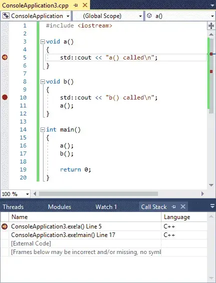
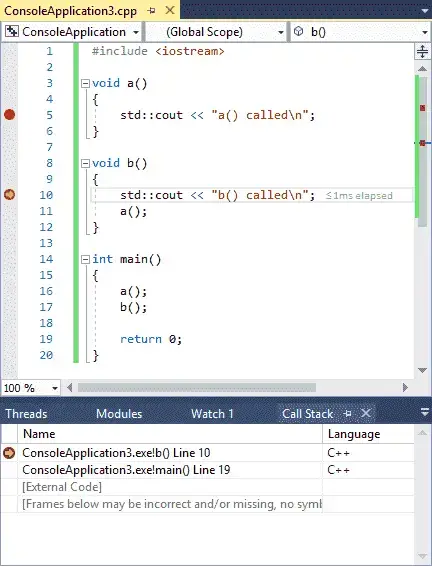

## **Bài 3.9: <u>Sử dụng trình gỡ lỗi tích hợp: Call Stack (Ngăn xếp lệnh gọi)</u>** 

Trình gỡ lỗi hiện đại chứa thêm một cửa sổ thông tin gỡ lỗi khác có thể rất hữu ích trong việc gỡ lỗi chương trình của bạn, đó là **cửa sổ ngăn xếp lệnh gọi (call stack)**.

Khi chương trình của bạn gọi một hàm, bạn đã biết nó đánh dấu vị trí hiện tại, thực hiện lệnh gọi hàm và sau đó trả về. Làm thế nào nó biết được nơi để quay lại? Câu trả lời là nó được theo dõi trong **ngăn xếp lệnh gọi**.

### **Ngăn xếp lệnh gọi (Call Stack) là gì?**

**Ngăn xếp lệnh gọi** là một danh sách tất cả các hàm đang hoạt động đã được gọi để đến điểm thực thi hiện tại. Ngăn xếp lệnh gọi bao gồm một mục cho mỗi hàm được gọi, cũng như dòng code nào sẽ được trả về khi hàm đó trả về. Bất cứ khi nào một hàm mới được gọi, hàm đó sẽ được thêm vào đầu của ngăn xếp lệnh gọi. Khi hàm hiện tại trả về cho hàm gọi, nó sẽ bị xóa khỏi đầu của ngăn xếp lệnh gọi và quyền điều khiển được trả lại cho hàm ngay bên dưới nó.

**Cửa sổ ngăn xếp lệnh gọi** là một cửa sổ gỡ rối hiển thị ngăn xếp lệnh gọi hiện tại. Nếu bạn không thấy cửa sổ ngăn xếp lệnh gọi, bạn sẽ cần yêu cầu IDE hiển thị nó.


>**Cách truy cập cửa sổ ngăn xếp lệnh gọi:**
>- **Visual Studio**: Menu *Debug > Windows > Call Stack*. Lưu ý rằng bạn phải ở trong phiên gỡ lỗi để kích hoạt cửa sổ này.
>- **Code::Blocks**: Menu *Debug > Debugging windows > Call Stack*.
>- **VS Code**: Trong VS Code, cửa sổ ngăn xếp lệnh gọi xuất hiện ở chế độ gỡ lỗi, được neo bên trái.


**Ví dụ minh họa:**

>```
>#include <iostream>
>
>void a()
>{
>    std::cout << "a() called\n";
>}
>
>void b()
>{
>    std::cout << "b() called\n";
>    a();
>}
>
>int main()
>{
>    a();
>    b();
>
>    return 0;
>}
>```

Đặt điểm dừng trên dòng `5` và `10` của chương trình này, sau đó bắt đầu chế độ gỡ lỗi. Do hàm `a` được gọi đầu tiên, nên điểm dừng trên dòng `5` sẽ được chạy tới trước.

Lúc này, bạn sẽ thấy thứ gì đó giống như này:




**IDE** của bạn có thể biểu hiện hiện một số khác biệt:
- Định dạng tên hàm và số dòng của bạn có thể khác nhau.
- Số dòng của bạn có thể hơi khác (chênh lệch 1).
- Thay vì `[External Code]`, bạn có thể thấy một loạt các hàm khác có tên kỳ lạ.

Những điểm khác biệt này không quan trọng.

Điều quan trọng ở đây là hai dòng đầu tiên. Từ dưới lên trên, chúng ta có thể thấy rằng hàm `main` được gọi trước tiên, và sau đó hàm `a` được gọi tiếp theo.

Dòng `5` bên cạnh hàm `a` cho chúng ta biết điểm thực thi hiện tại là ở đâu (phù hợp với dấu thực thi trong cửa sổ code). Dòng `17` trên dòng thứ hai cho biết dòng sẽ được trả về khi quyền điều khiển quay trở lại hàm `main`.

>**Mẹo**
>- Các số dòng sau tên hàm hiển thị dòng tiếp theo sẽ được thực thi trong mỗi hàm.
>- Do mục đầu trên ngăn xếp lệnh gọi biểu thị cho hàm hiện đang được thực thi, số dòng ở đây hiển thị dòng tiếp theo sẽ được thực thi khi thực thi tiếp tục. Các mục còn lại trong ngăn xếp lệnh gọi đại diện cho các hàm sẽ được trả về tại một điểm nào đó, vì vậy số dòng cho những mục này đại diện cho lệnh tiếp theo sẽ được thực thi sau khi hàm được trả về.


Bây giờ, hãy chọn lệnh gỡ rối *Continue* để tiến hành thực thi đến điểm dừng tiếp theo, điểm dừng này sẽ nằm trên dòng `10`. Ngăn xếp lệnh gọi sẽ được cập nhật để phản ánh trạng thái mới:



Bạn sẽ nhận thấy rằng hàm `b` bây giờ là dòng trên cùng của ngăn xếp lệnh gọi, phản ánh thực tế rằng hàm `b` là hàm đang được thực thi. Lưu ý rằng hàm `a` không còn được biểu diễn trên ngăn xếp lệnh gọi nữa. Điều này là do hàm `a` đã bị xóa khỏi ngăn xếp lệnh gọi khi nó trả về.

Chọn lại lệnh gỡ rối *Continue* một lần nữa và chúng ta sẽ chạm lại điểm dừng trên dòng `5` (bởi vì hàm `b` gọi hàm `a`). Ngăn xếp lệnh gọi sẽ trông như thế này:


Bây giờ có ba hàm trên ngăn xếp lệnh gọi: (từ dưới lên trên) `main`, chính là hàm gọi `b`, và hàm `b` là hàm gọi lại `a`.

Ngăn xếp lệnh gọi hữu ích khi kết hợp với các **breakpoint** (điểm dừng), khi breakpoint của bạn được chạm tới và bạn muốn biết những hàm nào được gọi để đến điểm cụ thể đó trong code.

### **Kết luận**

Chúc mừng, bây giờ bạn đã biết những điều cơ bản về việc sử dụng trình gỡ lỗi tích hợp! Sử dụng các tính năng **kiểm tra từng bước (stepping)**, **điểm dừng (breakpoints)**, **theo dõi biến (watches)** và **cửa sổ ngăn xếp lệnh gọi (call stack window)**, bạn giờ đây đã có những nền tảng cơ bản để có thể gỡ lỗi hầu hết mọi vấn đề. Giống như nhiều thứ khác, việc trở nên giỏi sử dụng trình gỡ rối cần một chút thực hành và thử nghiệm. Nhưng một lần nữa, chúng tôi xin nhắc lại rằng thời gian dành cho việc học cách sử dụng hiệu quả trình gỡ lỗi tích hợp sẽ được đền đáp nhiều lần trong thời gian tiết kiệm gỡ lỗi các chương trình của bạn!
