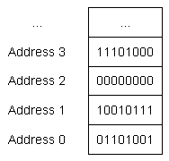

## **Bài 4.1: <u>Giới thiệu về Kiểu dữ liệu cơ bản</u>**

### **Bit, Byte và Địa chỉ bộ nhớ**

Trong bài học [**1.3 - Giới thiệu về đối tượng và biến**](../lesson1/lesson1_3.ipynb), chúng ta đã đề cập đến việc biến là tên gọi của một vùng nhớ được sử dụng để lưu trữ thông tin. Nhắc lại một cách ngắn gọn, máy tính có bộ nhớ truy cập ngẫu nhiên (**RAM**) mà các chương trình có thể sử dụng. Khi một biến được khai báo, một phần của bộ nhớ đó được dành riêng cho biến đó.

Đơn vị nhỏ nhất của bộ nhớ là một **bit** (còn gọi là **binary digit** hay đơn vị nhị phân), có thể chứa giá trị 0 hoặc 1. Bạn có thể coi một bit giống như công tắc đèn truyền thống - đèn tắt (0) hoặc bật (1). Không có trạng thái trung gian nào. Nếu bạn nhìn vào một đoạn bộ nhớ ngẫu nhiên, tất cả những gì bạn thấy là `...011010100101010...` hoặc một tổ hợp nào đó tương tự.

Bộ nhớ được tổ chức thành các đơn vị tuần tự được gọi là **địa chỉ bộ nhớ** (hay ngắn gọn là **địa chỉ**). Tương tự như cách một địa chỉ đường phố có thể được sử dụng để tìm một ngôi nhà nhất định trên một con phố, **địa chỉ bộ nhớ** cho phép chúng ta tìm và truy cập nội dung của bộ nhớ tại một vị trí cụ thể.

Có lẽ điều ngạc nhiên là, trong kiến trúc máy tính hiện đại, mỗi bit không có địa chỉ bộ nhớ riêng biệt. Điều này là do số lượng địa chỉ bộ nhớ bị hạn chế và nhu cầu truy cập dữ liệu từng bit là rất hiếm. Thay vào đó, mỗi địa chỉ bộ nhớ chứa 1 **byte** dữ liệu. **Byte** là một nhóm các bit được vận hành như một đơn vị. Tiêu chuẩn hiện đại là **1 byte** bao gồm **8 bit** tuần tự.

>**Kiến thức cốt lõi:**<br>
>Trong C++, chúng ta thường làm việc với các khối dữ liệu có kích thước bằng **byte**.

Hình ảnh sau đây cho thấy một số địa chỉ bộ nhớ tuần tự, cùng với byte dữ liệu tương ứng:
>


>**Ngoài lề**<br>
>Một số máy cũ hoặc không theo tiêu chuẩn có thể có byte với kích thước khác nhau (từ 1 đến 48 bit) - tuy nhiên, chúng ta thường không cần lo lắng về những điều này, vì tiêu chuẩn thực tế hiện đại là 1 byte bằng 8 bit. Trong các bài hướng dẫn này, chúng ta sẽ giả sử 1 byte bằng 8 bit.

### **Kiểu dữ liệu**

Vì tất cả dữ liệu trên máy tính chỉ là một dãy bit, chúng ta sử dụng **kiểu dữ liệu** (thường được gọi tắt là **"kiểu"**) để báo cho trình biên dịch cách giải thích nội dung của bộ nhớ theo một cách có ý nghĩa. Bạn đã thấy một ví dụ về kiểu dữ liệu: *số nguyên*. Khi chúng ta khai báo một biến là kiểu số nguyên, chúng ta đang nói với trình biên dịch "phần bộ nhớ mà biến này sử dụng sẽ được giải thích là một giá trị số nguyên".

Khi bạn gán giá trị cho một đối tượng, trình biên dịch và CPU sẽ xử lý việc mã hóa giá trị của bạn thành chuỗi bit thích hợp cho kiểu dữ liệu đó, sau đó được lưu trữ trong bộ nhớ (nhớ rằng: bộ nhớ chỉ có thể lưu trữ bit). Ví dụ, nếu bạn gán cho một đối tượng kiểu số nguyên giá trị `65`, thì giá trị đó được chuyển đổi thành chuỗi bit `01000001` và được lưu trữ trong bộ nhớ được gán cho đối tượng.

Ngược lại, khi đối tượng được đánh giá để tạo ra một giá trị, chuỗi bit đó được khôi phục lại thành giá trị ban đầu. Nghĩa là `01000001` được chuyển đổi trở lại thành giá trị `65`.

May mắn thay, trình biên dịch và CPU thực hiện tất cả các công việc khó khăn ở đây, vì vậy bạn thường không cần lo lắng về cách các giá trị được chuyển đổi thành chuỗi bit và ngược lại.

Tất cả bạn cần làm là chọn một kiểu dữ liệu cho đối tượng phù hợp nhất với việc sử dụng bạn muốn.


### **Kiểu dữ liệu cơ bản**

C++ cung cấp sẵn hỗ trợ cho nhiều kiểu dữ liệu khác nhau. Chúng được gọi là **kiểu dữ liệu cơ bản (fundamental data types)**, nhưng thường được gọi không chính thức là **kiểu cơ bản (basic types)**, **kiểu nguyên thủy (primitive types)** hoặc **kiểu dựng sẵn (built-in types)**.

Dưới đây là danh sách các kiểu dữ liệu cơ bản, một số trong số đó bạn đã từng gặp:

| Kieu DL                                                                                    | Phan loai             | Y nghia                                    | Vi Du     |
|--------------------------------------------------------------------------------------------|-----------------------|--------------------------------------------|-----------|
| `float`<br><br>`double`<br><br>`long double`                                                     | Số thực dấu phẩy động | Đi kèm với phần thập phân sau dấu phẩy (chấm)     | `3.1415926` |
| `bool`                                                                                       | Integral (Logic)     | Đúng (true) hoặc sai (false)                             | `true`      |
| `char`<br><br>`wchar_t`<br><br>`char8_t` (C++20)<br><br>`char16_t` (C++11)<br><br>`char32_t` (C++11) |Integral (ký tự)     | Một ký tự trong bảng chữ cái               | `'c'`<br>   |
| `short int`<br><br>`int`<br><br>`long int`<br><br>`long long int` (C++11)                          | Số nguyên (integer)            | Số nguyên âm và số nguyên dương bao gồm 0 | 64        |
| `std::nullptr_t` (C++11)                                                                     | Con trỏ null          | Con trỏ null                               | `nullptr`   |
| `void`                                                                                       | Void                  | Không có kiểu                              | `void`      |

Chương này tập trung khám phá chi tiết các kiểu dữ liệu cơ bản (ngoại trừ `std::nullptr_t`, kiểu này sẽ được thảo luận khi chúng ta nói về con trỏ). C++ cũng hỗ trợ một số kiểu dữ liệu phức tạp hơn, được gọi là **kiểu phức hợp** (compound types). Chúng ta sẽ tìm hiểu về kiểu phức hợp trong một chương học sắp tới.

>**Lưu ý của tác giả:**<br>
>Các thuật ngữ *integer* (số nguyên) và *integral* (thuộc loại số nguyên) có vẻ tương đồng nhưng đôi khi lại có ý nghĩa khác nhau.
>- Trong toán học, *integer* là một số không có phần thập phân hoặc phần phân số, bao gồm cả số âm, số dương và số 0.
>- Trong C++, thuật ngữ *integer* thường được dùng để chỉ kiểu dữ liệu `int`, lưu trữ các giá trị số nguyên. Tuy nhiên, đôi khi nó cũng được dùng để chỉ một tập hợp rộng hơn các kiểu dữ liệu thường được sử dụng để lưu trữ và hiển thị các giá trị số nguyên. Điều này bao gồm `short`, `int`, `long`, `long long` và các biến thể có dấu và không dấu của chúng.
>- Thuật ngữ *integral* có nghĩa là **"giống như số nguyên"**. Thường thì *integral* được sử dụng như một phần của cụm từ "kiểu thuộc loại số nguyên", bao gồm tập hợp rộng hơn các kiểu được lưu trữ trong bộ nhớ dưới dạng số nguyên, mặc dù hành vi của chúng có thể khác nhau (chúng ta sẽ thấy chi tiết hơn trong chương này khi nói về các kiểu ký tự `char`). Điều này bao gồm `bool`, các kiểu số nguyên và tất cả các kiểu ký tự khác nhau.

>**Ngoài lề**<br>
>Hầu hết các ngôn ngữ lập trình hiện đại đều bao gồm một kiểu dữ liệu cơ bản là `string` (chuỗi ký tự là một kiểu dữ liệu cho phép chúng ta lưu trữ một dãy các ký tự, thường được dùng để biểu diễn văn bản). Trong C++, `string` không phải là một kiểu dữ liệu cơ bản (mà là một kiểu phức hợp). Nhưng vì cách sử dụng cơ bản của `string` khá đơn giản và hữu ích, nên chúng ta sẽ giới thiệu về chuỗi trong chương tiếp theo (bài học 5.9 - Giới thiệu về `std::string`).

### **Hậu tố `_t`**

Nhiều kiểu dữ liệu được định nghĩa trong các phiên bản C++ mới hơn (ví dụ `std::nullptr_t`) sử dụng hậu tố `_t`. Hậu tố này có nghĩa là **"kiểu" (type)**, và đây là một thuật ngữ phổ biến được áp dụng cho các kiểu dữ liệu hiện đại.

Nếu bạn thấy một cái gì đó có hậu tố `_t`, thì có thể nó là một kiểu dữ liệu. Nhưng nhiều kiểu dữ liệu không có hậu tố `_t`, vì vậy điều này không được áp dụng một cách nhất quán.

## **Bài 4.2** 


```python

```
